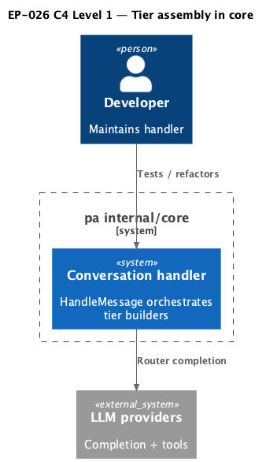

# EP-026 — Core refactor: tier builders in conversation handler — Requirements (EARS / INCOSE)

This document defines requirements for EP-026: explicit tier-scoped builders for the main LLM prompt path in `internal/core`, a thinner `HandleMessage` orchestrator, dedicated unit tests, and removal of the cyclomatic-complexity lint exception where complexity no longer warrants it.

> **6 requirements** · 5 FR · 1 NFR · 2 theme groups

**Contents**

- [Introduction](#introduction)
- [Glossary](#glossary)
- [C4 C1 — System Context](#c4-c1--system-context)
- [EARS patterns used](#ears-patterns-used)
- [Requirement index](#requirement-index)
- [Requirements](#requirements)

---

## Introduction

EP-026 implements [ep-scope.md](ep-scope.md): the intent tier decision (`simple`, `full_lite`, `full`) still gates retrieval and static system head as today; tier-specific assembly of merged tools, dynamic system tail, and `llm.CompletionOptions` moves behind named builder entry points so behaviour stays identical while structure improves.

---

## Glossary

| Term | Definition |
|------|------------|
| **Tier builder** | A `conversationHandler` method that produces `tierMainLLMParams` for exactly one `intent.Tier` (or delegates to a shared helper used only by full and full_lite). |
| **Main LLM prompt** | The first system message content plus optional tools and flags passed to `completeAt` for the user turn. |

---

## C4 C1 — System Context

**Source:** [c4-context.puml](diagrams/c4-context.puml). Regenerate: `plantuml -tpng diagrams/c4-context.puml` from this directory.

---

## EARS patterns used

- **Ubiquitous:** THE \<system\> SHALL \<response\>

---

## Requirement index

| Id | Type | Section | Summary |
|----|------|---------|---------|
| REQ-26.001 | FR | Tier builders | Each tier has an explicit builder entry point |
| REQ-26.002 | FR | Orchestrator | HandleMessage delegates tier assembly then completes |
| REQ-26.003 | FR | Tests | Unit tests cover tier builder contracts without full adapter graph |
| REQ-26.004 | FR | Lint | HandleMessage no longer carries `gocyclo` nolint for this flow |
| REQ-26.005 | FR | Parity | Observable main-turn behaviour unchanged vs pre-refactor |
| REQ-26.006 | NFR | Verification | Quality gate and AC validation pass |

---

## Requirements

### Tier builders

*REQ-26.001*

**REQ-26.001** (Ubiquitous)  
THE conversation handler SHALL expose distinct package-level entry methods on `*conversationHandler` for assembling main-LLM parameters for `intent.TierFull`, `intent.TierFullLite`, and the simple/default tier, such that `HandleMessage` selects among them by tier without duplicating the former full vs full_lite tail blocks inline.

---

### Orchestrator

*REQ-26.002*

**REQ-26.002** (Ubiquitous)  
THE `HandleMessage` implementation SHALL read as a linear sequence: validate input, classify tier, gather optional retrieval chunks, build base `llm.Message` slice, invoke the tier builder for options and system tail, log assembled prompt metadata, then call the router completion and post-completion path unchanged except for wiring through builder outputs.

---

### Tests

*REQ-26.003*

**REQ-26.003** (Ubiquitous)  
THE repository SHALL include unit tests in package `core` that call the tier builder methods (or the single tier dispatch helper) with minimal `conversationHandler` fixtures and assert stable contracts (e.g. simple tier yields nil completion options without mutating the initial system head; full_lite path with nil catalog returns no error).

---

### Lint

*REQ-26.004*

**REQ-26.004** (Ubiquitous)  
THE `//nolint:gocyclo` directive attached to `HandleMessage` for tier tail assembly SHALL be removed, and `golangci-lint` SHALL report zero `gocyclo` violations for `HandleMessage` at the configured minimum complexity.

---

### Parity

*REQ-26.005*

**REQ-26.005** (Ubiquitous)  
THE refactor SHALL not change merge rules, dynamic tool cap conditions per tier, Hermes text-path selection, or system message assembly semantics for any `intent.Tier` compared to the pre-EP-026 implementation on the parent branch.

---

### Verification

*REQ-26.006*

**REQ-26.006** (Ubiquitous)  
THE change set SHALL pass `make check` from the repository root and `./bin/validate EP-026` after `make build`.

---

## NFR section

Maintainability: smaller cyclomatic surface in `HandleMessage` reduces review cost ([REQ-26.004](ep-requirements.md#lint)). Regression safety is covered by existing handler tests plus new builder tests ([REQ-26.005](ep-requirements.md#parity), [REQ-26.003](ep-requirements.md#tests)).
