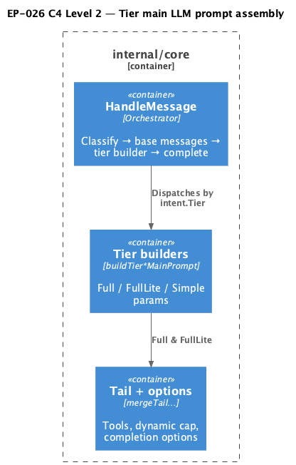

# EP-026 — System design

**Contents**

- [Overview](#overview)
- [Architecture](#architecture)
- [Module boundaries](#module-boundaries)
- [Components and interfaces](#components-and-interfaces)
- [Data models](#data-models)
- [Error handling](#error-handling)
- [Testing strategy](#testing-strategy)
- [Risks and trade-offs](#risks-and-trade-offs)
- [Requirement traceability](#requirement-traceability)

---

## Overview

Epic scope is in [ep-scope.md](ep-scope.md). EP-026 refactors `(*conversationHandler).HandleMessage` in package `core` so intent tier selection keeps existing semantics ([REQ-26.005](ep-requirements.md#parity)), while tier-specific construction of merged tool IDs, dynamic system tail, `llm.CompletionOptions`, and Hermes text-path flags moves into named methods plus one shared helper for the duplicated full vs full_lite tail pipeline ([REQ-26.001](ep-requirements.md#tier-builders)). `HandleMessage` becomes a shorter orchestrator: classify, optional retrieval, base messages, then `assembleTierMainLLMParams`, then logging and completion ([REQ-26.002](ep-requirements.md#orchestrator)).

---

## Architecture

`buildMainTurnMessagesPreTail` performs session-key normalisation, optional classification logging, retrieval for `TierFull`, static system head, session-memory replay, and the user message — returning `sysHead` via `messages[0].Content` for tier builders ([REQ-26.002](ep-requirements.md#orchestrator)). Tier builders replace the former inline `switch tier` bodies. Shared helper `mergeTailMergedToolsAndOptions` encapsulates merge, `mergedAfterDynamicToolCap` (preserving EP-018 full vs full_lite dynamic rules), `includeHermesForMainTail`, tail budget fitting, and completion option construction ([REQ-26.005](ep-requirements.md#parity)).

**Source:** [c4-container.puml](diagrams/c4-container.puml). Regenerate: `plantuml -tpng diagrams/c4-container.puml` from this directory.

---

## Module boundaries

| Layer | Responsibility |
|-------|----------------|
| `internal/core` | Conversation handler, tier assembly, LLM orchestration |
| `internal/intent` | Tier constants and classifier interface (unchanged) |
| `internal/llm` | Message and completion option types (unchanged) |

No new dependencies across module boundaries.

---

## Components and interfaces

| Component | Responsibility | REQ trace |
|-----------|----------------|-----------|
| `buildMainTurnMessagesPreTail` | Session key, classify, retrieval, base `[]llm.Message` | [REQ-26.002](ep-requirements.md#orchestrator) |
| `assembleTierMainLLMParams` | Dispatch on `intent.Tier` to tier builders | [REQ-26.001](ep-requirements.md#tier-builders), [REQ-26.002](ep-requirements.md#orchestrator) |
| `buildTierFullMainPrompt` | `selectSkillPackages` then shared tail merge | [REQ-26.001](ep-requirements.md#tier-builders) |
| `buildTierFullLiteMainPrompt` | Shared tail merge with nil skills/chunks | [REQ-26.001](ep-requirements.md#tier-builders) |
| `buildTierSimpleMainPrompt` | Returns empty params; leaves messages unchanged | [REQ-26.001](ep-requirements.md#tier-builders) |
| `mergeTailMergedToolsAndOptions` | Shared full / full_lite tail and options | [REQ-26.001](ep-requirements.md#tier-builders), [REQ-26.005](ep-requirements.md#parity) |
| `mergedAfterDynamicToolCap`, `includeHermesForMainTail`, `copyToolOriginMap` | Small helpers preserving branch semantics | [REQ-26.005](ep-requirements.md#parity), [REQ-26.004](ep-requirements.md#lint) |
| `HandleMessage` | Thin orchestrator; no `gocyclo` nolint | [REQ-26.002](ep-requirements.md#orchestrator), [REQ-26.004](ep-requirements.md#lint) |

---

## Data models

Reuses `intent.Tier`, `[]llm.Message`, `*llm.CompletionOptions`, and internal `tailFitState` ([REQ-26.005](ep-requirements.md#parity)). New exported-to-test-only is avoided; tests live in `package core` unexported access.

---

## Error handling

Builder methods return wrapped configuration errors from `completionOptionsMergedCatalogNative` consistent with today’s `WrapUserError` usage ([REQ-26.005](ep-requirements.md#parity)). `selectSkillPackages` errors propagate from `buildTierFullMainPrompt`.

---

## Testing strategy

- New file `handler_tier_main_prompt_test.go` with `// Covers AC-26.003` and table-driven or discrete tests for simple, full_lite, and dispatch presence ([REQ-26.003](ep-requirements.md#tests), [AC-26.003](ep-acceptance-criteria.md#ac-26-003)).
- Existing `./internal/core/...` tests provide regression evidence ([AC-26.005](ep-acceptance-criteria.md#ac-26-005)).
- `make check` and `./bin/validate EP-026` ([REQ-26.006](ep-requirements.md#verification)).

---

## Risks and trade-offs

| Risk | Mitigation |
|------|------------|
| Subtle parity drift in dynamic tool cap | Explicit boolean parameter documents full vs full_lite branch; keep duplicated logic zero inside the helper only. |
| Helper grows too complex | If `gocyclo` fails on the helper, split read-only sub-steps without changing behaviour. |

---

## Requirement traceability

| REQ | Design sections |
|-----|-----------------|
| [REQ-26.001](ep-requirements.md#tier-builders) | Overview; Components; Architecture |
| [REQ-26.002](ep-requirements.md#orchestrator) | Overview; Components |
| [REQ-26.003](ep-requirements.md#tests) | Testing strategy |
| [REQ-26.004](ep-requirements.md#lint) | Components (`HandleMessage`); Testing strategy |
| [REQ-26.005](ep-requirements.md#parity) | Overview; Architecture; Data models; Error handling |
| [REQ-26.006](ep-requirements.md#verification) | Testing strategy |
