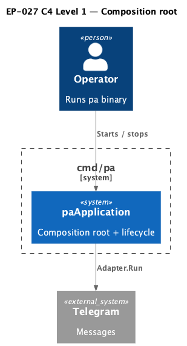

# EP-027 — Composition root and application lifecycle — Requirements (EARS / INCOSE)

This document defines requirements for EP-027: split `cmd/pa` server startup into a typed composition root (`paInfrastructure`, `paApplication`), single coordinated teardown, and user-visible soft responses for `create_scheduled_job` while the jobs runtime is not ready—without `//nolint:gocyclo` on the refactored startup path.

> **6 requirements** · 5 FR · 1 NFR

**Contents**

- [Introduction](#introduction)
- [Glossary](#glossary)
- [C4 C1 — System Context](#c4-c1--system-context)
- [Requirement index](#requirement-index)
- [Requirements](#requirements)

---

## Introduction

EP-027 implements [ep-scope.md](ep-scope.md): the monolithic `runServer` / `setup` wiring in `cmd/pa` is replaced by explicit construction helpers and an application type that owns handler assembly and defers teardown in a predictable order.

---

## Glossary

| Term | Definition |
|------|------------|
| **paInfrastructure** | Struct holding adapter, optional memory store, memory vectors, embedder, node runner, and vector indices; `close` releases vector-backed resources. |
| **paApplication** | Struct built by `newPAApplication` that wires LLM providers, optional memory summarization job, tool registry, and the final `core.MessageHandler`. |

---

## C4 C1 — System Context

**Source:** [c4-context.puml](diagrams/c4-context.puml). Regenerate: `plantuml -tpng diagrams/c4-context.puml` from this directory.

---

## Requirement index

| Id | Type | Section | Summary |
|----|------|---------|---------|
| REQ-27.001 | FR | Composition | Subsystem constructors and `paInfrastructure` |
| REQ-27.002 | FR | Application | `paApplication` owns wiring and exposes Close/teardown hooks |
| REQ-27.003 | FR | Server entry | `runServer` delegates to `paApplication` |
| REQ-27.004 | FR | Jobs hand-off | `create_scheduled_job` soft messages when runtime not ready or failed |
| REQ-27.005 | FR | Lint | No `//nolint:gocyclo` on refactored startup sources |
| REQ-27.006 | NFR | Verification | `make check` and `./bin/validate EP-027` pass |

---

## Requirements

### Composition root

*REQ-27.001*

### REQ-27.001 — Subsystem constructors and `paInfrastructure`
THE `cmd/pa` package SHALL construct long-lived subsystems used by `runServer` through `buildPAInfrastructure` and focused helpers (`setupTelegramAdapter`, `setupMemoryStoreIfConfigured`, `setupEmbedder`, `ensureVectorDir`, `setupToolIndex`, `setupSkillIndex`, `setupNodeRunnerIfConfigured`) returning a single `paInfrastructure` value whose `close` method releases memory vectors and indices.

---

### Application type

*REQ-27.002*

### REQ-27.002 — `paApplication` owns wiring and exposes Close/teardown hooks
THE repository SHALL define `paApplication` holding configuration, logger, `paInfrastructure`, LLM provider handles, optional `memoryjob.Runner`, and `jobsRuntimeState`, with `Close` delegating to `paInfrastructure.close` and `stopMemorySummarization` stopping the summarization worker when it was started.

---

### Server entry

*REQ-27.003*

### REQ-27.003 — `runServer` delegates to `paApplication`
THE `runServer` function SHALL construct a `paApplication`, defer `Close` and summarization shutdown in an order that preserves the prior teardown semantics, then delegate LLM startup, memory job startup, tool registry construction, and handler construction to `paApplication` methods before `Adapter.Run`.

---

### Jobs hand-off

*REQ-27.004*

### REQ-27.004 — `create_scheduled_job` soft messages when runtime not ready or failed
THE `create_scheduled_job` native tool SHALL, when wired with `NewCreateScheduledJobToolWithRuntimeLookup`, return the same user-visible soft strings as `/jobs` commands for not-ready and initialization-failed snapshots instead of returning a hard error for those states.

---

### Lint

*REQ-27.005*

### REQ-27.005 — No `//nolint:gocyclo` on refactored startup sources
THE files `main.go`, `application.go`, and `setup_infra.go` under `cmd/pa` that replace the former `runServer` / `setup` cyclomatic suppression SHALL NOT contain the substring `//nolint:gocyclo`.

---

### Verification

*REQ-27.006*

### REQ-27.006 — `make check` and `./bin/validate EP-027` pass
THE change set SHALL pass `make check` from the repository root and `./bin/validate EP-027` after `make build`.

---

## NFR section

Operability: soft job-create responses reduce user confusion during async init ([REQ-27.004](ep-requirements.md#jobs-hand-off)). Maintainability: composition root boundaries align with [ep-scope.md](ep-scope.md) success criteria.
