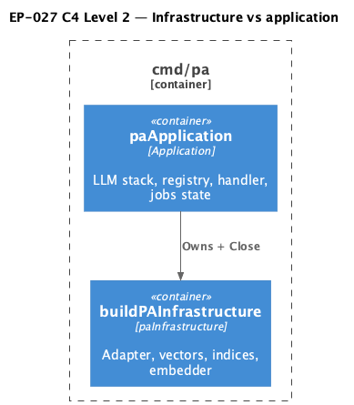

# EP-027 — System design

**Contents**

- [Overview](#overview)
- [Architecture](#architecture)
- [Module boundaries](#module-boundaries)
- [Components and interfaces](#components-and-interfaces)
- [Data models](#data-models)
- [Error handling](#error-handling)
- [Testing strategy](#testing-strategy)
- [Risks and trade-offs](#risks-and-trade-offs)
- [Requirement traceability](#requirement-traceability)

---

## Overview

Epic scope is in [ep-scope.md](ep-scope.md). EP-027 moves `cmd/pa` server startup from a single high-complexity `runServer`/`setup` pair into `buildPAInfrastructure` returning `paInfrastructure`, and `paApplication` methods that mirror the previous sequencing: SSH warn, LLM build, signal context, optional memory summarization worker, tool registry (including jobs runtime lookup), handler construction with `jobsCommandHandler` wrapping, and `initJobsRuntimeAsync` ([REQ-27.001](ep-requirements.md#composition-root)–[REQ-27.003](ep-requirements.md#server-entry)).

---

## Architecture

`runServer` is a thin orchestrator: construct application, register defers (`Close` then summarization stop — LIFO matches historic “stop worker before closing indices” behaviour), then call staged methods. Jobs tool registration uses `NewCreateScheduledJobToolWithRuntimeLookup` passing `jobsRuntimeState.snapshot` so `create_scheduled_job` can emit the same soft strings as chat `/jobs` paths ([REQ-27.004](ep-requirements.md#jobs-hand-off)).

**Source:** [c4-container.puml](diagrams/c4-container.puml). Regenerate: `plantuml -tpng diagrams/c4-container.puml` from this directory.

---

## Module boundaries

| Layer | Responsibility |
|-------|----------------|
| `cmd/pa` | Composition root, process lifecycle, Telegram adapter wiring |
| `internal/jobs` | `CreateScheduledJobTool` runtime lookup extension ([REQ-27.004](ep-requirements.md#jobs-hand-off)) |
| Other `internal/*` | Unchanged contracts consumed by constructors |

---

## Components and interfaces

| Component | Responsibility | REQ trace |
|-----------|----------------|-----------|
| `buildPAInfrastructure` | Construct adapter through indices | [REQ-27.001](ep-requirements.md#composition-root) |
| `paInfrastructure.close` | Close mem vectors, tool index, skill index | [REQ-27.001](ep-requirements.md#composition-root) |
| `newPAApplication` | Snapshot cfg/logger/infra | [REQ-27.002](ep-requirements.md#application-type) |
| `paApplication` methods | LLM load, memory job, registry, handler | [REQ-27.002](ep-requirements.md#application-type), [REQ-27.003](ep-requirements.md#server-entry) |
| `NewCreateScheduledJobToolWithRuntimeLookup` | Soft replies for async readiness | [REQ-27.004](ep-requirements.md#jobs-hand-off) |
| `runServer` | Defers + staged calls | [REQ-27.003](ep-requirements.md#server-entry) |
| Policy tests (`cmd/pa`) | Startup source lint assertions | [REQ-27.005](ep-requirements.md#lint) |

---

## Data models

No new persisted entities. Reuses `*config.Config`, `*jobsRuntimeState`, `*memoryjob.Runner` ([REQ-27.002](ep-requirements.md#application-type)).

---

## Error handling

Infrastructure construction fails fast with partial close via `paInfrastructure.close` on error paths inside `buildPAInfrastructure` ([REQ-27.001](ep-requirements.md#composition-root)). Jobs adapter missing chat sender still uses `setInitError` as before (behaviour parity with the pre-EP-027 `runServer` implementation).

---

## Testing strategy

- `internal/jobs`: `TestCreateScheduledJobTool_RuntimeLookup_*` ([AC-27.004](ep-acceptance-criteria.md#ac-27-004)).
- `cmd/pa`: `TestEP027_StartupSourcesHaveNoGocycloNolint` ([AC-27.005](ep-acceptance-criteria.md#ac-27-005)).
- `make check`, `./bin/validate EP-027` ([REQ-27.006](ep-requirements.md#verification)).

---

## Risks and trade-offs

| Risk | Mitigation |
|------|------------|
| Defer order regression | Match previous defer registration order explicitly in `runServer`. |
| Duplicate `jobsState` creation | `buildToolRegistry` always allocates state when `JobsDBPath` set; `buildMessageHandler` reuses `a.jobsState`. |

---

## Requirement traceability

| REQ | Design sections |
|-----|-----------------|
| [REQ-27.001](ep-requirements.md#composition-root) | Overview; Architecture; Components; Error handling |
| [REQ-27.002](ep-requirements.md#application-type) | Overview; Components; Data models |
| [REQ-27.003](ep-requirements.md#server-entry) | Overview; Components |
| [REQ-27.004](ep-requirements.md#jobs-hand-off) | Overview; Architecture; Components; Testing strategy |
| [REQ-27.005](ep-requirements.md#lint) | Components; Testing strategy |
| [REQ-27.006](ep-requirements.md#verification) | Testing strategy |
