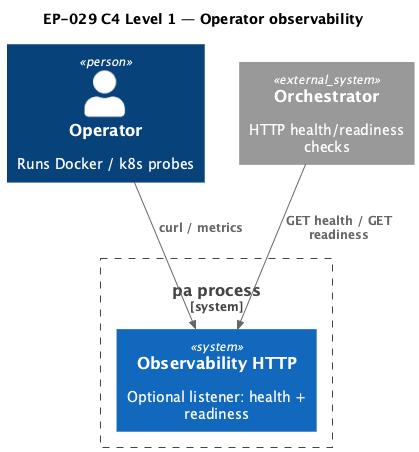

# EP-029 — Health, readiness, and operator observability — Requirements (EARS / INCOSE)

This document defines requirements for EP-029: an optional operator HTTP surface (health and readiness), readiness composition over critical subsystems, structured lifecycle logging from background workers, and operator documentation.

> **8 requirements** · 7 FR · 1 NFR · 2 theme groups

**Contents**

- [Introduction](#introduction)
- [Glossary](#glossary)
- [C4 C1 — System Context](#c4-c1--system-context)
- [EARS patterns used](#ears-patterns-used)
- [Requirement index](#requirement-index)
- [Requirements](#requirements)

---

## Introduction

EP-029 implements [ep-scope.md](ep-scope.md): operators need a standard way to probe process liveness without parsing Telegram traffic, a readiness signal that waits for asynchronous startup (tool vector index, optional jobs runtime, optional memory summarization worker), and structured logs for long-running background work.

---

## Glossary

| Term | Definition |
|------|------------|
| **Health** | HTTP response that confirms the process is executing and serving the observability listener. |
| **Readiness** | HTTP response that aggregates dependency and subsystem state before treating the instance as ready for full traffic. |
| **Lifecycle event** | A structured `slog` record using a stable attribute set (`lifecycle_event`, `subsystem`, `lifecycle_phase`, optional `duration_ms`). |

---

## C4 C1 — System Context

**Source:** [c4-context.puml](diagrams/c4-context.puml). Regenerate: `plantuml -tpng diagrams/c4-context.puml` from this directory.

---

## EARS patterns used

- **Ubiquitous:** THE \<system\> SHALL \<response\>
- **Optional feature:** WHEN \<configuration\> THE \<system\> SHALL \<response\>

---

## Requirement index

| Id | Type | Section | Summary |
|----|------|---------|---------|
| REQ-29.001 | FR | Configuration | Explicit `observability_http` object enables HTTP; all fields required when present |
| REQ-29.002 | FR | Health | Health path returns 200 and JSON liveness body |
| REQ-29.003 | FR | Readiness | Readiness path returns 200 when all checks pass, 503 otherwise |
| REQ-29.004 | FR | Readiness checks | Readiness composes LLM, vectors, tool index, optional jobs, optional memory worker |
| REQ-29.005 | FR | Lifecycle logs | Background workers emit lifecycle events with consistent attributes |
| REQ-29.006 | FR | No implicit listener | Absent `observability_http` means no extra HTTP listener |
| REQ-29.007 | FR | Operator docs | Docker-oriented documentation for endpoints and log fields |
| REQ-29.008 | NFR | Verification | Quality gate and AC validation pass |

---

## Requirements

### Configuration

*REQ-29.001*

**REQ-29.001** (Optional feature)  
WHEN `observability_http` is present as a JSON object in `config.json` THE configuration loader SHALL require every field in that object (`listen_address`, `health_path`, `readiness_path`, `probe_llm`) to be set explicitly and SHALL reject duplicate health and readiness paths or invalid path shapes (for example paths not starting with `/`).

---

### Health

*REQ-29.002*

**REQ-29.002** (Ubiquitous)  
THE observability HTTP handler SHALL respond to `GET` on the configured health path with HTTP 200 and a JSON body that includes a process liveness field suitable for container healthchecks.

---

### Readiness

*REQ-29.003*

**REQ-29.003** (Ubiquitous)  
THE observability HTTP handler SHALL respond to `GET` on the configured readiness path with HTTP 200 when all readiness checks pass, and with HTTP 503 when any check fails, returning JSON that lists per-check results.

---

### Readiness checks

*REQ-29.004*

**REQ-29.004** (Ubiquitous)  
THE readiness evaluation SHALL include: configured LLM providers (and, when `probe_llm` is true, a bounded completion probe against the first configured provider), opened memory vector stores (`summaries`, `turns`, `notes`), tool vector index readiness, and—when `paths.jobs_db_path` is non-empty—the scheduled jobs runtime initialization outcome; WHEN memory summarization prerequisites from the composition root are satisfied THE evaluation SHALL require the memory summarization worker to be started.

---

### Lifecycle logs

*REQ-29.005*

**REQ-29.005** (Ubiquitous)  
THE memory summarization worker, scheduled jobs runtime initialization, and tool vector index build completion SHALL emit structured `slog` records tagged as lifecycle events with stable keys `lifecycle_event`, `subsystem`, `lifecycle_phase`, and `duration_ms` where a duration applies.

---

### No implicit listener

*REQ-29.006*

**REQ-29.006** (Ubiquitous)  
THE main process SHALL NOT bind an observability HTTP listener unless `observability_http` is present in the loaded configuration.

---

### Operator documentation

*REQ-29.007*

**REQ-29.007** (Ubiquitous)  
THE operator documentation under `docs/` SHALL describe how to configure `observability_http`, how to call health vs readiness from Docker (including `HEALTHCHECK` examples), and the lifecycle log field schema.

---

### Verification

*REQ-29.008*

**REQ-29.008** (NFR)  
THE change set SHALL pass `make check` from the repository root, and AC validation for EP-029 SHALL succeed via the same validate tool entrypoint used in CI (`go run ./ai-sdlc/tools/validate EP-029`, or equivalently `./bin/validate EP-029` after `make build`).

---

## Traceability

| REQ | Motivation (scope) |
|-----|--------------------|
| REQ-29.001–REQ-29.004 | ep-scope — optional HTTP listener, readiness composition |
| REQ-29.005 | ep-scope — lifecycle events with consistent fields |
| REQ-29.006 | ep-scope — enable only when configuration is present |
| REQ-29.007 | ep-scope — operator documentation |
| REQ-29.008 | ep-scope — full quality gate |
