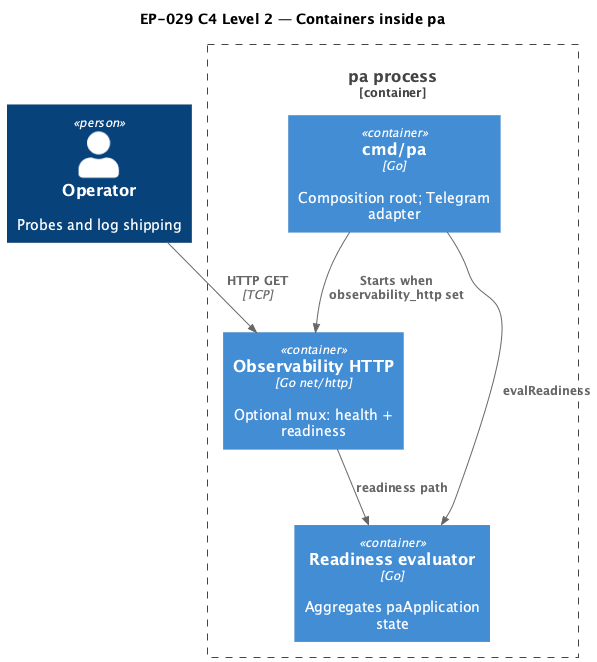

# EP-029 — System design

## Overview

This design adds an **optional** operator HTTP surface and **structured lifecycle logging** for selected background subsystems, as scoped in [ep-scope.md](ep-scope.md) and required by [ep-requirements.md](ep-requirements.md).

## Architecture

### C4 C1 — System Context

<p align="center"></p>

**Source:** [c4-context.puml](diagrams/c4-context.puml).

### C4 C2 — Containers

<p align="center"></p>

**Source:** [c4-container.puml](diagrams/c4-container.puml).

---

## Module boundaries

| Area | Package / path | Responsibility |
|------|----------------|------------------|
| Config | `internal/config` | `ObservabilityHTTPConfig`; validation when object present |
| Lifecycle schema | `internal/lifecyclelog` | Shared `slog` attributes for lifecycle boundaries |
| Readiness + HTTP wiring | `cmd/pa` | `evalReadiness`, `observabilityHTTPHandler`, `startObservabilityHTTPServer`, `runServer` integration |
| Memory worker | `internal/memoryjob` | Per-job lifecycle start/complete with duration |
| Jobs runtime | `cmd/pa/jobs_runtime.go` | Init lifecycle success/failure with duration |
| Tool index | `internal/toolindex` + `cmd/pa` | Build duration passed into `LogBuildOutcome` |

---

## Components and interfaces

| Component | Input | Output / side effects |
|-----------|-------|------------------------|
| `ObservabilityHTTPConfig` | JSON | Parsed config; validated paths and listen address string |
| `observabilityHTTPHandler` | `*config.Config`, `*paApplication` | `http.Handler` with GET health + GET readiness |
| `paApplication.evalReadiness` | `context.Context` | `readinessBody` JSON DTO |
| `lifecyclelog.Info` / `Error` | subsystem, phase, duration | `slog` record |
| `toolindex.LogBuildOutcome` | tool count, duration, error | `slog` record with `subsystem=tool_index` |

---

## Data models

### Health JSON

Liveness body (REQ-29.002 / AC-29.002):

```json
{"status":"alive"}
```

### Readiness JSON

```json
{
  "ready": true,
  "checks": [
    {"name": "llm", "ok": true, "detail": "providers loaded (probe_llm false)"},
    {"name": "vector_stores", "ok": true},
    {"name": "tool_index", "ok": true},
    {"name": "scheduled_jobs", "ok": true},
    {"name": "memory_summarization", "ok": true}
  ]
}
```

**Check inclusion rules**

- **`scheduled_jobs`** appears only when `paths.jobs_db_path` is non-empty.
- **`memory_summarization`** appears only when the composition root would start the worker (`paths.memory_dir`, `paths.llm_log_dir`, embedder, and summaries vector store are all available per `maybeStartMemorySummarization`). When those prerequisites are **not** met, the check is **omitted** (not reported as skipped) because the subsystem is out of scope for that process configuration.
- Other checks (`llm`, `vector_stores`, `tool_index`) are always evaluated.

The `vector_stores` check aggregates the three memory vector tables (`summaries`, `turns`, `notes`): a single `ok: false` means at least one required handle is missing, with `detail` naming the failure class (for example `memory vector bundle incomplete`).

### LLM readiness probe (when `probe_llm` is true)

- **Target:** the **first** entry in `cfg.llm_providers` / the first constructed `llm.Provider` in application order (same order as chat routing baseline index 0).
- **Call:** `Provider.Complete` with a single user message of minimal content, `MaxTokens: 1`, `Temperature: 0`, and a **context deadline of five seconds** (`llmReadinessProbeTimeout` in `cmd/pa/readiness.go`).
- **Outcomes:** transport/API/model errors map to `checks[].ok == false` and `detail` containing a short `probe failed: …` string (no response body stack traces). Success maps to `ok: true` with `detail` noting a successful probe. When `len(llm_providers)==0`, load already fails; at readiness time `llm` is not OK with `detail` explaining missing providers.

**Evaluation model:** each readiness HTTP request **re-evaluates synchronously** on the request goroutine (no cross-request cache), so scrape interval and `probe_llm` directly affect load—operators should keep intervals sane when probing is enabled.

### Lifecycle attributes (stable)

- `lifecycle_event` = `true`
- `subsystem` — `memory_job` | `jobs_runtime` | `tool_index`
- `lifecycle_phase` — e.g. `job_start`, `job_complete`, `init`, `build`
- `duration_ms` — integer milliseconds when the phase completed

---

## Error handling

- Invalid `observability_http` → **config load error** (fail fast before listen).
- HTTP server listen failure → **ERROR** log; process continues Telegram operation (observability is best-effort sidecar).
- Readiness **503** never panics; errors from LLM probe are summarized in the `llm` check `detail` string without stack traces in the HTTP body.

---

## Testing strategy

- **Unit:** `internal/config` fixtures for valid/invalid `observability_http`; `cmd/pa` tests for `evalReadiness` and `httptest.Server` over `observabilityHTTPHandler`; `internal/lifecyclelog` attribute smoke tests; updated `internal/toolindex` log tests.
- **Integration:** existing `make check` / race / core suites unchanged in behaviour.
- **Manual:** Docker `HEALTHCHECK` snippet verified by inspection in `docs/observability-http.md`.

---

## Risks and trade-offs

| Risk | Mitigation |
|------|------------|
| `probe_llm=true` adds cost and latency on every readiness scrape | Default examples use `false`; operators enable probing only when orchestration requires it. |
| Binding `0.0.0.0` exposes health to the network | Documentation stresses loopback binds for single-host deployments. |
| Duplicated “job failed” logs (legacy + lifecycle) | Keep legacy line for continuity; lifecycle adds structured fields for parsers. |

---

## Requirement traceability

| REQ | Design element |
|-----|-----------------|
| REQ-29.001 | `ObservabilityHTTPConfig` + `validateObservabilityHTTP` |
| REQ-29.002 | Health handler JSON |
| REQ-29.003 | Readiness status code + body |
| REQ-29.004 | `evalReadiness` composition |
| REQ-29.005 | `lifecyclelog`, memoryjob drain, jobs init, `LogBuildOutcome` |
| REQ-29.006 | `runServer` starts HTTP only when config block present |
| REQ-29.007 | `docs/observability-http.md`, `docs/configuration.md`, `docs/README.md` |
| REQ-29.008 | CI via `make check` and `./bin/validate EP-029` |
