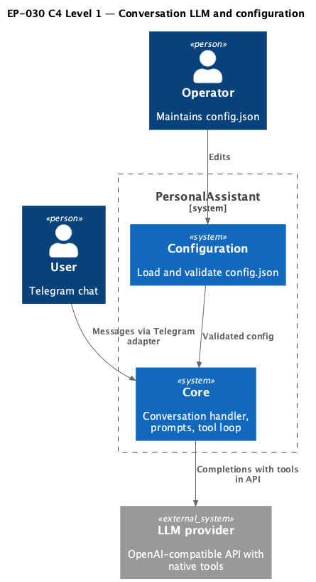
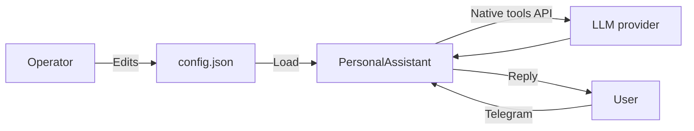

# EP-030 — Remove Hermes text-based tool path — Requirements (EARS / INCOSE)

This document defines requirements for [ep-scope.md](ep-scope.md): remove Hermes-style text tool calls, remove `tools.text_based_enabled` and `llm_providers[].supports_json_mode` from the product contract, simplify the OpenAI-compatible completion path to text-only defaults, and align dynamic tool capping and operator guidance with native tool calling only.

> **16 requirements** · 14 FR · 2 NFR · 7 theme groups

**Contents**

- [Introduction](#introduction)
- [Glossary](#glossary)
- [C4 C1 — System Context](#c4-c1--system-context)
- [Flow](#flow)
- [EARS patterns used](#ears-patterns-used)
- [Requirement index](#requirement-index)
- [Requirements](#requirements)

---

## Introduction

EP-030 removes the Hermes text tool path and related configuration so conversation tools run only through the provider native tool-calling API. The configuration surface shrinks: no `text_based_enabled`, no `supports_json_mode`, and `default_response_format` is restricted to `text` for every `llm_providers[]` entry. Operators receive a single startup warning when the baseline provider does not advertise native tool support while the deployment still exposes conversation tools. EP-018 requirements that referenced Hermes blocks for prompt assembly are superseded here for the main LLM turn; tier names and classifier behaviour stay unchanged except where they depended on the removed flag.

---

## Glossary

| Term | Definition |
|------|------------|
| **Baseline LLM provider** | The `llm_providers` entry selected by tools escalation baseline index when tools escalation is enabled and configured; otherwise index `0`. |
| **Hermes text path** | Legacy flow that injected Hermes format instructions and parsed `<tool_call>` blocks from assistant text when `supports_tools` was false and `text_based_enabled` was true. |
| **Main conversation completion** | The primary chat completion request built by the conversation handler for a user turn, including tool definitions when tools apply. |
| **Native tool calling** | Tool definitions and tool results carried in the provider HTTP API (`tool_calls` / tool role messages), not parsed from free-form assistant prose. |

---

## C4 C1 — System Context

**Source:** [diagrams/c4-context.puml](diagrams/c4-context.puml). Regenerate: `plantuml -tpng diagrams/c4-context.puml` from this directory.

### Flow

---

## EARS patterns used

- **Ubiquitous:** THE \<system\> SHALL \<response\>
- **Event-driven:** WHEN \<trigger\>, THE \<system\> SHALL \<response\>
- **Unwanted event:** IF \<condition\>, THEN THE \<system\> SHALL \<response\>
- **Optional feature:** WHERE \<option\>, THE \<system\> SHALL \<response\>

---

## Requirement index

| Id | Type | Section | Summary |
|----|------|---------|---------|
| REQ-30.001 | FR | Hermes removal | No Hermes markup in main system prompts |
| REQ-30.002 | FR | Hermes removal | No parsing of Hermes tool blocks from assistant text |
| REQ-30.003 | FR | Hermes removal | Remove Hermes-only Go package `internal/tooltext` |
| REQ-30.004 | FR | Configuration | Remove `tools.text_based_enabled` from contract and code |
| REQ-30.005 | FR | Configuration | Remove `supports_json_mode` from each `llm_providers[]` entry |
| REQ-30.006 | FR | LLM defaults | `default_response_format` SHALL be `text` only |
| REQ-30.007 | FR | LLM request shape | No `response_format: json_object` from removed JSON-mode flags |
| REQ-30.008 | FR | Dynamic tools | `full_lite` dynamic cap without `text_based_enabled` gate |
| REQ-30.009 | FR | Operator warning | Startup WARN when baseline lacks native tools but tools exist |
| REQ-30.010 | FR | Observability | Remove Hermes-specific log attributes and failure classes |
| REQ-30.011 | FR | Catalog YAML | Assembled prompts and native tool descriptions SHALL use `index_text` / `system_prompt` only |
| REQ-30.012 | FR | Documentation | Operator docs match post-epic behaviour and migration |
| REQ-30.013 | FR | Config migration | Reject removed keys with explicit load errors |
| REQ-30.014 | NFR | Quality gate | `make check` passes |
| REQ-30.015 | NFR | AC validation | `./bin/validate EP-030` passes |
| REQ-30.016 | FR | Native tools contract | Main path tool execution uses native tool_calls only |

---

## Requirements

### Hermes removal

*REQ-30.001*

### REQ-30.001 — No Hermes markup in main system prompts
THE conversation handler SHALL NOT insert legacy text-tool protocol instructions or removed `tooltext` package prose into the main conversation system message for any intent tier; tool invocation for the main turn SHALL be driven by native provider tool definitions, not by instructing the model to emit tool markup in assistant text.

*REQ-30.002*

### REQ-30.002 — No parsing of Hermes tool blocks from assistant text
THE conversation handler SHALL obtain tool invocations for the main conversation completion only from native `tool_calls` supplied by the LLM provider implementation.

*REQ-30.003*

### REQ-30.003 — Remove Hermes-only Go package `internal/tooltext`
THE product codebase SHALL NOT retain package `internal/tooltext`; any remaining Hermes parsing or instruction helpers SHALL be deleted or relocated without reintroducing a text-markup tool protocol in this epic.

---

### Configuration

*REQ-30.004*

### REQ-30.004 — Remove `tools.text_based_enabled` from contract and code
THE configuration loader SHALL reject `config.json` that contains a `tools.text_based_enabled` property after this epic, and the typed configuration model and all product code paths SHALL omit a `TextBasedEnabled` field.

*REQ-30.005*

### REQ-30.005 — Remove `supports_json_mode` from each `llm_providers[]` entry
THE configuration loader SHALL reject `config.json` that contains `supports_json_mode` on any `llm_providers[]` entry after this epic, and the typed `LLMProvider` model SHALL omit a `SupportsJSONMode` field.

*REQ-30.013*

### REQ-30.013 — Reject removed keys with explicit load errors
IF `config.json` contains `tools.text_based_enabled` or `supports_json_mode` inside any `llm_providers[]` object after this epic, THEN THE configuration loader SHALL fail with an error message that names the unsupported key or field.

---

### LLM defaults and request shape

*REQ-30.006*

### REQ-30.006 — `default_response_format` SHALL be `text` only
THE configuration loader SHALL require every `llm_providers[]` entry to set `default_response_format` to the literal `text` and SHALL reject any other value.

*REQ-30.007*

### REQ-30.007 — No `response_format: json_object` from removed JSON-mode flags
THE OpenAI-compatible client SHALL NOT set HTTP `response_format` to `json_object` based on a removed configuration flag or on `CompletionOptions.ForceJSONOutput`; any `ForceJSONOutput` field or equivalent hint SHALL be removed from the completion options type and call sites in this epic.

---

### Dynamic tool capping

*REQ-30.008*

### REQ-30.008 — `full_lite` dynamic cap without `text_based_enabled` gate
WHEN `tools.dynamic_selection.enabled` is true THE conversation handler SHALL apply the configured dynamic tool cap for tier `full_lite` the same way it applies for tier `full` for the shared merged-tail tool path, without requiring a former `text_based_enabled` precondition.

---

### Operator warning

*REQ-30.009*

### REQ-30.009 — Startup WARN when baseline lacks native tools but tools exist
WHEN the baseline LLM provider has `supports_tools` set to false AND at least one conversation tool definition would be attached to the main conversation completion for a configured assistant, THEN THE process SHALL emit exactly one structured `WARN` log line in English after tool registry wiring and before serving user traffic, stating that native tool calling is disabled for the baseline provider and conversation tools will not run.

---

### Observability

*REQ-30.010*

### REQ-30.010 — Remove Hermes-specific log attributes and failure classes
THE product SHALL remove Hermes-specific failure classes, metric labels, or log attribute values such as `hermes_parse` or `invoked_via=hermes`, replacing them with neutral or native-tool wording where logging is still required.

---

### Tool catalog

*REQ-30.011*

### REQ-30.011 — Assembled prompts and native tool descriptions SHALL use `index_text` / `system_prompt` only
THE main conversation system prompt assembly SHALL use **`index_text`** (and optional **`system_prompt`**) only for catalog-backed instructional content sent to the model. The product SHALL NOT define or read a separate catalog field for legacy text-tool list lines; any such keys in older YAML files are ignored by the parser and SHALL NOT appear in assembled prompts.

---

### Documentation

*REQ-30.012*

### REQ-30.012 — Operator docs match post-epic behaviour and migration
THE operator-facing documentation under `docs/` SHALL describe native-tool-only behaviour, list removed configuration keys, and SHALL document the startup warning from REQ-30.009.

---

### Native tool contract

*REQ-30.016*

### REQ-30.016 — Main path tool execution uses native tool_calls only
THE PersonalAssistant SHALL document in operator documentation that conversation tools require `supports_tools: true` on the baseline provider when tools are enabled; runtime behaviour for `supports_tools: false` SHALL match REQ-30.009 (warning) and SHALL NOT invoke tools on the main path.

---

### Verification

*REQ-30.014*

### REQ-30.014 — `make check` passes
THE change set SHALL pass `make check` on a clean working tree.

*REQ-30.015*

### REQ-30.015 — `./bin/validate EP-030` passes
THE change set SHALL pass `./bin/validate EP-030` with every in-scope acceptance criterion traced to automated tests per repository validation rules.

---

## NFR summary

Security and reliability follow existing project rules: fail-fast configuration, no silent removal of tool capability without the WARN in REQ-30.009, and no weakening of SSH or secret-handling behaviour.
