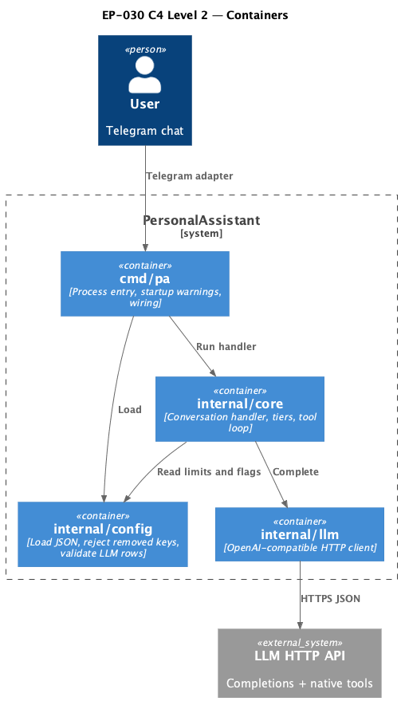

# EP-030 — System design

## Contents

- [Overview](#overview)
- [Architecture](#architecture)
- [Components and interfaces](#components-and-interfaces)
- [Data models](#data-models)
- [Error handling](#error-handling)
- [Testing strategy](#testing-strategy)
- [Requirement traceability](#requirement-traceability)

---

## Overview

Epic scope: [ep-scope.md](ep-scope.md). EP-030 removes the Hermes text tool path and related configuration flags so the main conversation uses **native tool calling only**. Implementation concentrates changes in `internal/core` (handler, tier prompt assembly, tool loop), `internal/config` (load, validation, strict rejection of removed keys), `internal/llm` (remove JSON-mode branches tied to removed flags), `internal/toolcatalog` (stop emitting Hermes-only bodies), `cmd/pa` (startup warning), `internal/promptmarkers` / `internal/systemprompt` if still referenced, operator `docs/`, and tests. See [ep-requirements.md](ep-requirements.md) and [ep-acceptance-criteria.md](ep-acceptance-criteria.md). When the baseline provider has `supports_tools` false, the main completion path MUST NOT attach tool definitions to the provider request and MUST NOT execute tools ([REQ-30.016](ep-requirements.md#native-tool-contract)), in addition to the startup WARN ([REQ-30.009](ep-requirements.md#operator-warning)).

---

## Architecture

**Source:** [diagrams/c4-container.puml](diagrams/c4-container.puml). Regenerate: `plantuml -tpng diagrams/c4-container.puml` from this directory.

### Module boundaries

| Layer | Responsibility |
|-------|----------------|
| `cmd/pa` | After tool registry build, emit REQ-30.009 warning; no business logic duplication inside `main` beyond wiring. |
| `internal/config` | Single source of truth for rejecting `text_based_enabled`, `supports_json_mode`, and non-text `default_response_format`. |
| `internal/core` | No imports of removed `tooltext`; tier builders use native tools only; `full_lite` dynamic cap matches `full` cap behaviour when enabled. |
| `internal/llm` | Text-first HTTP bodies; remove `ForceJSONOutput` and `supportsJSONMode` plumbing. |

---

## Components and interfaces

| Component | Responsibility | Key interfaces |
|-----------|----------------|----------------|
| `config.Load` | Parse JSON, `rejectRemovedUnsupportedConfigKeys`, `validateConfigRootObjectKeys`, `validate` | `Load(path string) (*Config, error)` |
| `ToolsConfig` | Holds tools settings without `TextBasedEnabled` | JSON `tools` object |
| `LLMProvider` | Holds provider row without `SupportsJSONMode`; `DefaultResponseFormat` only `text` | JSON `llm_providers[]` |
| `conversationHandler` | No Hermes branches; no `textBasedEnabled` field | `HandleMessage`, tier builders |
| `OpenAICompatible` | `resolveResponseFormat` simplified | `Complete` |
| `toolcatalog.Tool` | `id`, `index_text`, optional `system_prompt`, template, node_id, arguments, triggers; native descriptions from `index_text` only | YAML catalog |
| Startup wiring | WARN once per process start | `slog.Logger.Warn` |
| `docs/` | Operator migration text for removed keys and native-tool contract | Markdown under `docs/` ([REQ-30.012](ep-requirements.md#documentation)) |

---

## Data models

- **`config.json`**: `tools` object loses `text_based_enabled`. Each `llm_providers[]` entry loses `supports_json_mode`; `default_response_format` is always `"text"`.
- **Completion options** (`internal/llm`): Remove `ForceJSONOutput` from `CompletionOptions` and all assignments in `internal/core`.
- **Catalog YAML**: Tool entries use `index_text` and optional `system_prompt` for model-visible catalog text; the loader does not map removed legacy YAML keys into the in-memory tool model ([REQ-30.011](ep-requirements.md#tool-catalog)).

---

## Error handling

- Unknown or removed keys in JSON for the named epic fields produce **deterministic** `config: ...` errors ([REQ-30.013](ep-requirements.md#configuration), [REQ-30.004](ep-requirements.md#configuration), [REQ-30.005](ep-requirements.md#configuration)).
- Runtime tool failures no longer emit `hermes_parse`; use existing generic tool or parse error classes ([REQ-30.010](ep-requirements.md#observability)).

---

## Testing strategy

- **Unit**: `internal/config` tests for reject paths and `default_response_format`; `internal/llm` tests updated for response format; `internal/core` tests replace Hermes suites with native-tool-only cases.
- **Integration**: Adjust any integration test that asserted Hermes markers ordering; add startup WARN test with captured logger.
- **Validation**: Every new or changed `Test*` includes `// Covers AC-30.NNN` (and REQ where required) so `./bin/validate EP-030` passes ([REQ-30.015](ep-requirements.md#verification)).

---

## Requirement traceability

| REQ | Design sections addressing the REQ |
|-----|--------------------------------------|
| [REQ-30.001](ep-requirements.md#hermes-removal) | Overview; Components `conversationHandler`; Testing |
| [REQ-30.002](ep-requirements.md#hermes-removal) | Overview; Components `conversationHandler`; Data models Completion options |
| [REQ-30.003](ep-requirements.md#hermes-removal) | Overview; Module boundaries `internal/core` |
| [REQ-30.004](ep-requirements.md#configuration) | Data models; Components `config.Load`, `ToolsConfig`; Error handling |
| [REQ-30.005](ep-requirements.md#configuration) | Data models; Components `LLMProvider`; Error handling |
| [REQ-30.006](ep-requirements.md#llm-defaults-and-request-shape) | Data models; Components `config.Load`, `LLMProvider` |
| [REQ-30.007](ep-requirements.md#llm-defaults-and-request-shape) | Components `OpenAICompatible`; Data models Completion options |
| [REQ-30.008](ep-requirements.md#dynamic-tool-capping) | Module boundaries `internal/core`; Components `conversationHandler` |
| [REQ-30.009](ep-requirements.md#operator-warning) | Components Startup wiring |
| [REQ-30.010](ep-requirements.md#observability) | Error handling; Components `conversationHandler` |
| [REQ-30.011](ep-requirements.md#tool-catalog) | Data models; Components `toolcatalog.Tool` |
| [REQ-30.012](ep-requirements.md#documentation) | Components `docs/`; Overview |
| [REQ-30.013](ep-requirements.md#configuration) | Error handling; Components `config.Load` |
| [REQ-30.014](ep-requirements.md#verification) | Testing strategy |
| [REQ-30.015](ep-requirements.md#verification) | Testing strategy |
| [REQ-30.016](ep-requirements.md#native-tool-contract) | Overview; Components `conversationHandler`; Error handling |

---

## Risks and mitigations

| Risk | Mitigation |
|------|------------|
| Silent ignore of removed JSON keys | Raw JSON key scan in `prepareConfig` before or after unmarshal ([REQ-30.013](ep-requirements.md#configuration)). |
| `full_lite` token regressions | Dedicated tests for dynamic cap parity ([REQ-30.008](ep-requirements.md#dynamic-tool-capping), [AC-30.008](ep-acceptance-criteria.md#ac-30-008)). |
| Missed `hermes` strings in logs | Grep gate in review + AC-30.010 tests. |
