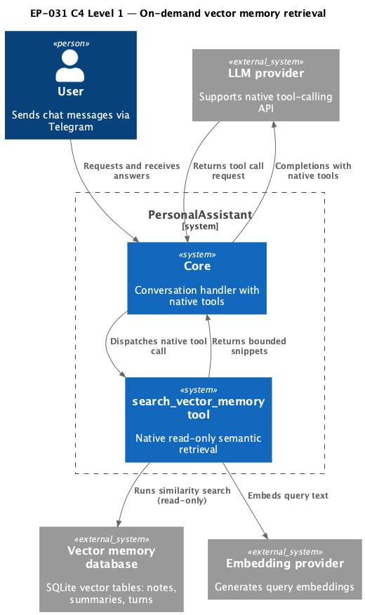
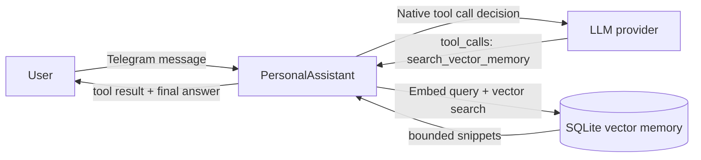

# EP-031 — Vector Memory Search Tool — Requirements (EARS / INCOSE)

This document defines requirements for [ep-scope.md](ep-scope.md): add native tool `search_vector_memory` for on-demand semantic retrieval from vector memory with bounded output, explicit validation, and no write-side effects.

> **13 requirements** · 10 FR · 3 NFR · 6 theme groups

**Contents**

- [Introduction](#introduction)
- [Glossary](#glossary)
- [C4 C1 — System Context](#c4-c1--system-context)
- [Flow](#flow)
- [EARS patterns used](#ears-patterns-used)
- [Requirement index](#requirement-index)
- [Requirements](#requirements)

---

## Introduction

EP-031 introduces an explicit semantic retrieval tool for vector memory to reduce prompt bloat caused by always-on auto-RAG injection. The tool is read-only, lane-aware (`notes`, `summaries`, `turns`), and bounded by strict limits so retrieval happens only when needed in the tool-calling loop.

---

## Glossary

| Term | Definition |
|------|------------|
| **Vector memory** | Semantic index stored in SQLite vector tables (`vec_notes`, `vec_summaries`, `vec_turns`). |
| **Memory lane** | One retrieval source among `notes`, `summaries`, and `turns`. |
| **`search_vector_memory`** | New native read-only tool id for semantic retrieval from vector memory in this epic. |
| **Tool-calling loop** | Main conversation loop where the LLM returns structured `tool_calls` and receives tool results as `tool` messages. |
| **Output budget** | Maximum bytes of tool result text that can be returned to the LLM prompt path. |
| **Query embedding** | Numeric vector computed from user query text by the configured embedding provider. |

---

## C4 C1 — System Context

**Source:** [diagrams/c4-context.puml](diagrams/c4-context.puml). Regenerate: `plantuml -tpng diagrams/c4-context.puml` from this directory.

### Flow

---

## EARS patterns used

- **Ubiquitous:** THE <system> SHALL <response>
- **Event-driven:** WHEN <trigger>, THE <system> SHALL <response>
- **Unwanted event:** IF <condition>, THEN THE <system> SHALL <response>
- **Optional feature:** WHERE <option>, THE <system> SHALL <response>

---

## Requirement index

| Id | Type | Section | Summary |
|----|------|---------|---------|
| REQ-31.001 | FR | Tool contract | Register native tool id `search_vector_memory` |
| REQ-31.002 | FR | Tool contract | Require non-empty semantic query |
| REQ-31.003 | FR | Retrieval lanes | Search selected lane(s): notes/summaries/turns |
| REQ-31.004 | FR | Retrieval lanes | Validate lane values and reject unknown lanes |
| REQ-31.005 | FR | Limits | Enforce bounded top_k and deterministic ordering |
| REQ-31.006 | FR | Output shaping | Return compact structured snippets with source ids |
| REQ-31.007 | FR | Safety | Tool is read-only and does not mutate memory files/index |
| REQ-31.008 | FR | Runtime skills | Allow runtime skills to reference `search_vector_memory` |
| REQ-31.009 | FR | Observability | Emit structured invocation logs without sensitive leakage |
| REQ-31.010 | FR | Retrieval policy | On-demand retrieval works without enabling auto-RAG lanes |
| REQ-31.011 | NFR | Verification | `make check` passes |
| REQ-31.012 | NFR | Validation | `make validate` passes |
| REQ-31.013 | NFR | E2E | End-to-end conversational retrieval scenario passes |

---

## Requirements

### Tool contract

### REQ-31.001 — Register native tool id `search_vector_memory`
THE PersonalAssistant SHALL expose a native tool with id `search_vector_memory` in the main conversation tool registry when vector memory and embedding runtime dependencies are available.

### REQ-31.002 — Require non-empty semantic query
IF a `search_vector_memory` call omits `query` or provides an empty `query`, THEN THE PersonalAssistant SHALL reject the call with a deterministic validation error.

---

### Retrieval lanes

### REQ-31.003 — Search selected lane(s): notes/summaries/turns
WHERE `lanes` is omitted, THE PersonalAssistant SHALL search all available memory lanes (`notes`, `summaries`, `turns`) for `search_vector_memory`.

### REQ-31.004 — Validate lane values and reject unknown lanes
IF a `search_vector_memory` call contains a lane value outside `{notes, summaries, turns}`, THEN THE PersonalAssistant SHALL reject the call with a deterministic validation error naming the invalid lane.

---

### Limits and output shaping

### REQ-31.005 — Enforce bounded top_k and deterministic ordering
THE PersonalAssistant SHALL enforce configured limits for `top_k` and output bytes for `search_vector_memory`, and SHALL return results in deterministic lane-and-score order.

### REQ-31.006 — Return compact structured snippets with source ids
THE PersonalAssistant SHALL return `search_vector_memory` results as compact structured snippets that include source identifiers and lane labels suitable for tool-result prompt insertion.

---

### Safety and integration

### REQ-31.007 — Tool is read-only and does not mutate memory files/index
THE PersonalAssistant SHALL implement `search_vector_memory` as read-only behaviour that does not append, delete, or rewrite memory files or vector rows.

### REQ-31.008 — Allow runtime skills to reference `search_vector_memory`
THE PersonalAssistant runtime skill validation SHALL accept `search_vector_memory` as an allowed native tool reference.

### REQ-31.009 — Emit structured invocation logs without sensitive leakage
WHEN `search_vector_memory` is invoked, THE PersonalAssistant SHALL emit a structured tool-invocation log entry that records tool id, validated arguments, and result/error metadata with existing redaction policy applied.

---

### Retrieval policy

### REQ-31.010 — On-demand retrieval works without enabling auto-RAG lanes
THE PersonalAssistant SHALL support `search_vector_memory` tool invocation and useful semantic retrieval even when `conversation_context.memory_vector` auto-retrieval top_k values are all zero.

---

### Verification

### REQ-31.011 — `make check` passes
THE EP-031 change set SHALL pass `make check` on a clean working tree.

### REQ-31.012 — `make validate` passes
THE EP-031 change set SHALL pass `make validate` without parameters on a clean working tree.

### REQ-31.013 — End-to-end conversational retrieval scenario passes
WHEN a user asks a question that depends on prior semantic context, THE PersonalAssistant SHALL complete an end-to-end flow where the main LLM invokes `search_vector_memory`, receives bounded relevant snippets, and produces a grounded final answer without requiring auto-RAG system-tail retrieval.
