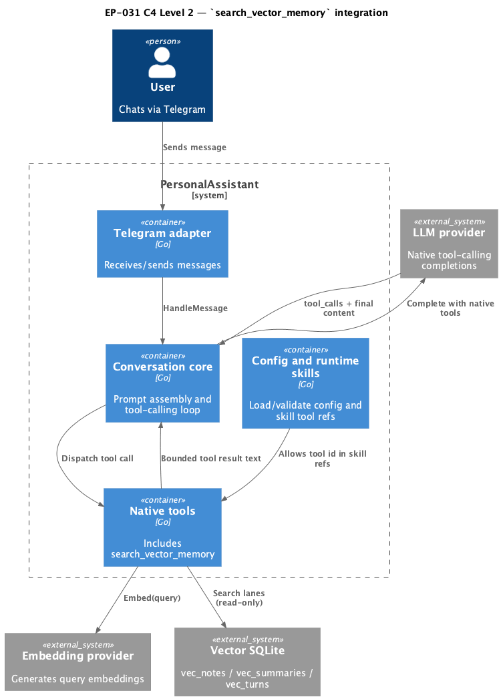

# EP-031 — System design

## Contents

- [Overview](#overview)
- [Architecture](#architecture)
- [Components and interfaces](#components-and-interfaces)
- [Data models](#data-models)
- [Error handling](#error-handling)
- [Testing strategy](#testing-strategy)
- [Requirement traceability](#requirement-traceability)
- [Risks and trade-offs](#risks-and-trade-offs)

---

## Overview

Epic scope: [ep-scope.md](ep-scope.md). EP-031 adds native tool `search_vector_memory` for on-demand semantic retrieval from vector memory lanes (`notes`, `summaries`, `turns`) with strict validation and bounded output. The design keeps retrieval read-only, integrates the tool into native registry and runtime-skill allowlist, and supports retrieval even when automatic memory-vector top_k lanes are disabled in conversation context.

---

## Architecture

**Source:** [diagrams/c4-container.puml](diagrams/c4-container.puml). Regenerate: `plantuml -tpng diagrams/c4-container.puml` from this directory.
Rendered artifact for review is stored at `diagrams/c4-container.png`.

### Module boundaries

| Layer | Responsibility |
|-------|----------------|
| `cmd/pa` | Register `search_vector_memory` with core native tools when runtime dependencies are available. |
| `internal/tools` | Implement `search_vector_memory` input validation, embedding, lane routing, bounded formatting, and read-only retrieval. |
| `internal/core` | Execute tool through existing tool-calling loop and pass truncated tool result to LLM prompt path. |
| `internal/config` | Accept `search_vector_memory` in allowed native tool IDs for runtime skills and `always_include` validation. |
| `internal/vector` + sqlite tables | Provide read-only search against notes, summaries, and turns stores. |

---

## Components and interfaces

| Component | Responsibility | Key interfaces |
|-----------|----------------|----------------|
| `tools.SearchVectorMemoryTool` (new) | Validate params and execute bounded semantic retrieval over selected lanes | `Name()`, `ParamsSchema()`, `Run(ctx, params)` with args: `query` (required), `lanes` (optional array), `top_k` (optional int); output: deterministic plain-text block with lane, source id, snippet; errors: validation, embedding, search |
| `core.MemoryVectors` | Expose lane stores to tool and handler | `Notes`, `Summaries`, `Turns` |
| `embedding.Embedder` | Build query embedding | `Embed(ctx, text)` |
| `tools.Registry` | Expose native tool to LLM definitions and dispatch | `Register`, `Get`, `List` |
| Runtime skill validation | Allow `search_vector_memory` in skill frontmatter | `AllowedNativeToolIDs` |
| `conversationHandler` tool loop | Use standard tool call dispatch and prompt-size truncation | `executeOneToolCall`, `truncateToolResultForPrompt` |

---

## Data models

### Tool arguments

- `query` (required string): semantic query text.
- `lanes` (optional array of strings): subset of `notes`, `summaries`, `turns`; omitted means all lanes.
- `top_k` (optional integer): bounded positive count; validated against config-level cap or tool default max.

### Tool output

- Deterministic plain-text block for prompt insertion:
  - Header with selected lanes and effective top_k.
  - Ordered items each containing lane label, source id, and compact snippet text.
  - Empty-result message when no match found.
- Deterministic ordering policy:
  - Lane order is fixed: `notes` -> `summaries` -> `turns`.
  - Within each lane, items are ordered by ascending distance score (lower is closer).
  - Ties within a lane are ordered by ascending source identifier.
  - Cross-lane merge does not reorder by score across lanes.

### State and side effects

- No writes to memory markdown files.
- No writes to vector rows.
- Read-only lane searches only.

---

## Error handling

- Invalid `query`/`lanes`/`top_k` return deterministic validation errors.
- Embedding failure returns explicit tool error and no partial result.
- Lane search failure returns explicit tool error with lane context.
- Output-budget policy is deterministic and single-path:
  - The tool enforces `max_output_bytes`.
  - If next item would exceed the limit, the tool stops adding items and appends one truncation footer (`[truncated: N items omitted]`) when at least one item already exists.
  - If even header plus first item cannot fit, the tool returns a deterministic size error.

### Observability and redaction contract

- Each `search_vector_memory` invocation emits one structured `tool invocation` log entry with:
  - `tool_id`, validated argument envelope (`lanes`, effective `top_k`, query length), result status.
- The raw query text and raw retrieved snippets are treated as sensitive and pass through the existing log redactor before emission.
- Logs SHALL NOT include full unredacted query content or full unredacted snippet bodies.
- Error logs include lane context and error class but exclude sensitive payload text.

---

## Testing strategy

- **Unit**
  - Parameter validation (`query`, lane set, `top_k` bounds).
  - Lane selection behavior (default all lanes, explicit subset).
  - Output format and deterministic ordering.
  - Read-only guarantee (no write-path calls).
- **Integration**
  - Native registry wiring and dispatch from `conversationHandler`.
  - Runtime skill allowlist acceptance for `search_vector_memory`.
  - Retrieval with all auto-RAG lane top_k set to zero.
- **E2E**
  - Conversational flow where model invokes `search_vector_memory` and answer uses returned snippets.
- **Quality gates**
  - `make check`
  - `make validate`

---

## Requirement traceability

| REQ | AC | Design sections addressing the REQ |
|-----|----|------------------------------------|
| [REQ-31.001](ep-requirements.md#tool-contract) | [AC-31.001](ep-acceptance-criteria.md#ac-31-001) | Architecture; Components `tools.SearchVectorMemoryTool`, `tools.Registry` |
| [REQ-31.002](ep-requirements.md#tool-contract) | [AC-31.002](ep-acceptance-criteria.md#ac-31-002) | Data models Tool arguments; Error handling |
| [REQ-31.003](ep-requirements.md#retrieval-lanes) | [AC-31.003](ep-acceptance-criteria.md#ac-31-003) | Data models Tool arguments; Components `core.MemoryVectors` |
| [REQ-31.004](ep-requirements.md#retrieval-lanes) | [AC-31.004](ep-acceptance-criteria.md#ac-31-004) | Data models Tool arguments; Error handling |
| [REQ-31.005](ep-requirements.md#limits-and-output-shaping) | [AC-31.005](ep-acceptance-criteria.md#ac-31-005) | Data models Tool output; Error handling |
| [REQ-31.006](ep-requirements.md#limits-and-output-shaping) | [AC-31.006](ep-acceptance-criteria.md#ac-31-006) | Data models Tool output; Testing strategy |
| [REQ-31.007](ep-requirements.md#safety-and-integration) | [AC-31.007](ep-acceptance-criteria.md#ac-31-007) | Data models State and side effects; Testing strategy |
| [REQ-31.008](ep-requirements.md#safety-and-integration) | [AC-31.008](ep-acceptance-criteria.md#ac-31-008) | Architecture `internal/config`; Components Runtime skill validation |
| [REQ-31.009](ep-requirements.md#safety-and-integration) | [AC-31.009](ep-acceptance-criteria.md#ac-31-009) | Error handling; Observability and redaction contract; Testing strategy |
| [REQ-31.010](ep-requirements.md#retrieval-policy) | [AC-31.010](ep-acceptance-criteria.md#ac-31-010) | Overview; Testing strategy integration case |
| [REQ-31.011](ep-requirements.md#verification) | [AC-31.011](ep-acceptance-criteria.md#ac-31-011) | Testing strategy quality gates |
| [REQ-31.012](ep-requirements.md#verification) | [AC-31.012](ep-acceptance-criteria.md#ac-31-012) | Testing strategy quality gates |
| [REQ-31.013](ep-requirements.md#verification) | [AC-31.013](ep-acceptance-criteria.md#ac-31-013) | Testing strategy E2E |

---

## Risks and trade-offs

| Risk or trade-off | Decision / mitigation |
|-------------------|-----------------------|
| Tool output may still be too long for downstream prompt | Keep strict output-size cap and rely on existing `truncateToolResultForPrompt` guard. |
| Lane merge ordering could become non-deterministic across stores | Define deterministic lane-first ordering and test exact output order. |
| Additional tool call can increase turn latency | Keep query embed + search bounded (`top_k` cap) and avoid extra writes. |
| Confusion with future calendar-memory `search_memory` | Keep fixed id `search_vector_memory` and document separation in scope and requirements. |
