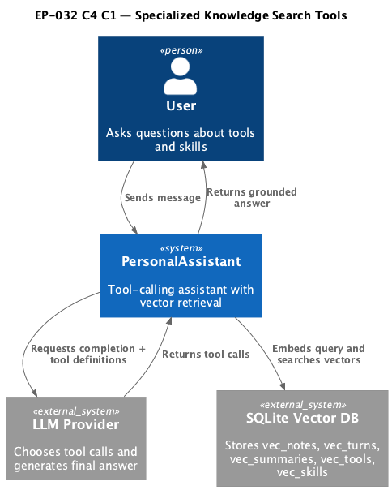
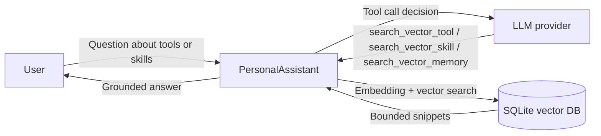

# EP-032 — Specialized Knowledge Search Tools — Requirements (EARS / INCOSE)

This document defines requirements for [ep-scope.md](ep-scope.md): add `search_vector_tool` and `search_vector_skill`, and move vector-search runtime settings for all three tools (`search_vector_memory`, `search_vector_tool`, `search_vector_skill`) into one unified config block.

> **17 requirements** · 13 FR · 4 NFR · 7 theme groups

**Contents**

- [Introduction](#introduction)
- [Glossary](#glossary)
- [C4 C1 — System Context](#c4-c1--system-context)
- [Flow](#flow)
- [EARS patterns used](#ears-patterns-used)
- [Requirement index](#requirement-index)
- [Requirements](#requirements)

---

## Introduction

EP-032 extends on-demand vector retrieval by splitting knowledge domains into dedicated native tools: one for tool knowledge and one for skill knowledge. The epic keeps `search_vector_memory` memory-only, and centralizes runtime limits for all vector-search tools in one config block to make behavior explicit, consistent, and operator-controlled.

---

## Glossary

| Term | Definition |
|------|------------|
| **`search_vector_memory`** | Existing native read-only tool for semantic retrieval from memory lanes (`notes`, `summaries`, `turns`). |
| **`search_vector_tool`** | New native read-only tool for semantic retrieval from tool-knowledge vector index/table. |
| **`search_vector_skill`** | New native read-only tool for semantic retrieval from skill-knowledge vector index/table. |
| **`tools.vector_search_tools`** | Unified config block for runtime limits and switches of all vector-search native tools. |
| **Tool knowledge lane** | Retrieval domain based on tool index content (`vec_tools`). |
| **Skill knowledge lane** | Retrieval domain based on runtime skill index content (`vec_skills`). |
| **Domain isolation** | Constraint that each specialized tool searches only its assigned domain/table. |
| **Output budget** | Maximum tool-result bytes returned to the prompt path. |
| **Deterministic ordering** | Stable result order by score and tie-breakers for repeated calls with same inputs. |
| **Tool-calling loop** | Conversation loop where the model emits tool calls and receives tool messages. |

---

## C4 C1 — System Context

**Source:** [diagrams/c4-context.puml](diagrams/c4-context.puml). Regenerate PNG: `plantuml -tpng diagrams/c4-context.puml` from this directory.

### Flow

---

## EARS patterns used

- **Ubiquitous:** THE <system> SHALL <response>
- **Event-driven:** WHEN <trigger>, THE <system> SHALL <response>
- **Unwanted event:** IF <condition>, THEN THE <system> SHALL <response>
- **Optional feature:** WHERE <option>, THE <system> SHALL <response>

---

## Requirement index

| Id | Type | Section | Summary |
|----|------|---------|---------|
| REQ-32.001 | FR | Tool contract | Register native tool id `search_vector_tool` |
| REQ-32.002 | FR | Tool contract | Register native tool id `search_vector_skill` |
| REQ-32.003 | FR | Tool contract | Keep `search_vector_memory` memory-only |
| REQ-32.004 | FR | Unified config block | Define single block for all vector-search tools |
| REQ-32.005 | FR | Unified config block | Validate config block with fail-fast semantics |
| REQ-32.006 | FR | Unified config block | `search_vector_memory` reads limits from unified block |
| REQ-32.007 | FR | Unified config block | `search_vector_tool` reads limits from unified block |
| REQ-32.008 | FR | Unified config block | `search_vector_skill` reads limits from unified block |
| REQ-32.009 | FR | Retrieval behavior | Reject missing/empty query for new tools |
| REQ-32.010 | FR | Retrieval behavior | Enforce top_k bounds and deterministic ordering |
| REQ-32.011 | FR | Retrieval behavior | Return compact bounded snippets with source identifiers |
| REQ-32.012 | FR | Safety and observability | Keep retrieval read-only |
| REQ-32.013 | FR | Safety and observability | Log invocation metadata with redaction |
| REQ-32.014 | FR | Runtime skills integration | Allow new tool IDs in runtime skill validation |
| REQ-32.015 | NFR | Verification | `make check` passes |
| REQ-32.016 | NFR | Validation | `make validate` passes |
| REQ-32.017 | NFR | E2E | End-to-end specialized retrieval scenario passes |

---

## Requirements

### Tool contract

**REQ-32.001** (Ubiquitous)  
THE PersonalAssistant SHALL register native tool id `search_vector_tool` in the main conversation registry when tool-index store and embedding runtime dependencies are available.

**REQ-32.002** (Ubiquitous)  
THE PersonalAssistant SHALL register native tool id `search_vector_skill` in the main conversation registry when skill-index store and embedding runtime dependencies are available.

**REQ-32.003** (Ubiquitous)  
THE PersonalAssistant SHALL keep `search_vector_memory` restricted to memory lanes (`notes`, `summaries`, `turns`) and SHALL NOT extend that tool to tool or skill domains.

---

### Unified config block

**REQ-32.004** (Ubiquitous)  
THE PersonalAssistant SHALL expose one config block `tools.vector_search_tools` that contains runtime settings for `search_vector_memory`, `search_vector_tool`, and `search_vector_skill`.

**REQ-32.005** (Unwanted event)  
IF `tools.vector_search_tools` contains invalid numeric bounds or invalid per-tool switches, THEN THE PersonalAssistant SHALL fail config load with deterministic validation errors naming invalid fields.

**REQ-32.006** (Ubiquitous)  
THE PersonalAssistant SHALL initialize `search_vector_memory` limits from `tools.vector_search_tools.search_vector_memory` instead of hardcoded registration values.

**REQ-32.007** (Ubiquitous)  
THE PersonalAssistant SHALL initialize `search_vector_tool` limits from `tools.vector_search_tools.search_vector_tool`.

**REQ-32.008** (Ubiquitous)  
THE PersonalAssistant SHALL initialize `search_vector_skill` limits from `tools.vector_search_tools.search_vector_skill`.

---

### Retrieval behavior

**REQ-32.009** (Unwanted event)  
IF `search_vector_tool` or `search_vector_skill` is called with missing or whitespace-only `query`, THEN THE PersonalAssistant SHALL reject the call with deterministic validation error.

**REQ-32.010** (Ubiquitous)  
THE PersonalAssistant SHALL enforce `top_k` bounds and deterministic score-based ordering for `search_vector_tool` and `search_vector_skill`.

**REQ-32.011** (Ubiquitous)  
THE PersonalAssistant SHALL return compact snippet-oriented output for `search_vector_tool` and `search_vector_skill` that includes source identifier and remains within configured output budget.

---

### Safety and observability

**REQ-32.012** (Ubiquitous)  
THE PersonalAssistant SHALL implement `search_vector_tool` and `search_vector_skill` as read-only retrieval with no writes to memory markdown files or vector rows.

**REQ-32.013** (Event-driven)  
WHEN `search_vector_tool` or `search_vector_skill` is invoked, THE PersonalAssistant SHALL emit structured invocation logs with tool id, arguments, and result/error metadata under existing log-redaction policy.

---

### Runtime skills integration

**REQ-32.014** (Ubiquitous)  
THE PersonalAssistant runtime skill validation SHALL allow native tool references `search_vector_tool` and `search_vector_skill`.

---

### Verification

**REQ-32.015** (NFR)  
THE EP-032 change set SHALL pass `make check` on a clean working tree.

**REQ-32.016** (NFR)  
THE EP-032 change set SHALL pass `make validate` without parameters on a clean working tree.

**REQ-32.017** (NFR)  
WHEN a user asks a question about tools or skills, THE PersonalAssistant SHALL complete end-to-end flow where the main model invokes the corresponding specialized vector tool, receives bounded relevant snippets, and returns grounded final answer in the same turn.
