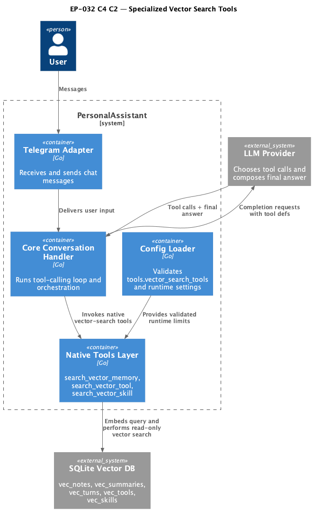

# EP-032 — Specialized Knowledge Search Tools — System design

**Contents**

- [Overview](#overview)
- [Architecture](#architecture)
- [Components and interfaces](#components-and-interfaces)
- [Data models](#data-models)
- [Error handling](#error-handling)
- [Testing strategy](#testing-strategy)
- [Risks and trade-offs](#risks-and-trade-offs)
- [Requirement traceability](#requirement-traceability)

---

## Overview

EP-032 adds two new native read-only retrieval tools (`search_vector_tool`, `search_vector_skill`) while keeping `search_vector_memory` as memory-only. Runtime settings for all three tools move to one unified config block (`tools.vector_search_tools`) to remove hardcoded limits and provide a single operator control point.

Primary requirements covered: [REQ-32.001](ep-requirements.md#tool-contract), [REQ-32.002](ep-requirements.md#tool-contract), [REQ-32.003](ep-requirements.md#tool-contract), [REQ-32.004](ep-requirements.md#unified-config-block), [REQ-32.005](ep-requirements.md#unified-config-block), [REQ-32.006](ep-requirements.md#unified-config-block), [REQ-32.007](ep-requirements.md#unified-config-block), [REQ-32.008](ep-requirements.md#unified-config-block).

---

## Architecture

**Source:** [diagrams/c4-container.puml](diagrams/c4-container.puml). Regenerate PNG: `plantuml -tpng diagrams/c4-container.puml` from this directory.

### Module boundaries

| Module | Responsibility | Allowed dependencies | Fail-fast behavior |
|---|---|---|---|
| `internal/config` | Parse and validate `tools.vector_search_tools` block | `internal/config` internals only | Reject invalid values during config load with field-level error |
| `internal/tools` | Implement vector-search tools and output shaping | `internal/embedding`, `internal/vector` | Reject invalid params before embedding/search |
| `cmd/pa` | Register tools with runtime dependencies and config | `internal/config`, `internal/tools`, `internal/toolindex`, `internal/skillindex` | Return startup error for invalid mandatory dependency states |
| `internal/core` | Execute tool-calling loop and logging/redaction | `internal/llm`, native registry, log redactor | Preserve deterministic tool error surfacing in tool loop |

Design constraints:

- Domain isolation: each specialized tool reads one index/store only.
- Deterministic output ordering and bounded output budget.
- No index writes in retrieval path.

---

## Components and interfaces

| Component | Responsibility | Key interface/contract |
|---|---|---|
| `config.ToolsConfig.VectorSearchTools` | Unified per-tool settings for all vector-search tools | Parsed from `tools.vector_search_tools`; validated at config load |
| `tools.SearchVectorMemoryTool` | Existing memory retrieval tool | Now initialized from unified config settings |
| `tools.SearchVectorToolKnowledgeTool` | Tool-knowledge retrieval from `vec_tools` | Params: `query`, optional `top_k`; read-only |
| `tools.SearchVectorSkillKnowledgeTool` | Skill-knowledge retrieval from `vec_skills` | Params: `query`, optional `top_k`; read-only |
| `registerMemoryToolsIfEnabled` | Registers memory tools and reads unified config | Must configure `search_vector_memory` from block |
| `registerKnowledgeToolsIfEnabled` | Registers specialized knowledge tools | Requires embedder + matching index store availability |
| `config.AllowedNativeToolIDs` | Runtime skill allowlist | Includes `search_vector_tool` and `search_vector_skill` |

---

## Data models

Unified config model:

- `tools.vector_search_tools.search_vector_memory`
- `tools.vector_search_tools.search_vector_tool`
- `tools.vector_search_tools.search_vector_skill`

Per-tool settings:

- `enabled` (bool)
- `default_top_k` (int)
- `max_top_k` (int)
- `max_output_bytes` (int)
- `snippet_runes` (int)

Index/store usage:

- `search_vector_memory` -> `vec_notes`, `vec_summaries`, `vec_turns`
- `search_vector_tool` -> `vec_tools`
- `search_vector_skill` -> `vec_skills`

Output shape (specialized tools):

- Header with tool id and top_k
- Rows: source id + score + compact single-line snippet
- Optional truncation footer when output budget limit is reached

---

## Error handling

- Config load fails fast on invalid unified block values (range checks and consistency checks).
- Tool invocation rejects missing/empty `query`.
- Tool invocation rejects out-of-range `top_k`.
- Missing runtime dependencies:
  - memory tool registration remains fail-fast for required memory write/read dependencies.
  - specialized tools register only when their index store is available; when disabled/unavailable, no partial invalid registration.
- Tool execution errors are deterministic and prefixed with tool id for traceable diagnostics.

Requirements mapped: [REQ-32.005](ep-requirements.md#unified-config-block), [REQ-32.009](ep-requirements.md#retrieval-behavior), [REQ-32.010](ep-requirements.md#retrieval-behavior), [REQ-32.012](ep-requirements.md#safety-and-observability), [REQ-32.013](ep-requirements.md#safety-and-observability).

---

## Testing strategy

- **Unit**
  - Config validation for unified block.
  - Specialized tool validation (`query`, `top_k` bounds), deterministic ordering, output budgets.
  - Runtime skill allowlist update.
- **Integration**
  - Registry wiring tests for registration behavior of all three vector-search tools.
  - Tool-calling loop tests for specialized tools and log redaction.
- **E2E-oriented**
  - Conversation flow where model chooses `search_vector_tool` / `search_vector_skill` and produces grounded answer.
- **Quality gates**
  - `make check`
  - `make validate`

Requirements mapped: [REQ-32.014](ep-requirements.md#runtime-skills-integration), [REQ-32.015](ep-requirements.md#verification), [REQ-32.016](ep-requirements.md#verification), [REQ-32.017](ep-requirements.md#verification).

---

## Risks and trade-offs

- **Trade-off:** Keeping specialized tools separated improves precision but adds registration/config complexity.
- **Risk:** If specialized indexes are empty or stale, recall quality drops. Mitigation: reuse existing index build lifecycle and deterministic tool behavior.
- **Risk:** Config misconfiguration could disable useful retrieval paths. Mitigation: fail-fast validation with field-level errors.

---

## Requirement traceability

| Requirement | AC | Design sections |
|---|---|---|
| [REQ-32.001](ep-requirements.md#tool-contract) | [AC-32.001](ep-acceptance-criteria.md#ac-32-001) | Overview, Components and interfaces |
| [REQ-32.002](ep-requirements.md#tool-contract) | [AC-32.002](ep-acceptance-criteria.md#ac-32-002) | Overview, Components and interfaces |
| [REQ-32.003](ep-requirements.md#tool-contract) | [AC-32.003](ep-acceptance-criteria.md#ac-32-003) | Overview, Data models |
| [REQ-32.004](ep-requirements.md#unified-config-block) | [AC-32.004](ep-acceptance-criteria.md#ac-32-004) | Overview, Data models |
| [REQ-32.005](ep-requirements.md#unified-config-block) | [AC-32.005](ep-acceptance-criteria.md#ac-32-005) | Error handling |
| [REQ-32.006](ep-requirements.md#unified-config-block) | [AC-32.006](ep-acceptance-criteria.md#ac-32-006) | Components and interfaces, Data models |
| [REQ-32.007](ep-requirements.md#unified-config-block) | [AC-32.007](ep-acceptance-criteria.md#ac-32-007) | Components and interfaces, Data models |
| [REQ-32.008](ep-requirements.md#unified-config-block) | [AC-32.008](ep-acceptance-criteria.md#ac-32-008) | Components and interfaces, Data models |
| [REQ-32.009](ep-requirements.md#retrieval-behavior) | [AC-32.009](ep-acceptance-criteria.md#ac-32-009) | Error handling |
| [REQ-32.010](ep-requirements.md#retrieval-behavior) | [AC-32.010](ep-acceptance-criteria.md#ac-32-010) | Architecture, Error handling |
| [REQ-32.011](ep-requirements.md#retrieval-behavior) | [AC-32.011](ep-acceptance-criteria.md#ac-32-011) | Data models, Error handling |
| [REQ-32.012](ep-requirements.md#safety-and-observability) | [AC-32.012](ep-acceptance-criteria.md#ac-32-012) | Architecture, Error handling |
| [REQ-32.013](ep-requirements.md#safety-and-observability) | [AC-32.013](ep-acceptance-criteria.md#ac-32-013) | Components and interfaces, Error handling |
| [REQ-32.014](ep-requirements.md#runtime-skills-integration) | [AC-32.014](ep-acceptance-criteria.md#ac-32-014) | Components and interfaces, Testing strategy |
| [REQ-32.015](ep-requirements.md#verification) | [AC-32.015](ep-acceptance-criteria.md#ac-32-015) | Testing strategy |
| [REQ-32.016](ep-requirements.md#verification) | [AC-32.016](ep-acceptance-criteria.md#ac-32-016) | Testing strategy |
| [REQ-32.017](ep-requirements.md#verification) | [AC-32.017](ep-acceptance-criteria.md#ac-32-017) | Testing strategy |
