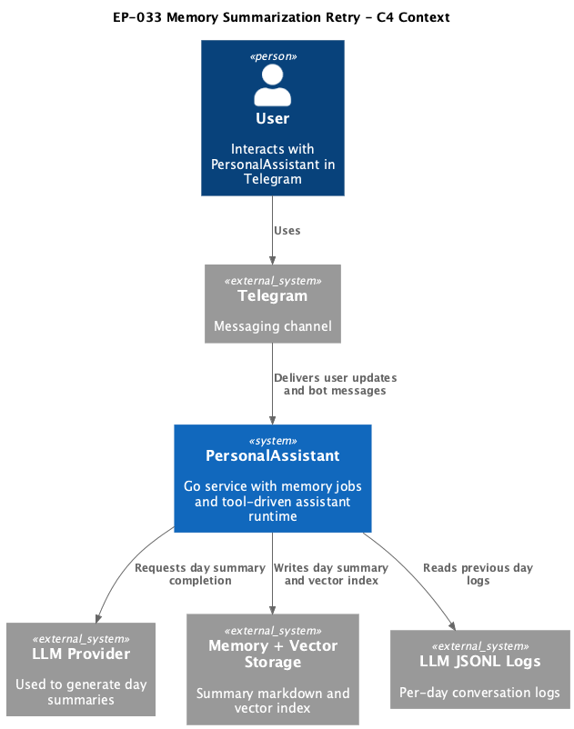
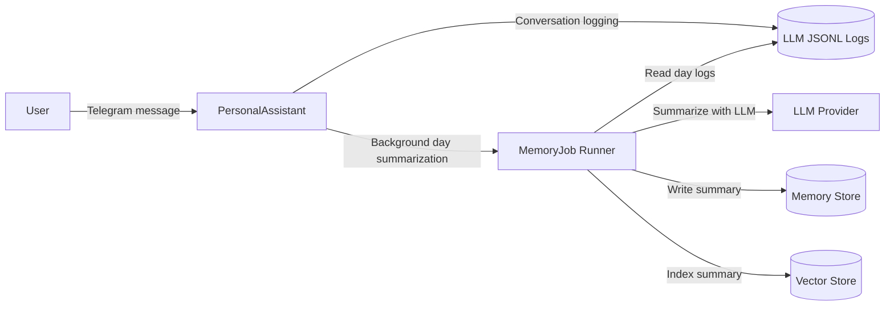

# EP-033 — Memory Summarization Retry — Requirements (EARS / INCOSE)

This document defines requirements for [ep-scope.md](ep-scope.md): add bounded retries for failed day summarization jobs in `memoryjob` while preserving current queue model and keeping month/year flows unchanged.

> **14 requirements** · 10 FR · 4 NFR · 6 theme groups

**Contents**

- [Introduction](#introduction)
- [Glossary](#glossary)
- [C4 C1 — System Context](#c4-c1--system-context)
- [Flow](#flow)
- [EARS patterns used](#ears-patterns-used)
- [Requirement index](#requirement-index)
- [Requirements](#requirements)

---

## Introduction

EP-033 improves reliability of automatic day summarization by adding bounded retries for temporary failures in `catchup_day` and `summarize_yesterday`. The epic does not widen catch-up date ranges and does not change month/year summarization logic.

---

## Glossary

| Term | Definition |
|------|------------|
| **`memoryjob.Runner`** | In-process worker that schedules and executes automatic memory jobs. |
| **`catchup_day`** | Startup day catch-up job that summarizes previous calendar day when logs exist and summary is missing. |
| **`summarize_yesterday`** | Scheduled day summarization job triggered after local 01:00. |
| **Retry attempt** | One re-execution of the same day job after a failed prior attempt. |
| **Retry policy** | Configured or constant limits for max attempts and per-attempt backoff delays. |
| **Retry queue item** | A queued day job with retry metadata (attempt and not-before time). |
| **Dedupe key** | Stable identifier that prevents duplicate queued retries for one day target. |
| **Retry exhaustion** | Terminal state where max retry attempts is reached and no further automatic retries occur. |
| **User turn deferral** | Existing behavior that postpones catch-up and scheduled jobs while an interactive user turn is active. |

---

## C4 C1 — System Context

**Source:** [diagrams/c4-context.puml](diagrams/c4-context.puml). Regenerate PNG: `plantuml -tpng diagrams/c4-context.puml` from this directory.

### Flow

---

## EARS patterns used

- **Ubiquitous:** THE <system> SHALL <response>
- **Event-driven:** WHEN <trigger>, THE <system> SHALL <response>
- **State-driven:** WHILE <condition>, THE <system> SHALL <response>
- **Unwanted event:** IF <condition>, THEN THE <system> SHALL <response>

---

## Requirement index

| Id | Type | Section | Summary |
|----|------|---------|---------|
| REQ-33.001 | FR | Retry policy scope | Apply retries to `catchup_day` |
| REQ-33.002 | FR | Retry policy scope | Apply retries to `summarize_yesterday` |
| REQ-33.003 | FR | Retry policy scope | Keep month/year paths unchanged |
| REQ-33.004 | FR | Retry scheduling behavior | Schedule retry with bounded backoff |
| REQ-33.005 | FR | Retry scheduling behavior | Stop retries at configured max attempts |
| REQ-33.006 | FR | Retry scheduling behavior | Avoid duplicate retry chains for same day target |
| REQ-33.007 | FR | Queue semantics | Keep user-turn deferral behavior for retryable day jobs |
| REQ-33.008 | FR | Queue semantics | Execute retry via existing memoryjob queue model |
| REQ-33.009 | FR | Observability | Emit structured retry logs |
| REQ-33.010 | FR | Existing behavior preservation | Preserve successful day summarization behavior |
| REQ-33.011 | NFR | Determinism | Keep deterministic retry timing policy |
| REQ-33.012 | NFR | Verification | Add unit tests for retry scheduling and exhaustion |
| REQ-33.013 | NFR | Quality gate | `make check` passes |
| REQ-33.014 | NFR | AC validation | `./bin/validate EP-033` passes |

---

## Requirements

### Retry policy scope

### REQ-33.001 — Apply retries to `catchup_day`
THE PersonalAssistant SHALL apply automatic retry policy to `catchup_day` failures in `memoryjob.Runner`.

### REQ-33.002 — Apply retries to `summarize_yesterday`
THE PersonalAssistant SHALL apply automatic retry policy to `summarize_yesterday` failures in `memoryjob.Runner`.

### REQ-33.003 — Keep month/year paths unchanged
THE PersonalAssistant SHALL keep `catchup_month`, `catchup_year`, and month/year scheduled rollup retry behavior unchanged in EP-033.

---

### Retry scheduling behavior

### REQ-33.004 — Schedule retry with bounded backoff
WHEN a retryable failure occurs in `catchup_day` or `summarize_yesterday`, THE PersonalAssistant SHALL enqueue a retry for the same day target using bounded backoff delay.

### REQ-33.005 — Stop retries at configured max attempts
WHILE retry attempts for one day target are below max attempts, THE PersonalAssistant SHALL continue scheduling retries, and THE PersonalAssistant SHALL stop automatic retries when retry exhaustion is reached.

### REQ-33.006 — Avoid duplicate retry chains for same day target
IF a retry queue item for the same day target is already pending, THEN THE PersonalAssistant SHALL prevent duplicate retry chain enqueue for that target.

---

### Queue semantics

### REQ-33.007 — Keep user-turn deferral behavior for retryable day jobs
WHILE user turn deferral is active, THE PersonalAssistant SHALL preserve existing deferral behavior for retryable day jobs and their retries.

### REQ-33.008 — Execute retry via existing memoryjob queue model
THE PersonalAssistant SHALL execute retries through the existing `memoryjob` queue and worker loop instead of introducing a separate retry worker subsystem.

---

### Observability

### REQ-33.009 — Emit structured retry logs
WHEN retry is scheduled or exhausted, THE PersonalAssistant SHALL emit structured logs with job name, day target, attempt index, and next delay or exhaustion outcome.

---

### Existing behavior preservation

### REQ-33.010 — Preserve successful day summarization behavior
THE PersonalAssistant SHALL preserve current successful day summarization write and vector-index flow semantics when no error occurs.

---

### Verification

### REQ-33.011 — Keep deterministic retry timing policy
THE PersonalAssistant SHALL use deterministic retry policy constants so repeated runs with identical clock and failures produce identical retry schedule.

### REQ-33.012 — Add unit tests for retry scheduling and exhaustion
THE PersonalAssistant SHALL include automated tests that cover retry schedule timing, max-attempt exhaustion, and duplicate prevention for day-job retries.

### REQ-33.013 — `make check` passes
THE EP-033 change set SHALL pass `make check`.

### REQ-33.014 — `./bin/validate EP-033` passes
THE EP-033 change set SHALL pass `./bin/validate EP-033`.
