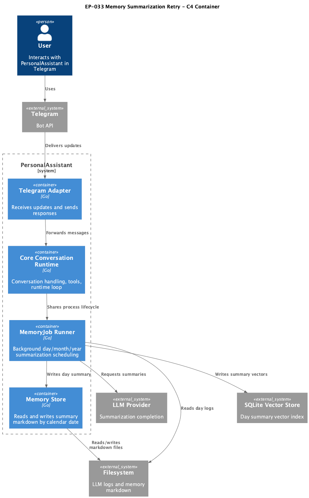

# EP-033 — Memory Summarization Retry — System design

**Contents**

- [Overview](#overview)
- [Architecture](#architecture)
- [Components and interfaces](#components-and-interfaces)
- [Data models](#data-models)
- [Error handling](#error-handling)
- [Testing strategy](#testing-strategy)
- [Risks and trade-offs](#risks-and-trade-offs)
- [Requirement traceability](#requirement-traceability)

---

## Overview

EP-033 adds bounded retries for failed day summarization jobs in `memoryjob.Runner` and keeps scope intentionally narrow: retries apply to `catchup_day` and `summarize_yesterday`, while month/year paths remain unchanged. The design uses existing runner queue semantics and user-turn deferral logic to avoid introducing a second worker subsystem.

Key requirements: [REQ-33.001](ep-requirements.md#retry-policy-scope), [REQ-33.002](ep-requirements.md#retry-policy-scope), [REQ-33.003](ep-requirements.md#retry-policy-scope), [REQ-33.008](ep-requirements.md#queue-semantics), [REQ-33.010](ep-requirements.md#existing-behavior-preservation).

---

## Architecture

**Source:** [diagrams/c4-container.puml](diagrams/c4-container.puml). Regenerate PNG: `plantuml -tpng diagrams/c4-container.puml` from this directory.

### Module boundaries

| Module | Responsibility | Allowed dependencies | Fail-fast behavior |
|---|---|---|---|
| `internal/memoryjob` | Queue, scheduling, retry state, and execution loop | `internal/summarize`, `internal/memory`, `internal/llmlog` | Reject invalid retry scheduling state and stop retries after exhaustion |
| `internal/summarize` | Day/month/year summarization run path | LLM provider, memory store, vector store | Return explicit errors to caller for retry decisions |
| `internal/core` | User-turn state signal | atomic state only | Keeps existing deferral behavior unchanged |
| `cmd/pa` | Runner wiring and lifecycle | config + infra components | Startup fails if required dependencies are missing |

Design constraints:

- Retries must stay inside existing `memoryjob` queue loop.
- Retry chain must be deduplicated by stable target key.
- Retry policy is deterministic and bounded.

---

## Components and interfaces

| Component | Responsibility | Key interface/contract |
|---|---|---|
| `Runner.Enqueue` and retry enqueue helper | Insert jobs with optional retry metadata | Queue item carries `attempt`, `notBefore`, and dedupe key for day target |
| `Runner.drain` | Pop and execute jobs | Applies user-turn deferral and retry scheduling decision on failure |
| Day job wrappers | Create target-day key for `catchup_day` and `summarize_yesterday` | Retry scope is limited to day jobs |
| Retry policy constants | Bounded attempts and delays | Deterministic policy used by queue logic |
| Structured logs | Retry observability | Includes job, day key, attempt, delay, and exhaustion |

Concurrency/dedupe contract:

- Dedupe-key existence check and queue insert are atomic under `Runner.mu`.
- Pop removes dedupe key before execution and re-inserts key only when the same job is re-queued (defer or retry).
- Simultaneous enqueue attempts for the same day target result in one queued retry chain.

---

## Data models

Retry queue metadata per day job:

- `key`: stable day target identifier (for example `day:2026-04-20`)
- `attempt`: current retry attempt index
- `not_before`: timestamp that gates next execution
- `max_attempts`: upper bound for retries
- `backoff`: fixed delay sequence

Authoritative policy source (EP-033):

- Retry policy is defined in `internal/memoryjob` as constants, not runtime config in this epic.
- Initial sequence for day jobs: `1m`, `5m`, `15m`, `60m`.
- `max_attempts` means retry attempts after the initial failed run.
- `not_before` uses runner clock abstraction `Runner.now()` (wired to `Deps.Now` in tests, `time.Now` in production) to guarantee deterministic test behavior.

State semantics:

- New day job starts with attempt `0`.
- Failure with remaining attempts schedules next attempt with computed `not_before`.
- Exhaustion transitions to terminal failure and removes retry chain.

Existing data stores remain unchanged:

- LLM logs in `.data/llm_logs/llm-YYYY-MM-DD.jsonl`
- Day summary markdown in `memory_dir/YYYY/MM/DD/summary.md`
- Vector id `summary:day:YYYY-MM-DD`

---

## Error handling

- Retry decision is fail-fast and explicit:
  - Retryable day-job failure -> enqueue bounded retry.
  - Non-retryable failure -> no retry.
  - Retry exhaustion -> log terminal failure and stop retries.
- `not_before` gating prevents premature execution before backoff delay.
- Existing vector-reconcile behavior remains unchanged for `ErrVectorIndexAfterFileWrite`.
- User-turn deferral remains active for catch-up and scheduled priorities, including retries.
- Retry classification contract (day jobs in EP-033):
  - `context.DeadlineExceeded`, transient LLM transport errors, and temporary upstream provider errors -> retry.
  - Argument validation errors and deterministic local state errors -> no retry.
  - Unknown errors -> retry until exhaustion, then terminal fail-fast log.
- Retry logs must use structured fields and avoid raw prompt or transcript payloads; error detail is passed through existing redaction/sanitization path.

Requirements covered: [REQ-33.004](ep-requirements.md#retry-scheduling-behavior), [REQ-33.005](ep-requirements.md#retry-scheduling-behavior), [REQ-33.006](ep-requirements.md#retry-scheduling-behavior), [REQ-33.007](ep-requirements.md#queue-semantics), [REQ-33.009](ep-requirements.md#observability), [REQ-33.011](ep-requirements.md#verification).

---

## Testing strategy

- **Unit**
  - Retry schedule timing and `not_before` gating.
  - Retry exhaustion after max attempts.
  - Dedupe by day key.
- **Integration**
  - Day summarization eventually succeeds after one or more failed attempts.
  - Existing month/year behavior has no retry regression.
- **Quality gates**
  - `make check`
  - `./bin/validate EP-033`

Requirements covered: [REQ-33.012](ep-requirements.md#verification), [REQ-33.013](ep-requirements.md#verification), [REQ-33.014](ep-requirements.md#verification).

---

## Risks and trade-offs

- **Trade-off:** Keeping retries in one queue avoids architecture sprawl but increases queue-item metadata complexity.
- **Risk:** Wrong dedupe key could suppress valid jobs. Mitigation: derive keys only from day target and keep scope to day jobs.
- **Risk:** Backoff that is too short can increase LLM pressure. Mitigation: bounded deterministic delay sequence.
- **Risk:** Concurrent enqueue paths can race and create duplicates. Mitigation: queue insertion and dedupe-key check happen in one critical section under runner mutex.

---

## Requirement traceability

| Requirement | AC | Design sections |
|---|---|---|
| [REQ-33.001](ep-requirements.md#retry-policy-scope) | [AC-33.001](ep-acceptance-criteria.md#ac-33-001) | Overview, Components and interfaces |
| [REQ-33.002](ep-requirements.md#retry-policy-scope) | [AC-33.002](ep-acceptance-criteria.md#ac-33-002) | Overview, Components and interfaces |
| [REQ-33.003](ep-requirements.md#retry-policy-scope) | [AC-33.003](ep-acceptance-criteria.md#ac-33-003) | Overview, Testing strategy |
| [REQ-33.004](ep-requirements.md#retry-scheduling-behavior) | [AC-33.004](ep-acceptance-criteria.md#ac-33-004) | Data models, Error handling |
| [REQ-33.005](ep-requirements.md#retry-scheduling-behavior) | [AC-33.005](ep-acceptance-criteria.md#ac-33-005) | Data models, Error handling |
| [REQ-33.006](ep-requirements.md#retry-scheduling-behavior) | [AC-33.006](ep-acceptance-criteria.md#ac-33-006) | Components and interfaces, Data models |
| [REQ-33.007](ep-requirements.md#queue-semantics) | [AC-33.007](ep-acceptance-criteria.md#ac-33-007) | Architecture, Error handling |
| [REQ-33.008](ep-requirements.md#queue-semantics) | [AC-33.008](ep-acceptance-criteria.md#ac-33-008) | Architecture, Components and interfaces |
| [REQ-33.009](ep-requirements.md#observability) | [AC-33.009](ep-acceptance-criteria.md#ac-33-009) | Components and interfaces, Error handling |
| [REQ-33.010](ep-requirements.md#existing-behavior-preservation) | [AC-33.010](ep-acceptance-criteria.md#ac-33-010) | Overview, Error handling |
| [REQ-33.011](ep-requirements.md#verification) | [AC-33.011](ep-acceptance-criteria.md#ac-33-011) | Error handling, Testing strategy |
| [REQ-33.012](ep-requirements.md#verification) | [AC-33.012](ep-acceptance-criteria.md#ac-33-012) | Testing strategy |
| [REQ-33.013](ep-requirements.md#verification) | [AC-33.013](ep-acceptance-criteria.md#ac-33-013) | Testing strategy |
| [REQ-33.014](ep-requirements.md#verification) | [AC-33.014](ep-acceptance-criteria.md#ac-33-014) | Testing strategy |
