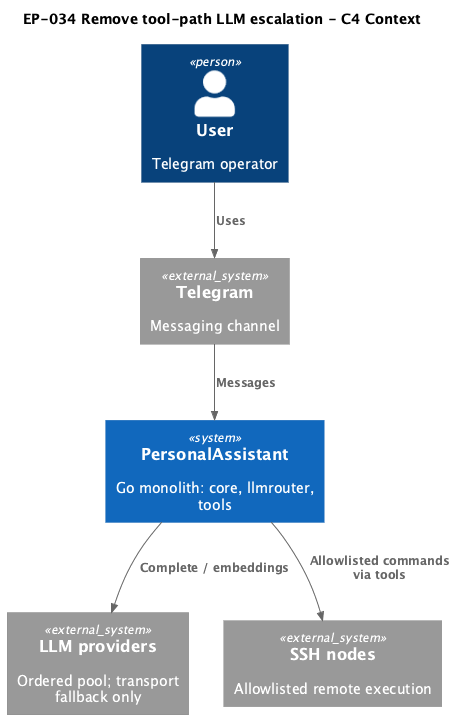
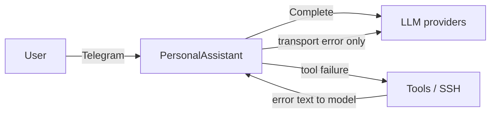

# EP-034 — Remove tool-path LLM escalation — Requirements (EARS / INCOSE)

This document defines requirements for [ep-scope.md](ep-scope.md): remove EP-006 tool-path escalation, keep transport fallback, simplify config and core.

> **16 requirements** · 11 FR · 5 NFR

**Contents**

- [Introduction](#introduction)
- [Glossary](#glossary)
- [C4 C1 — System Context](#c4-c1--system-context)
- [Flow](#flow)
- [Requirement index](#requirement-index)
- [Requirements](#requirements)

---

## Introduction

EP-034 removes tool-path LLM escalation introduced in EP-006. PersonalAssistant SHALL continue to use an ordered `llm_providers` list with transport fallback on retryable `Complete` failures. Tool execution failures SHALL NOT change the active provider index within a user turn or between tool rounds.

This epic supersedes the tool-path escalation portion of [EP-006](../EP-006/ep-requirements.md).

---

## Glossary

| Term | Definition |
|------|------------|
| **`llmrouter.Router`** | Component that selects `llm_providers` entries for `Complete` calls. |
| **Transport fallback** | Switching to the next provider when `Complete` fails with timeout, network error, or HTTP 5xx. |
| **Tool-path escalation** | Advancing provider index after a qualifying tool failure (EP-006). Removed by EP-034. |
| **Primary provider** | `llm_providers[0]` — start index after EP-034. |
| **User turn** | One user message handled until the assistant's final reply is sent. |

---

## C4 C1 — System Context

**Source:** [diagrams/c4-context.puml](diagrams/c4-context.puml). Regenerate PNG: `plantuml -tpng diagrams/c4-context.puml` from this directory.

### Flow

---

## Requirement index

| Id | Type | Summary |
|----|------|---------|
| REQ-34.001 | FR | No provider change on tool failure |
| REQ-34.002 | FR | Remove escalationpolicy package |
| REQ-34.003 | FR | Remove toolfailure package |
| REQ-34.004 | FR | Keep transport fallback |
| REQ-34.005 | FR | Remove router tool escalation API |
| REQ-34.006 | FR | Start at provider index 0 |
| REQ-34.007 | FR | Reject tools.llm_escalation config |
| REQ-34.008 | FR | Update example configs |
| REQ-34.009 | FR | Plain tool errors |
| REQ-34.010 | FR | Remove tool-escalation logs |
| REQ-34.011 | FR | Update operator docs |
| REQ-34.012 | NFR | Document EP-006 supersession |
| REQ-34.013 | NFR | Remove EP-006 escalation tests |
| REQ-34.014 | NFR | Add no-escalation regression tests |
| REQ-34.015 | NFR | make check passes |
| REQ-34.016 | NFR | validate EP-034 passes |

---

## Requirements

### REQ-34.001 — No provider change on tool failure

THE PersonalAssistant SHALL NOT advance the active LLM provider index because of a tool execution failure during a user turn.

### REQ-34.002 — Remove escalationpolicy package

THE PersonalAssistant SHALL remove the `internal/escalationpolicy` package and all product imports of it.

### REQ-34.003 — Remove toolfailure package

THE PersonalAssistant SHALL remove the `internal/core/toolfailure` package and all product imports of it.

### REQ-34.004 — Keep transport fallback

WHEN a `Complete` call fails with a retryable transport error and a next provider exists in `llm_providers`, THE `llmrouter.Router` SHALL attempt `Complete` on the next provider.

### REQ-34.005 — Remove router tool escalation API

THE `llmrouter.Router` SHALL NOT expose tool-path escalation APIs such as `OnQualifyingFailure`, policy escalation actions, or per-turn escalation counters.

### REQ-34.006 — Start at provider index 0

THE PersonalAssistant SHALL start each new user turn and each summarize or adapter `Complete` sequence at `llm_providers` index **0**.

### REQ-34.007 — Reject tools.llm_escalation config

THE config loader SHALL reject `config.json` that contains `tools.llm_escalation`.

### REQ-34.008 — Update example configs

THE repository example configs SHALL NOT include `tools.llm_escalation`.

### REQ-34.009 — Plain tool errors

THE core tool execution paths SHALL return standard errors without escalation policy wrappers.

### REQ-34.010 — Remove tool-escalation logs

THE PersonalAssistant SHALL NOT emit structured logs for tool-path LLM escalation.

### REQ-34.011 — Update operator docs

THE operator documentation under `docs/` SHALL describe multi-provider transport fallback and SHALL NOT describe tool-path escalation or `baseline_index`.

### REQ-34.012 — Document EP-006 supersession

THE epic artefacts SHALL state that EP-034 supersedes EP-006 tool-path escalation scope while EP-006 history remains archived.

### REQ-34.013 — Remove EP-006 escalation tests

THE PersonalAssistant SHALL remove or rewrite automated tests whose sole purpose is EP-006 tool-path escalation behaviour.

### REQ-34.014 — Add no-escalation regression tests

THE PersonalAssistant SHALL include automated tests demonstrating that a qualifying tool failure does not change provider index and that transport fallback still switches providers on retryable `Complete` errors.

### REQ-34.015 — make check passes

THE EP-034 change set SHALL pass `make check`.

### REQ-34.016 — validate EP-034 passes

THE EP-034 change set SHALL pass `./bin/validate EP-034`.
