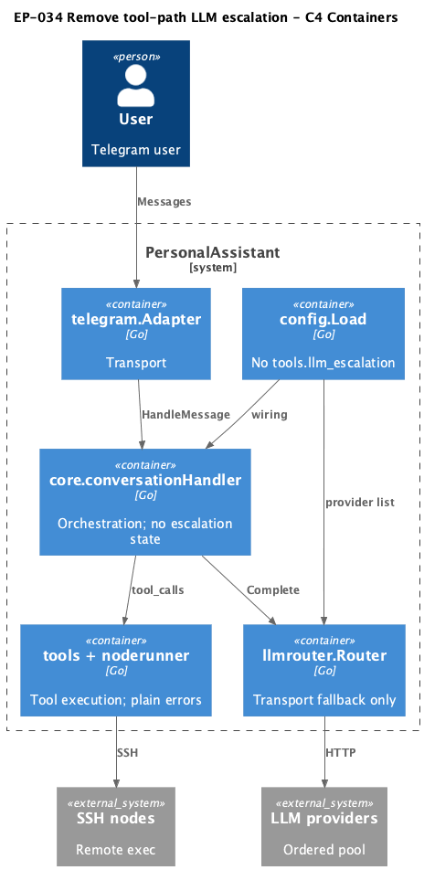
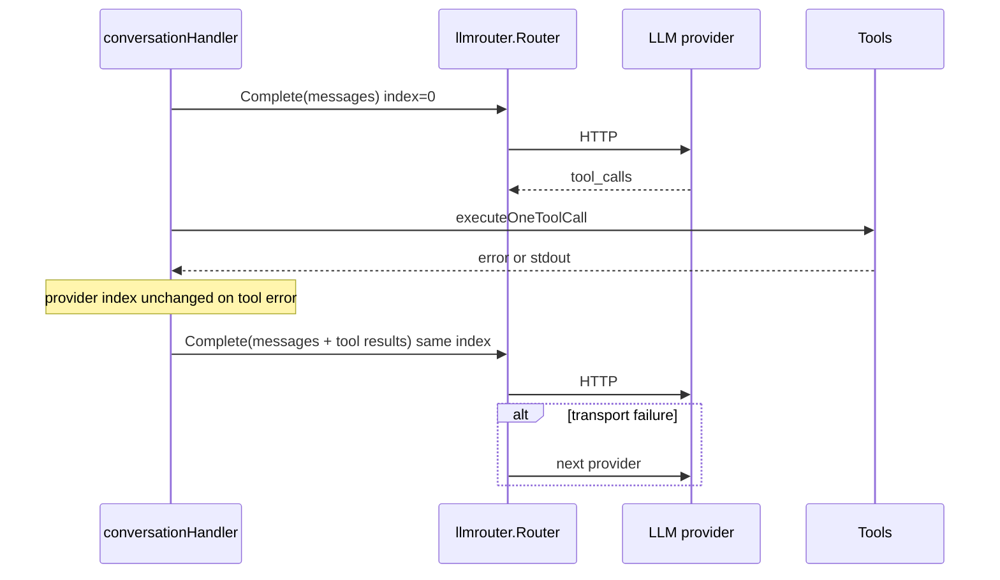

# EP-034 — Remove tool-path LLM escalation — System design

**Contents**

- [Overview](#overview)
- [Architecture](#architecture)
- [Components and interfaces](#components-and-interfaces)
- [Data models](#data-models)
- [Error handling](#error-handling)
- [Testing strategy](#testing-strategy)
- [Risks and trade-offs](#risks-and-trade-offs)
- [Requirement traceability](#requirement-traceability)

---

## Overview

EP-034 removes tool-path LLM escalation (EP-006) from PersonalAssistant while preserving ordered multi-provider **transport fallback**. The design deletes escalation-specific packages and config, simplifies `conversationHandler` and `llmrouter`, and updates operator documentation. Every user turn starts `Complete` at provider index **0**.

Key requirements: [REQ-34.001](ep-requirements.md#removal), [REQ-34.004](ep-requirements.md#router), [REQ-34.007](ep-requirements.md#config).

**Supersedes:** Tool-path escalation in [EP-006](../EP-006/ep-system-design.md); EP-006 artefacts remain historical record.

---

## Architecture

<p align="center"></p>

**Source:** [diagrams/c4-container.puml](diagrams/c4-container.puml). Regenerate PNG: `plantuml -tpng diagrams/c4-container.puml` from this directory.

### Target message flow (after EP-034)



### Module boundaries

| Module | Change | Dependencies after EP-034 |
|--------|--------|---------------------------|
| `internal/core` | Remove `llmTurnState`, `maybeEscalate`, escalation imports | `llmrouter`, `tools`, `noderunner`, `toolcatalog` |
| `internal/llmrouter` | `Complete` only; remove `OnQualifyingFailure`, `EscUsed`, escalation config | `llm`, `config` (no escalation struct) |
| `internal/escalationpolicy` | **Delete package** | — |
| `internal/core/toolfailure` | **Delete package** | — |
| `internal/noderunner` | Return plain errors; remove `WrapNodeOutcome` | `cmdsafe`, `allowlist`, `ssh` |
| `internal/config` | Remove `LLMEscalationConfig`, `validateLLMEscalation`, `ToolsLLMEscalation` | existing config load |
| `cmd/pa` | Wire router without escalation config | unchanged composition pattern |

---

## Components and interfaces

| Component | Responsibility | Key interface / contract | REQ trace |
|-----------|----------------|--------------------------|-----------|
| `conversationHandler` | Orchestrate turn; no provider index state across tool rounds | `HandleMessage`; `completeViaRouter(ctx, messages, opts)` without turn state | REQ-34.001, REQ-34.009 |
| `llmrouter.Router` | Transport fallback loop in `Complete` | `Complete(ctx, messages, opts, onEvent)`; starts at index 0 | REQ-34.004, REQ-34.005, REQ-34.006 |
| `llmrouter.State` | **Removed** or reduced to ephemeral loop index inside `Complete` only (not escalation) | No `EscUsed`; no cross-call mutation for tools | REQ-34.005 |
| `executeCatalogToolCall` | Validate, substitute, SSH | Returns `error` directly from `toolcatalog`, `cmdsafe`, `noderunner` | REQ-34.009 |
| `executeNativeToolCall` | Native registry | Plain errors | REQ-34.009 |
| `config.Load` | Fail-fast validation | Rejects unknown `tools.llm_escalation` key | REQ-34.007 |
| `NewProviderAdapter` / summarize paths | Non-chat LLM | `Config{}` or transport-only config; start index 0 | REQ-34.006 |
| Operator docs | Describe transport fallback only | No baseline_index / tool escalation | REQ-34.011 |

### Removed APIs (explicit)

- `llmrouter.Router.OnQualifyingFailure`
- `llmrouter.DecideToolFailure`
- `llmrouter.ActionEscalatePolicy`, `PhaseToolFailure`
- `toolfailure.MayEscalate`, `NoEscalate`, `QualifiesForEscalation`
- `escalationpolicy.WrapCatalogValidateError`, `WrapNodeOutcome`
- `config.LLMEscalationConfig`, `ToolsLLMEscalation()`, `validateLLMEscalation`

---

## Data models

### Config (`config.json`)

**Before (EP-006):**

```json
"tools": {
  "llm_escalation": {
    "enabled": true,
    "baseline_index": 0,
    "max_per_user_message": 1
  }
}
```

**After (EP-034):** Key absent. Presence of `llm_escalation` under `tools` is a **load error** (unknown nested key or explicit rejection in `validateTools`).

`tools` object remains required; minimum `{}` still valid.

### Router state

- **Conversation:** No persistent `llmTurnState` on handler. `Complete` uses local attempt loop for transport switching only.
- **New user message:** Always first provider index 0 (satisfies AC-34.006; prior transport fallback does not carry over).

### Logging

Remove events: `llm tool escalation`, routing events with `ActionEscalatePolicy`, `escalations_used` on tool failure path.

Retain: `llm routing` with `ActionSwitchNextTransport` on transport errors ([REQ-34.010](ep-requirements.md#observability)).

---

## Error handling

| Failure type | Behaviour after EP-034 | REQ |
|--------------|------------------------|-----|
| Tool catalog validation | Error text to model; same provider index | REQ-34.001, REQ-34.009 |
| Allowlist / cmdsafe denial | Error text to model; no escalation | REQ-34.001 |
| SSH remote exec failure | Error text to model; no escalation | REQ-34.001 |
| LLM transport timeout / 5xx | Try next provider in `Complete` loop | REQ-34.004 |
| Single provider + transport error | Stop with error | REQ-34.004 |

Hermes/text-tool parse paths: if still present, treat as plain handler errors without provider switch ([REQ-34.001](ep-requirements.md#removal)).

---

## Testing strategy

| Level | Focus | AC / REQ |
|-------|-------|----------|
| Unit — `llmrouter` | Transport fallback; assert `OnQualifyingFailure` removed | AC-34.004, AC-34.005 |
| Unit — `core` | Mock tool failure mid-loop; provider index unchanged | AC-34.001 |
| Unit — `config` | Load rejects `tools.llm_escalation` fixtures | AC-34.007 |
| Integration | Replace `ep006_escalation_run_test.go` with no-escalation regression | AC-34.013, AC-34.014 |
| Repo | `make check`, `./bin/validate EP-034` | AC-34.015, AC-34.016 |

Remove files (expected):

- `internal/escalationpolicy/*`
- `internal/core/toolfailure/*`
- `internal/core/handler_ep006_audit_test.go`, `run_ep006_escalation_test.go` (or rewrite)
- `tests/integration/ep006_escalation_run_test.go` (replace)
- Config testdata `tools_llm_escalation_*.json` (replace with rejection fixtures)

---

## Risks and trade-offs

| Risk | Mitigation |
|------|------------|
| Operators relied on cheap baseline + escalation to strong model | Document using a single capable primary provider; transport fallback for outages only |
| EP-006 docs/artefacts contradict runtime | EP-034 scope states supersession; update threat-model and user docs |
| Missed import of deleted packages | `make check` + grep CI; module boundary script |

**Trade-off accepted (HOTL):** Remove `baseline_index` entirely — simpler mental model (always index 0) vs EP-006 flexibility.

---

## Requirement traceability

| REQ | Design section |
|-----|----------------|
| REQ-34.001 | Target message flow; Error handling |
| REQ-34.002 | Module boundaries — delete `escalationpolicy` |
| REQ-34.003 | Module boundaries — delete `toolfailure` |
| REQ-34.004 | Router `Complete` transport loop |
| REQ-34.005 | Removed APIs |
| REQ-34.006 | Router state — index 0 per turn |
| REQ-34.007 | Config data model |
| REQ-34.008 | Implementation plan — update `config.examples/` |
| REQ-34.009 | Components — plain tool errors |
| REQ-34.010 | Logging |
| REQ-34.011 | Components — docs |
| REQ-34.012 | Overview supersession note |
| REQ-34.013 | Testing strategy — remove EP-006 tests |
| REQ-34.014 | Testing strategy — new regression tests |
| REQ-34.015 | Testing strategy |
| REQ-34.016 | Testing strategy |
