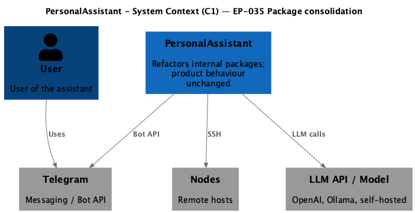
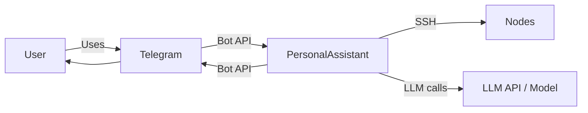

# EP-035 — Consolidate small internal packages — Requirements (EARS / INCOSE)

This document defines requirements for [ep-scope.md](ep-scope.md): remove stub or test-only `internal/` packages, merge EP-013 prompt helpers into `internal/prompt`, and preserve security-sensitive prompt and SQLite reliability contracts without `config.json` changes.

> **20 requirements** · 14 FR · 6 NFR · 4 theme groups

**Contents**

- [Introduction](#introduction)
- [Glossary](#glossary)
- [C4 C1 — System Context](#c4-c1--system-context)
- [Flow](#flow)
- [EARS patterns used](#ears-patterns-used)
- [Requirement index](#requirement-index)
- [Requirements](#requirements)
  - [Remove internal/logging](#remove-internallogging)
  - [Remove internal/reliability](#remove-internalreliability)
  - [Merge prompt packages](#merge-prompt-packages)
  - [Constraints and verification](#constraints-and-verification)

---

## Introduction

EP-035 reduces `internal/` package surface for Refactoring increment **0.02** by deleting empty or misplaced packages and merging tightly coupled EP-013 prompt libraries. Product behaviour, explicit JSON configuration, and contracts from EP-013 (prompt markers, trust policy), EP-022 (concurrent-write reliability test), and EP-029 (lifecycle logging) remain unchanged except for import paths and test file locations.

**Scope in brief**

- Delete `internal/logging` (doc-only stub; LLM logging stays in `internal/llmlog` and `internal/logredact`).
- Delete `internal/reliability`; relocate `TestConcurrentWrites_NoBusyErrors` under `tests/integration`.
- Merge `internal/promptmarkers` and `internal/systemprompt` into `internal/prompt` with frozen trust and marker bytes.
- Leave `internal/lifecyclelog` unchanged (deferred).

---

## Glossary

| Term | Definition |
|------|------------|
| **PersonalAssistant** | The product codebase in this repository (`cmd/`, `internal/`, `tests/`). |
| **`internal/logging`** | Stub package containing only `doc.go`; no production or test importers today. |
| **`internal/reliability`** | Test-only package hosting the EP-022 concurrent-write integration test. |
| **`internal/promptmarkers`** | Package defining canonical `<<<PA_BEGIN_*>>>` / `<<<PA_END_*>>>` line constants and forbidden-line validation (EP-013). |
| **`internal/systemprompt`** | Package defining `TrustPolicy` and block wrap helpers (EP-013). |
| **`internal/prompt`** | Target merged package replacing `internal/promptmarkers` and `internal/systemprompt`. |
| **Trust policy** | The static `TrustPolicy` string prepended to merged system content (EP-013). |
| **Canonical block markers** | The six exact marker line constants for context, tools, and skills blocks (EP-013). |
| **`TextContainsForbiddenMarkerLine`** | Function that reports whether any trimmed line in text equals a canonical marker line. |
| **`ForbiddenMarkerLines`** | Function returning the list of canonical marker lines used for rejection checks. |
| **Concurrent-write reliability test** | `TestConcurrentWrites_NoBusyErrors` covering [AC-22.010](../EP-022/ep-acceptance-criteria.md) intent under the Go race detector. |
| **`make check`** | Repository quality gate (build, tests, linters) invoked from the repo root. |
| **`config.json`** | Product explicit JSON configuration file and its load validation. |

---

## C4 C1 — System Context

**Source:** [diagrams/c4-context.puml](diagrams/c4-context.puml) (C4-PlantUML). To regenerate PNG: `plantuml -tpng diagrams/c4-context.puml` from this directory.

### Flow

Internal package consolidation does not change external interfaces; runtime behaviour visible to the user flows through the same messaging and LLM paths.

---

## EARS patterns used

- **Ubiquitous:** THE \<system\> SHALL \<response\>
- **Event-driven:** WHEN \<trigger\>, THE \<system\> SHALL \<response\>
- **State-driven:** WHILE \<condition\>, THE \<system\> SHALL \<response\>
- **Unwanted event:** IF \<condition\>, THEN THE \<system\> SHALL \<response\>
- **Optional feature:** WHERE \<option\>, THE \<system\> SHALL \<response\>

In the following, *PersonalAssistant* = the product codebase unless a component name is stated.

---

## Requirement index

| Id | Type | Section | Summary |
|----|------|---------|---------|
| REQ-35.001 | FR | Remove internal/logging | Delete stub logging package directory |
| REQ-35.002 | FR | Remove internal/logging | Zero import paths to internal/logging |
| REQ-35.003 | FR | Remove internal/reliability | Delete reliability package directory |
| REQ-35.004 | FR | Remove internal/reliability | Relocate concurrent-write test to tests/integration |
| REQ-35.005 | FR | Remove internal/reliability | Race test preserves AC-22.010 cross-store intent |
| REQ-35.006 | FR | Remove internal/reliability | Update configuration doc path for reliability test |
| REQ-35.007 | FR | Merge prompt packages | Provide internal/prompt merged package |
| REQ-35.008 | FR | Merge prompt packages | Byte-identical TrustPolicy constant |
| REQ-35.009 | FR | Merge prompt packages | Byte-identical canonical marker line constants |
| REQ-35.010 | FR | Merge prompt packages | Equivalent forbidden-marker line validation |
| REQ-35.011 | FR | Merge prompt packages | Equivalent block wrap helpers |
| REQ-35.012 | FR | Merge prompt packages | Remove legacy promptmarkers and systemprompt packages |
| REQ-35.013 | FR | Merge prompt packages | Zero import paths to removed prompt packages |
| REQ-35.014 | FR | Merge prompt packages | Update all current prompt package importers |
| REQ-35.015 | NFR | Constraints | No config.json schema or validation changes |
| REQ-35.016 | NFR | Constraints | make check passes on change set |
| REQ-35.017 | NFR | Constraints | No regression in merged system prompt assembly |
| REQ-35.018 | NFR | Constraints | No regression in runtime skills marker rejection |
| REQ-35.019 | NFR | Constraints | No regression in memory indexing marker rejection |
| REQ-35.020 | NFR | Constraints | EP-013 prompt and marker tests retain intent |

---

## Requirements

### Remove internal/logging

*REQ-35.001, REQ-35.002*

### REQ-35.001 — Delete logging stub package

THE PersonalAssistant SHALL remove the `internal/logging` package directory from the repository.

### REQ-35.002 — No logging package imports

THE PersonalAssistant codebase SHALL contain zero Go import paths referencing `pa/internal/logging`.

### Remove internal/reliability

*REQ-35.003–REQ-35.006*

### REQ-35.003 — Delete reliability test package

THE PersonalAssistant SHALL remove the `internal/reliability` package directory from the repository.

### REQ-35.004 — Relocate concurrent-write test

THE PersonalAssistant SHALL host `TestConcurrentWrites_NoBusyErrors` in the `tests/integration` Go package (or another existing integration test package that can import `internal/jobs`, `internal/vector/sqlite`, and `internal/sqlitepragma`).

### REQ-35.005 — Preserve AC-22.010 race test intent

WHEN `go test -race` runs the relocated `TestConcurrentWrites_NoBusyErrors`, THE test SHALL drive concurrent writers against both a temporary vector SQLite store and a temporary jobs SQLite store under `sqlitepragma.RecommendedPolicy` through the full per-writer iteration budget without `SQLITE_BUSY` or database-locked outcomes, preserving [AC-22.010](../EP-022/ep-acceptance-criteria.md) intent.

### REQ-35.006 — Update reliability test documentation path

WHEN `docs/configuration.md` documents the concurrent-writer reliability test location, THE documentation SHALL cite the relocated test path instead of `internal/reliability`.

### Merge prompt packages

*REQ-35.007–REQ-35.014*

### REQ-35.007 — Provide merged internal/prompt package

THE PersonalAssistant SHALL provide a single `internal/prompt` package that exports canonical block marker constants, forbidden-marker validation, the trust policy constant, and block wrap helpers previously split across `internal/promptmarkers` and `internal/systemprompt`.

### REQ-35.008 — Byte-identical trust policy

THE `TrustPolicy` string constant in `internal/prompt` SHALL be byte-identical to the `TrustPolicy` constant in `internal/systemprompt` immediately before EP-035 implementation.

### REQ-35.009 — Byte-identical marker constants

THE six canonical marker line constants (`<<<PA_BEGIN_CONTEXT>>>`, `<<<PA_END_CONTEXT>>>`, `<<<PA_BEGIN_TOOLS>>>`, `<<<PA_END_TOOLS>>>`, `<<<PA_BEGIN_SKILLS>>>`, `<<<PA_END_SKILLS>>>`) in `internal/prompt` SHALL be byte-identical to the corresponding constants in `internal/promptmarkers` immediately before EP-035 implementation.

### REQ-35.010 — Equivalent forbidden-marker validation

THE `TextContainsForbiddenMarkerLine` and `ForbiddenMarkerLines` behaviour in `internal/prompt` SHALL match the behaviour in `internal/promptmarkers` immediately before EP-035 implementation for the same inputs.

### REQ-35.011 — Equivalent block wrap helpers

THE `WrapRetrievedContext`, `WrapToolInstructions`, and `WrapRuntimeSkills` functions in `internal/prompt` SHALL produce the same wrapped text as the corresponding functions in `internal/systemprompt` immediately before EP-035 implementation for the same non-empty and empty inner inputs.

### REQ-35.012 — Delete legacy prompt packages

THE PersonalAssistant SHALL remove the `internal/promptmarkers` and `internal/systemprompt` package directories from the repository.

### REQ-35.013 — No legacy prompt package imports

THE PersonalAssistant codebase SHALL contain zero Go import paths referencing `pa/internal/promptmarkers` or `pa/internal/systemprompt`.

### REQ-35.014 — Update prompt package importers

THE PersonalAssistant SHALL update every current importer of `internal/promptmarkers` or `internal/systemprompt` to import `internal/prompt`, including `internal/core` (`handler.go`, `system_tail.go`, and related tests), `internal/tools/write_memory.go`, `internal/runtimeskills`, `tests/integration/runtime_skills_handler_test.go`, and `tests/integration/runtime_skills_config_test.go`.

### Constraints and verification

*REQ-35.015–REQ-35.020*

### REQ-35.015 — No config.json changes

THE EP-035 change set SHALL leave `config.json` top-level keys, example configs, and config load validation unchanged.

### REQ-35.016 — Quality gate passes

THE EP-035 change set SHALL pass `make check` from the repository root.

### REQ-35.017 — Preserve system prompt assembly

THE PersonalAssistant SHALL preserve EP-013 merged system-message assembly behaviour for trust policy placement, non-empty block wrapping, and dynamic block ordering relative to the pre-EP-035 baseline.

### REQ-35.018 — Preserve runtime skills marker rejection

WHEN any line in a runtime `SKILL.md` body or frontmatter equals a canonical marker line after trim, THE PersonalAssistant SHALL fail startup with an error that identifies the skill directory, as required by [REQ-13.007](../EP-013/ep-requirements.md#load-and-validation).

### REQ-35.019 — Preserve memory indexing marker rejection

IF conversation chunk text prepared for vector indexing contains any line equal to a canonical marker line after trim, THEN THE PersonalAssistant SHALL refuse to index that chunk for that attempt, as required by [REQ-13.018](../EP-013/ep-requirements.md#memory-indexing).

### REQ-35.020 — EP-013 prompt tests retain intent

THE PersonalAssistant automated tests that cover EP-013 marker collision, wrap layout, handler prompt structure, and runtime-skills integration SHALL pass after EP-035, whether retained in `internal/prompt` or relocated with unchanged test intent.

---
