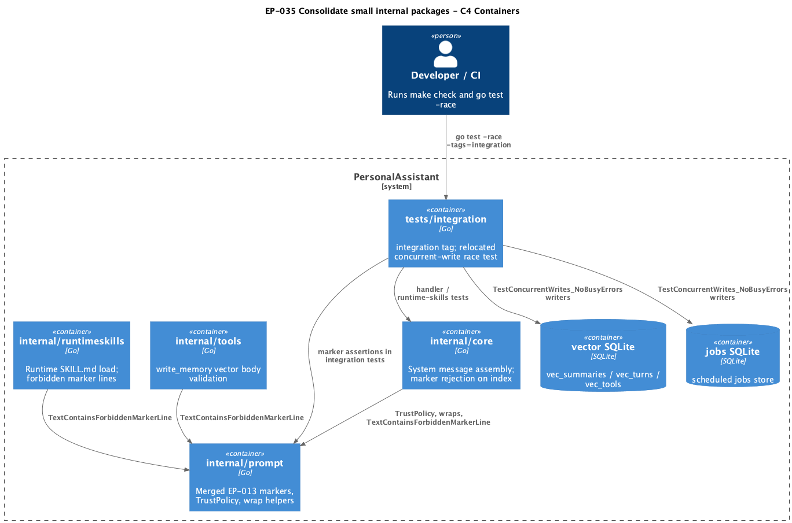

# EP-035 — Consolidate small internal packages — System design

**Contents**

- [Overview](#overview)
- [Architecture](#architecture)
- [Components and interfaces](#components-and-interfaces)
- [Data models](#data-models)
- [Error handling](#error-handling)
- [Testing strategy](#testing-strategy)
- [Migration sequencing](#migration-sequencing)
- [Constraints (no behaviour change)](#constraints-no-behaviour-change)
- [Risks and trade-offs](#risks-and-trade-offs)
- [Requirement traceability](#requirement-traceability)

---

## Overview

EP-035 is a **structural refactor** for Refactoring increment 0.02: delete stub `internal/logging`, delete test-only `internal/reliability` after relocating its race test, and merge `internal/promptmarkers` + `internal/systemprompt` into **`internal/prompt`** (`pa/internal/prompt`). Product behaviour, `config.json`, and EP-013 byte-level prompt contracts stay unchanged; only import paths, package layout, test file locations, and one documentation path change.

Key requirements: [REQ-35.007](ep-requirements.md#req-35-007--provide-merged-internalprompt-package), [REQ-35.008](ep-requirements.md#req-35-008--byte-identical-trust-policy), [REQ-35.009](ep-requirements.md#req-35-009--byte-identical-marker-constants), [REQ-35.004](ep-requirements.md#req-35-004--relocate-concurrent-write-test), [REQ-35.015](ep-requirements.md#req-35-015--no-configjson-changes).

---

## Architecture

<p align="center"></p>

**Source:** [diagrams/c4-container.puml](diagrams/c4-container.puml). Regenerate PNG: `plantuml -tpng diagrams/c4-container.puml` from this directory.

### Module boundaries

| Module | Responsibility | Allowed dependencies (EP-035) | Notes |
|--------|----------------|----------------------------------|-------|
| **`internal/prompt`** | Canonical marker lines, forbidden-line validation, `TrustPolicy`, block wrap helpers | Standard library only | Replaces `promptmarkers` + `systemprompt`; no imports from `core`, `config`, or stores |
| **`internal/core`** | Merged system message + indexing marker checks | `internal/prompt` (not legacy prompt packages) | `handler.go`, `system_tail.go` — assembly order unchanged |
| **`internal/runtimeskills`** | SKILL.md load + marker rejection at startup | `internal/prompt` | Same validation call sites |
| **`internal/tools`** | Memory write / vector body validation | `internal/prompt` | `write_memory.go` only |
| **`tests/integration`** | Cross-package integration tests, including relocated EP-022 race test | `internal/jobs`, `internal/vector/sqlite`, `internal/sqlitepragma`, `internal/core`, `internal/prompt`, … | Package name `integration_test`; build tag `integration` |
| **Removed** | `internal/logging`, `internal/reliability`, `internal/promptmarkers`, `internal/systemprompt` | — | No Go importers after EP-035 |

**Dependency rule:** `internal/prompt` remains a leaf library (stdlib only), same as today’s `promptmarkers` / `systemprompt` split. Callers depend on `prompt`; `prompt` does not depend on callers.

**Verification checklist (post-implementation):**

```bash
# From repo root — zero legacy import paths
rg 'pa/internal/(logging|reliability|promptmarkers|systemprompt)' --glob '*.go' cmd internal tests
# Relocated race test (with integration tag)
go test -race -tags=integration ./tests/integration/... -run TestConcurrentWrites_NoBusyErrors
make check
```

---

## Components and interfaces

### `internal/prompt` — merged package layout

| File | Source | Exports (unchanged names / signatures) |
|------|--------|----------------------------------------|
| `markers.go` | `internal/promptmarkers/markers.go` | `BeginContext`, `EndContext`, `BeginTools`, `EndTools`, `BeginSkills`, `EndSkills`; `ForbiddenMarkerLines()`; `TextContainsForbiddenMarkerLine(text string) bool` |
| `wrap.go` | `internal/systemprompt/systemprompt.go` | `TrustPolicy` (const string); `WrapRetrievedContext`, `WrapToolInstructions`, `WrapRuntimeSkills` (same signatures; use package-local marker constants instead of `promptmarkers.*`) |
| `markers_test.go` | `internal/promptmarkers/markers_test.go` | Same test names and intent; package `prompt` |
| `wrap_test.go` | `internal/systemprompt/systemprompt_test.go` | Same tests; qualify markers as `prompt.BeginContext` etc. (same package) |

**Package comment:** `// Package prompt defines EP-013 canonical system-block markers, trust policy, and wrap helpers.`

**Implementation note:** Move `markers.go` and `wrap.go` bodies verbatim (copy-paste) so [REQ-35.008](ep-requirements.md#req-35-008--byte-identical-trust-policy)–[REQ-35.011](ep-requirements.md#req-35-011--equivalent-block-wrap-helpers) hold without logic edits. The only mechanical change inside `wrap.go` is replacing `promptmarkers.BeginContext` with `BeginContext` (same package).

### Import rewrite — single path `pa/internal/prompt`

All callers use **one** import; no split between marker and wrap packages.

| # | File | Current import(s) | After EP-035 |
|---|------|-------------------|--------------|
| 1 | `internal/core/handler.go` | `pa/internal/promptmarkers`, `pa/internal/systemprompt` | `pa/internal/prompt` |
| 2 | `internal/core/system_tail.go` | `pa/internal/systemprompt` | `pa/internal/prompt` |
| 3 | `internal/core/handler_test.go` | `pa/internal/systemprompt` | `pa/internal/prompt` |
| 4 | `internal/tools/write_memory.go` | `pa/internal/promptmarkers` | `pa/internal/prompt` |
| 5 | `internal/runtimeskills/package.go` | `pa/internal/promptmarkers` | `pa/internal/prompt` |
| 6 | `tests/integration/runtime_skills_handler_test.go` | `pa/internal/promptmarkers`, `pa/internal/systemprompt` | `pa/internal/prompt` |
| 7 | `tests/integration/runtime_skills_config_test.go` | `pa/internal/promptmarkers` | `pa/internal/prompt` |

**Qualified identifier rewrites (examples):**

- `promptmarkers.TextContainsForbiddenMarkerLine` → `prompt.TextContainsForbiddenMarkerLine`
- `promptmarkers.BeginContext` → `prompt.BeginContext` (or unqualified `BeginContext` in `prompt` tests)
- `systemprompt.TrustPolicy` → `prompt.TrustPolicy`
- `systemprompt.WrapToolInstructions` → `prompt.WrapToolInstructions`

No other Go files import the legacy packages (verified by repo grep on `epic/EP-035-consolidate-small-packages`).

### Remove `internal/logging`

| Action | Detail |
|--------|--------|
| Delete | `internal/logging/doc.go` only (stub package) |
| Imports | None today — safe anytime ([REQ-35.001](ep-requirements.md#req-35-001--delete-logging-stub-package), [REQ-35.002](ep-requirements.md#req-35-002--no-logging-package-imports)) |
| LLM logging | Unchanged in `internal/llmlog`, `internal/logredact` |

### Remove `internal/reliability` — relocate race test

| Item | Design choice |
|------|----------------|
| **Destination** | `tests/integration/concurrent_write_test.go` |
| **Package** | `integration_test` (same as existing files under repo `tests/integration/`) |
| **Build tag** | `//go:build integration` at top of file (required so `make test-race` / `make test-integration` include it; today’s `internal/reliability` had no tag and was picked up only via `./...` without tags) |
| **Test name** | `TestConcurrentWrites_NoBusyErrors` (unchanged) |
| **Imports** | `pa/internal/jobs`, `pa/internal/sqlitepragma`, `pa/internal/vector/sqlite` (alias `vectorsqlite` as today), plus stdlib `context`, `path/filepath`, `sync`, `sync/atomic`, `testing`, `time`, `strconv`, `strings` |
| **Body** | Move `concurrent_write_test.go` helpers (`runVectorWriter`, `runJobsWriter`, `isBusyOrLocked`, `iterations` const) unchanged |
| **Trace comment** | Keep `// Covers AC-22.010`; add `// Covers AC-35.005` for EP-035 traceability |
| **Doc update** | `docs/configuration.md` § Local SQLite stores — replace `internal/reliability` with `tests/integration` ([REQ-35.006](ep-requirements.md#req-35-006--update-reliability-test-documentation-path)) |

**Out of scope:** `internal/lifecyclelog` — unchanged ([ep-scope.md](ep-scope.md)).

---

## Data models

EP-035 does not introduce or alter persisted schemas.

| Entity | Role in this epic |
|--------|-------------------|
| **`TrustPolicy` string** | Opaque const; must remain byte-identical ([REQ-35.008](ep-requirements.md#req-35-008--byte-identical-trust-policy), [AC-35.008](ep-acceptance-criteria.md#ac-35-008)) |
| **Six marker line constants** | Exact line strings `<<<PA_BEGIN_*>>>` / `<<<PA_END_*>>>`; frozen ([REQ-35.009](ep-requirements.md#req-35-009--byte-identical-marker-constants)) |
| **Wrapped block text** | Deterministic concatenation: begin marker + `\n` + inner + `\n` + end marker + `\n` (context/tools/skills); empty inner → empty string |
| **SQLite stores (test only)** | Temp vector + jobs DBs under `sqlitepragma.RecommendedPolicy` — unchanged for relocated race test ([REQ-35.005](ep-requirements.md#req-35-005--preserve-ac-22-010-race-test-intent)) |

---

## Error handling

No new error types. Existing behaviour preserved:

| Path | Mechanism | Requirements |
|------|-----------|--------------|
| Runtime skills startup | `prompt.TextContainsForbiddenMarkerLine` on raw SKILL.md → fail load with directory in error | [REQ-35.018](ep-requirements.md#req-35-018--preserve-runtime-skills-marker-rejection) |
| Memory / turn indexing | `prompt.TextContainsForbiddenMarkerLine` on chunk text → refuse index for that attempt | [REQ-35.019](ep-requirements.md#req-35-019--preserve-memory-indexing-marker-rejection) |
| Concurrent SQLite writers | Relocated test fails on `SQLITE_BUSY` / locked strings or incomplete iteration budget | [REQ-35.005](ep-requirements.md#req-35-005--preserve-ac-22-010-race-test-intent) |
| Config load | No EP-035 changes | [REQ-35.015](ep-requirements.md#req-35-015--no-configjson-changes) |

---

## Testing strategy

Per [strategy.md](../../strategy.md) §2:

| Level | What EP-035 verifies |
|-------|----------------------|
| **Unit** | `internal/prompt` — marker detection table, wrap golden outputs, byte-frozen `TrustPolicy` / constants vs pre-merge snapshot ([AC-35.007](ep-acceptance-criteria.md#ac-35-007)–[AC-35.011](ep-acceptance-criteria.md#ac-35-011)) |
| **Integration** | Existing `internal/core` handler tests, `tests/integration/runtime_skills_*`, relocated `TestConcurrentWrites_NoBusyErrors` with `-race` ([AC-35.004](ep-acceptance-criteria.md#ac-35-004), [AC-35.005](ep-acceptance-criteria.md#ac-35-005), [AC-35.017](ep-acceptance-criteria.md#ac-35-017)–[AC-35.020](ep-acceptance-criteria.md#ac-35-020)) |
| **Manual** | Directory removal grep, `config.json` diff clean ([AC-35.001](ep-acceptance-criteria.md#ac-35-001), [AC-35.003](ep-acceptance-criteria.md#ac-35-003), [AC-35.015](ep-acceptance-criteria.md#ac-35-015)) |
| **Gate** | `make check` ([REQ-35.016](ep-requirements.md#req-35-016--quality-gate-passes)) |

**Race test invocation:** `make test-race` runs `go test -race -tags=integration ./...`, which includes `tests/integration` after the file move. Optionally document in PR notes: `go test -race -tags=integration ./tests/integration/... -run TestConcurrentWrites_NoBusyErrors`.

---

## Migration sequencing

Order edits so **`make check` stays green** after each logical commit (implementation plan may split further).

| Step | Action | Green-build note |
|------|--------|------------------|
| 0 | Delete `internal/logging/` | Independent; zero importers |
| 1 | Add `internal/prompt/` (`markers.go`, `wrap.go`) + unit tests copied from legacy packages | Old packages still exist; nothing imports `prompt` yet — build still passes |
| 2 | Rewrite **all seven** importer files to `pa/internal/prompt`; fix qualifiers | Both old and new packages must not be imported together — delete legacy packages in step 3 immediately after |
| 3 | Remove `internal/promptmarkers/` and `internal/systemprompt/` | `rg` legacy paths → zero |
| 4 | Add `tests/integration/concurrent_write_test.go` (`//go:build integration`, package `integration_test`) | Copy from `internal/reliability/concurrent_write_test.go` |
| 5 | Remove `internal/reliability/` | |
| 6 | Update `docs/configuration.md` reliability test path | [REQ-35.006](ep-requirements.md#req-35-006--update-reliability-test-documentation-path) |
| 7 | Run `make check` and `go test -race -tags=integration ./tests/integration/... -run TestConcurrentWrites_NoBusyErrors` | [REQ-35.016](ep-requirements.md#req-35-016--quality-gate-passes) |

Steps 0 and 1–3 can be one PR slice; steps 4–5 another if desired, but step 2 and 3 must land in the same change set to avoid duplicate symbol packages.

---

## Constraints (no behaviour change)

| Constraint | Enforcement |
|------------|-------------|
| **Byte-identical `TrustPolicy` and six marker constants** | Verbatim copy into `internal/prompt`; unit test compares to frozen pre-EP-035 reference ([REQ-35.008](ep-requirements.md#req-35-008--byte-identical-trust-policy), [REQ-35.009](ep-requirements.md#req-35-009--byte-identical-marker-constants)) |
| **Equivalent validation and wraps** | Same functions and logic; only package name / internal constant references change ([REQ-35.010](ep-requirements.md#req-35-010--equivalent-forbidden-marker-validation), [REQ-35.011](ep-requirements.md#req-35-011--equivalent-block-wrap-helpers)) |
| **No `config.json` change** | No edits to product config schema, examples, or `internal/config` validation ([REQ-35.015](ep-requirements.md#req-35-015--no-configjson-changes)) |
| **No behavioural change** | No changes to handler tail order, trust placement, startup failure messages’ conditions, or SQLite PRAGMA policy ([REQ-35.017](ep-requirements.md#req-35-017--preserve-system-prompt-assembly)–[REQ-35.020](ep-requirements.md#req-35-020--ep-013-prompt-tests-retain-intent)) |

---

## Risks and trade-offs

| Risk | Mitigation |
|------|------------|
| Accidental edit to `TrustPolicy` or marker bytes during move | Copy-paste + byte identity unit tests ([AC-35.008](ep-acceptance-criteria.md#ac-35-008), [AC-35.009](ep-acceptance-criteria.md#ac-35-009)) |
| Race test omitted from `integration` tag builds | Mandatory `//go:build integration` on relocated file; run `make test-race` in CI |
| Missed importer | Grep gate in [AC-35.013](ep-acceptance-criteria.md#ac-35-013), [AC-35.014](ep-acceptance-criteria.md#ac-35-014) |
| **Trade-off:** defer `lifecyclelog` | Avoids EP-029 attribute coupling; accepted per [ep-scope.md](ep-scope.md) |

---

## Requirement traceability

| Requirement | AC | Design sections |
|-------------|-----|-----------------|
| [REQ-35.001](ep-requirements.md#req-35-001--delete-logging-stub-package) | [AC-35.001](ep-acceptance-criteria.md#ac-35-001) | Components (`internal/logging`), Migration step 0 |
| [REQ-35.002](ep-requirements.md#req-35-002--no-logging-package-imports) | [AC-35.002](ep-acceptance-criteria.md#ac-35-002) | Architecture verification checklist |
| [REQ-35.003](ep-requirements.md#req-35-003--delete-reliability-test-package) | [AC-35.003](ep-acceptance-criteria.md#ac-35-003) | Components (reliability removal), Migration step 5 |
| [REQ-35.004](ep-requirements.md#req-35-004--relocate-concurrent-write-test) | [AC-35.004](ep-acceptance-criteria.md#ac-35-004) | Components (reliability relocation), Testing strategy |
| [REQ-35.005](ep-requirements.md#req-35-005--preserve-ac-22-010-race-test-intent) | [AC-35.005](ep-acceptance-criteria.md#ac-35-005) | Components, Testing strategy |
| [REQ-35.006](ep-requirements.md#req-35-006--update-reliability-test-documentation-path) | [AC-35.006](ep-acceptance-criteria.md#ac-35-006) | Components (doc update), Migration step 6 |
| [REQ-35.007](ep-requirements.md#req-35-007--provide-merged-internalprompt-package) | [AC-35.007](ep-acceptance-criteria.md#ac-35-007) | Components (`internal/prompt` layout) |
| [REQ-35.008](ep-requirements.md#req-35-008--byte-identical-trust-policy) | [AC-35.008](ep-acceptance-criteria.md#ac-35-008) | Data models, Constraints |
| [REQ-35.009](ep-requirements.md#req-35-009--byte-identical-marker-constants) | [AC-35.009](ep-acceptance-criteria.md#ac-35-009) | Data models, Constraints |
| [REQ-35.010](ep-requirements.md#req-35-010--equivalent-forbidden-marker-validation) | [AC-35.010](ep-acceptance-criteria.md#ac-35-010) | Components, Constraints |
| [REQ-35.011](ep-requirements.md#req-35-011--equivalent-block-wrap-helpers) | [AC-35.011](ep-acceptance-criteria.md#ac-35-011) | Components, Constraints |
| [REQ-35.012](ep-requirements.md#req-35-012--delete-legacy-prompt-packages) | [AC-35.012](ep-acceptance-criteria.md#ac-35-012) | Migration step 3 |
| [REQ-35.013](ep-requirements.md#req-35-013--no-legacy-prompt-package-imports) | [AC-35.013](ep-acceptance-criteria.md#ac-35-013) | Import rewrite table, Architecture checklist |
| [REQ-35.014](ep-requirements.md#req-35-014--update-prompt-package-importers) | [AC-35.014](ep-acceptance-criteria.md#ac-35-014) | Import rewrite table |
| [REQ-35.015](ep-requirements.md#req-35-015--no-configjson-changes) | [AC-35.015](ep-acceptance-criteria.md#ac-35-015) | Constraints, Error handling |
| [REQ-35.016](ep-requirements.md#req-35-016--quality-gate-passes) | [AC-35.016](ep-acceptance-criteria.md#ac-35-016) | Testing strategy, Migration step 7 |
| [REQ-35.017](ep-requirements.md#req-35-017--preserve-system-prompt-assembly) | [AC-35.017](ep-acceptance-criteria.md#ac-35-017) | Components (`core`), Constraints |
| [REQ-35.018](ep-requirements.md#req-35-018--preserve-runtime-skills-marker-rejection) | [AC-35.018](ep-acceptance-criteria.md#ac-35-018) | Error handling, Testing strategy |
| [REQ-35.019](ep-requirements.md#req-35-019--preserve-memory-indexing-marker-rejection) | [AC-35.019](ep-acceptance-criteria.md#ac-35-019) | Error handling (`handler`, `write_memory`) |
| [REQ-35.020](ep-requirements.md#req-35-020--ep-013-prompt-tests-retain-intent) | [AC-35.020](ep-acceptance-criteria.md#ac-35-020) | Testing strategy, Components (tests move to `prompt`) |
