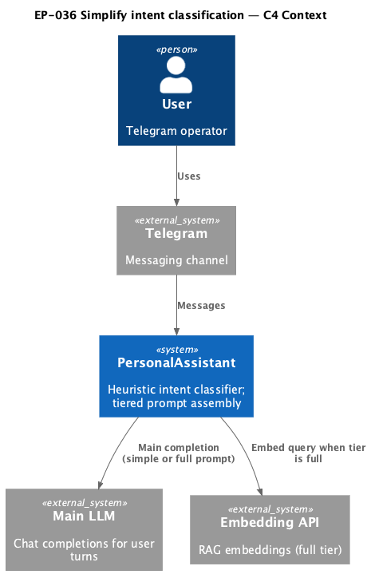
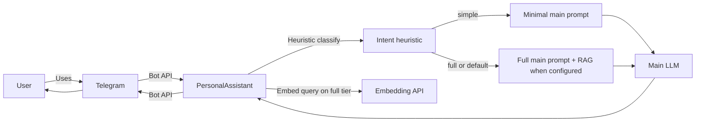

# EP-036 — Simplify intent classification — Requirements (EARS / INCOSE)

This document defines product requirements for [ep-scope.md](ep-scope.md): remove the intent-classifier model stage and the `full_lite` tier so classification is heuristic-only with two outcomes (`simple`, `full`).

> **27 requirements** · 25 FR · 2 NFR · 6 theme groups

**Contents**

- [Introduction](#introduction)
- [Glossary](#glossary)
- [C4 C1 — System Context](#c4-c1--system-context)
- [Flow](#flow)
- [EARS patterns used](#ears-patterns-used)
- [Requirement index](#requirement-index)
- [Requirements](#requirements)
  - [Complexity tiers](#complexity-tiers)
  - [Heuristic cascade](#heuristic-cascade)
  - [Model stage removal](#model-stage-removal)
  - [Core prompt assembly](#core-prompt-assembly)
  - [Configuration](#configuration)
  - [Documentation and tests](#documentation-and-tests)
  - [NFR — Verification and traceability](#nfr--verification-and-traceability)

---

## Introduction

EP-036 simplifies intent classification for Refactoring increment **0.02** ([strategy.md](../../strategy.md)): drop the optional cheap-LLM **model stage** and the **`full_lite`** tier introduced in EP-017/EP-018. The cascade becomes **heuristic → default `full`**; only **`simple`** and **`full`** govern main-LLM prompt assembly. Messages that would have been `full_lite` or ambiguous after heuristics use the existing **`full`** path.

**Scope in brief**

- Delete `ModelClassifier` / `internal/intent/model.go`; simplify `cascade.go` and `cmd/pa` wiring.
- Remove `TierFullLite`, `full_lite_patterns`, and `buildTierFullLiteMainPrompt`.
- Shrink `intent_classifier` config (reject removed nested keys at load); update examples, live config, testdata, and operator docs.
- Preserve `simple` and `full` assembly rules; refresh tests; `make check` green.

---

## Glossary

| Term | Definition |
|------|------------|
| **PersonalAssistant** | The Go product (`cmd/pa`, `internal/core`, `internal/intent`, configuration, Telegram adapter). |
| **Intent classifier** | Pre-main-LLM component that assigns a complexity tier from the user message. After EP-036: heuristic patterns only when enabled. |
| **Heuristic stage** | Regex and length-guard classification in `internal/intent/heuristic.go`; returns confident tier or ambiguous. |
| **Model stage** | Removed cheap-LLM classification stage (`internal/intent/model.go`, `intent_classifier.model_stage`). |
| **Cascade classifier** | `CascadeClassifier` chaining heuristic then default tier when heuristic is ambiguous. |
| **Complexity tier** | `simple` or `full`; determines which prompt components are included in the main LLM request. |
| **`full_lite` tier** | Removed middle tier (EP-018); former matches use the `full` path. |
| **`Result.Stage`** | Classification provenance: `heuristic` (confident heuristic) or `default` (ambiguous heuristic → `full`). |
| **Explicit JSON configuration** | Root `config.json` lists every documented top-level key; unknown keys rejected; optional blocks use JSON `null`; removed documented keys fail load if still present. |
| **`intent_classifier` config block** | Top-level configuration key; when enabled, contains `heuristic` only (no `model_stage`, no `full_lite_patterns`). |

---

## C4 C1 — System Context

**Source:** [diagrams/c4-context.puml](diagrams/c4-context.puml) (C4-PlantUML). To regenerate PNG: `plantuml -tpng diagrams/c4-context.puml` from this directory.

### Flow

High-level flow: the user messages via Telegram; PersonalAssistant runs heuristic intent classification (no separate classification LLM); the core assembles a `simple` or `full` main prompt and calls the main LLM; replies return via Telegram.

---

## EARS patterns used

- **Ubiquitous:** THE \<system\> SHALL \<response\>
- **Event-driven:** WHEN \<trigger\>, THE \<system\> SHALL \<response\>
- **State-driven:** WHILE \<condition\>, THE \<system\> SHALL \<response\>
- **Unwanted event:** IF \<condition\>, THEN THE \<system\> SHALL \<response\>
- **Optional feature:** WHERE \<option\>, THE \<system\> SHALL \<response\>

In the following, *PersonalAssistant* means the PersonalAssistant unless a component name is given explicitly.

---

## Requirement index

| Id | Type | Section | Summary |
|----|------|---------|---------|
| REQ-36.001 | FR | Complexity tiers | Exactly two tiers: `simple`, `full` |
| REQ-36.002 | FR | Complexity tiers | Remove `full_lite` from product types |
| REQ-36.003 | FR | Heuristic cascade | One tier per turn when classifier enabled |
| REQ-36.004 | FR | Heuristic cascade | Heuristic evaluation order |
| REQ-36.005 | FR | Heuristic cascade | No `full_lite_patterns` in heuristic |
| REQ-36.006 | FR | Heuristic cascade | Ambiguous → `full`, stage `default` |
| REQ-36.007 | FR | Heuristic cascade | Confident → stage `heuristic` |
| REQ-36.008 | FR | Model stage removal | Delete `model.go` tests |
| REQ-36.009 | FR | Model stage removal | Remove `ModelClassifier` type |
| REQ-36.010 | FR | Model stage removal | No classification LLM in `cmd/pa` |
| REQ-36.011 | FR | Model stage removal | `Result.Stage` `heuristic` or `default` |
| REQ-36.012 | FR | Core prompt assembly | Dispatch `simple` and `full` only |
| REQ-36.013 | FR | Core prompt assembly | Remove `full_lite` prompt builder |
| REQ-36.014 | FR | Core prompt assembly | Parity for `simple` and `full` assembly |
| REQ-36.015 | FR | Core prompt assembly | Former `full_lite` → `full` path |
| REQ-36.016 | FR | Configuration | Reject `model_stage` config key |
| REQ-36.017 | FR | Configuration | Reject `full_lite_patterns` key |
| REQ-36.018 | FR | Configuration | Enabled heuristic schema |
| REQ-36.019 | FR | Configuration | Validate heuristic at load |
| REQ-36.020 | FR | Configuration | Keep `intent_classifier` root key |
| REQ-36.021 | FR | Configuration | `null` disables classifier |
| REQ-36.022 | FR | Documentation and tests | Update configs and operator docs |
| REQ-36.023 | FR | Documentation and tests | Ambiguous-default regression tests |
| REQ-36.024 | FR | Documentation and tests | Reject removed keys in tests |
| REQ-36.025 | FR | Documentation and tests | Retire obsolete tier tests |
| REQ-36.026 | NFR | Verification | `make check` passes |
| REQ-36.027 | NFR | Verification | EARS validation passes |

---

## Requirements

### Complexity tiers

### REQ-36.001 — Two complexity tiers

THE PersonalAssistant SHALL define exactly two intent complexity tiers for main-LLM prompt assembly: `simple` and `full`.

### REQ-36.002 — Remove full_lite tier

THE PersonalAssistant SHALL remove the `full_lite` tier value and `TierFullLite` from package `intent` and from all production code paths that branch on three tiers.

### Heuristic cascade

### REQ-36.003 — One tier per turn when enabled

WHEN the operator enables `intent_classifier` in configuration, THE PersonalAssistant SHALL assign exactly one of `simple` or `full` to each user turn before main-model prompt assembly for that turn.

### REQ-36.004 — Heuristic evaluation order

THE heuristic classifier SHALL evaluate each message in order: length guard (`max_simple_len`), then `simple_patterns`, then `full_patterns`, then ambiguous.

### REQ-36.005 — No full_lite patterns in heuristic

THE heuristic classifier SHALL NOT evaluate `full_lite_patterns`.

### REQ-36.006 — Ambiguous defaults to full

WHEN the heuristic stage returns ambiguous, THE cascade classifier SHALL assign tier `full` with `Result.Stage` `default` without issuing a classification LLM `Complete` call for that turn.

### REQ-36.007 — Confident heuristic stage label

WHEN the heuristic stage returns confident, THE cascade classifier SHALL assign the heuristic tier with `Result.Stage` `heuristic`.

### Model stage removal

### REQ-36.008 — Delete model-stage code

THE PersonalAssistant SHALL delete `internal/intent/model.go` and `internal/intent/model_test.go`.

### REQ-36.009 — Remove ModelClassifier type

THE PersonalAssistant SHALL remove the `ModelClassifier` type from the product.

### REQ-36.010 — No classification LLM wiring

THE PersonalAssistant SHALL NOT construct a classification LLM provider or `ModelClassifier` in `cmd/pa` intent-classifier wiring.

### REQ-36.011 — Stage values heuristic or default

THE cascade classifier `Result.Stage` field SHALL contain only `heuristic` or `default` for production classification outcomes.

### Core prompt assembly

### REQ-36.012 — Dispatch simple and full only

THE core `assembleTierMainLLMParams` SHALL dispatch main-LLM parameter assembly only for `intent.TierSimple` and `intent.TierFull`.

### REQ-36.013 — Remove full_lite prompt builder

THE PersonalAssistant SHALL remove `buildTierFullLiteMainPrompt` and all `TierFullLite` branches from package `core` tier main-prompt assembly.

### REQ-36.014 — Parity for simple and full assembly

WHILE assembling the main LLM prompt for tier `simple` or tier `full`, THE PersonalAssistant SHALL apply the same assembly rules as immediately before this epic for that tier.

### REQ-36.015 — Former full_lite uses full path

WHEN a user message matches pre-epic `full_lite` heuristic or model-stage rules, THE PersonalAssistant SHALL run the existing `full` tier main-prompt assembly path for that turn.

### Configuration

### REQ-36.016 — Reject model_stage config key

THE config loader SHALL reject `config.json` that contains the key `intent_classifier.model_stage` at any depth under `intent_classifier`.

### REQ-36.017 — Reject full_lite_patterns config key

THE config loader SHALL reject `config.json` that contains the key `intent_classifier.heuristic.full_lite_patterns`.

### REQ-36.018 — Enabled heuristic schema

WHERE the operator enables `intent_classifier` in configuration, THE enabled configuration object SHALL contain `heuristic` with `simple_patterns`, `full_patterns`, and `max_simple_len`.

### REQ-36.019 — Validate heuristic at load

WHERE the operator enables `intent_classifier` in configuration, THE config loader SHALL validate heuristic regex patterns and require `max_simple_len` ≥ 1 at load time.

### REQ-36.020 — Keep intent_classifier root key

THE root configuration key list SHALL continue to include top-level `intent_classifier`.

### REQ-36.021 — Null intent_classifier disables classification

WHERE top-level `intent_classifier` is JSON `null`, THE config loader SHALL accept the configuration without enabling intent classification.

### Documentation and tests

### REQ-36.022 — Update configs and operator docs

THE repository SHALL update `config.examples/config.example.json`, the operator `.config/config.json`, `internal/config/testdata/` fixtures, `docs/configuration.md`, and `docs/llm-provider-roles-and-logging.md` so documented schema matches the shrunk classifier and representative configs load successfully.

### REQ-36.023 — Classification and config-load tests

THE PersonalAssistant SHALL include automated tests demonstrating that ambiguous heuristic classification yields tier `full` and stage `default` without a classification LLM call.

### REQ-36.024 — Reject removed keys in tests

THE PersonalAssistant SHALL include automated tests demonstrating that configs containing `intent_classifier.model_stage` or `intent_classifier.heuristic.full_lite_patterns` fail config load.

### REQ-36.025 — Retire obsolete tier tests

THE PersonalAssistant SHALL remove or rewrite automated tests whose sole purpose is model-stage parsing, three-way tier classification, or `full_lite` prompt token deltas.

### NFR — Verification and traceability

### REQ-36.026 — make check passes

THE EP-036 change set SHALL pass `make check`.

### REQ-36.027 — Epic validation passes

THE EP-036 requirements artefact SHALL pass `./bin/validate ears EP-036` from the repository root after the validator binary is built.

---

## Traceability

- **Scope:** [ep-scope.md](ep-scope.md) — model stage removal, two tiers, config shrink, test refresh, `simple`/`full` parity.
- **Strategy:** Refactoring **0.02** — simplify intent tiers ([strategy.md](../../strategy.md)).
- **Supersedes (partial):** Model-stage requirements in [EP-017](../EP-017/ep-requirements.md); `full_lite` tier requirements in [EP-018](../EP-018/ep-requirements.md). EP-017 and EP-018 epics remain DONE; behaviour is intentionally reduced.
