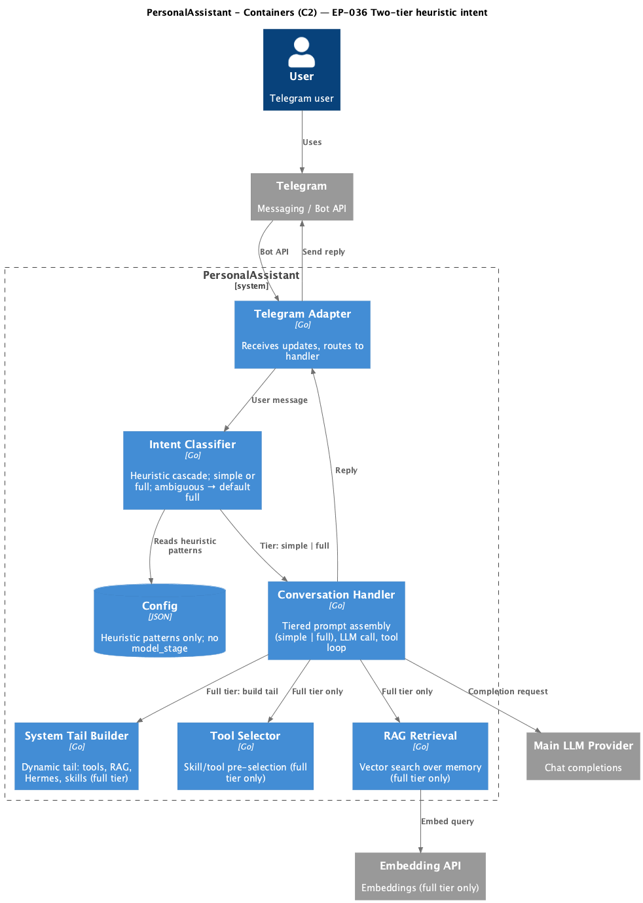
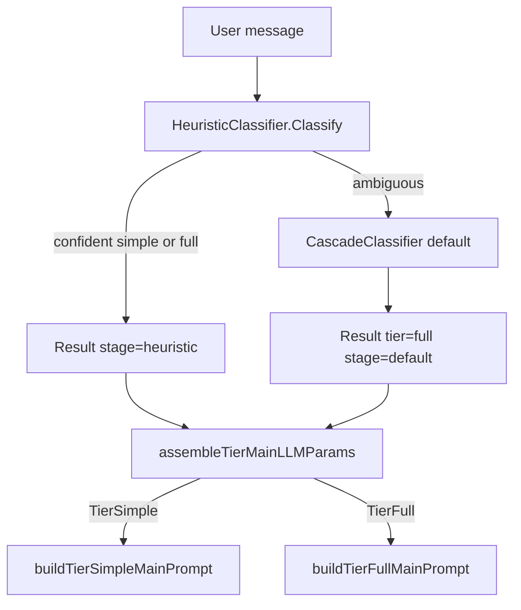

# EP-036 — Simplify intent classification — System design

**Contents**

- [Overview](#overview)
- [Architecture](#architecture)
- [Components and interfaces](#components-and-interfaces)
- [Data models](#data-models)
- [Error handling](#error-handling)
- [Testing strategy](#testing-strategy)
- [Implementation sequencing](#implementation-sequencing)
- [Requirement traceability](#requirement-traceability)

---

## Overview

EP-036 reduces intent-classification complexity for Refactoring increment **0.02** ([strategy.md](../../strategy.md)): remove the optional **model-stage** LLM call and the **`full_lite`** tier so only **`simple`** and **`full`** govern main-LLM prompt assembly. The cascade becomes **heuristic → default `full`** when heuristics are ambiguous ([REQ-36.006](ep-requirements.md#req-36-006--ambiguous-defaults-to-full)). Messages that previously matched `full_lite_patterns` or were resolved by the model stage as `full_lite` use the existing **`full`** assembly path ([REQ-36.015](ep-requirements.md#req-36-015--former-full_lite-uses-full-path)). **`simple`** and **`full`** builder logic is unchanged aside from deleting the `full_lite` branch ([REQ-36.014](ep-requirements.md#req-36-014--parity-for-simple-and-full-assembly)).

Explicit JSON configuration is **not** weakened: top-level `intent_classifier` remains required in the root key list; removed nested keys **fail load** via raw-JSON rejection (EP-034 pattern) ([REQ-36.016](ep-requirements.md#req-36-016--reject-model_stage-config-key), [REQ-36.017](ep-requirements.md#req-36-017--reject-full_lite_patterns-config-key), [REQ-36.020](ep-requirements.md#req-36-020--keep-intent_classifier-root-key)).

**Supersedes (partial):** Model stage from [EP-017](../EP-017/ep-system-design.md); `full_lite` tier from [EP-018](../EP-018/ep-system-design.md). Historical epics remain DONE.

---

## Architecture

<p align="center"></p>

**Source:** [diagrams/c4-container.puml](diagrams/c4-container.puml). Regenerate PNG: `plantuml -tpng diagrams/c4-container.puml` from this directory.

### Target classification flow



No classification LLM container or edge remains ([REQ-36.010](ep-requirements.md#req-36-010--no-classification-llm-wiring)).

### Module boundaries

| Module | Change | Dependencies after EP-036 |
|--------|--------|---------------------------|
| `internal/intent` | Two tiers; heuristic-only cascade; delete model stage | `context`, `log/slog`, `regexp` only (no `internal/llm` in this package) |
| `internal/config` | Shrink `IntentClassifierConfig`; reject removed JSON keys at load | existing load/validate |
| `cmd/pa` | `buildIntentClassifier` builds heuristic + cascade only | `intent`, `config` (no classifier `llm.NewProvider`) |
| `internal/core` | Tier dispatch: `simple` \| `full` only | `intent` |
| `docs/` | Two-tier heuristic-only operator prose | — |

---

## Components and interfaces

### `internal/intent` — kept

| Symbol | Responsibility |
|--------|----------------|
| `Tier` (`string`) | Complexity label for prompt assembly |
| `TierSimple`, `TierFull` | Only tier constants ([REQ-36.001](ep-requirements.md#req-36-001--two-complexity-tiers)) |
| `Result` | `{ Tier, Stage, MessageLen }`; `Stage` is `"heuristic"` or `"default"` only ([REQ-36.011](ep-requirements.md#req-36-011--stage-values-heuristic-or-default)) |
| `Classifier` | `Classify(ctx, message) Result` |
| `HeuristicResult` | `{ Tier, Confident }` |
| `HeuristicClassifier` | Pattern + length guard evaluation |
| `NewHeuristicClassifier(simplePatterns, fullPatterns []string, maxSimpleLen int)` | **Signature change:** drop `fullLitePatterns` argument |
| `(*HeuristicClassifier) Classify(message) HeuristicResult` | Order: length → simple → full → ambiguous ([REQ-36.004](ep-requirements.md#req-36-004--heuristic-evaluation-order)) |
| `CascadeClassifier` | Chains heuristic then default full |
| `NewCascadeClassifier(heuristic *HeuristicClassifier, logger *slog.Logger)` | **Signature change:** no `model` parameter |
| `(*CascadeClassifier) Classify(ctx, message) Result` | Heuristic confident → `Stage: "heuristic"`; else → `TierFull`, `Stage: "default"` ([REQ-36.006](ep-requirements.md#req-36-006--ambiguous-defaults-to-full), [REQ-36.007](ep-requirements.md#req-36-007--confident-heuristic-stage-label)) |

### `internal/intent` — removed

| Symbol | Former role |
|--------|-------------|
| **Files** `model.go`, `model_test.go` | Entire model stage ([REQ-36.008](ep-requirements.md#req-36-008--delete-model-stage-code)) |
| `TierFullLite` | Middle tier constant ([REQ-36.002](ep-requirements.md#req-36-002--remove-full_lite-tier)) |
| `ModelClassifier` | Cheap-LLM ambiguous resolver ([REQ-36.009](ep-requirements.md#req-36-009--remove-modelclassifier-type)) |
| `NewModelClassifier`, `(*ModelClassifier) Classify` | Model-stage API |
| `classificationPromptTemplate`, `defaultModelTimeout`, `parseTierResponse`, `tierFromSingleLineOrPrefix` | Model parsing helpers (file deleted) |
| `CascadeClassifier.model` field | Model-stage branch in cascade |
| `HeuristicClassifier.fullLitePatterns` field | `full_lite` regex list |
| Model branch in `(*CascadeClassifier) Classify` | Lines 32–43 in current `cascade.go` (model call + `Stage: "model"`) |
| `TestModelClassifier_LogsUsageSeparately` in `observability_test.go` | Delete test; keep `TestCascadeClassifier_ResultContainsStageAndLen` in same file |

### Heuristic behaviour change — former `full_lite` matches

| Before (EP-018) | After (EP-036) |
|-----------------|----------------|
| `full_lite_patterns` match → confident `TierFullLite` | Pattern list removed from config; operators move patterns into `full_patterns` if they still want confident `full`, or rely on ambiguous → default `full` |
| No pattern match after simple/full → ambiguous → model or default | Same ambiguous path → cascade assigns **`full`** / **`default`** with no LLM ([REQ-36.005](ep-requirements.md#req-36-005--no-full_lite-patterns-in-heuristic), [REQ-36.015](ep-requirements.md#req-36-015--former-full_lite-uses-full-path)) |

**Migration note for operator `.config`:** Patterns currently under `heuristic.full_lite_patterns` (e.g. conversational “explain/tell me”) should be merged into `full_patterns` if they must stay **confident** `full` before ambiguous default; otherwise removing them only increases use of default-`full` (acceptable per scope).

### `internal/core` — tier main prompt ([REQ-36.012](ep-requirements.md#req-36-012--dispatch-simple-and-full-only)–[REQ-36.014](ep-requirements.md#req-36-014--parity-for-simple-and-full-assembly))

| Kept | Unchanged behaviour |
|------|---------------------|
| `buildMainTurnMessagesPreTail` | Classification logging; RAG gather only when `tier == intent.TierFull` |
| `assembleTierMainLLMParams` | `switch`: `TierFull` → `buildTierFullMainPrompt`; **default** → `buildTierSimpleMainPrompt` |
| `buildTierSimpleMainPrompt` | Empty `tierMainLLMParams` (minimal prompt) |
| `buildTierFullMainPrompt` | Skills + RAG chunks + `mergeTailMergedToolsAndOptions` |
| `mergeTailMergedToolsAndOptions`, `mergedAfterDynamicToolCap` | Shared tail pipeline (comment: “full tier tail” only) |

| Removed |
|---------|
| `case intent.TierFullLite` in `assembleTierMainLLMParams` |
| `buildTierFullLiteMainPrompt` (called `mergeTailMergedToolsAndOptions` with `nil` skills/chunks) |

`buildTierFullMainPrompt` body stays as today; former `full_lite` turns now enter this path ([REQ-36.015](ep-requirements.md#req-36-015--former-full_lite-uses-full-path)).

### `cmd/pa` — `buildIntentClassifier` ([REQ-36.010](ep-requirements.md#req-36-010--no-classification-llm-wiring))

**Remove:** `var model *intent.ModelClassifier`; entire `if ic.ModelStage != nil && ic.ModelStage.Enabled { ... llm.NewProvider ... NewModelClassifier }` block; `model_stage` / `classifier_model` log attrs.

**Keep:**

```go
heuristic = intent.NewHeuristicClassifier(
    ic.Heuristic.SimplePatterns,
    ic.Heuristic.FullPatterns,
    ic.Heuristic.MaxSimpleLen,
)
return intent.NewCascadeClassifier(heuristic, logger), nil
```

**Imports to drop from model-stage block:** no extra `llm` provider construction for classification (package may still import `llm` elsewhere in `main.go`).

**Tests:** `cmd/pa/ep024_operator_logging_test.go` — remove expected log keys `model_stage` / classification model from intent-enabled fixture expectations ([AC-36.009](ep-acceptance-criteria.md#ac-36-009)).

### `internal/config` — schema and load ([REQ-36.016](ep-requirements.md#req-36-016--reject-model_stage-config-key)–[REQ-36.021](ep-requirements.md#req-36-021--null-intent_classifier-disables-classification))

#### Struct / field removals (`config.go`)

| Remove | Notes |
|--------|-------|
| `ClassificationModelConfig` type | Entire struct deleted |
| `IntentClassifierConfig.ModelStage` | Field + `json:"model_stage"` |
| `HeuristicConfig.FullLitePatterns` | Field + `json:"full_lite_patterns"` |
| `validateICModelStage` | Function deleted from `load.go` |
| Loop validating `h.FullLitePatterns` in `validateICHeuristic` | Deleted |
| `resolve.go` block resolving `IntentClassifier.ModelStage.APIKeyPath` | Deleted |

#### Kept

```go
type IntentClassifierConfig struct {
    Enabled   bool             `json:"enabled"`
    Heuristic *HeuristicConfig `json:"heuristic,omitempty"`
}

type HeuristicConfig struct {
    SimplePatterns []string `json:"simple_patterns"`
    FullPatterns   []string `json:"full_patterns"`
    MaxSimpleLen   int      `json:"max_simple_len"`
}
```

`validateIntentClassifier`: when enabled, require `heuristic` with `max_simple_len >= 1` and compile-check `simple_patterns` / `full_patterns` only ([REQ-36.018](ep-requirements.md#req-36-018--enabled-heuristic-schema), [REQ-36.019](ep-requirements.md#req-36-019--validate-heuristic-at-load)).

`root_keys.go`: keep `"intent_classifier"` in documented top-level list ([REQ-36.020](ep-requirements.md#req-36-020--keep-intent_classifier-root-key)).

#### Removed-key rejection (EP-034 pattern)

Add `rejectRemovedIntentClassifierKeys(rawIC json.RawMessage) error` called from `rejectRemovedUnsupportedConfigKeys` when root `intent_classifier` is present and not JSON `null`:

1. Unmarshal `intent_classifier` object to `map[string]json.RawMessage`.
2. If key **`model_stage`** exists → `errors.New("config: intent_classifier.model_stage is not supported; intent classification is heuristic-only (EP-036)")` (wording may name the key explicitly per [AC-36.013](ep-acceptance-criteria.md#ac-36-013)).
3. If `heuristic` object exists, unmarshal and if key **`full_lite_patterns`** exists → analogous error for `intent_classifier.heuristic.full_lite_patterns` ([AC-36.014](ep-acceptance-criteria.md#ac-36-014)).

This mirrors [EP-034](../EP-034/ep-system-design.md) `rejectRemovedToolsConfigKeys` (raw JSON map inspection before relying on struct tags). Go `encoding/json` would otherwise **silently drop** unknown fields after struct removal; rejection must happen **before** or **independent of** unmarshaling into shrunk structs.

**Comment-only:** `ToolDynamicSelection` doc line “TierFull and TierFullLite” → “TierFull” ([REQ-36.022](ep-requirements.md#req-36-022--update-configs-and-operator-docs) docs alignment).

### Configuration files to update ([REQ-36.022](ep-requirements.md#req-36-022--update-configs-and-operator-docs), [AC-36.018](ep-acceptance-criteria.md#ac-36-018))

| File | Action |
|------|--------|
| `.config/config.json` | Remove `heuristic.full_lite_patterns` and entire `model_stage` object; keep `enabled: true` and heuristic-only block (merge former `full_lite` regexes into `full_patterns` per operator choice) |
| `config.examples/config.example.json` | Keep `"intent_classifier": null` (explicit key); document enabled shape in `docs/configuration.md` only |
| `internal/config/testdata/*.json` | All fixtures already use `"intent_classifier": null` — no bulk edit required |
| **Add** `internal/config/testdata/intent_classifier_model_stage_rejected.json` | Minimal valid config + `model_stage` → load must fail |
| **Add** `internal/config/testdata/intent_classifier_full_lite_patterns_rejected.json` | Minimal valid config + `full_lite_patterns` → load must fail |
| **Add** `internal/config/testdata/intent_classifier_enabled_heuristic_only.json` | Positive enabled heuristic-only load ([AC-36.015](ep-acceptance-criteria.md#ac-36-015), [AC-36.018](ep-acceptance-criteria.md#ac-36-018)) |
| `tests/integration/testdata/runtime_skills/minimal_ok/config.json` | Already `null`; verify unchanged |
| `cmd/pa/main_test.go` embedded config | Already `intent_classifier: null` |
| `docs/configuration.md` | Two-tier table; heuristic-only cascade; remove `full_lite` / `model_stage` sections |
| `docs/llm-provider-roles-and-logging.md` | Remove intent classifier model-stage client section |

---

## Data models

### `intent.Result` (production)

| Field | Values after EP-036 |
|-------|---------------------|
| `Tier` | `simple` \| `full` |
| `Stage` | `heuristic` \| `default` |
| `MessageLen` | Unchanged (UTF-8 rune count) |

### Enabled `intent_classifier` JSON (target)

```json
"intent_classifier": {
  "enabled": true,
  "heuristic": {
    "simple_patterns": ["^hello$"],
    "full_patterns": ["(search|find)"],
    "max_simple_len": 40
  }
}
```

Disabled: `"intent_classifier": null` ([REQ-36.021](ep-requirements.md#req-36-021--null-intent_classifier-disables-classification)).

### Constraints preserved

- Root `config.json` must list every documented top-level key exactly once; `intent_classifier` stays in the list ([REQ-36.020](ep-requirements.md#req-36-020--keep-intent_classifier-root-key)).
- Unknown **top-level** keys still rejected via `root_keys.go` (unchanged).
- Removed **nested** keys under `intent_classifier` rejected via new helper (fail fast).

---

## Error handling

| Condition | Behaviour | REQ / AC |
|-----------|-----------|----------|
| Heuristic confident | Return heuristic tier, `Stage: heuristic` | REQ-36.007, AC-36.007 |
| Heuristic ambiguous | `TierFull`, `Stage: default`; no LLM call | REQ-36.006, AC-36.006 |
| Both heuristic nil and cascade called | Default full (existing `TestCascade_BothNil_DefaultFull` behaviour) | REQ-36.006 |
| Config contains `model_stage` or `full_lite_patterns` | Load error with explicit message | REQ-36.016–017, AC-36.013–014 |
| Invalid heuristic regex / `max_simple_len` < 1 | Load error (unchanged) | REQ-36.019, AC-36.015 |
| Unknown tier reaches `assembleTierMainLLMParams` | Falls through to `buildTierSimpleMainPrompt` (only `TierFull` is explicit); with two tiers only, classification cannot emit `full_lite` | REQ-36.012 |

---

## Testing strategy

| Level | Focus | REQ / AC |
|-------|-------|----------|
| Unit — `intent` | Two tier constants; heuristic order without `full_lite` step; ambiguous → default full; no model tests | AC-36.001–007 |
| Unit — `config` | Rejection fixtures; enabled heuristic-only load; drop model-stage validation tests | AC-36.013–016, AC-36.018 |
| Unit — `core` | Dispatch only simple/full; delete `buildTierFullLite` tests; rewrite EP-018 token-delta tests to compare simple vs full or former-lite fixture → full path | AC-36.010–012, AC-36.019 |
| Integration | Handler assigns one tier per turn; simple/full assembly parity; table of pre-epic `full_lite` messages → `full` assembly | AC-36.003, AC-36.011–012 |
| Manual | Grep `cmd/pa` for classification LLM; docs review; `make check`; `./bin/validate ears EP-036` | AC-36.008–009, AC-36.017, AC-36.020–021 |

**Retire / rewrite** ([REQ-36.025](ep-requirements.md#req-36-025--retire-obsolete-tier-tests)):

- `internal/intent/model_test.go` — delete with `model.go`
- `internal/intent/cascade_test.go` — remove `TestCascade_AmbiguousToModel`, `TestCascade_ModelError_*`, `TestCascade_ModelReturnsSimple`; keep/default-full cases
- `internal/intent/heuristic_test.go` — remove `TestHeuristic_FullLitePatterns`; add case that former lite pattern without `full_patterns` → ambiguous
- `internal/core/handler_ep018_test.go` — remove full vs full_lite token reduction; add former-lite → full path test
- `internal/config/intent_classifier_test.go` — remove model-stage validation tests; add rejection tests via `Load` + new testdata

**Out of scope for tier-string changes:** `internal/telegram/outbound_chunk_test.go` and `internal/llm/openai_test.go` use the literal `full_lite` as sample footer/content text, not `intent.Tier` — update only if product footers must never display removed tier names (optional hygiene).

---

## Implementation sequencing

Order below keeps `make check` green after each step ([REQ-36.026](ep-requirements.md#req-36-026--make-check-passes)).

| Step | Work | Rationale |
|------|------|-----------|
| **1** | `rejectRemovedIntentClassifierKeys` + testdata rejection JSON + `config_test.go` cases; **still keep** legacy struct fields temporarily OR land struct removal in same step as rejection | Rejection tests pass before operator configs are stripped |
| **2** | `internal/intent`: delete model files; shrink tier/heuristic/cascade; fix intent tests | Compiles once cascade API updated |
| **3** | `cmd/pa`: `buildIntentClassifier` + `ep024` test | Wires new cascade constructor |
| **4** | `internal/core`: remove `full_lite` dispatch/builder; rewrite tier tests | Depends on `TierFullLite` removal |
| **5** | `internal/config`: remove structs/validators/resolve; add positive testdata; update `.config/config.json` | Load matches code |
| **6** | `docs/configuration.md`, `docs/llm-provider-roles-and-logging.md`; `config.go` comment on `ToolDynamicSelection` | AC-36.017 |
| **7** | `make check`; `./bin/validate ears EP-036` | AC-36.020–021 |

Steps 2–4 can be one commit if preferred; step 1 should precede stripping `.config` keys so CI catches stale operator files.

---

## Requirement traceability

| REQ | Design section |
|-----|----------------|
| REQ-36.001 | Overview; `TierSimple` / `TierFull` only |
| REQ-36.002 | Removed `TierFullLite`; core/intent removals |
| REQ-36.003 | Cascade + handler one tier per turn |
| REQ-36.004 | Heuristic order table |
| REQ-36.005 | No `fullLitePatterns`; heuristic tests |
| REQ-36.006 | Cascade default branch |
| REQ-36.007 | Confident `Stage: heuristic` |
| REQ-36.008–009 | Delete `model.go` / `ModelClassifier` |
| REQ-36.010 | `cmd/pa` wiring |
| REQ-36.011 | `Result.Stage` values |
| REQ-36.012–014 | Core dispatch; parity |
| REQ-36.015 | Former `full_lite` → `buildTierFullMainPrompt` |
| REQ-36.016–017 | `rejectRemovedIntentClassifierKeys` |
| REQ-36.018–019 | Shrunk `HeuristicConfig` + validation |
| REQ-36.020–021 | Root key + `null` |
| REQ-36.022 | Config/docs file list |
| REQ-36.023–025 | Testing strategy |
| REQ-36.026–027 | Sequencing step 7 |

### AC mapping (implementation plan input)

| AC | Primary verification |
|----|----------------------|
| AC-36.001–002 | `intent` tier constants / grep |
| AC-36.003 | Handler integration test |
| AC-36.004–007 | `heuristic_test.go`, `cascade_test.go` |
| AC-36.008–009 | File tree + `cmd/pa` grep |
| AC-36.010 | `handler_tier_main_prompt` unit tests |
| AC-36.011 | Existing simple/full assembly baselines |
| AC-36.012 | Former `full_lite` fixture → full assembly |
| AC-36.013–014 | Config load rejection testdata |
| AC-36.015–016 | Heuristic validation + root key tests |
| AC-36.017–018 | Docs + `Load` on representative JSON |
| AC-36.019 | Test inventory |
| AC-36.020–021 | `make check`, validate binary |

---

## Risks and trade-offs

| Risk | Mitigation |
|------|------------|
| Operator configs still contain removed keys | Fail-fast JSON rejection + update `.config/config.json` in same epic |
| Former `full_lite` messages use heavier `full` path (more tokens/latency) | Accepted in scope; merge patterns into `full_patterns` if needed |
| Silent ignore if rejection omitted | Follow EP-034 raw-JSON check; unit tests for both keys |
| EP-017/018 docs contradict runtime | EP-036 operator docs supersede for classification |
