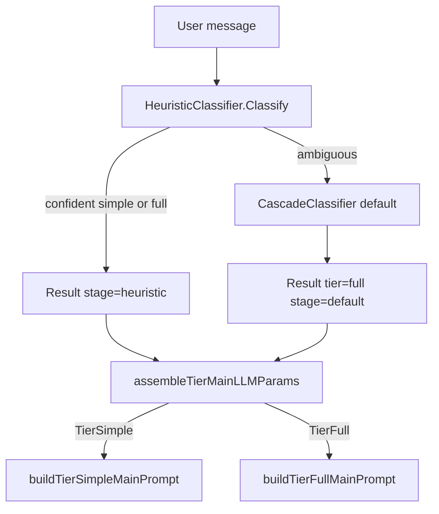

# EP-036 — Simplify intent classification — System design

**Contents**

- [Overview](#overview)
- [Architecture](#architecture)
- [Components and interfaces](#components-and-interfaces)
- [Data models](#data-models)
- [Error handling](#error-handling)
- [Testing strategy](#testing-strategy)
- [Implementation sequencing](#implementation-sequencing)
- [Requirement traceability](#requirement-traceability)

---

## Overview

EP-036 reduces intent-classification complexity for Refactoring increment **0.02** ([strategy.md](../../strategy.md)): remove the optional **model-stage** LLM call and the **`full_lite`** tier so only **`simple`** and **`full`** govern main-LLM prompt assembly. The cascade becomes **heuristic → default `full`** when heuristics are ambiguous ([REQ-36.006](ep-requirements.md#req-36-006--ambiguous-defaults-to-full)). Messages that previously matched `full_lite_patterns` or were resolved by the model stage as `full_lite` use the existing **`full`** assembly path ([REQ-36.015](ep-requirements.md#req-36-015--former-full_lite-uses-full-path)). **`simple`** and **`full`** builder logic is unchanged aside from deleting the `full_lite` branch ([REQ-36.014](ep-requirements.md#req-36-014--parity-for-simple-and-full-assembly)).

Explicit JSON configuration is **not** weakened: top-level `intent_classifier` remains required in the root key list; removed nested keys **fail load** via raw-JSON rejection (EP-034 pattern) ([REQ-36.016](ep-requirements.md#req-36-016--reject-model_stage-config-key), [REQ-36.017](ep-requirements.md#req-36-017--reject-full_lite_patterns-config-key), [REQ-36.020](ep-requirements.md#req-36-020--keep-intent_classifier-root-key)).

**Supersedes (partial):** Model stage from [EP-017](../EP-017/ep-system-design.md); `full_lite` tier from [EP-018](../EP-018/ep-system-design.md). Historical epics remain DONE.

---

## Architecture

<p align="center"></p>

**Source:** [diagrams/c4-container.puml](diagrams/c4-container.puml). Regenerate PNG: `plantuml -tpng diagrams/c4-container.puml` from this directory.

### Target classification flow



No classification LLM container or edge remains ([REQ-36.010](ep-requirements.md#req-36-010--no-classification-llm-wiring)).

### Module boundaries

| Module | Change | Dependencies after EP-036 |
|--------|--------|---------------------------|
| `internal/intent` | Two tiers; heuristic-only cascade; delete model stage | `context`, `log/slog`, `regexp` only (no `internal/llm` in this package) |
| `internal/config` | Shrink `IntentClassifierConfig`; reject removed JSON keys at load | existing load/validate |
| `cmd/pa` | `buildIntentClassifier` builds heuristic + cascade only | `intent`, `config` (no classifier `llm.NewProvider`) |
| `internal/core` | Tier dispatch: `simple` \| `full` only | `intent` |
| `docs/` | Two-tier heuristic-only operator prose | — |

---

## Components and interfaces

### `internal/intent` — kept

| Symbol | Responsibility |
|--------|----------------|
| `Tier` (`string`) | Complexity label for prompt assembly |
| `TierSimple`, `TierFull` | Only tier constants ([REQ-36.001](ep-requirements.md#req-36-001--two-complexity-tiers)) |
| `Result` | `{ Tier, Stage, MessageLen }`; `Stage` is `"heuristic"` or `"default"` only ([REQ-36.011](ep-requirements.md#req-36-011--stage-values-heuristic-or-default)) |

#### Doc/comment updates in `internal/intent` (F-003)

Code comments referencing the removed model stage / `full_lite` / EP-018 must be refreshed alongside the symbol removals (REQ-36.011 alignment, doc hygiene):

| Location | Current | After EP-036 |
|----------|---------|--------------|
| `tier.go:18` (`Result.Stage` field comment) | `// "heuristic", "model", or "default"` | `// "heuristic" or "default"` |
| `tier.go:1` (package doc) | `two-stage intent classifier (EP-017, EP-018)` | heuristic-only cascade (EP-017, EP-018, simplified EP-036) |
| `heuristic.go:14` (type doc) | `REQ-17.004–REQ-17.006, EP-018 full_lite` | drop `full_lite` reference |
| `heuristic.go:39` (`Classify` order comment) | `Order: length → simple → full → full_lite → ambiguous (EP-018)` | `Order: length → simple → full → ambiguous` |
| `Classifier` | `Classify(ctx, message) Result` |
| `HeuristicResult` | `{ Tier, Confident }` |
| `HeuristicClassifier` | Pattern + length guard evaluation |
| `NewHeuristicClassifier(simplePatterns, fullPatterns []string, maxSimpleLen int)` | **Signature change:** drop `fullLitePatterns` argument |
| `(*HeuristicClassifier) Classify(message) HeuristicResult` | Order: length → simple → full → ambiguous ([REQ-36.004](ep-requirements.md#req-36-004--heuristic-evaluation-order)) |
| `CascadeClassifier` | Chains heuristic then default full |
| `NewCascadeClassifier(heuristic *HeuristicClassifier, logger *slog.Logger)` | **Signature change:** no `model` parameter |
| `(*CascadeClassifier) Classify(ctx, message) Result` | Heuristic confident → `Stage: "heuristic"`; else → `TierFull`, `Stage: "default"` ([REQ-36.006](ep-requirements.md#req-36-006--ambiguous-defaults-to-full), [REQ-36.007](ep-requirements.md#req-36-007--confident-heuristic-stage-label)) |

### `internal/intent` — removed

| Symbol | Former role |
|--------|-------------|
| **Files** `model.go`, `model_test.go` | Entire model stage ([REQ-36.008](ep-requirements.md#req-36-008--delete-model-stage-code)) |
| `TierFullLite` | Middle tier constant ([REQ-36.002](ep-requirements.md#req-36-002--remove-full_lite-tier)) |
| `ModelClassifier` | Cheap-LLM ambiguous resolver ([REQ-36.009](ep-requirements.md#req-36-009--remove-modelclassifier-type)) |
| `NewModelClassifier`, `(*ModelClassifier) Classify` | Model-stage API |
| `classificationPromptTemplate`, `defaultModelTimeout`, `parseTierResponse`, `tierFromSingleLineOrPrefix` | Model parsing helpers (file deleted) |
| `CascadeClassifier.model` field | Model-stage branch in cascade |
| `HeuristicClassifier.fullLitePatterns` field | `full_lite` regex list |
| Model branch in `(*CascadeClassifier) Classify` | Lines 32–43 in current `cascade.go` (model call + `Stage: "model"`) |
| `TestModelClassifier_LogsUsageSeparately` in `observability_test.go` | Delete test; **keep** `TestCascadeClassifier_ResultContainsStageAndLen` but update its `NewHeuristicClassifier(...)` (drop `nil` lite arg) and `NewCascadeClassifier(h, nil, nil)` → `NewCascadeClassifier(h, nil)` calls to the new signatures (F-005) |

**"Keep" means "retain intent but migrate to the new constructor signatures."** Every retained intent test that constructs a heuristic/cascade classifier must change `NewHeuristicClassifier(simple, full, lite, max)` → `NewHeuristicClassifier(simple, full, max)` and `NewCascadeClassifier(h, model, logger)` → `NewCascadeClassifier(h, logger)`.

### Heuristic behaviour change — former `full_lite` matches

| Before (EP-018) | After (EP-036) |
|-----------------|----------------|
| `full_lite_patterns` match → confident `TierFullLite` | Pattern list removed from config; operators move patterns into `full_patterns` if they still want confident `full`, or rely on ambiguous → default `full` |
| No pattern match after simple/full → ambiguous → model or default | Same ambiguous path → cascade assigns **`full`** / **`default`** with no LLM ([REQ-36.005](ep-requirements.md#req-36-005--no-full_lite-patterns-in-heuristic), [REQ-36.015](ep-requirements.md#req-36-015--former-full_lite-uses-full-path)) |

**Migration note for operator `.config`:** Patterns currently under `heuristic.full_lite_patterns` (e.g. conversational “explain/tell me”) should be merged into `full_patterns` if they must stay **confident** `full` before ambiguous default; otherwise removing them only increases use of default-`full` (acceptable per scope).

### `internal/core` — tier main prompt ([REQ-36.012](ep-requirements.md#req-36-012--dispatch-simple-and-full-only)–[REQ-36.014](ep-requirements.md#req-36-014--parity-for-simple-and-full-assembly))

| Kept | Unchanged behaviour |
|------|---------------------|
| `buildMainTurnMessagesPreTail` | Classification logging; RAG gather only when `tier == intent.TierFull` |
| `assembleTierMainLLMParams` | `switch`: `TierFull` → `buildTierFullMainPrompt`; **default** → `buildTierSimpleMainPrompt` |
| `buildTierSimpleMainPrompt` | Empty `tierMainLLMParams` (minimal prompt) |
| `buildTierFullMainPrompt` | Skills + RAG chunks + `mergeTailMergedToolsAndOptions` |
| `mergeTailMergedToolsAndOptions`, `mergedAfterDynamicToolCap` | Shared tail pipeline (comment: “full tier tail” only) |

| Removed |
|---------|
| `case intent.TierFullLite` in `assembleTierMainLLMParams` |
| `buildTierFullLiteMainPrompt` (called `mergeTailMergedToolsAndOptions` with `nil` skills/chunks) |

`buildTierFullMainPrompt` body stays as today; former `full_lite` turns now enter this path ([REQ-36.015](ep-requirements.md#req-36-015--former-full_lite-uses-full-path)).

### `cmd/pa` — `buildIntentClassifier` ([REQ-36.010](ep-requirements.md#req-36-010--no-classification-llm-wiring))

**Remove:** `var model *intent.ModelClassifier`; entire `if ic.ModelStage != nil && ic.ModelStage.Enabled { ... llm.NewProvider ... NewModelClassifier }` block; `model_stage` / `classifier_model` log attrs.

**Keep:**

```go
heuristic = intent.NewHeuristicClassifier(
    ic.Heuristic.SimplePatterns,
    ic.Heuristic.FullPatterns,
    ic.Heuristic.MaxSimpleLen,
)
return intent.NewCascadeClassifier(heuristic, logger), nil
```

**Imports to drop from model-stage block:** no extra `llm` provider construction for classification (package may still import `llm` elsewhere in `main.go`).

**Tests:** No `cmd/pa` test asserts intent-classifier **log keys**, so removing the `model_stage` / `classifier_model` log attrs in `main.go` needs no test edit. The only `cmd/pa` test touching removed text is the **doc-content** check in `ep024_operator_logging_test.go` (`TestEP024_ProviderRolesDocContent`), handled in the Testing strategy / step 6. AC-36.009 is verified by build + grep (Manual).

### `internal/config` — schema and load ([REQ-36.016](ep-requirements.md#req-36-016--reject-model_stage-config-key)–[REQ-36.021](ep-requirements.md#req-36-021--null-intent_classifier-disables-classification))

#### Struct / field removals (`config.go`)

| Remove | Notes |
|--------|-------|
| `ClassificationModelConfig` type | Entire struct deleted |
| `IntentClassifierConfig.ModelStage` | Field + `json:"model_stage"` |
| `HeuristicConfig.FullLitePatterns` | Field + `json:"full_lite_patterns"` |
| `validateICModelStage` | Function deleted from `load.go` |
| Loop validating `h.FullLitePatterns` in `validateICHeuristic` | Deleted |
| `resolve.go` block resolving `IntentClassifier.ModelStage.APIKeyPath` | Deleted |

#### Kept

```go
type IntentClassifierConfig struct {
    Enabled   bool             `json:"enabled"`
    Heuristic *HeuristicConfig `json:"heuristic,omitempty"`
}

type HeuristicConfig struct {
    SimplePatterns []string `json:"simple_patterns"`
    FullPatterns   []string `json:"full_patterns"`
    MaxSimpleLen   int      `json:"max_simple_len"`
}
```

`validateIntentClassifier`: when enabled, require `heuristic` with `max_simple_len >= 1` and compile-check `simple_patterns` / `full_patterns` only ([REQ-36.018](ep-requirements.md#req-36-018--enabled-heuristic-schema), [REQ-36.019](ep-requirements.md#req-36-019--validate-heuristic-at-load)).

`root_keys.go`: keep `"intent_classifier"` in documented top-level list ([REQ-36.020](ep-requirements.md#req-36-020--keep-intent_classifier-root-key)).

#### Removed-key rejection (EP-034 pattern)

Add `rejectRemovedIntentClassifierKeys(rawIC json.RawMessage) error` called from `rejectRemovedUnsupportedConfigKeys` when root `intent_classifier` is present and not JSON `null`:

1. Unmarshal `intent_classifier` object to `map[string]json.RawMessage`.
2. If key **`model_stage`** exists → `errors.New("config: intent_classifier.model_stage is not supported; intent classification is heuristic-only (EP-036)")` (wording may name the key explicitly per [AC-36.013](ep-acceptance-criteria.md#ac-36-013)).
3. If `heuristic` object exists, unmarshal and if key **`full_lite_patterns`** exists → analogous error for `intent_classifier.heuristic.full_lite_patterns` ([AC-36.014](ep-acceptance-criteria.md#ac-36-014)).

This mirrors [EP-034](../EP-034/ep-system-design.md) `rejectRemovedToolsConfigKeys` (raw JSON map inspection before relying on struct tags). Go `encoding/json` would otherwise **silently drop** unknown fields after struct removal; rejection must happen **before** or **independent of** unmarshaling into shrunk structs.

**Comment-only:** `ToolDynamicSelection` doc line “TierFull and TierFullLite” → “TierFull” ([REQ-36.022](ep-requirements.md#req-36-022--update-configs-and-operator-docs) docs alignment).

### Configuration files to update ([REQ-36.022](ep-requirements.md#req-36-022--update-configs-and-operator-docs), [AC-36.018](ep-acceptance-criteria.md#ac-36-018), [AC-36.022](ep-acceptance-criteria.md#ac-36-022))

| File | Action |
|------|--------|
| `.config/config.json` | Remove `heuristic.full_lite_patterns` and entire `model_stage` object; keep `enabled: true` and heuristic-only block (merge former `full_lite` regexes into `full_patterns` per operator choice). **Live operator file = MANUAL verification only** ([AC-36.018](ep-acceptance-criteria.md#ac-36-018), amended; see F-002 note below) |
| `config.examples/config.example.json` | Keep `"intent_classifier": null` (explicit key); document enabled shape in `docs/configuration.md` only. Automated positive-load coverage ([AC-36.022](ep-acceptance-criteria.md#ac-36-022), Unit) |
| `internal/config/testdata/*.json` | All fixtures already use `"intent_classifier": null` — no bulk edit required |
| **Add** `internal/config/testdata/intent_classifier_model_stage_rejected.json` | Minimal valid config + `model_stage` → load must fail (automated Unit, [AC-36.013](ep-acceptance-criteria.md#ac-36-013)) |
| **Add** `internal/config/testdata/intent_classifier_full_lite_patterns_rejected.json` | Minimal valid config + `full_lite_patterns` → load must fail (automated Unit, [AC-36.014](ep-acceptance-criteria.md#ac-36-014)) |
| **Add** `internal/config/testdata/intent_classifier_enabled_heuristic_only.json` | Positive enabled heuristic-only load ([AC-36.015](ep-acceptance-criteria.md#ac-36-015), [AC-36.022](ep-acceptance-criteria.md#ac-36-022)) |
| `tests/integration/testdata/runtime_skills/minimal_ok/config.json` | Already `null`; verify unchanged |
| `cmd/pa/main_test.go` embedded config | Already `intent_classifier: null` |
| `docs/configuration.md` | Two-tier table; heuristic-only cascade; remove `full_lite` / `model_stage` sections |
| `docs/llm-provider-roles-and-logging.md` | Remove intent classifier model-stage client section |
| `docs/architecture-ru.md` | **Add (F-004):** stale `full_lite` / three-tier references at lines 162 (`simple / full_lite / full`), 230 (`else tier = full_lite`), 260 (`full_lite` tier description), 519 (classification-flow `simple / full_lite / full`) → two-tier (`simple` / `full`) heuristic-only |

> **F-002 — `.config/config.json` verification (reconciled with AC).** No Go test loads the operator `.config/config.json` (a real `config.Load` needs secrets / known_hosts / tool-catalog files that are not test fixtures), so a stale operator file is **not** caught by `make check`; it would fail only at process start. The acceptance criteria now reflect this split:
> - **Live operator `.config/config.json` → MANUAL verification only** ([AC-36.018](ep-acceptance-criteria.md#ac-36-018), amended in stage 5): updated and verified by hand during the epic.
> - **Automated positive-load / schema coverage → Unit** ([AC-36.022](ep-acceptance-criteria.md#ac-36-022)): `config.examples/config.example.json` (loads as `intent_classifier: null`) plus the new `internal/config/testdata/intent_classifier_enabled_heuristic_only.json` fixture.
> - **Removed-key rejection → Unit** ([AC-36.013](ep-acceptance-criteria.md#ac-36-013)/[AC-36.014](ep-acceptance-criteria.md#ac-36-014)): the two new rejection fixtures via `Load`.
>
> No design wording claims CI catches a stale operator file.

---

## Data models

### `intent.Result` (production)

| Field | Values after EP-036 |
|-------|---------------------|
| `Tier` | `simple` \| `full` |
| `Stage` | `heuristic` \| `default` |
| `MessageLen` | Unchanged (UTF-8 rune count) |

### Enabled `intent_classifier` JSON (target)

```json
"intent_classifier": {
  "enabled": true,
  "heuristic": {
    "simple_patterns": ["^hello$"],
    "full_patterns": ["(search|find)"],
    "max_simple_len": 40
  }
}
```

Disabled: `"intent_classifier": null` ([REQ-36.021](ep-requirements.md#req-36-021--null-intent_classifier-disables-classification)).

### Constraints preserved

- Root `config.json` must list every documented top-level key exactly once; `intent_classifier` stays in the list ([REQ-36.020](ep-requirements.md#req-36-020--keep-intent_classifier-root-key)).
- Unknown **top-level** keys still rejected via `root_keys.go` (unchanged).
- Removed **nested** keys under `intent_classifier` rejected via new helper (fail fast).

---

## Error handling

| Condition | Behaviour | REQ / AC |
|-----------|-----------|----------|
| Heuristic confident | Return heuristic tier, `Stage: heuristic` | REQ-36.007, AC-36.007 |
| Heuristic ambiguous | `TierFull`, `Stage: default`; no LLM call | REQ-36.006, AC-36.006 |
| Both heuristic nil and cascade called | Default full (existing `TestCascade_BothNil_DefaultFull` behaviour) | REQ-36.006 |
| Config contains `model_stage` or `full_lite_patterns` | Load error with explicit message | REQ-36.016–017, AC-36.013–014 |
| Invalid heuristic regex / `max_simple_len` < 1 | Load error (unchanged) | REQ-36.019, AC-36.015 |
| Unknown tier reaches `assembleTierMainLLMParams` | Falls through to `buildTierSimpleMainPrompt` (only `TierFull` is explicit); with two tiers only, classification cannot emit `full_lite` | REQ-36.012 |

---

## Testing strategy

| Level | Focus | REQ / AC |
|-------|-------|----------|
| Unit — `intent` | Two tier constants; heuristic order without `full_lite` step; ambiguous → default full; no model tests | AC-36.001–007 |
| Unit — `config` | Removed-key rejection fixtures (AC-36.013–014); positive enabled heuristic-only + `config.examples` load (AC-36.022); root-key + `null` (AC-36.016); drop model-stage validation tests. Live `.config/config.json` is **manual** (AC-36.018) | AC-36.013–016, AC-36.022 |
| Unit — `core` | Dispatch only simple/full; delete `buildTierFullLite` tests; rewrite EP-018 token-delta tests to compare simple vs full or former-lite fixture → full path | AC-36.010–012, AC-36.019 |
| Integration | Handler assigns one tier per turn; simple/full assembly parity; table of pre-epic `full_lite` messages → `full` assembly | AC-36.003, AC-36.011–012 |
| Manual | Grep `cmd/pa` for classification LLM; docs review; `make check`; `./bin/validate ears EP-036` | AC-36.008–009, AC-36.017, AC-36.020–021 |

**Exhaustive test-file inventory** ([REQ-36.025](ep-requirements.md#req-36-025--retire-obsolete-tier-tests)). Derived from grep of `FullLite|full_lite|TierFullLite|ModelStage|ModelClassifier|NewHeuristicClassifier|NewCascadeClassifier` across `internal/`, `cmd/`, `tests/`. Every file that references a removed symbol or an old constructor signature is listed so each migration step keeps `make check` green ([REQ-36.026](ep-requirements.md#req-36-026--make-check-passes)).

**`internal/intent/`**

- `model_test.go` — **delete** with `model.go`.
- `observability_test.go` — **delete** `TestModelClassifier_LogsUsageSeparately`; **keep** `TestCascadeClassifier_ResultContainsStageAndLen` with new signatures (`NewHeuristicClassifier(simple, full, max)`, `NewCascadeClassifier(h, logger)`).
- `cascade_test.go` — **delete** `TestCascade_AmbiguousToModel`, `TestCascade_ModelError_DefaultFull`, `TestCascade_ModelError_LogsWarn`, `TestCascade_ModelReturnsSimple` (model-stage); **keep & migrate signatures** `TestCascade_HeuristicConfident`, `TestCascade_ModelDisabled_DefaultFull` (rename to `_DefaultFull`), `TestCascade_BothNil_DefaultFull` (`NewCascadeClassifier(nil, nil)`), `TestCascade_MessageLen`.
- `heuristic_test.go` — **delete** `TestHeuristic_FullLitePatterns`; **migrate signatures** on all other `NewHeuristicClassifier(...)` calls (drop the lite arg); add a case that a former-lite pattern with no `full_patterns` match → `Confident:false` (ambiguous).

**`internal/core/`** (all must compile after `TierFullLite` / `buildTierFullLiteMainPrompt` removal)

- `handler_ep017_test.go` — **migrate signatures**: `NewHeuristicClassifier(simple, full, nil, max)` → 3-arg; `NewCascadeClassifier(h, nil, nil)` / `NewCascadeClassifier(nil, nil, nil)` → 2-arg. No `full_lite` logic here; tests retained.
- `handler_ep018_test.go` — **delete** `TestHandleMessage_FullLite_skipsRAGInSystemMessage` and `TestHandleMessage_FullLite_systemPromptRunesLowerThanFullWithRAG` (full vs full_lite token delta); **migrate signatures** on retained `full`/`simple` cases; **add** a former-`full_lite` fixture-message test asserting it runs the `full` assembly path ([AC-36.012](ep-acceptance-criteria.md#ac-36-012)).
- `handler_ep018_coverage_test.go` — **(F-001a)** uses old constructors at lines 83–84, 143–144, 197–198, 228–229, 269–270 (`NewHeuristicClassifier(.., .., []string{..}, ..)`, `NewCascadeClassifier(h, nil, nil)`) and `TierFullLite`-driven cases (`^LITESESS`, `^LITEHERM`, `^LITENOTOOL`, `^LITEDYN`, lines ~138–309). **Rewrite:** migrate `^FULLTOOLS` case to new signatures; **delete or re-target** the four `full_lite`-specific tests (session-parity, catalog native tool defs, no-tools, dynamic-selection cap) to the `full` path so they exercise the same assembly via `TierFull`. **(F-001b critical)** `TestEP018_configurationDoc_containsTierMatrix` (lines 64–77) asserts `docs/configuration.md` **contains** `"### Intent tiers"`, `"full_lite"`, `"dynamic_selection"` — the doc update removes `full_lite`. **Rewrite** this test to assert the new two-tier matrix content (e.g. `"### Intent tiers"`, `"simple"`, `"full"`, `"dynamic_selection"`) and **must not** assert `full_lite`.
- `handler_tier_main_prompt_test.go` — **(F-001c)** calls `h.assembleTierMainLLMParams(ctx, intent.TierFullLite, ...)` (line 39) and `h.buildTierFullLiteMainPrompt(...)` (line 73) → compile error after removal. **Delete** those `TierFullLite` / `buildTierFullLiteMainPrompt` assertions; retain `simple` and `full` dispatch/builder coverage ([AC-36.010](ep-acceptance-criteria.md#ac-36-010)).

**`internal/config/`**

- `intent_classifier_test.go` — **delete** `TestValidateIntentClassifier_ModelStageConfig`, `TestValidateIntentClassifier_ModelStage_BadTimeout`, `TestValidateIntentClassifier_ModelStage_MissingEndpoint`, `TestValidateIntentClassifier_ModelStage_HTTPTimeout_requiredAndPositive` (all reference the removed `ClassificationModelConfig`); **add** rejection tests via `Load` + the two new rejection fixtures ([AC-36.013](ep-acceptance-criteria.md#ac-36-013)–[AC-36.014](ep-acceptance-criteria.md#ac-36-014)) and a positive enabled-heuristic load ([AC-36.015](ep-acceptance-criteria.md#ac-36-015)). The doc-content test in this file asserting `configuration.md` mentions `intent_classifier` stays valid (key name unchanged).

**`cmd/pa/`**

- `ep024_operator_logging_test.go` — **doc-content only (F-006).** This file has **no** intent-classifier log-key assertion, so no log-key edit is required; the `model_stage` / `classifier_model` log attrs are removed in `cmd/pa/main.go` production code (AC-36.009, verified by build + grep). The one assertion touching removed text is `TestEP024_ProviderRolesDocContent` (lines 65–78), which asserts `docs/llm-provider-roles-and-logging.md` **contains** `"model_stage"`, `"not selected by an index"`, and `"## Example: pool with intent classifier"`. Because the doc update removes the model-stage section, **remove those three substrings** from the `checks` list (keep `llm_providers`, `zero-based`, `transport fallback`, `intent_classifier`, `PA_ENV`, `development`, and the single-/multi-provider example headers).
- `main_test.go` — embedded config already uses `"intent_classifier": null`; no change.

**Literal-string-only (not `intent.Tier`; out of scope for tier removal, optional hygiene)**

- `internal/telegram/outbound_chunk_test.go` (footer sample text `"… · full_lite"`) and `internal/llm/openai_test.go` (sample `reasoning:"full_lite"` content) use `full_lite` as arbitrary literal data, not the `intent` tier constant. They compile unchanged and are **not** required edits; touch only if footer/sample hygiene is desired.

This inventory supersedes the earlier "only `handler_ep018_test.go`" list and is reflected in the sequencing table (steps 2–4 fix intent + core tests; step 1 and step 6 fix the config and doc-content tests respectively).

---

## Implementation sequencing

Order below keeps `make check` green after each step ([REQ-36.026](ep-requirements.md#req-36-026--make-check-passes)).

| Step | Work | Rationale / green-after-step note |
|------|------|-----------|
| **1** | `rejectRemovedIntentClassifierKeys` + two rejection testdata JSON + positive heuristic-only testdata + `config_test.go` cases. Land alongside struct removal in step 5 **or** keep legacy structs until step 5 so the package compiles | Automated Unit coverage: removed-key rejection (AC-36.013–014) + positive load of `config.examples` and new testdata (AC-36.022). Does **not** load the live operator `.config/config.json` (AC-36.018 manual) |
| **2** | `internal/intent`: delete `model.go`/`model_test.go`; shrink `tier.go`/`heuristic.go`/`cascade.go` (+ comment updates F-003); migrate `cascade_test.go`, `heuristic_test.go`, `observability_test.go` signatures and delete model/lite tests | Package + its tests compile once constructor signatures and removed tests are updated together |
| **3** | `cmd/pa`: `buildIntentClassifier` (drop model block + `model_stage`/`classifier_model` log attrs). No `cmd/pa` test log-key edit exists (the only affected `ep024` assertion is doc-content, handled in step 6) | Wires new 2-arg cascade constructor |
| **4** | `internal/core`: remove `TierFullLite` case + `buildTierFullLiteMainPrompt`; migrate/rewrite `handler_ep017_test.go`, `handler_ep018_test.go`, `handler_ep018_coverage_test.go`, `handler_tier_main_prompt_test.go` (incl. former-lite → full path test) | All four core test files edited in the **same** step as the symbol removal so the build never breaks |
| **5** | `internal/config`: remove `ClassificationModelConfig`, `ModelStage`, `FullLitePatterns`, `validateICModelStage`, lite-pattern loop, `resolve.go` block; update `intent_classifier_test.go`; update `.config/config.json` (manual) | Load matches code; struct removal coexists with raw-JSON rejection from step 1 |
| **6** | Docs: `docs/configuration.md`, `docs/llm-provider-roles-and-logging.md`, `docs/architecture-ru.md` (F-004); `config.go` `ToolDynamicSelection` comment. **Same step:** rewrite the doc-content assertions in `handler_ep018_coverage_test.go` (`TestEP018_configurationDoc_containsTierMatrix`) and `cmd/pa/ep024_operator_logging_test.go` (`TestEP024_ProviderRolesDocContent`) so doc edits and their content tests change atomically | Doc-content tests would otherwise fail the instant `full_lite` / `model_stage` leave the docs |
| **7** | `make check`; `./bin/validate ears EP-036`; **manually** load/verify `.config/config.json` | AC-36.020–021 + manual operator-config check (F-002) |

Steps 2–4 may be one commit. The doc-content tests in step 6 MUST move with their docs in the same commit; otherwise `make check` breaks between steps. There is **no** automated test of `.config/config.json`, so a stale operator file is caught only by the manual step-7 verification, not by CI.

---

## Requirement traceability

| REQ | Design section |
|-----|----------------|
| REQ-36.001 | Overview; `TierSimple` / `TierFull` only |
| REQ-36.002 | Removed `TierFullLite`; core/intent removals |
| REQ-36.003 | Cascade + handler one tier per turn |
| REQ-36.004 | Heuristic order table |
| REQ-36.005 | No `fullLitePatterns`; heuristic tests |
| REQ-36.006 | Cascade default branch |
| REQ-36.007 | Confident `Stage: heuristic` |
| REQ-36.008–009 | Delete `model.go` / `ModelClassifier` |
| REQ-36.010 | `cmd/pa` wiring |
| REQ-36.011 | `Result.Stage` values |
| REQ-36.012–014 | Core dispatch; parity |
| REQ-36.015 | Former `full_lite` → `buildTierFullMainPrompt` |
| REQ-36.016–017 | `rejectRemovedIntentClassifierKeys` |
| REQ-36.018–019 | Shrunk `HeuristicConfig` + validation |
| REQ-36.020–021 | Root key + `null` |
| REQ-36.022 | Config/docs file list |
| REQ-36.023–025 | Testing strategy |
| REQ-36.026–027 | Sequencing step 7 |

### AC mapping (implementation plan input)

| AC | Primary verification |
|----|----------------------|
| AC-36.001–002 | `intent` tier constants / grep |
| AC-36.003 | Handler integration test |
| AC-36.004–007 | `heuristic_test.go`, `cascade_test.go` |
| AC-36.008–009 | File tree + `cmd/pa` grep |
| AC-36.010 | `handler_tier_main_prompt` unit tests |
| AC-36.011 | Existing simple/full assembly baselines |
| AC-36.012 | Former `full_lite` fixture → full assembly |
| AC-36.013–014 | Config load rejection testdata (automated Unit) |
| AC-36.015–016 | Heuristic validation + root key tests |
| AC-36.017 | Operator docs review (Manual) |
| AC-36.018 | Live `.config/config.json` load (Manual only) |
| AC-36.022 | Positive load of `config.examples` + new testdata fixture (automated Unit) |
| AC-36.019 | Test inventory |
| AC-36.020–021 | `make check`, validate binary |

---

## Risks and trade-offs

| Risk | Mitigation |
|------|------------|
| Operator configs still contain removed keys | Fail-fast JSON rejection at load (automated Unit, AC-36.013–014); the live `.config/config.json` is updated and verified **manually** (AC-36.018; no automated test loads it — F-002), while positive schema load is covered by `config.examples` + testdata (AC-36.022). A stale operator file fails at process start, not in `make check` |
| Doc-content tests assert removed substrings (`full_lite`, `model_stage`) | Rewrite `TestEP018_configurationDoc_containsTierMatrix` and `TestEP024_ProviderRolesDocContent` in the same commit as the doc edits (sequencing step 6) |
| Former `full_lite` messages use heavier `full` path (more tokens/latency) | Accepted in scope; merge patterns into `full_patterns` if needed |
| Silent ignore if rejection omitted | Follow EP-034 raw-JSON check; unit tests for both keys |
| EP-017/018 docs contradict runtime | EP-036 operator docs supersede for classification |
