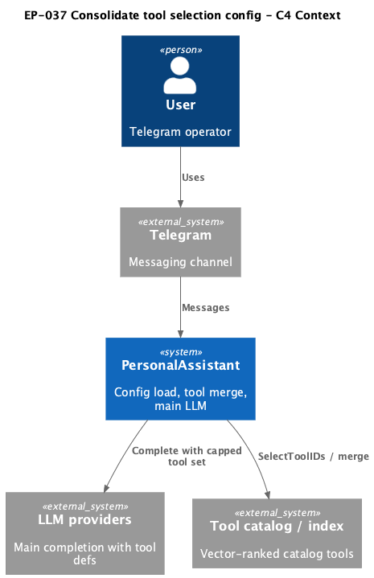
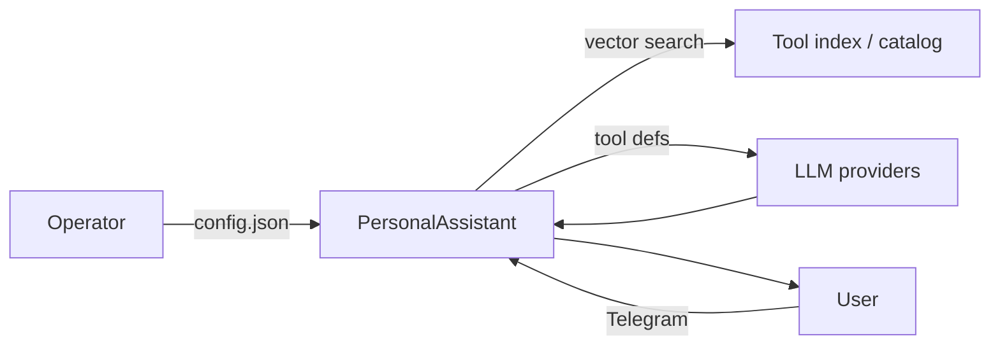

# EP-037 — Consolidate tool pre-selection configuration — Requirements (EARS / INCOSE)

This document defines product requirements for [ep-scope.md](ep-scope.md): merge catalog tool vector pre-selection and EP-018 per-request tool capping into one `tools.selection` block, remove legacy keys, and preserve runtime tool-selection outcomes for equivalent settings.

> **24 requirements** · 18 FR · 6 NFR · 6 theme groups

**Contents**

- [Introduction](#introduction)
- [Glossary](#glossary)
- [C4 C1 — System Context](#c4-c1--system-context)
- [Flow](#flow)
- [EARS patterns used](#ears-patterns-used)
- [Requirement index](#requirement-index)
- [Requirements](#requirements)
  - [Configuration schema](#configuration-schema)
  - [Legacy key rejection](#legacy-key-rejection)
  - [Explicit JSON and root keys](#explicit-json-and-root-keys)
  - [Runtime behaviour parity](#runtime-behaviour-parity)
  - [Repository artefacts and documentation](#repository-artefacts-and-documentation)
  - [Verification](#verification)

---

## Introduction

EP-037 is a **config-shape refactor** (Refactoring increment 0.02, direction B in [strategy.md](../../strategy.md)). PersonalAssistant SHALL expose one required `tools.selection` object that holds vector pre-selection parameters and the EP-018 dynamic tool cap. Top-level `tool_pre_selection` and `tools.dynamic_selection` SHALL be removed and rejected at load. Selection algorithms, merge order, and cap application SHALL remain unchanged for operator settings that map one-to-one from the removed keys.

**Scope in brief**

- Required `tools.selection` with `tool_search_top_k`, `tool_min_count`, `tool_fallback_cap`, `enabled`, `max_tools_for_llm_request`.
- Fail-fast rejection of legacy keys (EP-034 / EP-036 raw-JSON pattern).
- Updated `.config/config.json`, all `config.examples/`, `internal/config/testdata/`, integration configs, and `docs/configuration.md`.
- Regression tests proving equivalent configs yield the same merged tool ids and dynamic-cap behaviour.

**Out of scope (no requirements herein):** `tools.vector_search_tools` JSON DRY; relocating `runtime_skills.tool_vector_top_k_cap`; `internal/core` handler decomposition (EP-038); new selection features.

---

## Glossary

| Term | Definition |
|------|------------|
| **PersonalAssistant** | The Go product (`cmd/pa`, `internal/core`, `internal/config`). |
| **Config loader** | `config.Load` and validation in `internal/config`. |
| **Tool vector pre-selection** | Ranking catalog tools by semantic similarity (`toolindex.SelectToolIDs`), then merging with `always_include` and skill-linked ids (`mergeSelectedToolIDs`). |
| **Dynamic tool cap** | After merge, optionally narrowing the tool id list for the main LLM (`mergedAfterDynamicToolCap` / `pickToolsForMainRequest`; formerly `tools.dynamic_selection`). |
| **`tools.selection`** | Required sub-object under `tools` holding pre-selection and dynamic-cap fields in one place. |
| **Equivalent configuration** | Settings where legacy `tool_pre_selection` and `tools.dynamic_selection` values are copied field-for-field into `tools.selection` (documented operator migration). |
| **Effective vector top-K** | `tool_search_top_k` after applying `min(tool_search_top_k, runtime_skills.tool_vector_top_k_cap)` when runtime skills are enabled and the cap is positive. |
| **Tier `full`** | Intent tier that runs merged catalog tools and optional dynamic cap (EP-017 / EP-036). |
| **Explicit JSON configuration** | Every documented key appears exactly once at its level; unknown keys fail load; optional product blocks use JSON `null` at the root; no implicit defaults for required numeric fields. |

---

## C4 C1 — System Context

**Source:** [diagrams/c4-context.puml](diagrams/c4-context.puml) (C4-PlantUML). To regenerate PNG: `plantuml -tpng diagrams/c4-context.puml` from this directory.

### Flow

High-level flow: the operator configures `tools.selection`; on each **tier `full`** turn PersonalAssistant merges ranked catalog tools, optionally applies the dynamic cap, and sends tool definitions to the main LLM.

---

## EARS patterns used

- **Ubiquitous:** THE \<system\> SHALL \<response\>
- **Event-driven:** WHEN \<trigger\>, THE \<system\> SHALL \<response\>
- **State-driven:** WHILE \<condition\>, THE \<system\> SHALL \<response\>
- **Unwanted event:** IF \<condition\>, THEN THE \<system\> SHALL \<response\>
- **Optional feature:** WHERE \<option\>, THE \<system\> SHALL \<response\>
- **Complex:** Clauses in order WHERE → WHILE → WHEN/IF → THE → SHALL

In the following, *System* = **PersonalAssistant** unless a requirement names **Config loader** or **repository** explicitly.

---

## Requirement index

| Id | Type | Section | Summary |
|----|------|---------|---------|
| REQ-37.001 | FR | Configuration schema | Require `tools.selection` with five explicit fields |
| REQ-37.002 | FR | Configuration schema | Validate pre-selection numeric bounds |
| REQ-37.003 | FR | Configuration schema | Validate dynamic cap when `enabled` is true |
| REQ-37.004 | FR | Configuration schema | Allow `max_tools_for_llm_request` zero when disabled |
| REQ-37.005 | FR | Legacy key rejection | Reject top-level `tool_pre_selection` |
| REQ-37.006 | FR | Legacy key rejection | Reject `tools.dynamic_selection` |
| REQ-37.007 | FR | Explicit JSON and root keys | Drop `tool_pre_selection` from root key list |
| REQ-37.008 | FR | Explicit JSON and root keys | Reject unknown keys under `tools` |
| REQ-37.009 | FR | Runtime behaviour parity | Apply runtime-skills top-K cap |
| REQ-37.010 | FR | Runtime behaviour parity | Preserve merge and vector search semantics |
| REQ-37.011 | FR | Runtime behaviour parity | Preserve EP-018 dynamic cap on tier `full` |
| REQ-37.012 | FR | Runtime behaviour parity | Wire handler from `tools.selection` only |
| REQ-37.013 | FR | Repository artefacts and documentation | Update operator and example configs |
| REQ-37.014 | FR | Repository artefacts and documentation | Document field migration in operator docs |
| REQ-37.015 | FR | Repository artefacts and documentation | Document `tool_vector_top_k_cap` interaction |
| REQ-37.016 | FR | Verification | Tests reject legacy keys at load |
| REQ-37.017 | FR | Verification | Tests prove equivalent-config parity |
| REQ-37.018 | NFR | Verification | `make check` passes |
| REQ-37.019 | NFR | Verification | `./bin/validate ears EP-037` passes |
| REQ-37.020 | NFR | Explicit JSON and root keys | Do not weaken explicit-JSON rules |
| REQ-37.021 | NFR | Configuration schema | Keep `runtime_skills.tool_vector_top_k_cap` location |
| REQ-37.022 | NFR | Out of scope | No `vector_search_tools` schema DRY |
| REQ-37.023 | NFR | Out of scope | No broad handler refactor |
| REQ-37.024 | NFR | Out of scope | No new selection features |

---

## Requirements

### Configuration schema

### REQ-37.001 — Require tools.selection block

THE Config loader SHALL require a `tools.selection` object under `tools` with explicit JSON fields `tool_search_top_k`, `tool_min_count`, `tool_fallback_cap`, `enabled`, and `max_tools_for_llm_request`.

### REQ-37.002 — Validate pre-selection bounds

THE Config loader SHALL validate `tools.selection.tool_search_top_k`, `tools.selection.tool_min_count`, and `tools.selection.tool_fallback_cap` with lower bound **≥ 1** and upper caps matching the former `tool_pre_selection` limits (**500** for top-K and min count; **1000** for fallback cap).

### REQ-37.003 — Validate dynamic cap when enabled

WHERE `tools.selection.enabled` is **true**, THE Config loader SHALL require `tools.selection.max_tools_for_llm_request` **≥ 1** and **≥** the count of distinct valid `tools.always_include` tool ids.

### REQ-37.004 — Allow zero max when disabled

WHERE `tools.selection.enabled` is **false**, THE Config loader SHALL accept `tools.selection.max_tools_for_llm_request` equal to **0**.

### Legacy key rejection

### REQ-37.005 — Reject tool_pre_selection root key

THE Config loader SHALL reject `config.json` that contains the top-level key `tool_pre_selection`.

### REQ-37.006 — Reject tools.dynamic_selection key

THE Config loader SHALL reject `config.json` that contains the key `tools.dynamic_selection`.

### Explicit JSON and root keys

### REQ-37.007 — Omit tool_pre_selection from root keys

THE `configRootJSONKeys` list SHALL exclude `tool_pre_selection`.

### REQ-37.008 — Reject unknown tools nested keys

THE Config loader SHALL reject unknown keys nested under `tools`.

### REQ-37.020 — Preserve explicit-JSON rules

THE EP-037 change set SHALL preserve explicit-JSON product rules: every documented top-level key appears exactly once in `.config/config.json` and in each `config.examples/` file; unknown top-level keys fail load; optional root blocks use JSON `null` when disabled.

### Runtime behaviour parity

### REQ-37.009 — Apply runtime-skills top-K cap

WHILE `runtime_skills` is enabled with `tool_vector_top_k_cap` greater than zero and catalog vector pre-selection runs, THE PersonalAssistant SHALL use effective vector top-K equal to the minimum of `tools.selection.tool_search_top_k` and `runtime_skills.tool_vector_top_k_cap`.

### REQ-37.010 — Preserve merge semantics

WHEN operator settings map one-to-one from the removed keys into `tools.selection`, THE PersonalAssistant SHALL produce the same merged catalog tool id set from `mergeSelectedToolIDs` as immediately before this epic.

### REQ-37.011 — Preserve EP-018 dynamic cap

WHILE assembling the main LLM prompt for tier `full` with `tools.selection.enabled` true, THE PersonalAssistant SHALL apply the dynamic tool cap after merge using `tools.selection.max_tools_for_llm_request` with the same semantics as the former `tools.dynamic_selection` block.

### REQ-37.012 — Wire handler from tools.selection

THE PersonalAssistant SHALL supply conversation-handler tool pre-selection and dynamic-cap parameters from `tools.selection` via `internal/config` and minimal wiring in `internal/core/run.go`, `handler.go`, and `integration_export.go`.

### Repository artefacts and documentation

### REQ-37.013 — Update repository configs

THE repository SHALL update `.config/config.json`, every JSON file under `config.examples/`, `internal/config/testdata/`, and integration configs under `tests/integration/` so each loads with `tools.selection` and without legacy keys.

### REQ-37.014 — Document migration in configuration.md

THE operator documentation in `docs/configuration.md` SHALL describe `tools.selection`, document one-to-one field migration from `tool_pre_selection` and `tools.dynamic_selection`, and update the intent-tier tool-shaping table to reference `tools.selection.enabled`.

### REQ-37.015 — Document tool_vector_top_k_cap interaction

THE operator documentation SHALL state that `runtime_skills.tool_vector_top_k_cap` remains under `runtime_skills` and limits effective vector top-K per REQ-37.009.

### Verification

### REQ-37.016 — Tests reject legacy keys

THE PersonalAssistant SHALL include automated tests that configs containing `tool_pre_selection` or `tools.dynamic_selection` fail config load with explicit errors naming the unsupported key.

### REQ-37.017 — Tests prove equivalent-config parity

THE PersonalAssistant SHALL include automated tests that representative equivalent configurations yield the same merged tool id sets and dynamic-cap output as before this epic.

### REQ-37.018 — make check passes

THE EP-037 change set SHALL pass `make check`.

### REQ-37.019 — validate ears EP-037 passes

THE EP-037 requirements artefact SHALL pass `./bin/validate ears EP-037` from the repository root after `make build`.

### Out of scope (constraints)

### REQ-37.021 — Keep tool_vector_top_k_cap location

THE EP-037 change set SHALL keep `runtime_skills.tool_vector_top_k_cap` under `runtime_skills` only.

### REQ-37.022 — Defer vector_search_tools DRY

THE EP-037 change set SHALL leave `tools.vector_search_tools` schema unchanged (deferred per [ep-scope.md](ep-scope.md)).

### REQ-37.023 — Limit core handler changes

THE EP-037 change set SHALL limit `internal/core` changes to config field wiring required by this epic (handler decomposition is EP-038).

### REQ-37.024 — No new selection features

THE EP-037 change set SHALL restrict tool-selection changes to configuration consolidation and documentation updates without new ranking signals or tier-specific caps.
