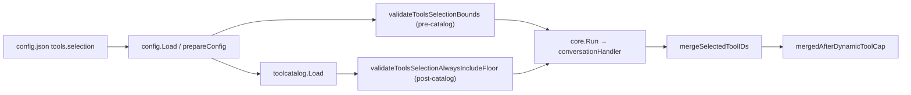

# EP-037 — Consolidate tool pre-selection configuration — System design

**Contents**

- [Overview](#overview)
- [Architecture](#architecture)
- [Components and interfaces](#components-and-interfaces)
- [Data models](#data-models)
- [Error handling](#error-handling)
- [Testing strategy](#testing-strategy)
- [Implementation sequencing](#implementation-sequencing)
- [Risks and trade-offs](#risks-and-trade-offs)
- [Requirement traceability](#requirement-traceability)

---

## Overview

EP-037 is a **config-shape refactor** (Refactoring **0.02**, direction B in [strategy.md](../../strategy.md)): collapse top-level `tool_pre_selection` and nested `tools.dynamic_selection` into one required **`tools.selection`** object with five explicit JSON fields. Selection algorithms (`mergeSelectedToolIDs`, `pickToolsForMainRequest`), merge order, and runtime `min(tool_search_top_k, runtime_skills.tool_vector_top_k_cap)` stay unchanged for equivalent settings ([REQ-37.009](ep-requirements.md#req-37-009--apply-runtime-skills-top-k-cap)–[REQ-37.012](ep-requirements.md#req-37-012--wire-handler-from-toolsselection)).

Explicit JSON rules are **not** weakened: `configRootJSONKeys` drops `tool_pre_selection`; legacy keys fail load via the existing **raw-JSON rejection** entry point `rejectRemovedUnsupportedConfigKeys` ([REQ-37.005](ep-requirements.md#req-37-005--reject-tool_pre_selection-root-key)–[REQ-37.008](ep-requirements.md#req-37-008--reject-unknown-tools-nested-keys), [REQ-37.020](ep-requirements.md#req-37-020--preserve-explicit-json-rules)). `tools.vector_search_tools` schema is untouched ([REQ-37.022](ep-requirements.md#req-37-022--defer-vector_search_tools-dry)); `internal/core` changes are wiring-only ([REQ-37.023](ep-requirements.md#req-37-023--limit-core-handler-changes)).

**Operator migration (1:1):**

| Removed | New |
|---------|-----|
| `tool_pre_selection.tool_search_top_k` | `tools.selection.tool_search_top_k` |
| `tool_pre_selection.tool_min_count` | `tools.selection.tool_min_count` |
| `tool_pre_selection.tool_fallback_cap` | `tools.selection.tool_fallback_cap` |
| `tools.dynamic_selection.enabled` | `tools.selection.enabled` |
| `tools.dynamic_selection.max_tools_for_llm_request` | `tools.selection.max_tools_for_llm_request` |

---

## Architecture

<p align="center"></p>

**Source:** [diagrams/c4-container.puml](diagrams/c4-container.puml). Regenerate PNG: `plantuml -tpng diagrams/c4-container.puml` from this directory.

### Config → runtime data flow



### Module boundaries

| Module | Responsibility | EP-037 change |
|--------|----------------|---------------|
| `internal/config` | Parse, validate, reject legacy keys | New `ToolsSelection`; remove `ToolPreSelection` / `ToolDynamicSelection`; extend raw rejection |
| `internal/core` | Handler construction, merge, cap | Read `cfg.Tools.Selection` only; no algorithm changes |
| `docs/configuration.md` | Operator contract | Document `tools.selection`; migration table |
| Repo JSON fixtures | Explicit-JSON examples | Replace legacy blocks in all tracked configs |

`runtime_skills.tool_vector_top_k_cap` stays under `runtime_skills` ([REQ-37.021](ep-requirements.md#req-37-021--keep-tool_vector_top_k_cap-location)); handler still applies `min` in `mergeSelectedToolIDs` ([REQ-37.009](ep-requirements.md#req-37-009--apply-runtime-skills-top-k-cap)).

---

## Components and interfaces

| Component | Responsibility | Key contract |
|-----------|----------------|--------------|
| `rejectRemovedUnsupportedConfigKeys` | Pre-unmarshal legacy key scan | Reject `tool_pre_selection` at root; delegate `tools` to `rejectRemovedToolsConfigKeys` ([REQ-37.005](ep-requirements.md#req-37-005--reject-tool_pre_selection-root-key), [REQ-37.006](ep-requirements.md#req-37-006--reject-toolsdynamic_selection-key)) |
| `rejectRemovedToolsConfigKeys` | Reject removed `tools.*` keys | Add `dynamic_selection`; keep `text_based_enabled`, `llm_escalation` (EP-034) |
| `validateToolsObjectKeys` (new) | Whitelist nested `tools` keys | Allow `always_include`, `selection`, `vector_search_tools`, `create_tool_secret_patterns`, `tool_output_artifacts`; fail on unknown e.g. `legacy_selection_stub` ([REQ-37.008](ep-requirements.md#req-37-008--reject-unknown-tools-nested-keys)) |
| `validateToolsSelectionBounds` | Catalog-independent checks (early site) | Required block; pre-selection bounds; `enabled==true ⇒ max ≥ 1`; `enabled==false ⇒ max may be 0` ([REQ-37.002](ep-requirements.md#req-37-002--validate-pre-selection-bounds), [REQ-37.004](ep-requirements.md#req-37-004--allow-zero-max-when-disabled)) |
| `validateToolsSelectionAlwaysIncludeFloor` | Catalog-dependent floor (post-catalog site) | `enabled==true ⇒ max ≥ countValidAlwaysIncludeTools(c)`; needs populated `c.ToolCatalog` ([REQ-37.003](ep-requirements.md#req-37-003--validate-dynamic-cap-when-enabled)) |
| `toolPreSelectionParams` → `toolsSelectionParams` | Extract ints for handler | `(topK, minCount, fallbackCap)` from `cfg.Tools.Selection` |
| `conversationHandler` | Runtime merge/cap | `toolSearchTopK` / `toolMinCount` / `toolFallbackCap` ints; `toolsSelection *config.ToolsSelection` for cap gate ([REQ-37.012](ep-requirements.md#req-37-012--wire-handler-from-toolsselection)) |
| `mergeSelectedToolIDs` | Vector pre-selection + merge | Unchanged logic; `topK` capped by `runtime_skills.tool_vector_top_k_cap` ([REQ-37.010](ep-requirements.md#req-37-010--preserve-merge-semantics)) |
| `mergedAfterDynamicToolCap` | EP-018 cap after merge | `toolsSelection.Enabled` + `MaxToolsForLLMRequest` on tier `full` ([REQ-37.011](ep-requirements.md#req-37-011--preserve-ep-018-dynamic-cap)) |

---

## Data models

### `ToolsSelection` (new) — lives in `internal/config/config.go`

Placed on **`ToolsConfig`** (not top-level `Config`) because all five fields belong under the required `tools` object ([REQ-37.001](ep-requirements.md#req-37-001--require-toolsselection-block)).

```go
// ToolsSelection configures catalog vector pre-selection and per-request main-LLM tool cap (EP-037).
// All fields are required in JSON when tools is present; validated at load; no implicit defaults.
type ToolsSelection struct {
	ToolSearchTopK          int  `json:"tool_search_top_k"`           // >= 1, <= 500
	ToolMinCount            int  `json:"tool_min_count"`              // >= 1, <= 500
	ToolFallbackCap         int  `json:"tool_fallback_cap"`           // >= 1, <= 1000
	Enabled                 bool `json:"enabled"`                     // dynamic cap gate (tier full)
	MaxToolsForLLMRequest   int  `json:"max_tools_for_llm_request"`   // when enabled: >= 1 and >= always_include count; when disabled: may be 0
}

// ToolsConfig — EP-037 field change:
type ToolsConfig struct {
	AlwaysInclude            []string               `json:"always_include,omitempty"`
	Selection                *ToolsSelection        `json:"selection"` // required (non-nil after load)
	VectorSearchTools        *VectorSearchToolsConfig `json:"vector_search_tools,omitempty"`
	CreateToolSecretPatterns []string               `json:"create_tool_secret_patterns,omitempty"`
}
```

**Removed types/fields:**

- `Config.ToolPreSelection` / JSON `tool_pre_selection`
- `ToolsConfig.DynamicSelection` / JSON `dynamic_selection`
- Types `ToolPreSelection`, `ToolDynamicSelection` (delete; no aliases)

### Validation (`internal/config/load.go`) — two call sites (F-001)

Validation is **split across the same two ordering points used today**, because the `always_include` floor check needs the loaded tool catalog. Merging everything into one early `validateTools` call would run the floor check with a nil `c.ToolCatalog`, where `countValidAlwaysIncludeTools` returns 0, silently skipping the check and breaking [REQ-37.003](ep-requirements.md#req-37-003--validate-dynamic-cap-when-enabled) / AC-37.003 parity.

**Call site A — early, pre-catalog** (`validateToolsSelectionBounds`): replaces today's `validateToolPreSelection`, called from `validateMandatoryJSONSectionsCore` (inside `validate(raw)` at `prepareConfig` ~line 55, **before** `toolcatalog.Load`). Catalog-independent only.

**Call site B — after `toolcatalog.Load`** (`validateToolsSelectionAlwaysIncludeFloor`): replaces today's `validateToolDynamicSelection`, called at the **same place** `validateToolDynamicSelection` runs today in `prepareConfig` (~line 86, after `raw.ToolCatalog = cat`). Catalog-dependent floor only.

| Rule | Function (site) | Error prefix |
|------|-----------------|--------------|
| `tools.selection` present | `validateToolsSelectionBounds` (A) | `config: tools.selection is required` |
| `tool_search_top_k`, `tool_min_count` ∈ [1, 500] | `validateToolsSelectionBounds` (A) | `config: tools.selection.<field> ...` (reuse `maxToolSearchTopK`, `maxToolMinCount`) |
| `tool_fallback_cap` ∈ [1, 1000] | `validateToolsSelectionBounds` (A) | `config: tools.selection.tool_fallback_cap ...` (reuse `maxToolFallbackCap`) |
| `enabled == true` → `max_tools_for_llm_request >= 1` | `validateToolsSelectionBounds` (A) | `config: tools.selection.max_tools_for_llm_request must be >= 1 when selection.enabled is true` |
| `enabled == false` → `max_tools_for_llm_request` may be `0` | `validateToolsSelectionBounds` (A) | no error on zero max |
| `enabled == true` → `max >= countValidAlwaysIncludeTools(c)` | `validateToolsSelectionAlwaysIncludeFloor` (B) | same message shape as today's `validateToolDynamicSelection`, `tools.selection` path |

Replace calls: `validateToolPreSelection` (site A) → `validateToolsSelectionBounds`; `validateToolDynamicSelection` (site B) → `validateToolsSelectionAlwaysIncludeFloor`. The `>= 1`-when-enabled portion moves to site A (catalog-independent); only the always_include floor stays at site B. This preserves the exact ordering and semantics of today's two checks.

### `enabled` vs `max_tools_for_llm_request` (load + runtime)

| Phase | `enabled == false` | `enabled == true` |
|-------|-------------------|-------------------|
| **Load** | `max_tools_for_llm_request` may be **0** (site A); no always_include floor check ([REQ-37.004](ep-requirements.md#req-37-004--allow-zero-max-when-disabled)) | `max_tools_for_llm_request` **≥ 1** (site A) and **≥** distinct valid `tools.always_include` count (site B, post-catalog) ([REQ-37.003](ep-requirements.md#req-37-003--validate-dynamic-cap-when-enabled)) |
| **Runtime** (`mergedAfterDynamicToolCap`) | Cap **skipped**; merged ids unchanged (same as `toolsDynamic == nil` or `!Enabled` today) | `pickToolsForMainRequest(ctx, merged, max_tools_for_llm_request)` after merge on tier **`full`** ([REQ-37.011](ep-requirements.md#req-37-011--preserve-ep-018-dynamic-cap)) |

The numeric cap field is **ignored at runtime** when `enabled` is false, even if non-zero in JSON.

### Legacy key rejection (EP-034 / EP-036 pattern)

**Entry point:** `prepareConfig` → `rejectRemovedUnsupportedConfigKeys(rootJSON)` (before `validateConfigRootObjectKeys`).

**Additions:**

```go
// In rejectRemovedUnsupportedConfigKeys, after unmarshaling root:
if _, has := root["tool_pre_selection"]; has {
    return errors.New("config: tool_pre_selection is not supported; use tools.selection (EP-037)")
}

// In rejectRemovedToolsConfigKeys:
if _, has := tools["dynamic_selection"]; has {
    return errors.New("config: tools.dynamic_selection is not supported; use tools.selection (EP-037)")
}
```

**Root keys:** remove `"tool_pre_selection"` from `configRootJSONKeys` in `root_keys.go` ([REQ-37.007](ep-requirements.md#req-37-007--omit-tool_pre_selection-from-root-keys)).

**Unknown `tools` keys (F-002):** add `validateToolsObjectKeys(rawTools)` called from `rejectRemovedToolsConfigKeys` (after the `dynamic_selection`/`text_based_enabled`/`llm_escalation` rejection). The **exact** allowed key set is:

```go
var allowedToolsKeys = []string{
    "always_include",
    "selection",              // new (EP-037)
    "vector_search_tools",
    "create_tool_secret_patterns",
    "tool_output_artifacts",  // see decision below
}
```

`dynamic_selection` is **not** in the set (rejected explicitly with the EP-037 message before this whitelist runs); any other key fails with `config: unknown tools key %q`.

**Decision on `tool_output_artifacts` — option (a), in EP-037:** the operator `.config/config.json` carries a `tools.tool_output_artifacts` block (lines 42–55) that has **no `ToolsConfig` field today** and is tolerated only because there is no strict nested validation yet. Introducing a strict whitelist without it would fail-fast the live operator config at startup (AC-37.023). Therefore EP-037 **adds `tool_output_artifacts` to `allowedToolsKeys`** so the strict whitelist accepts the existing operator and example configs unchanged. EP-037 does **not** add a typed `ToolsConfig` struct field or value validation for it — it remains parsed-but-ignored exactly as today (`json` unmarshal already drops it). A typed model + validation is recorded as a **named follow-up (EP-038 or a dedicated config-typing epic)**; EP-037's scope is limited to consolidating selection config and must not silently break the operator config. `vector_search_tools` shape is **unchanged** ([REQ-37.022](ep-requirements.md#req-37-022--defer-vector_search_tools-dry)).

### Core wiring (`internal/core`)

**`run.go` — `Run` / handler construction:**

```go
// Before (remove):
toolTopK, toolMin, toolCap := toolPreSelectionParams(cfg)
toolDynSel = tc.DynamicSelection

// After:
sel := cfg.Tools.Selection // validated non-nil
toolTopK, toolMin, toolCap = sel.ToolSearchTopK, sel.ToolMinCount, sel.ToolFallbackCap
// handler field:
toolsSelection: sel,
```

Delete `toolPreSelectionParams`; add `toolsSelectionParams` only if a helper improves clarity (optional one-liner inline is fine).

**`handler.go`:**

- Replace `toolsDynamic *config.ToolDynamicSelection` with `toolsSelection *config.ToolsSelection`.
- `mergedAfterDynamicToolCap`: `if h.toolsSelection == nil || !h.toolsSelection.Enabled || len(merged) == 0` → return merged; else `pickToolsForMainRequest(..., h.toolsSelection.MaxToolsForLLMRequest)`.

**`integration_export.go` (F-005):** the real symbols are `IntegrationConversationParams` (params struct, lines 114–141) and `NewIntegrationConversationHandler` (constructor, lines 143–199). Today this constructor keeps the explicit `ToolSearchTopK` / `ToolMinCount` / `ToolFallbackCap` ints **but never wires any dynamic cap** (no `toolsDynamic` assignment in the returned `conversationHandler`). To support cap-parity integration tests (AC-37.011), EP-037 must **add a new field** `ToolsSelection *config.ToolsSelection` to `IntegrationConversationParams` and **assign** it into the handler (`toolsSelection: p.ToolsSelection`) — this is an additive change, not just a rename. Keep the existing pre-selection int fields and their zero-value fallbacks (`10`/`1`/`50`) for backward-compatible test construction ([REQ-37.012](ep-requirements.md#req-37-012--wire-handler-from-toolsselection)).

**Unchanged:** `mergeSelectedToolIDs` top-K cap block (lines 318–321 today); `pickToolsForMainRequest` implementation.

---

## Error handling

| Failure | When | Message shape |
|---------|------|-----------------|
| Legacy `tool_pre_selection` | `rejectRemovedUnsupportedConfigKeys` | `tool_pre_selection is not supported; use tools.selection (EP-037)` |
| Legacy `tools.dynamic_selection` | `rejectRemovedToolsConfigKeys` | `tools.dynamic_selection is not supported; use tools.selection (EP-037)` |
| Missing `tools.selection` | `validateToolsSelectionBounds` (A) | `tools.selection is required` |
| Out-of-range pre-selection ints | `validateToolsSelectionBounds` (A) | `tools.selection.<field> must be >= 1` / `<= N` |
| Enabled cap `< 1` | `validateToolsSelectionBounds` (A) | `tools.selection.max_tools_for_llm_request must be >= 1 when selection.enabled is true` |
| Enabled cap `< always_include` count | `validateToolsSelectionAlwaysIncludeFloor` (B) | same semantics as current dynamic_selection floor error |
| Unknown `tools.*` key | `validateToolsObjectKeys` | `config: unknown tools key %q` |
| Unknown top-level key | `validateConfigRootObjectKeys` | unchanged ([REQ-37.020](ep-requirements.md#req-37-020--preserve-explicit-json-rules) / AC-37.018) |

---

## Testing strategy

### New / renamed unit tests (`internal/config`)

| Test | AC / REQ |
|------|----------|
| `TestLoad_ToolPreSelectionRejected` | AC-37.005 |
| `TestLoad_ToolsDynamicSelectionRejected` | AC-37.006 |
| `TestLoad_ToolsSelectionRequired` / missing block | AC-37.001 |
| `TestLoad_ToolsSelectionBounds` | AC-37.002 |
| `TestValidateToolsSelection_*` (port from `ep018_dynamic_tools_test.go`) | AC-37.003, AC-37.004 |
| `TestLoad_ToolsUnknownNestedKey` | AC-37.008 |
| `TestConfigRootJSONKeys_ExcludesToolPreSelection` | AC-37.007 |
| `TestLoad_AllFixturesLoad` (existing table) — update every fixture | AC-37.013 |

### Core parity tests (`internal/core`)

| File | Change |
|------|--------|
| `handler_ep018_coverage_test.go` | Build handler with `toolsSelection: &config.ToolsSelection{...}`; update doc needle from `dynamic_selection` → `tools.selection` where applicable |
| `handler_test.go` | Keep explicit `toolSearchTopK` fields; set `toolsSelection` when testing cap |
| `run_test.go` | Replace `ToolPreSelection` on `&config.Config{}` with `Tools: &config.ToolsConfig{Selection: &config.ToolsSelection{...}}}` |

### Parity fixtures ([REQ-37.017](ep-requirements.md#req-37-017--tests-prove-equivalent-config-parity))

Add table-driven tests (config load + handler):

1. **Merge parity:** legacy top-level pre-selection values → same `mergeSelectedToolIDs` output as `tools.selection` with copied fields (AC-37.010).
2. **Cap parity:** legacy `dynamic_selection` → same post-cap ids as `tools.selection` with `enabled` + `max_tools_for_llm_request` (AC-37.011).
3. **Runtime cap:** `tool_search_top_k` > `tool_vector_top_k_cap` → effective top-K = min (AC-37.009).

### Manual gates

- `make check` ([REQ-37.018](ep-requirements.md#req-37-018--make-check-passes))
- `./bin/validate ears EP-037` ([REQ-37.019](ep-requirements.md#req-37-019--validate-ears-ep-037-passes))
- Read `docs/configuration.md` (AC-37.014, AC-37.015)
- Operator `.config/config.json` (AC-37.023)

---

## Implementation sequencing

Single epic branch; **one atomic config migration** per commit step to keep `make check` green:

1. **`internal/config` schema + validation + rejection** — add `ToolsSelection`; add `validateToolsSelectionBounds` (early/pre-catalog site A) and `validateToolsSelectionAlwaysIncludeFloor` (post-catalog site B); extend `rejectRemovedUnsupportedConfigKeys` / `rejectRemovedToolsConfigKeys`, add `validateToolsObjectKeys` (incl. `tool_output_artifacts`); remove old types/validators (`validateToolPreSelection`, `validateToolDynamicSelection`); update `root_keys.go`.
2. **Bulk JSON fixtures** — all `internal/config/testdata/*.json`, inline JSON in `config_test.go`, `intent_classifier_test.go`, `vector_search_tools_test.go`, `cmd/pa/main_test.go`.
3. **`internal/config` tests** — rename `tool_pre_selection_zero` case → `tools_selection_*`; port `ep018_dynamic_tools_test.go` → `tools_selection_test.go`; add legacy rejection tests.
4. **`internal/core` wiring** — `run.go`, `handler.go`, `handler_tier_main_prompt.go` (field rename only), `integration_export.go`, core tests.
5. **Operator artefacts** — `.config/config.json`, `config.examples/config.example.json`, `tests/integration/testdata/runtime_skills/minimal_ok/config.json`, `tests/integration/config_helpers.go`.
6. **`docs/configuration.md`** — migration table, intent-tier row uses `tools.selection.enabled`.
7. **Parity tests** — merge/cap/top-K tables (step 7 can merge with step 3–4 if preferred).

Do **not** refactor `vector_search_tools` ([REQ-37.022](ep-requirements.md#req-37-022--defer-vector_search_tools-dry)) or decompose the handler ([REQ-37.023](ep-requirements.md#req-37-023--limit-core-handler-changes)).

---

## Files to update (implementation checklist)

### Product Go

| File | Change |
|------|--------|
| `internal/config/config.go` | Add `ToolsSelection`; `ToolsConfig.Selection`; remove `ToolPreSelection`, `ToolDynamicSelection`, `Config.ToolPreSelection`, `ToolsConfig.DynamicSelection` |
| `internal/config/load.go` | `validateToolsSelectionBounds` (site A) + `validateToolsSelectionAlwaysIncludeFloor` (site B); `validateToolsObjectKeys`; legacy rejection; remove `validateToolPreSelection` / `validateToolDynamicSelection`; wire both `prepareConfig` call sites |
| `internal/config/root_keys.go` | Drop `tool_pre_selection` |
| `internal/config/ep018_dynamic_tools_test.go` | Rename/replace → `tools_selection_test.go` |
| `internal/config/config_test.go` | Inline JSON + table cases |
| `internal/config/intent_classifier_test.go` | Inline JSON |
| `internal/config/vector_search_tools_test.go` | Inline JSON |
| `internal/core/run.go` | Read `cfg.Tools.Selection`; drop `toolPreSelectionParams` |
| `internal/core/handler.go` | `toolsSelection` field |
| `internal/core/handler_tier_main_prompt.go` | Use `toolsSelection` in `mergedAfterDynamicToolCap` |
| `internal/core/integration_export.go` | Add `ToolsSelection *config.ToolsSelection` to `IntegrationConversationParams`; assign `toolsSelection` in `NewIntegrationConversationHandler` (additive — cap not wired today) |
| `internal/core/run_test.go` | Config struct in tests |
| `internal/core/handler_test.go` | Handler literals |
| `internal/core/handler_ep018_coverage_test.go` | Handler literals + doc strings |
| `cmd/pa/main_test.go` | Inline config JSON |

### Config JSON (replace `tool_pre_selection` + move `dynamic_selection` → `tools.selection`)

**Source of truth (run before editing):**

```bash
grep -rl 'tool_pre_selection' internal/config/testdata/ config.examples/ tests/
```

Returns **64** files: **62** under `internal/config/testdata/`, plus `config.examples/config.example.json` and `tests/integration/testdata/runtime_skills/minimal_ok/config.json`. **Every** match must be converted (move `tool_pre_selection` fields into `tools.selection`, and `dynamic_selection` where present). The full 62-file testdata enumeration is in the [Test inventory](#test-inventory-grep-baseline) below.

| Path |
|------|
| `.config/config.json` (also move its `tools.dynamic_selection` → `tools.selection`; keep `tool_output_artifacts`) |
| `config.examples/config.example.json` |
| `tests/integration/testdata/runtime_skills/minimal_ok/config.json` |
| **All 62** `internal/config/testdata/*.json` containing `tool_pre_selection` |

**New testdata (suggested names):**

- `tool_pre_selection_rejected.json`
- `tools_dynamic_selection_rejected.json`
- `tools_selection_missing.json`
- `tools_unknown_nested_key.json`
- `tools_selection_enabled_max_zero.json` (rename from `tools_dynamic_selection_enabled_max_zero.json`)

### Docs / integration

| File | Change |
|------|--------|
| `docs/configuration.md` | `tools.selection` section; remove `tool_pre_selection` / `dynamic_selection`; intent-tier table ([REQ-37.014](ep-requirements.md#req-37-014--document-migration-in-configurationmd), [REQ-37.015](ep-requirements.md#req-37-015--document-tool_vector_top_k_cap-interaction)) |
| `tests/integration/config_helpers.go` | `ensureCoreRunConfigRequiredSections`: set `cfg.Tools.Selection` instead of `cfg.ToolPreSelection` |

### Out of scope (no edits)

- `internal/config/vector_search_tools.go` and per-tool JSON shape ([REQ-37.022](ep-requirements.md#req-37-022--defer-vector_search_tools-dry))
- Broad `internal/core` handler decomposition (EP-038)

---

## Test inventory (grep baseline)

Sites matching `tool_pre_selection|ToolPreSelection|dynamic_selection|DynamicSelection|ToolSearchTopK|ToolFallbackCap|ToolMinCount` under `internal/`, `cmd/`, `tests/` (update all on implementation):

### `internal/config`

- **Go sources:** `config.go`, `load.go`, `root_keys.go`, `config_test.go`, `intent_classifier_test.go`, `vector_search_tools_test.go`, `ep018_dynamic_tools_test.go`
- **testdata (62 JSON files, from a fresh `grep -rl 'tool_pre_selection' internal/config/testdata/`):** `conversation_context_zero.json`, `conversation_memory_vector_all_zero.json`, `conversation_memory_vector_notes_negative.json`, `conversation_memory_vector_notes_over_max.json`, `conversation_session_bad_max.json`, `conversation_session_ok.json`, `create_tool_bad_regex.json`, `empty_llm_providers.json`, `intent_classifier_enabled_heuristic_only.json`, `intent_classifier_full_lite_patterns_rejected.json`, `intent_classifier_model_stage_rejected.json`, `invalid_auth.json`, `invalid_embedding_batch_size.json`, `invalid_host.json`, `invalid_observability_http_empty_listen.json`, `invalid_observability_http_relative_health_path.json`, `invalid_observability_http_same_paths.json`, `invalid_pa_timezone.json`, `invalid_version.json`, `llm_default_max_tokens_zero.json`, `llm_default_response_format_empty.json`, `llm_default_response_format_invalid.json`, `llm_default_temperature_above_two.json`, `llm_default_temperature_negative.json`, `llm_default_temperature_two.json`, `llm_default_temperature_zero.json`, `llm_json_object_without_supports_json_mode.json`, `llm_log_retention_zero.json`, `llm_supports_json_mode_rejected.json`, `log_redaction_invalid_regex.json`, `log_redaction_reserved_id.json`, `missing_command_allowlist.json`, `missing_dedicated_user.json`, `missing_embedding.json`, `missing_embedding_batch_size.json`, `missing_llm_endpoint.json`, `missing_llm_type.json`, `missing_log_redaction.json`, `missing_pa_timezone.json`, `missing_paths_memory_dir.json`, `missing_read_memory.json`, `missing_supports_tools.json`, `missing_token_path.json`, `missing_tool_catalog_path.json`, `missing_tools.json`, `missing_write_memory.json`, `nodes_missing_ssh_known_hosts_path.json`, `openai_missing_api_key.json`, `tool_pre_selection_zero.json`, `tools_bad_always_include.json`, `tools_dynamic_selection_enabled_max_zero.json`, `tools_llm_escalation_rejected.json`, `tools_text_based_enabled_rejected.json`, `unknown_root_key.json`, `valid_max_message_length.json`, `valid_no_users.json`, `valid_observability_http.json`, `valid_pa_timezone.json`, `valid_tools_text_based_enabled.json`, `valid_with_good_users.json`, `valid_with_tool_catalog.json`, `valid_with_users.json`

### `internal/core`

- `run.go`, `handler.go`, `handler_tier_main_prompt.go`, `integration_export.go`
- `run_test.go`, `handler_test.go`, `handler_ep018_coverage_test.go`

### `cmd/`

- `cmd/pa/main_test.go`

### `tests/integration`

- `config_helpers.go` — set `cfg.Tools.Selection` instead of `cfg.ToolPreSelection`
- `runtime_skills_handler_test.go` — references preserved `ToolSearchTopK` / `ToolMinCount` / `ToolFallbackCap` fields at 7 sites; **no change required** (fields preserved, compiles unchanged). Listed for grep-baseline completeness (F-007). Add the new `ToolsSelection` param only if a cap-parity assertion is added here.
- `testdata/runtime_skills/minimal_ok/config.json`

### Repo configs / docs

- `.config/config.json`
- `config.examples/config.example.json`
- `docs/configuration.md`

---

## Risks and trade-offs

| Risk | Impact | Mitigation |
|------|--------|------------|
| **Floor-check ordering** (F-001) — moving the `always_include` floor into an early pre-catalog `validateTools` call would silently skip it (nil catalog → count 0), letting previously-rejected configs load | Behavioural drift; breaks [REQ-37.003](ep-requirements.md#req-37-003--validate-dynamic-cap-when-enabled) / AC-37.003 | Split validation: bounds at site A (pre-catalog), `always_include` floor at site B (post-catalog), preserving today's exact two-site ordering. Parity test AC-37.003 asserts the floor still rejects. |
| **Operator-config break** (F-002) — strict `validateToolsObjectKeys` could fail-fast the live `.config/config.json` because of its unmodeled `tool_output_artifacts` block (gitignored, so CI/testdata wouldn't catch it) | Operator startup failure (AC-37.023) | `tool_output_artifacts` is explicitly in `allowedToolsKeys`; parsed-but-ignored as today. Typed modelling deferred to a named follow-up. |
| **Bulk fixture migration** (62 testdata + examples + integration) — a missed or malformed fixture fails load | Red `make check`; partial migration (AC-37.013) | Authoritative grep command + exhaustive 62-file list; sequencing step 2 converts all fixtures in one step; positive-load test asserts every fixture loads. |
| **`max_tools_for_llm_request` ignored at runtime when disabled** — operators may expect a non-zero value to still cap | Operator confusion, not a correctness bug | Behaviour identical to today's `dynamic_selection`; documented in `docs/configuration.md` and the enabled/cap table. |
| **Integration cap wiring is additive** (F-005) — `NewIntegrationConversationHandler` never wired the cap before | Cap-parity integration test (AC-37.011) needs new field, not just rename | Add `ToolsSelection` to `IntegrationConversationParams` and assign into handler. |

**Trade-off accepted:** EP-037 keeps `tool_output_artifacts` unmodeled (whitelisted only) rather than introducing a typed struct now — this honours KISS and the wiring-only core constraint ([REQ-37.023](ep-requirements.md#req-37-023--limit-core-handler-changes)) at the cost of one whitelisted-but-unvalidated key, tracked as follow-up.

---

## Requirement traceability

| REQ | Design section |
|-----|----------------|
| [REQ-37.001](ep-requirements.md#req-37-001--require-toolsselection-block) | `ToolsSelection` on `ToolsConfig`; required-block check in `validateToolsSelectionBounds` (site A) |
| [REQ-37.002](ep-requirements.md#req-37-002--validate-pre-selection-bounds) | Bounds in `validateToolsSelectionBounds` (site A); reuse `maxToolSearchTopK` / `maxToolMinCount` / `maxToolFallbackCap` |
| [REQ-37.003](ep-requirements.md#req-37-003--validate-dynamic-cap-when-enabled) | `max ≥ 1` in `validateToolsSelectionBounds` (A); always_include floor in `validateToolsSelectionAlwaysIncludeFloor` (B, post-catalog) |
| [REQ-37.004](ep-requirements.md#req-37-004--allow-zero-max-when-disabled) | Disabled branch in `validateToolsSelectionBounds` (site A) |
| [REQ-37.005](ep-requirements.md#req-37-005--reject-tool_pre_selection-root-key) | `rejectRemovedUnsupportedConfigKeys` root check |
| [REQ-37.006](ep-requirements.md#req-37-006--reject-toolsdynamic_selection-key) | `rejectRemovedToolsConfigKeys` |
| [REQ-37.007](ep-requirements.md#req-37-007--omit-tool_pre_selection-from-root-keys) | `root_keys.go` |
| [REQ-37.008](ep-requirements.md#req-37-008--reject-unknown-tools-nested-keys) | `validateToolsObjectKeys` |
| [REQ-37.009](ep-requirements.md#req-37-009--apply-runtime-skills-top-k-cap) | Unchanged `mergeSelectedToolIDs` cap |
| [REQ-37.010](ep-requirements.md#req-37-010--preserve-merge-semantics) | Parity tests; unchanged merge |
| [REQ-37.011](ep-requirements.md#req-37-011--preserve-ep-018-dynamic-cap) | `mergedAfterDynamicToolCap` + `toolsSelection` |
| [REQ-37.012](ep-requirements.md#req-37-012--wire-handler-from-toolsselection) | `run.go` / `handler.go` / `integration_export.go` |
| [REQ-37.013](ep-requirements.md#req-37-013--update-repository-configs) | Files checklist |
| [REQ-37.014](ep-requirements.md#req-37-014--document-migration-in-configurationmd) | `docs/configuration.md` |
| [REQ-37.015](ep-requirements.md#req-37-015--document-tool_vector_top_k_cap-interaction) | `docs/configuration.md` |
| [REQ-37.016](ep-requirements.md#req-37-016--tests-reject-legacy-keys) | New rejection tests |
| [REQ-37.017](ep-requirements.md#req-37-017--tests-prove-equivalent-config-parity) | Parity table tests |
| [REQ-37.018](ep-requirements.md#req-37-018--make-check-passes) | Sequencing gate |
| [REQ-37.019](ep-requirements.md#req-37-019--validate-ears-ep-037-passes) | Artefact gate |
| [REQ-37.020](ep-requirements.md#req-37-020--preserve-explicit-json-rules) | Root keys + examples |
| [REQ-37.021](ep-requirements.md#req-37-021--keep-tool_vector_top_k_cap-location) | No move to `tools.selection` |
| [REQ-37.022](ep-requirements.md#req-37-022--defer-vector_search_tools-dry) | Out of scope |
| [REQ-37.023](ep-requirements.md#req-37-023--limit-core-handler-changes) | Wiring-only core diff |
| [REQ-37.024](ep-requirements.md#req-37-024--no-new-selection-features) | No algorithm changes |
