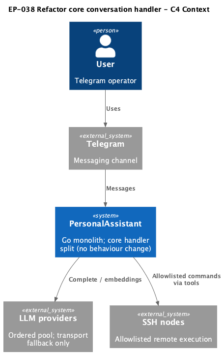
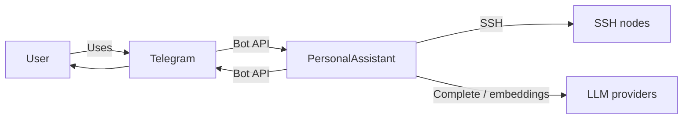

# EP-038 — Refactor core conversation handler (god handler) — Requirements (EARS / INCOSE)

This document defines product requirements for [ep-scope.md](ep-scope.md): decompose `internal/core/handler.go` into focused files while preserving runtime behaviour, tests, explicit JSON configuration, and contracts from EP-013, EP-017/018, EP-034, EP-036, and EP-037.

> **25 requirements** · 19 FR · 6 NFR · 7 theme groups

**Contents**

- [Introduction](#introduction)
- [Glossary](#glossary)
- [C4 C1 — System Context](#c4-c1--system-context)
- [Flow](#flow)
- [EARS patterns used](#ears-patterns-used)
- [Requirement index](#requirement-index)
- [Requirements](#requirements)
  - [Prerequisites and landing gate](#prerequisites-and-landing-gate)
  - [Slim orchestration entry (handler.go)](#slim-orchestration-entry-handlergo)
  - [LLM completion and tool loop (handler_llm.go)](#llm-completion-and-tool-loop-handler_llmgo)
  - [Tool offering and execution (handler_tools.go)](#tool-offering-and-execution-handler_toolsgo)
  - [Memory retrieval and turn indexing (handler_memory.go)](#memory-retrieval-and-turn-indexing-handler_memorygo)
  - [Tier main prompt boundary](#tier-main-prompt-boundary)
  - [Public wiring and configuration](#public-wiring-and-configuration)
  - [Verification and contracts](#verification-and-contracts)

---

## Introduction

EP-038 is a **structural refactor** (Refactoring increment 0.02, direction F in [strategy.md](../../strategy.md)). PersonalAssistant SHALL split the monolithic `conversationHandler` in `internal/core/handler.go` (~663 LOC) into file-scoped method groups without changing prompts, tool lists, routing, tier dispatch, or `config.json` semantics. The epic delivers maintainability of core orchestration; operators and users SHALL observe unchanged Telegram conversation behaviour.

**Scope in brief**

- Slim `handler.go` to orchestration (~≤200 LOC): struct, `HandleMessage` turn sequence, session-window helpers, shared turn constants.
- New `handler_llm.go`, `handler_tools.go`, `handler_memory.go` with method moves listed in [ep-scope.md](ep-scope.md).
- Retain `handler_tier_main_prompt.go`, `system_tail.go`, `dynamic_tool_selection.go`, `runtime_tools.go` responsibilities.
- Unchanged `MessageHandler` / `BuildMessageHandler` / `Run` / `NewIntegrationConversationHandler` surfaces; zero config schema change.
- All existing handler tests and `make check` green; EP-034/036/037 regression contracts preserved.

**Out of scope (no requirements herein):** new tiers, tool-selection algorithms, router policies, memory formats, `tools.vector_search_tools` DRY, `tools.tool_output_artifacts` typing, package moves outside `internal/core`, microservice-style plugin registries, renaming or exporting `conversationHandler`.

---

## Glossary

| Term | Definition |
|------|------------|
| **PersonalAssistant** | The Go product (`cmd/pa`, `internal/core`, `internal/config`). |
| **conversationHandler** | Unexported struct in `internal/core` implementing `MessageHandler`; orchestrates one user turn. |
| **God handler** | Pre-refactor state where tiering, RAG, tool pre-selection, dynamic tail, LLM completion, tool loop, logging, and turn indexing live primarily in `handler.go`. |
| **Structural refactor** | Move and group methods/types only; no intentional change to prompts, tool lists, routing, or config semantics. |
| **Tier main prompt path** | Pre-main-LLM flow in `handler_tier_main_prompt.go`: classify tier → base messages → full-tier tail → `tierMainLLMParams`. |
| **HandleMessage turn sequence** | `checkUserMessage` → `buildMainTurnMessagesPreTail` → `assembleTierMainLLMParams` → `completeAt` → `finishAfterFirstLLM` → optional usage footer. |
| **Transport-only LLM routing** | Provider switch on transport failure only; no tool-path provider escalation (EP-034). |
| **Two-tier intent** | Intent tiers `simple` and `full` after EP-036; no `full_lite` revival. |
| **tools.selection** | Required `tools` sub-object for vector pre-selection and dynamic tool cap (EP-037). |
| **Preserved contracts** | Behaviour from EP-013 (trust/marker system tail), EP-017/018/036 (two-tier + full-tier assembly), EP-034 (no tool-path escalation), EP-037 (`tools.selection` wiring). |
| **Dynamic tool cap** | Post-merge narrowing via `mergedAfterDynamicToolCap` / `pickToolsForMainRequest` in `dynamic_tool_selection.go`. |
| **Turn index id** | Vector turn document id format `turn:<date>:<12-byte-hex-digest-prefix>` from canonicalized user/reply pair. |
| **maxToolRounds** | Constant **10** limiting request–tool-result LLM rounds per user message. |

---

## C4 C1 — System Context

**Source:** [diagrams/c4-context.puml](diagrams/c4-context.puml) (C4-PlantUML). To regenerate PNG: `plantuml -tpng diagrams/c4-context.puml` from this directory.

### Flow

High-level flow is unchanged by this epic: the user messages via Telegram; PersonalAssistant classifies intent, assembles tier prompts, calls the LLM (with optional tool rounds), and may index the turn; replies return via Telegram.

---

## EARS patterns used

- **Ubiquitous:** THE \<system\> SHALL \<response\>
- **Event-driven:** WHEN \<trigger\>, THE \<system\> SHALL \<response\>
- **State-driven:** WHILE \<condition\>, THE \<system\> SHALL \<response\>
- **Unwanted event:** IF \<condition\>, THEN THE \<system\> SHALL \<response\>
- **Optional feature:** WHERE \<option\>, THE \<system\> SHALL \<response\>
- **Complex:** Clauses in order WHERE → WHILE → WHEN/IF → THE → SHALL

In the following, *System* = **PersonalAssistant** unless a requirement names **repository** explicitly.

---

## Requirement index

| Id | Type | Section | Summary |
|----|------|---------|---------|
| REQ-38.001 | FR | Prerequisites | Land after EP-035, EP-036, EP-037 merged |
| REQ-38.002 | FR | handler.go | Keep struct and HandleMessage turn sequence |
| REQ-38.003 | FR | handler.go | Reduce handler.go to orchestration (~≤200 LOC) |
| REQ-38.004 | FR | handler.go | Retain shared turn constants in handler.go |
| REQ-38.005 | FR | handler_llm.go | Extract LLM completion and tool-loop methods |
| REQ-38.006 | FR | handler_llm.go | Preserve router usage, round cap, message roles |
| REQ-38.007 | FR | handler_tools.go | Extract tool merge, selection, and execution |
| REQ-38.008 | FR | handler_tools.go | Leave runtime_tools and dynamic_tool_selection in place |
| REQ-38.009 | FR | handler_memory.go | Extract RAG chunk and turn-index methods |
| REQ-38.010 | FR | handler_memory.go | Leave vector_merge, memory_vectors, system_tail ownership |
| REQ-38.011 | FR | Tier boundary | Retain tier main prompt dispatch in handler_tier_main_prompt.go |
| REQ-38.012 | FR | Tier boundary | No new tier values or full_lite revival |
| REQ-38.013 | FR | Tier boundary | Use simple tier switch; no strategy framework |
| REQ-38.014 | FR | Public wiring | Preserve MessageHandler.HandleMessage signature |
| REQ-38.015 | FR | Public wiring | Preserve BuildMessageHandler and Run surfaces |
| REQ-38.016 | FR | Public wiring | Preserve NewIntegrationConversationHandler |
| REQ-38.017 | FR | Configuration | No config.json schema change |
| REQ-38.018 | FR | Verification | Behaviour parity on tier, tools, prompts, routing |
| REQ-38.019 | FR | Verification | Preserve EP-013/034/036/037 contracts |
| REQ-38.020 | FR | Verification | Existing handler tests pass without assertion changes |
| REQ-38.021 | NFR | Verification | make check passes |
| REQ-38.022 | NFR | Verification | validate ears EP-038 passes |
| REQ-38.023 | NFR | Out of scope | No product behaviour changes |
| REQ-38.024 | NFR | Out of scope | Do not rename or export conversationHandler |
| REQ-38.025 | NFR | Tier boundary | Optional naming/comments cleanup only in tier prompt file |

---

## Requirements

### Prerequisites and landing gate

### REQ-38.001 — Land after EP-035, EP-036, EP-037 merged

WHEN EP-038 implementation lands on the integration branch, THE repository SHALL have EP-035 (package consolidation), EP-036 (two-tier intent), and EP-037 (`tools.selection`) already merged so handler file splits do not conflict with concurrent core edits.

### Slim orchestration entry (handler.go)

### REQ-38.002 — Keep struct and HandleMessage turn sequence

THE PersonalAssistant SHALL keep `conversationHandler` struct definition, `HandleMessage`, and the **HandleMessage turn sequence** in `internal/core/handler.go`.

### REQ-38.003 — Reduce handler.go to orchestration (~≤200 LOC)

THE PersonalAssistant SHALL limit `internal/core/handler.go` to orchestration and shared wiring such that implementation detail primarily lives in `handler_llm.go`, `handler_tools.go`, `handler_memory.go`, and existing focused files, with `handler.go` at approximately **≤200** lines of code.

### REQ-38.004 — Retain shared turn constants in handler.go

THE PersonalAssistant SHALL keep turn-wide constants `maxToolRounds`, `logTruncateMaxLen`, and `maxToolResultPromptBytes` in `internal/core/handler.go` (or co-located with orchestration in that file).

### LLM completion and tool loop (handler_llm.go)

### REQ-38.005 — Extract LLM completion and tool-loop methods

THE PersonalAssistant SHALL implement in `internal/core/handler_llm.go` the methods moved from `handler.go`: `completeViaRouter`, `completeAt`, `onRouteEvent`, `finishAfterFirstLLM`, `runToolResultLoop`, `appendToolRound`, `truncateToolResultForPrompt`, `systemStaticHead`, `todayCalendarDateInPALocation`, `paLocationFromConfig`, `genRequestID`, `logLLMRequest`, `logMainLLMCompletion`, `logLLMResponse`, and `logMainLLMPromptAssembled`.

### REQ-38.006 — Preserve router usage, round cap, message roles

THE PersonalAssistant SHALL preserve after the move: unified `llmrouter` usage, **transport-only** provider switching via `onRouteEvent`, **maxToolRounds** enforcement in `runToolResultLoop`, LLM message roles in tool rounds, and DEBUG/INFO LLM observability semantics established before this epic.

### Tool offering and execution (handler_tools.go)

### REQ-38.007 — Extract tool merge, selection, and execution

THE PersonalAssistant SHALL implement in `internal/core/handler_tools.go` the methods moved from `handler.go`: `mergeSelectedToolIDs`, `selectSkillPackages`, `completionOptionsMergedCatalogNative`, `nativeToolDefs`, `executeOneToolCall`, `executeCatalogToolCall`, `parseToolArgumentsJSON`, and `remoteCommandFromRunOnNodeArgs`.

### REQ-38.008 — Leave runtime_tools and dynamic_tool_selection in place

THE PersonalAssistant SHALL keep `mergeToolIDs` in `runtime_tools.go`, dynamic pre-main cap logic in `dynamic_tool_selection.go`, and tail merge helpers (`mergedAfterDynamicToolCap`, `mergeTailMergedToolsAndOptions`) in `handler_tier_main_prompt.go` without relocating their responsibilities to other packages.

### Memory retrieval and turn indexing (handler_memory.go)

### REQ-38.009 — Extract RAG chunk and turn-index methods

THE PersonalAssistant SHALL implement in `internal/core/handler_memory.go` the methods moved from `handler.go`: `gatherRetrievedChunkTexts`, `gatherSplitTableChunks`, `labeledChunksFromResults`, `retrievalChunkWithLabel`, `handleLLMSuccess`, `indexTurn`, `eventAlignedTurnDate`, `canonicalizeTurnPair`, and `canonicalizeTurnText`.

### REQ-38.010 — Leave vector_merge, memory_vectors, system_tail ownership

THE PersonalAssistant SHALL leave ownership of `vector_merge.go`, `memory_vectors.go`, and `system_tail.go` unchanged by this epic.

### Tier main prompt boundary

### REQ-38.011 — Retain tier main prompt dispatch in handler_tier_main_prompt.go

THE PersonalAssistant SHALL retain tier dispatch in `handler_tier_main_prompt.go`: `buildMainTurnMessagesPreTail`, `assembleTierMainLLMParams`, `buildTierSimpleMainPrompt`, `buildTierFullMainPrompt`, and `mergeTailMergedToolsAndOptions`.

### REQ-38.012 — No new tier values or full_lite revival

THE PersonalAssistant SHALL NOT introduce new intent tier values or revive the `full_lite` tier as part of this epic.

### REQ-38.013 — Use simple tier switch; no strategy framework

THE PersonalAssistant SHALL dispatch intent tiers `simple` and `full` with a direct tier switch (or equivalent minimal dispatch), not a pluggable tier-strategy framework.

### REQ-38.025 — Optional naming/comments cleanup only in tier prompt file

WHERE light cleanup is applied in `handler_tier_main_prompt.go`, THE PersonalAssistant SHALL limit changes to naming, comments, or unexported helper visibility without altering tier selection, prompt message shapes, or tool-list assembly order.

### Public wiring and configuration

### REQ-38.014 — Preserve MessageHandler.HandleMessage signature

THE PersonalAssistant SHALL preserve the `MessageHandler` interface and `HandleMessage(ctx, userID, sessionKey, text) (string, error)` contract in `internal/core/adapter.go`.

### REQ-38.015 — Preserve BuildMessageHandler and Run surfaces

THE PersonalAssistant SHALL preserve `BuildMessageHandler` and `Run` public signatures and behaviour in `internal/core/run.go`, adjusting imports or field wiring only as required by file moves.

### REQ-38.016 — Preserve NewIntegrationConversationHandler

THE PersonalAssistant SHALL preserve `NewIntegrationConversationHandler` and `IntegrationIndexTurn` public surfaces in `internal/core/integration_export.go`.

### REQ-38.017 — No config.json schema change

THE PersonalAssistant SHALL NOT add or remove top-level `config.json` keys or change documented configuration semantics as part of this epic; `.config/config.json` and examples SHALL load unchanged.

### Verification and contracts

### REQ-38.018 — Behaviour parity on tier, tools, prompts, routing

THE PersonalAssistant SHALL exhibit behaviour parity for representative configurations: unchanged intent tier choice, merged catalog tool ids, dynamic tool cap application, main prompt message shapes, tool-loop round limits, transport-only LLM routing, and turn-index id format.

### REQ-38.019 — Preserve EP-013/034/036/037 contracts

THE PersonalAssistant SHALL satisfy preserved contracts: EP-013 marker/trust system tail assembly, EP-036 two-tier dispatch, EP-037 `tools.selection` fields on the handler, and EP-034 prohibition of tool-path LLM provider escalation.

### REQ-38.020 — Existing handler tests pass without assertion changes

THE repository SHALL pass all existing `internal/core/handler_*` and integration handler tests without assertion changes except import or package-location fixes tied to moved unexported symbols.

### REQ-38.021 — make check passes

THE repository SHALL pass `make check` after EP-038 implementation.

### REQ-38.022 — validate ears EP-038 passes

THE repository SHALL pass `./tools/validate/validate ears EP-038` for EARS format on this epic’s requirements artefact.

### REQ-38.023 — No product behaviour changes

THE EP-038 change set SHALL NOT intentionally change product behaviour: Telegram/session semantics, tool-selection algorithms, router policies, memory storage formats, or operator-visible configuration.

### REQ-38.024 — Do not rename or export conversationHandler

THE PersonalAssistant SHALL keep `conversationHandler` unexported and SHALL NOT export sub-handlers to other packages as part of this epic.
