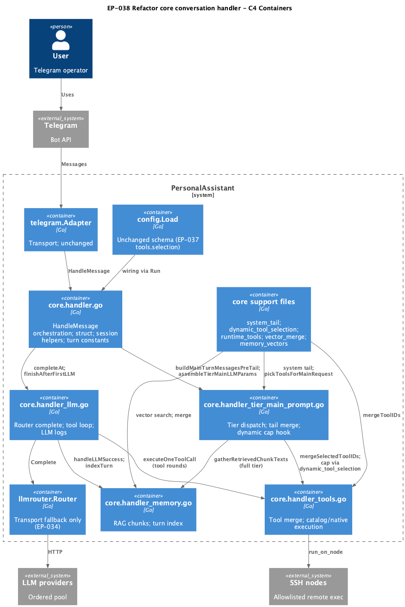
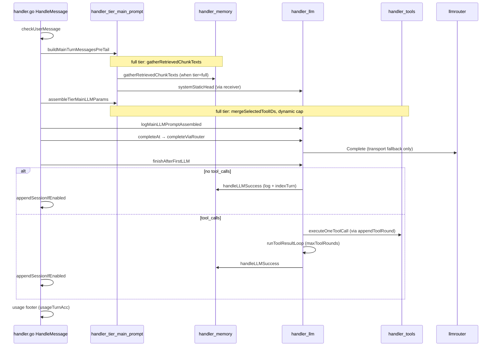

# EP-038 — Refactor core conversation handler (god handler) — System design

**Contents**

- [Overview](#overview)
- [Architecture](#architecture)
- [Method → file mapping](#method--file-mapping)
- [HandleMessage sequencing](#handlemessage-sequencing)
- [Components and interfaces](#components-and-interfaces)
- [Data models](#data-models)
- [Error handling](#error-handling)
- [Testing strategy](#testing-strategy)
- [Implementation sequencing](#implementation-sequencing)
- [Risks and trade-offs](#risks-and-trade-offs)
- [Requirement traceability](#requirement-traceability)

---

## Overview

EP-038 is a **structural refactor** (Refactoring **0.02**, direction F in [strategy.md](../../strategy.md)): split the monolithic `conversationHandler` in `internal/core/handler.go` (~663 LOC today) into file-scoped method groups while preserving runtime behaviour, explicit JSON configuration, and contracts from EP-013, EP-017/018, EP-034, EP-036, and EP-037 ([REQ-38.018](ep-requirements.md#verification-and-contracts)–[REQ-38.023](ep-requirements.md#verification-and-contracts)).

The design keeps **one** unexported `conversationHandler` type across `package core` files (Go same-package receivers). No new tiers, no tier-strategy framework, no `config.json` changes ([REQ-38.012](ep-requirements.md#tier-main-prompt-boundary)–[REQ-38.017](ep-requirements.md#public-wiring-and-configuration), [REQ-38.024](ep-requirements.md#verification-and-contracts)). Land only after EP-035/036/037 are merged ([REQ-38.001](ep-requirements.md#prerequisites-and-landing-gate)).

---

## Architecture

**Source:** [diagrams/c4-container.puml](diagrams/c4-container.puml). Regenerate PNG: `plantuml -tpng diagrams/c4-container.puml` from this directory.

### Module boundaries (target)

| File | Responsibility | REQ |
|------|----------------|-----|
| `handler.go` | Struct, `HandleMessage`, `checkUserMessage`, session-window helpers, log redaction helper, shared turn constants | [REQ-38.002](ep-requirements.md#slim-orchestration-entry-handlergo)–[REQ-38.004](ep-requirements.md#slim-orchestration-entry-handlergo) |
| `handler_tier_main_prompt.go` | Tier classify → base messages → full-tier tail → `tierMainLLMParams` | [REQ-38.011](ep-requirements.md#tier-main-prompt-boundary)–[REQ-38.013](ep-requirements.md#tier-main-prompt-boundary) |
| `handler_llm.go` (new) | Router completion, tool-result loop, static system head helpers, LLM observability | [REQ-38.005](ep-requirements.md#llm-completion-and-tool-loop-handler_llmgo)–[REQ-38.006](ep-requirements.md#llm-completion-and-tool-loop-handler_llmgo) |
| `handler_tools.go` (new) | Skill/tool merge, completion options, catalog/native execution | [REQ-38.007](ep-requirements.md#tool-offering-and-execution-handler_toolsgo)–[REQ-38.008](ep-requirements.md#tool-offering-and-execution-handler_toolsgo) |
| `handler_memory.go` (new) | Vector retrieval chunk assembly, post-success logging/index | [REQ-38.009](ep-requirements.md#memory-retrieval-and-turn-indexing-handler_memorygo)–[REQ-38.010](ep-requirements.md#memory-retrieval-and-turn-indexing-handler_memorygo) |
| `system_tail.go`, `dynamic_tool_selection.go`, `runtime_tools.go`, `vector_merge.go`, `memory_vectors.go` | Unchanged ownership | [REQ-38.008](ep-requirements.md#tool-offering-and-execution-handler_toolsgo), [REQ-38.010](ep-requirements.md#memory-retrieval-and-turn-indexing-handler_memorygo) |

**Dependency rule:** New files depend on existing `internal/core` helpers and external packages (`llmrouter`, `vector`, `toolcatalog`, etc.); they do **not** introduce cross-package exports. `handler.go` orchestrates calls into tier/llm/tools/memory files only ([REQ-38.024](ep-requirements.md#verification-and-contracts)).

### Public surfaces (unchanged)

| Surface | File | Contract |
|---------|------|----------|
| `MessageHandler` | `adapter.go` | `HandleMessage(ctx, userID, sessionKey, text) (string, error)` | [REQ-38.014](ep-requirements.md#public-wiring-and-configuration) |
| `BuildMessageHandler`, `Run` | `run.go` | Same signatures; field wiring only if needed | [REQ-38.015](ep-requirements.md#public-wiring-and-configuration) |
| `NewIntegrationConversationHandler`, `IntegrationIndexTurn` | `integration_export.go` | Unchanged test/integration entry | [REQ-38.016](ep-requirements.md#public-wiring-and-configuration) |

---

## Method → file mapping

Target layout after EP-038. **Current** column reflects `handler.go` on the epic branch (~663 LOC). Moves are cut/paste of methods and package-level helpers onto the same `conversationHandler` receiver unless noted.

| Method / symbol | Current | Target | REQ |
|-----------------|---------|--------|-----|
| `conversationHandler` struct | `handler.go` | `handler.go` | REQ-38.002 |
| `maxToolRounds`, `logTruncateMaxLen`, `maxToolResultPromptBytes` | `handler.go` | `handler.go` | REQ-38.004 |
| `defaultMaxDynamicSystemRunes` | `handler.go` | `handler.go` (test default; co-located with orchestration) | REQ-38.003 |
| `checkUserMessage` | `handler.go` | `handler.go` | REQ-38.002 |
| `redactLogString` | `handler.go` | `handler.go` | REQ-38.003 |
| `sessionMemoryEnabled`, `appendSessionIfEnabled` | `handler.go` | `handler.go` | REQ-38.002 |
| `HandleMessage` | `handler.go` | `handler.go` | REQ-38.002 |
| `buildMainTurnMessagesPreTail` | `handler_tier_main_prompt.go` | *(unchanged)* | REQ-38.011 |
| `assembleTierMainLLMParams` | `handler_tier_main_prompt.go` | *(unchanged)* | REQ-38.011, REQ-38.013 |
| `buildTierSimpleMainPrompt`, `buildTierFullMainPrompt` | `handler_tier_main_prompt.go` | *(unchanged)* | REQ-38.011 |
| `mergedAfterDynamicToolCap`, `mergeTailMergedToolsAndOptions` | `handler_tier_main_prompt.go` | *(unchanged)* | REQ-38.008, REQ-38.011 |
| `copyToolOriginMap`, `tierMainLLMParams` | `handler_tier_main_prompt.go` | *(unchanged)* | REQ-38.011 |
| `completeViaRouter` | `handler.go` | `handler_llm.go` | REQ-38.005 |
| `completeAt` | `handler.go` | `handler_llm.go` | REQ-38.005 |
| `onRouteEvent` | `handler.go` | `handler_llm.go` | REQ-38.005, REQ-38.006 |
| `finishAfterFirstLLM` | `handler.go` | `handler_llm.go` | REQ-38.005 |
| `runToolResultLoop` | `handler.go` | `handler_llm.go` | REQ-38.005, REQ-38.006 |
| `appendToolRound` | `handler.go` | `handler_llm.go` | REQ-38.005 |
| `truncateToolResultForPrompt` | `handler.go` | `handler_llm.go` | REQ-38.005 |
| `systemStaticHead` | `handler.go` | `handler_llm.go` | REQ-38.005 |
| `todayCalendarDateInPALocation` | `handler.go` | `handler_llm.go` | REQ-38.005 |
| `paLocationFromConfig` | `handler.go` | `handler_llm.go` | REQ-38.005 |
| `genRequestID` | `handler.go` | `handler_llm.go` | REQ-38.005 |
| `logLLMRequest`, `logMainLLMCompletion`, `logLLMResponse` | `handler.go` | `handler_llm.go` | REQ-38.005 |
| `logMainLLMPromptAssembled` | `handler.go` | `handler_llm.go` | REQ-38.005 |
| `mergeSelectedToolIDs` | `handler.go` | `handler_tools.go` | REQ-38.007 |
| `selectSkillPackages` | `handler.go` | `handler_tools.go` | REQ-38.007 |
| `completionOptionsMergedCatalogNative` | `handler.go` | `handler_tools.go` | REQ-38.007 |
| `nativeToolDefs` | `handler.go` | `handler_tools.go` | REQ-38.007 |
| `executeOneToolCall` | `handler.go` | `handler_tools.go` | REQ-38.007 |
| `executeCatalogToolCall` | `handler.go` | `handler_tools.go` | REQ-38.007 |
| `parseToolArgumentsJSON` | `handler.go` | `handler_tools.go` | REQ-38.007 |
| `remoteCommandFromRunOnNodeArgs` | `handler.go` | `handler_tools.go` | REQ-38.007 |
| `mergeToolIDs` | `runtime_tools.go` | *(unchanged)* | REQ-38.008 |
| `pickToolsForMainRequest` | `dynamic_tool_selection.go` | *(unchanged)* | REQ-38.008 |
| `gatherRetrievedChunkTexts` | `handler.go` | `handler_memory.go` | REQ-38.009 |
| `gatherSplitTableChunks` | `handler.go` | `handler_memory.go` | REQ-38.009 |
| `labeledChunksFromResults` | `handler.go` | `handler_memory.go` | REQ-38.009 |
| `retrievalChunkWithLabel` | `handler.go` | `handler_memory.go` | REQ-38.009 |
| `handleLLMSuccess` | `handler.go` | `handler_memory.go` | REQ-38.009 |
| `indexTurn` | `handler.go` | `handler_memory.go` | REQ-38.009 |
| `eventAlignedTurnDate` | `handler.go` | `handler_memory.go` | REQ-38.009 |
| `canonicalizeTurnPair`, `canonicalizeTurnText` | `handler.go` | `handler_memory.go` | REQ-38.009 |
| `MemoryVectors`, `vector_merge` helpers | `memory_vectors.go`, `vector_merge.go` | *(unchanged)* | REQ-38.010 |
| EP-013 system tail assembly | `system_tail.go` | *(unchanged)* | REQ-38.010, REQ-38.019 |

**LOC target:** `handler.go` ≤ ~200 LOC of orchestration and shared wiring after extractions ([REQ-38.003](ep-requirements.md#slim-orchestration-entry-handlergo)); implementation detail primarily in the three new files and existing focused modules.

---

## HandleMessage sequencing

Turn pipeline is **unchanged** by file moves ([REQ-38.002](ep-requirements.md#slim-orchestration-entry-handlergo), [AC-38.002](ep-acceptance-criteria.md#ac-38-002)).

**Call order (must preserve):** `checkUserMessage` → `buildMainTurnMessagesPreTail` → `assembleTierMainLLMParams` → `completeAt` → `finishAfterFirstLLM` → optional usage footer ([ep-requirements.md](ep-requirements.md#glossary) *HandleMessage turn sequence*).

**Tier dispatch:** `assembleTierMainLLMParams` uses a direct `switch` on `intent.TierSimple` / `intent.TierFull` — no strategy registry ([REQ-38.013](ep-requirements.md#tier-main-prompt-boundary)).

---

## Components and interfaces

| Component | Responsibility | Key contract | REQ |
|-----------|----------------|--------------|-----|
| `handler.go` orchestration | Single entry per user turn; early reject; usage footer | `HandleMessage`; `EnterUserTurn`/`LeaveUserTurn` | REQ-38.002–004, REQ-38.014 |
| `handler_tier_main_prompt.go` | Intent tier → messages + tools for main LLM | `tierMainLLMParams`; `mergeTailMergedToolsAndOptions` | REQ-38.011–013, REQ-38.025 |
| `handler_llm.go` | Router-backed completion and tool rounds | `completeAt`; `onRouteEvent` logs `ActionSwitchNextTransport` only; `maxToolRounds` in loop | REQ-38.005–006, REQ-38.019 |
| `handler_tools.go` | Offer and run tools | `executeOneToolCall` → catalog or native; plain errors to model | REQ-38.007–008 |
| `handler_memory.go` | RAG text for full tier; post-reply index | Turn id `turn:<date>:<12-byte-hex-prefix>` | REQ-38.009–010, REQ-38.018 |
| `llmrouter.Router` | Transport fallback | No tool-path provider escalation (EP-034) | REQ-38.006, REQ-38.019 |
| `config.Load` | Explicit JSON | No schema change; `tools.selection` from EP-037 | REQ-38.017, REQ-38.019 |

---

## Data models

### Handler struct (`conversationHandler`)

No field additions or renames ([REQ-38.024](ep-requirements.md#verification-and-contracts)). Existing fields include `router`, `memVec`, `toolsSelection` (EP-037), `classifier` (EP-036), session store (EP-014), and tool/skill indices. File moves do not alter struct layout.

### Turn constants (`handler.go`)

| Constant | Value | Usage |
|----------|-------|--------|
| `maxToolRounds` | 10 | `runToolResultLoop` upper bound |
| `logTruncateMaxLen` | 2000 | DEBUG log truncation |
| `maxToolResultPromptBytes` | 8192 | `truncateToolResultForPrompt` |

### Turn index id

Unchanged canonical format from EP-016: `turn:<YYYY-MM-DD in pa_timezone>:<first 12 hex chars of SHA-256(canonical pair)>` — logic stays in `handler_memory.go` ([REQ-38.009](ep-requirements.md#memory-retrieval-and-turn-indexing-handler_memorygo), [REQ-38.018](ep-requirements.md#verification-and-contracts)).

### Configuration

No top-level or `tools.selection` schema changes ([REQ-38.017](ep-requirements.md#public-wiring-and-configuration)). `.config/config.json` and examples load unchanged.

---

## Error handling

| Failure | Behaviour (unchanged) | REQ |
|---------|----------------------|-----|
| Empty / overlong user message | Early reply from `checkUserMessage`; no LLM call | REQ-38.002, REQ-38.023 |
| Tier assembly error | `HandleMessage` returns error | REQ-38.011 |
| LLM transport failure | `onRouteEvent` → next provider via router | REQ-38.006, REQ-38.019 |
| Tool execution failure | Error text in tool result; **same** provider index (EP-034) | REQ-38.006, REQ-38.019 |
| Tool round cap | Stop after `maxToolRounds` | REQ-38.004, REQ-38.006 |
| Index / vector errors | Logged; user reply still returned where today | REQ-38.009, REQ-38.023 |

---

## Testing strategy

Per [strategy.md](../../strategy.md) §2 and [ep-acceptance-criteria.md](ep-acceptance-criteria.md). EP-038 adds **no** new product tests unless a move breaks compile-only helpers; rely on existing suites for behaviour parity.

| Level | Focus | Primary tests / gate | AC / REQ |
|-------|-------|----------------------|----------|
| **Unit** | Constants, tier values, config load | `handler_ep036_test.go`; `internal/config/*_test.go` | AC-38.004, AC-38.012, AC-38.017 |
| **Integration — handler** | Turn sequence, tier prompts, tool loop, routing | `handler_test.go`, `handler_ep017_test.go`, `handler_ep018_test.go`, `handler_ep018_coverage_test.go` | AC-38.002, AC-38.011, AC-38.018 |
| **Integration — contracts** | EP-034/036/037 regressions | `handler_ep034_regression_test.go`, `handler_ep036_test.go`, `tools_selection_parity_test.go` | AC-38.006, AC-38.019 |
| **Integration — export** | Integration handler wiring | `tests/integration/runtime_skills_handler_test.go` | AC-38.016 |
| **Manual — structure** | File ownership grep, `handler.go` LOC | Reviewer checklist | AC-38.003, AC-38.005, AC-38.007, AC-38.009, AC-38.013, AC-38.024 |
| **Repo gates** | Full quality | `make check` ([REQ-38.021](ep-requirements.md#verification-and-contracts)); `./tools/validate/validate ears EP-038` ([REQ-38.022](ep-requirements.md#verification-and-contracts)) | AC-38.021, AC-38.022 |
| **Manual — diff** | No intentional behaviour change | Branch diff review | AC-38.023 |

**Assertion policy:** Existing tests pass without assertion changes except import or unexported-symbol location fixes ([REQ-38.020](ep-requirements.md#verification-and-contracts)).

**Suggested implementation verification order:** (1) extract `handler_memory.go` and compile; (2) `handler_tools.go`; (3) `handler_llm.go`; (4) slim `handler.go`; (5) `make check`; (6) manual grep/LOC for MANUAL ACs.

---

## Implementation sequencing

Recommended order minimizes merge conflict and keeps `make check` green after each step:

1. **Prerequisite gate** — Confirm EP-035, EP-036, EP-037 merged on integration branch ([REQ-38.001](ep-requirements.md#prerequisites-and-landing-gate)).
2. **Create `handler_memory.go`** — Move retrieval, `handleLLMSuccess`, `indexTurn`, canonicalization helpers; no logic edits ([REQ-38.009](ep-requirements.md#memory-retrieval-and-turn-indexing-handler_memorygo)).
3. **Create `handler_tools.go`** — Move tool merge/execution helpers ([REQ-38.007](ep-requirements.md#tool-offering-and-execution-handler_toolsgo)).
4. **Create `handler_llm.go`** — Move router completion, tool loop, logging, static head/date helpers ([REQ-38.005](ep-requirements.md#llm-completion-and-tool-loop-handler_llmgo)).
5. **Slim `handler.go`** — Leave struct, constants, `HandleMessage`, `checkUserMessage`, session helpers, `redactLogString`; verify ≤ ~200 LOC ([REQ-38.003](ep-requirements.md#slim-orchestration-entry-handlergo)).
6. **Optional** — Naming/comment-only cleanup in `handler_tier_main_prompt.go` ([REQ-38.025](ep-requirements.md#tier-main-prompt-boundary)).
7. **Verify** — `go test ./internal/core/...`; `make check`; manual structural ACs; `validate ears EP-038`.

Do **not** relocate `runtime_tools.go`, `dynamic_tool_selection.go`, `handler_tier_main_prompt.go` tail logic, or `system_tail.go` / `vector_merge.go` / `memory_vectors.go` ([REQ-38.008](ep-requirements.md#tool-offering-and-execution-handler_toolsgo), [REQ-38.010](ep-requirements.md#memory-retrieval-and-turn-indexing-handler_memorygo)).

---

## Risks and trade-offs

| Risk | Mitigation |
|------|------------|
| Concurrent edits on `handler.go` while prerequisites land | Land only after EP-035/036/037 merged ([REQ-38.001](ep-requirements.md#prerequisites-and-landing-gate)) |
| Accidental behaviour change during cut/paste | No logic edits in moves; full `make check` + EP regression suites ([REQ-38.018](ep-requirements.md#verification-and-contracts)–[REQ-38.021](ep-requirements.md#verification-and-contracts)) |
| Cyclic readability across files | Single package; method→file table + sequence diagram; avoid new interfaces |
| Temptation to add tier-strategy framework | Explicitly out of scope; two-tier `switch` only ([REQ-38.013](ep-requirements.md#tier-main-prompt-boundary)) |

**HOTL decision:** File split over extracting tier-strategy interfaces — smallest change matching EP-036 two-tier model ([ep-scope.md](ep-scope.md)).

---

## Requirement traceability

| REQ | Design section |
|-----|----------------|
| REQ-38.001 | [Implementation sequencing](#implementation-sequencing); [Risks](#risks-and-trade-offs) |
| REQ-38.002 | [Method → file mapping](#method--file-mapping); [HandleMessage sequencing](#handlemessage-sequencing) |
| REQ-38.003 | [Overview](#overview); [Method → file mapping](#method--file-mapping); [Architecture](#architecture) |
| REQ-38.004 | [Data models](#data-models); [Method → file mapping](#method--file-mapping) |
| REQ-38.005 | [Method → file mapping](#method--file-mapping); [Components](#components-and-interfaces) |
| REQ-38.006 | [HandleMessage sequencing](#handlemessage-sequencing); [Error handling](#error-handling); [Testing strategy](#testing-strategy) |
| REQ-38.007 | [Method → file mapping](#method--file-mapping); [Components](#components-and-interfaces) |
| REQ-38.008 | [Architecture](#architecture); [Method → file mapping](#method--file-mapping) |
| REQ-38.009 | [Method → file mapping](#method--file-mapping); [Data models](#data-models) |
| REQ-38.010 | [Architecture](#architecture); [Method → file mapping](#method--file-mapping) |
| REQ-38.011 | [HandleMessage sequencing](#handlemessage-sequencing); [Components](#components-and-interfaces) |
| REQ-38.012 | [Overview](#overview); [HandleMessage sequencing](#handlemessage-sequencing) |
| REQ-38.013 | [HandleMessage sequencing](#handlemessage-sequencing); [Architecture](#architecture) |
| REQ-38.014 | [Architecture](#architecture) — Public surfaces |
| REQ-38.015 | [Architecture](#architecture) — Public surfaces |
| REQ-38.016 | [Architecture](#architecture) — Public surfaces |
| REQ-38.017 | [Data models](#data-models) |
| REQ-38.018 | [Testing strategy](#testing-strategy); [Data models](#data-models) |
| REQ-38.019 | [Components](#components-and-interfaces); [Error handling](#error-handling); [Testing strategy](#testing-strategy) |
| REQ-38.020 | [Testing strategy](#testing-strategy) |
| REQ-38.021 | [Testing strategy](#testing-strategy) |
| REQ-38.022 | [Testing strategy](#testing-strategy) |
| REQ-38.023 | [Overview](#overview); [Error handling](#error-handling); [Risks](#risks-and-trade-offs) |
| REQ-38.024 | [Overview](#overview); [Architecture](#architecture); [Data models](#data-models) |
| REQ-38.025 | [Implementation sequencing](#implementation-sequencing); [Components](#components-and-interfaces) |
