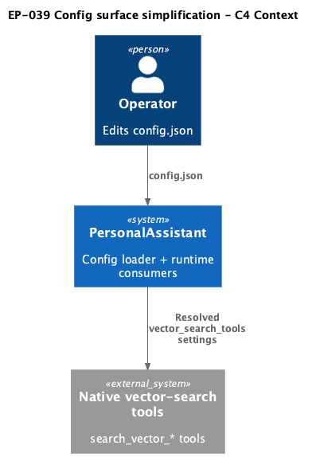
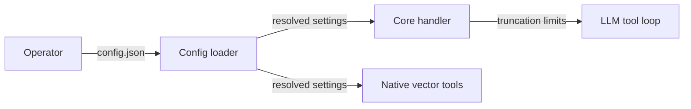

# EP-039 — Config surface simplification — Requirements (EARS / INCOSE)

This document defines product requirements for [ep-scope.md](ep-scope.md): DRY config schemas for vector-search tools and SQLite reliability, plus typed and wired `tools.tool_output_artifacts`.

> **25 requirements** · 20 FR · 5 NFR · 5 theme groups

**Contents**

- [Introduction](#introduction)
- [Glossary](#glossary)
- [C4 C1 — System Context](#c4-c1--system-context)
- [Flow](#flow)
- [Requirement index](#requirement-index)
- [Requirements](#requirements)

---

## Introduction

EP-039 is a **config-shape and wiring refactor** (Refactoring increment 0.02, continuation after EP-037/038). PersonalAssistant SHALL reduce JSON duplication in operator and repository configs while preserving fail-fast explicit configuration. Three areas: **`tools.vector_search_tools`** (defaults + overrides), **`tools.tool_output_artifacts`** (typed validation and runtime wiring), and **SQLite store reliability** (shared defaults + per-store overrides).

**Out of scope:** tool-selection algorithms, intent tiers, handler decomposition, new artifact features beyond wiring existing config fields.

---

## Glossary

| Term | Definition |
|------|------------|
| **PersonalAssistant** | The Go product (`cmd/pa`, `internal/config`, `internal/core`, `internal/tools`). |
| **Config loader** | `config.Load` and validation in `internal/config`. |
| **Resolved tool config** | Effective `VectorSearchToolConfig` after merging `defaults` with a per-tool override. |
| **Equivalent configuration** | Pre- and post-epic settings that yield identical resolved runtime values (documented migration). |
| **Phantom config** | JSON accepted at load but not mapped to Go or runtime (status quo for `tool_output_artifacts`). |

---

## C4 C1 — System Context

**Source:** [diagrams/c4-context.puml](diagrams/c4-context.puml). Regenerate: `plantuml -tpng diagrams/c4-context.puml` from this directory.

### Flow

---

## Requirement index

| Id | Type | Section | Summary |
|----|------|---------|---------|
| REQ-39.001 | FR | vector_search_tools | Require `defaults` + three per-tool override objects |
| REQ-39.002 | FR | vector_search_tools | Reject legacy flat repeated tool shape |
| REQ-39.003 | FR | vector_search_tools | Validate defaults numeric bounds |
| REQ-39.004 | FR | vector_search_tools | Validate per-tool overrides when present |
| REQ-39.005 | FR | vector_search_tools | Resolve effective settings via merge |
| REQ-39.006 | FR | vector_search_tools | Preserve native tool runtime for equivalent configs |
| REQ-39.007 | FR | tool_output_artifacts | Add typed struct under `ToolsConfig` |
| REQ-39.008 | FR | tool_output_artifacts | Validate all documented artifact fields at load |
| REQ-39.009 | FR | tool_output_artifacts | Wire `tool_result_prompt_bytes` into core truncation |
| REQ-39.010 | FR | tool_output_artifacts | Wire artifact directory path when tools persist output |
| REQ-39.011 | FR | tool_output_artifacts | Reject unknown keys under `tool_output_artifacts` |
| REQ-39.012 | FR | sqlite reliability | Require root `sqlite_store_defaults` |
| REQ-39.013 | FR | sqlite reliability | Reduce per-store blocks to overrides |
| REQ-39.014 | FR | sqlite reliability | Preserve effective PRAGMA policy |
| REQ-39.015 | FR | sqlite reliability | Reject legacy full duplicate reliability blocks |
| REQ-39.016 | FR | migration | Update examples, testdata, integration configs |
| REQ-39.017 | FR | migration | Document operator migration in configuration.md |
| REQ-39.018 | FR | legacy rejection | Explicit errors name unsupported key paths |
| REQ-39.019 | FR | verification | Parity tests for equivalent configs |
| REQ-39.020 | FR | verification | Negative fixtures for legacy shapes |
| REQ-39.021 | NFR | verification | `make check` passes |
| REQ-39.022 | NFR | explicit JSON | Unknown top-level and nested keys still fail load |
| REQ-39.023 | NFR | scope guard | No handler file moves beyond config wiring |
| REQ-39.024 | NFR | scope guard | No changes to `tools.selection` schema |
| REQ-39.025 | NFR | operator | Operator `.config/config.json` loads after migration |

---

## Requirements

### vector_search_tools

#### REQ-39.001 — Require defaults and per-tool overrides

THE **Config loader** SHALL require `tools.vector_search_tools` to contain a **`defaults`** object with explicit fields `enabled`, `default_top_k`, `max_top_k`, `max_output_bytes`, and `snippet_runes`, and three objects **`search_vector_memory`**, **`search_vector_tool`**, and **`search_vector_skill`** that MAY specify only `enabled` and optional field overrides.

#### REQ-39.002 — Reject legacy vector_search_tools shape

IF a config file places the five tuning fields directly on each tool object without a **`defaults`** sibling, THEN THE **Config loader** SHALL fail load with an error naming `tools.vector_search_tools` and the legacy shape as unsupported.

#### REQ-39.003 — Validate defaults bounds

THE **Config loader** SHALL validate `tools.vector_search_tools.defaults` using the same numeric bounds as today’s per-tool validation (`default_top_k >= 1`, `max_top_k >= default_top_k`, positive output and snippet limits).

#### REQ-39.004 — Validate per-tool overrides

WHERE a per-tool override specifies a tuning field, THE **Config loader** SHALL validate that field with the same rules as defaults; omitted fields SHALL inherit from defaults at resolve time.

#### REQ-39.005 — Resolve merged settings

THE **Config loader** SHALL expose resolved per-tool settings through `VectorSearchToolSettings(toolID)` by merging `defaults` with the matching override object.

#### REQ-39.006 — Runtime parity for vector tools

WHEN an operator migrates field-for-field from the pre-EP-039 shape to the defaults+overrides shape, THE **PersonalAssistant** SHALL produce identical resolved settings and native tool behaviour for `search_vector_memory`, `search_vector_tool`, and `search_vector_skill`.

### tool_output_artifacts

#### REQ-39.007 — Typed ToolOutputArtifactsConfig

THE **Config loader** SHALL map `tools.tool_output_artifacts` to a typed **`ToolOutputArtifactsConfig`** on `ToolsConfig` with fields matching operator documentation (including `enabled`, `directory`, `tool_result_prompt_bytes`, size and retention limits).

#### REQ-39.008 — Validate artifact fields

THE **Config loader** SHALL validate all required artifact fields at load (positive byte limits where applicable, non-empty `directory` when `enabled` is true, valid `omission_marker`).

#### REQ-39.009 — Wire tool_result_prompt_bytes

THE **PersonalAssistant** SHALL use `tools.tool_output_artifacts.tool_result_prompt_bytes` as the maximum tool-result bytes included in the main LLM prompt, replacing the hardcoded core constant when config is loaded.

#### REQ-39.010 — Wire artifact directory

WHERE `tools.tool_output_artifacts.enabled` is true, THE **PersonalAssistant** SHALL resolve artifact storage relative to configured paths using `tools.tool_output_artifacts.directory`.

#### REQ-39.011 — Reject unknown artifact keys

IF an unknown key appears under `tools.tool_output_artifacts`, THEN THE **Config loader** SHALL fail load with an explicit nested-key error.

### sqlite reliability

#### REQ-39.012 — Require sqlite_store_defaults

THE **Config loader** SHALL require a root-level **`sqlite_store_defaults`** object with explicit `journal_mode`, `busy_timeout`, and `synchronous` fields.

#### REQ-39-013 — Per-store override blocks

THE **Config loader** SHALL require `vector_store_reliability` and `jobs_store_reliability` as root keys whose objects contain at minimum **`foreign_keys`** and MAY override any field from `sqlite_store_defaults`.

#### REQ-39.014 — Effective PRAGMA parity

WHEN per-store blocks specify only `foreign_keys` and inherit other fields from `sqlite_store_defaults`, THE **PersonalAssistant** SHALL produce the same effective SQLite PRAGMA policy as the pre-EP-039 full duplicate blocks for equivalent operator settings.

#### REQ-39.015 — Reject redundant legacy reliability-only shape

IF a config uses the pre-EP-039 pattern where both store blocks repeat all PRAGMA fields without `sqlite_store_defaults`, THEN THE **Config loader** SHALL fail load with an error directing the operator to migrate to defaults + overrides.

### migration, legacy rejection, verification

#### REQ-39.016 — Update repository configs

THE **repository** SHALL update `config.examples/`, `internal/config/testdata/`, and integration JSON configs to the new schemas before merge.

#### REQ-39.017 — Document migration

THE **repository** SHALL document field-for-field migration from pre-EP-039 shapes in `docs/configuration.md`.

#### REQ-39.018 — Explicit legacy errors

THE **Config loader** SHALL include the unsupported JSON path in every legacy-shape rejection error introduced by this epic.

#### REQ-39.019 — Equivalent-config parity tests

THE **repository** SHALL include automated tests proving equivalent pre- and post-epic configs yield identical resolved vector-search settings, truncation limits, and SQLite policies.

#### REQ-39.020 — Negative legacy fixtures

THE **repository** SHALL include negative testdata fixtures for each legacy shape rejected by REQ-39.002 and REQ-39.015 with assertions on the error message text.

#### REQ-39.021 — make check passes

THE **repository** SHALL pass `make check` on the epic branch before merge.

#### REQ-39.022 — Preserve explicit JSON rules

THE **Config loader** SHALL continue to reject unknown top-level keys and enforce single-occurrence documented keys per consumer repo rules.

#### REQ-39.023 — Limit core changes

THE **PersonalAssistant** SHALL limit `internal/core` changes to reading new config fields for truncation and artifact paths; no handler file reorganization.

#### REQ-39.024 — No tools.selection changes

THE **Config loader** SHALL leave the `tools.selection` schema unchanged.

#### REQ-39.025 — Operator config loads

THE operator `.config/config.json` (migrated on the epic branch per operator procedure) SHALL load successfully at startup.

---

**Source:** [ep-scope.md](ep-scope.md) · [strategy.md](../../strategy.md)
