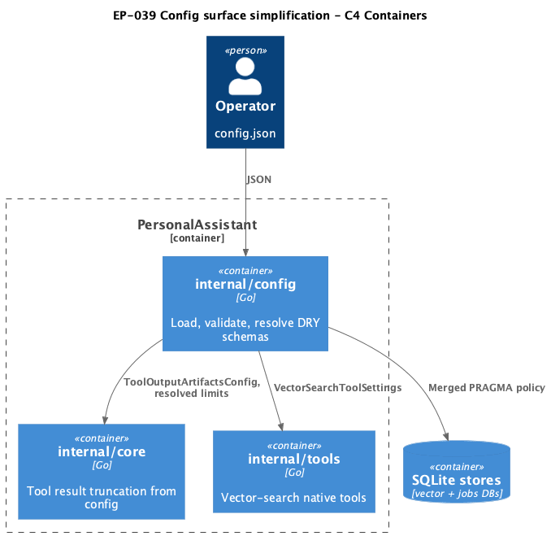
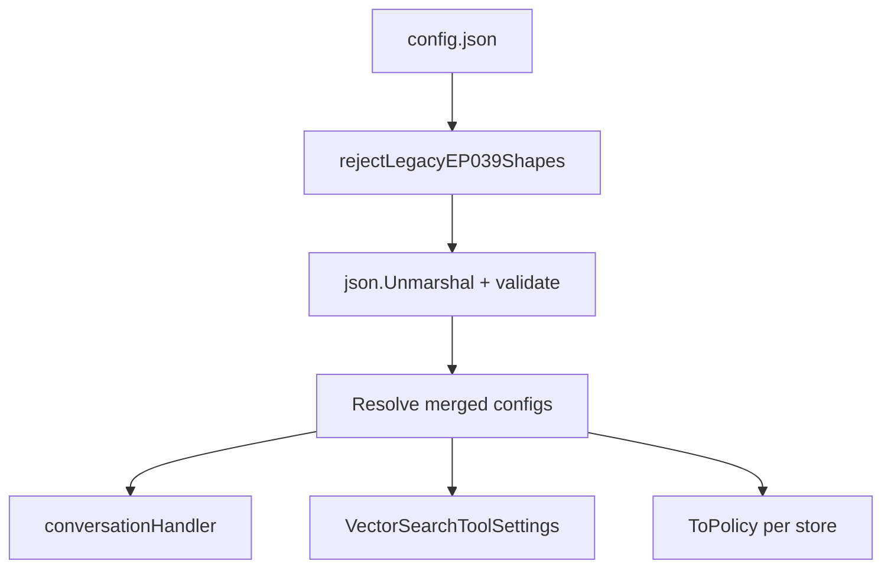

# EP-039 — Config surface simplification — System design

**Contents**

- [Overview](#overview)
- [Architecture](#architecture)
- [Components and interfaces](#components-and-interfaces)
- [Data models](#data-models)
- [Error handling](#error-handling)
- [Testing strategy](#testing-strategy)
- [Implementation sequencing](#implementation-sequencing)
- [Risks and trade-offs](#risks-and-trade-offs)
- [Requirement traceability](#requirement-traceability)

---

## Overview

EP-039 is a **config-shape and wiring refactor** (Refactoring **0.02**, continuation after EP-037/038). Three independent but shippable workstreams in one epic:

1. **`tools.vector_search_tools`** — `defaults` + per-tool overrides (reject legacy flat triple repeat).
2. **`tools.tool_output_artifacts`** — typed struct, nested-key whitelist validation, wire `tool_result_prompt_bytes` into core (replace hardcoded `maxToolResultPromptBytes = 8 << 10`).
3. **SQLite reliability DRY** — new root `sqlite_store_defaults`; `vector_store_reliability` and `jobs_store_reliability` become override blocks (minimum `foreign_keys`; optional field overrides).

Explicit JSON rules preserved: new root key added to `configRootJSONKeys`; legacy shapes rejected via raw-JSON scan before unmarshal ([REQ-39.002](ep-requirements.md#req-39-002--reject-legacy-vector_search_tools-shape), [REQ-39.015](ep-requirements.md#req-39-015--reject-redundant-legacy-reliability-only-shape)). `tools.selection` unchanged ([REQ-39.024](ep-requirements.md#req-39-024--no-toolsselection-changes)).

**Operator migration (summary):**

| Area | Before | After |
|------|--------|-------|
| Vector search tools | Three full 5-field objects | `defaults` + `{tool: {enabled, …overrides}}` |
| Tool artifacts | Whitelist-only, dropped on unmarshal | Typed; validated; `tool_result_prompt_bytes` wired |
| SQLite reliability | Two full duplicate PRAGMA blocks | `sqlite_store_defaults` + per-store `{foreign_keys, …?}` |

---

## Architecture

<p align="center"></p>

**Source:** [diagrams/c4-container.puml](diagrams/c4-container.puml). Regenerate: `plantuml -tpng diagrams/c4-container.puml` from this directory.

### Config → runtime flow



### Module boundaries

| Module | EP-039 change |
|--------|---------------|
| `internal/config` | New/updated structs, validators, legacy rejection, merge resolvers |
| `internal/config/root_keys.go` | Add `sqlite_store_defaults` |
| `internal/core` | Read `tool_result_prompt_bytes` from config in handler construction; remove package constant for prompt limit ([REQ-39.009](ep-requirements.md#req-39-009--wire-tool_result_prompt_bytes), [REQ-39.023](ep-requirements.md#req-39-023--limit-core-changes)) |
| `internal/tools` | No algorithm change; continues calling `VectorSearchToolSettings` |
| `docs/configuration.md` | Migration tables for all three areas |
| Repo JSON fixtures | Bulk migrate testdata + examples |

---

## Components and interfaces

| Component | Responsibility | Key contract |
|-----------|----------------|--------------|
| `rejectLegacyVectorSearchToolsShape` | Pre-unmarshal scan of `tools.vector_search_tools` | Fail if any tool object has `default_top_k` without sibling `defaults` key ([REQ-39.002](ep-requirements.md#req-39-002--reject-legacy-vector_search_tools-shape)) |
| `rejectLegacySQLiteReliabilityShape` | Pre-unmarshal scan | Fail if `sqlite_store_defaults` absent AND both store blocks contain `journal_mode` ([REQ-39.015](ep-requirements.md#req-39-015--reject-redundant-legacy-reliability-only-shape)) |
| `VectorSearchToolsConfigV2` | Defaults + overrides | `Defaults VectorSearchToolConfig`; overrides as `VectorSearchToolOverride` (optional fields via pointers or `json` omitempty + merge) |
| `mergeVectorSearchTool(defaults, override)` | Resolve per tool | Omitted override fields inherit defaults ([REQ-39.005](ep-requirements.md#req-39-005--resolve-merged-settings)) |
| `VectorSearchToolSettings(toolID)` | Public resolver | Same signature; internally merge ([REQ-39.006](ep-requirements.md#req-39-006--runtime-parity-for-vector-tools)) |
| `ToolOutputArtifactsConfig` | Typed `tools.tool_output_artifacts` | All 11 operator fields ([REQ-39.007](ep-requirements.md#req-39-007--typed-tooloutputartifactsconfig)) |
| `validateToolOutputArtifacts` | Load-time validation | Bounds + `enabled ⇒ directory non-empty` ([REQ-39.008](ep-requirements.md#req-39-008--validate-artifact-fields)) |
| `validateToolOutputArtifactsObjectKeys` | Nested whitelist | Exact field set; unknown keys fail ([REQ-39.011](ep-requirements.md#req-39-011--reject-unknown-artifact-keys)) |
| `SQLiteStoreDefaultsConfig` | Shared PRAGMA defaults | `journal_mode`, `busy_timeout`, `synchronous` ([REQ-39.012](ep-requirements.md#req-39-012--require-sqlite_store_defaults)) |
| `SQLiteStoreReliabilityOverride` | Per-store block | Required `foreign_keys`; optional overrides for other three fields ([REQ-39.013](ep-requirements.md#req-39-013--per-store-override-blocks)) |
| `mergeSQLiteStoreReliability(defaults, override)` → `SQLiteStoreReliabilityConfig` | Effective policy | Used by `ValidateVectorStoreReliability` / `ValidateJobsStoreReliability` ([REQ-39.014](ep-requirements.md#req-39-014--effective-pragma-parity)) |
| `newRunConversationHandler` | Wire truncation limit | Set handler field from `cfg.Tools.ToolOutputArtifacts.ToolResultPromptBytes` ([REQ-39.009](ep-requirements.md#req-39-009--wire-tool_result_prompt_bytes)) |

**Decision — artifact fields beyond truncation:** Validate all fields at load ([REQ-39.008](ep-requirements.md#req-39-008--validate-artifact-fields)); wire `tool_result_prompt_bytes` in this epic. Store `ToolOutputArtifactsConfig` on handler for future tool paths; `directory` exposed via helper `ArtifactDirectory(cfg)` for tools that persist output ([REQ-39.010](ep-requirements.md#req-39-010--wire-artifact-directory)) — if no call site exists yet, add resolver only (no new feature behaviour).

---

## Data models

### `tools.vector_search_tools` (new shape)

```json
"vector_search_tools": {
  "defaults": {
    "enabled": true,
    "default_top_k": 5,
    "max_top_k": 10,
    "max_output_bytes": 4096,
    "snippet_runes": 200
  },
  "search_vector_memory": { "enabled": true },
  "search_vector_tool": { "enabled": true },
  "search_vector_skill": { "enabled": true }
}
```

Per-tool override may include any subset of the five tuning fields; `enabled` always allowed.

### `ToolOutputArtifactsConfig` — `internal/config/config.go`

Fields match operator `.config/config.json` lines 38–50: `enabled`, `directory`, `tool_result_prompt_bytes`, `max_artifact_bytes`, `omission_marker`, `preview_min_tail_bytes`, `max_stderr_bytes_in_prompt`, `max_reads_per_turn`, `max_read_bytes_per_turn`, `max_bytes_per_read`, `retention_max_total_bytes`, `retention_max_files`.

Nested allowed keys = exactly this set (validate via `validateToolOutputArtifactsObjectKeys` in `load.go`).

### Root SQLite DRY

```json
"sqlite_store_defaults": {
  "journal_mode": "WAL",
  "busy_timeout": "5s",
  "synchronous": "NORMAL"
},
"vector_store_reliability": { "foreign_keys": false },
"jobs_store_reliability": { "foreign_keys": true }
```

`Config` struct adds `SQLiteStoreDefaults *SQLiteStoreDefaultsConfig`. Store blocks become `SQLiteStoreReliabilityOverride` with merge at validate time.

---

## Error handling

- Legacy shape errors include JSON path prefix, e.g. `config: tools.vector_search_tools: legacy per-tool shape without defaults is not supported (EP-039)` ([REQ-39.018](ep-requirements.md#req-39-018--explicit-legacy-errors)).
- Validation errors reuse existing `validateVectorSearchToolConfig` message patterns with merged field paths.
- Missing `sqlite_store_defaults` when using new schema: `config: missing required top-level key "sqlite_store_defaults"`.

---

## Testing strategy

| AC area | Tests |
|---------|-------|
| Vector DRY | `vector_search_tools_test.go`: load valid, merge resolve, legacy reject, parity table |
| Artifacts | `tool_output_artifacts_test.go`: valid load, invalid bounds, unknown nested key, handler truncation uses config bytes |
| SQLite DRY | `sqlite_reliability_test.go`: merge parity, legacy reject, effective `ToPolicy()` |
| Migration | Batch load of migrated testdata ([REQ-39.016](ep-requirements.md#req-39-016--update-repository-configs)) |
| Negative fixtures | `testdata/vector_search_tools_legacy_rejected.json`, `sqlite_reliability_legacy_rejected.json` ([REQ-39.020](ep-requirements.md#req-39-020--negative-legacy-fixtures)) |

Parity table: at least 3 rows per workstream mapping pre/post configs ([REQ-39.019](ep-requirements.md#req-39-019--equivalent-config-parity-tests)).

---

## Implementation sequencing

1. **Phase 1 — Legacy rejection stubs + root key** — add `sqlite_store_defaults` to `configRootJSONKeys`; raw-JSON reject helpers (fail before partial migrate).
2. **Phase 2 — SQLite DRY** — structs, merge, validators, migrate all fixtures' reliability blocks.
3. **Phase 3 — vector_search_tools DRY** — new struct shape, merge resolver, update `VectorSearchToolSettings`, migrate `tools.vector_search_tools` in fixtures.
4. **Phase 4 — tool_output_artifacts** — struct, nested validation, wire core truncation + artifact dir helper.
5. **Phase 5 — Docs + operator migration section** — `docs/configuration.md` ([REQ-39.017](ep-requirements.md#req-39-017--document-migration)).
6. **Phase 6 — Verification** — `make check`, register EP-039 in validate tool if needed.

**Files (primary):**

| File | Change |
|------|--------|
| `internal/config/config.go` | New structs |
| `internal/config/load.go` | Rejection, validation, merge |
| `internal/config/root_keys.go` | `sqlite_store_defaults` |
| `internal/config/vector_search_tools.go` | Merge resolver |
| `internal/core/handler.go`, `handler_llm.go`, `run.go` | Truncation from config |
| `internal/config/testdata/*`, `config.examples/*` | Bulk migrate |
| `docs/configuration.md` | Migration |

---

## Risks and trade-offs

| Risk | Mitigation |
|------|------------|
| Large testdata diff (60+ files) | Scripted or phased migrate; run `make check` after each phase |
| Operator `.config/config.json` gitignored | Document manual migration; optional local migrate in implementation |
| Artifact fields validated but not all wired | Accept for KISS; truncation + directory resolver only in EP-039 |
| Breaking change for external configs | Explicit legacy rejection with migration doc ([REQ-39.017](ep-requirements.md#req-39-017--document-migration)) |

**Trade-off accepted:** SQLite and vector_search_tools are **breaking schema changes** (no dual-read of legacy shape) to honour fail-fast explicit JSON over silent compatibility.

---

## Requirement traceability

| REQ | Design section |
|-----|----------------|
| REQ-39.001–006 | Data models vector_search_tools; Components merge resolver |
| REQ-39.007–011 | ToolOutputArtifactsConfig; Components validation + core wire |
| REQ-39.012–015 | SQLite DRY models; mergeSQLiteStoreReliability |
| REQ-39.016–020 | Implementation sequencing; Testing strategy |
| REQ-39.021–025 | Risks; Verification; Overview explicit JSON |

---

**Source:** [ep-requirements.md](ep-requirements.md) · [ep-scope.md](ep-scope.md)
