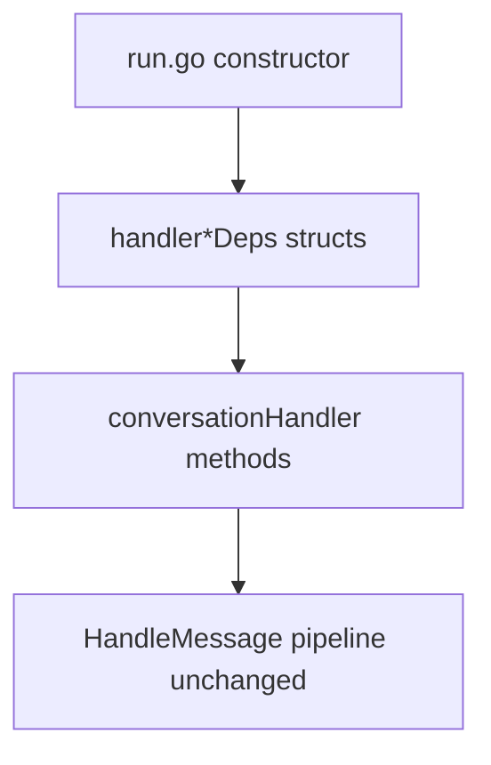

# EP-040 — Handler dependency grouping — Requirements (EARS / INCOSE)

> **10 requirements** · 7 FR · 3 NFR

## Introduction

EP-040 groups `conversationHandler` dependencies into sub-structs. No runtime behaviour change ([ep-scope.md](ep-scope.md)).

## C4 C1 — System Context

**Source:** [diagrams/c4-context.puml](diagrams/c4-context.puml)

### Flow

## Requirement index

| Id | Type | Summary |
|----|------|---------|
| REQ-40.001 | FR | Define handlerToolDeps with tool-related fields |
| REQ-40.002 | FR | Define handlerMemoryDeps |
| REQ-40.003 | FR | Define handlerSessionDeps |
| REQ-40.004 | FR | Define handlerLLMDeps (router, logging, limits, classifier) |
| REQ-40.005 | FR | Replace flat h.field with grouped access in all handler files |
| REQ-40.006 | FR | Refactor newRunConversationHandler to build groups |
| REQ-40.007 | FR | Preserve MessageHandler and BuildMessageHandler API |
| REQ-40.008 | FR | All handler tests pass without assertion changes |
| REQ-40.009 | NFR | No config.json schema changes |
| REQ-40.010 | NFR | make check passes |

## Requirements

#### REQ-40.001 — handlerToolDeps

THE **PersonalAssistant** SHALL store tool-selection and execution dependencies on `conversationHandler` in an unexported **`handlerToolDeps`** struct containing at minimum: `catalog`, `toolIndex`, `skillIndex`, `nativeRegistry`, `skillPackagesByID`, `toolsCfg`, `toolsSelection`, `toolSearchTopK`, `toolMinCount`, `toolFallbackCap`, `nodeRunner`, and `runtimeSkillsCfg`.

#### REQ-40.002 — handlerMemoryDeps

THE **PersonalAssistant** SHALL store memory and retrieval dependencies in **`handlerMemoryDeps`**: `memVec`, `embedder`, `memoryVectorTopK`, `paLoc`.

#### REQ-40.003 — handlerSessionDeps

THE **PersonalAssistant** SHALL store session-window dependencies in **`handlerSessionDeps`**: `sessionCfg`, `sessionStore`.

#### REQ-40.004 — handlerLLMDeps

THE **PersonalAssistant** SHALL store LLM and turn-limit dependencies in **`handlerLLMDeps`**: `router`, `llmLog`, `model`, `firstProviderSupportsTools`, `logRedactor`, `logger`, `classifier`, `maxMessageLength`, `maxDynamicSystemRunes`.

#### REQ-40.005 — Migrate field access

THE **PersonalAssistant** SHALL update all methods in `handler*.go` to access dependencies through the grouped structs.

#### REQ-40.006 — Constructor builds groups

THE **PersonalAssistant** SHALL construct the four dependency groups in `newRunConversationHandler` and assign them to `conversationHandler` in one struct literal per group.

#### REQ-40.007 — Public API unchanged

THE **PersonalAssistant** SHALL keep `MessageHandler`, `BuildMessageHandler`, `Run`, and `NewIntegrationConversationHandler` signatures and semantics unchanged.

#### REQ-40.008 — Test parity

THE **repository** SHALL pass all existing `internal/core/handler*` tests without changing expected outputs.

#### REQ-40.009 — No config changes

THE **Config loader** SHALL not change JSON schema as part of this epic.

#### REQ-40.010 — make check

THE **repository** SHALL pass `make check` before merge.
