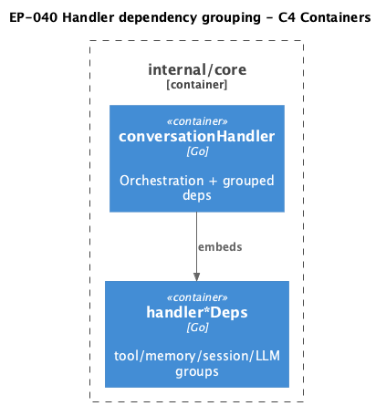

# EP-040 — Handler dependency grouping — System design

## Overview

Structural refactor: group ~25 flat fields on `conversationHandler` into four unexported structs. No behaviour, config, or public API changes ([ep-scope.md](ep-scope.md)).

## Architecture

<p align="center"></p>

**Source:** [diagrams/c4-container.puml](diagrams/c4-container.puml)

### Struct layout

```go
type handlerToolDeps struct {
    catalog, toolIndex, skillIndex, nativeRegistry, skillPackagesByID
    toolsCfg, toolsSelection, nodeRunner, runtimeSkillsCfg
    toolSearchTopK, toolMinCount, toolFallbackCap int
}
type handlerMemoryDeps struct {
    memVec *MemoryVectors; embedder embedding.Embedder
    memoryVectorTopK config.MemoryVectorConfig; paLoc *time.Location
}
type handlerSessionDeps struct {
    cfg *config.ConversationSessionConfig; store *sessionWindowStore
}
type handlerLLMDeps struct {
    router *llmrouter.Router; llmLog llmlog.Writer; model string
    firstProviderSupportsTools bool; logRedactor func(string) string
    logger *slog.Logger; classifier intent.Classifier
    maxMessageLength, maxDynamicSystemRunes int
}
type conversationHandler struct {
    tools handlerToolDeps
    memory handlerMemoryDeps
    session handlerSessionDeps
    llm handlerLLMDeps
    toolResultPromptBytes int // EP-039; stays top-level (single int)
}
```

Access pattern: `h.tools.catalog`, `h.memory.memVec`, `h.llm.router` — no getter methods (KISS).

## Components

| File | Change |
|------|--------|
| `handler.go` | Struct definitions + `HandleMessage` uses groups |
| `handler_llm.go`, `handler_tools.go`, `handler_memory.go`, `handler_tier_main_prompt.go` | Replace `h.field` with grouped access |
| `run.go` | Build four struct literals in `newRunConversationHandler` |
| `integration_export.go` | Same grouping in test constructor if present |
| `handler_test.go`, `handler_*_test.go` | Update direct struct literals if any |

## Testing strategy

- All existing `internal/core` handler tests pass unchanged in assertions ([REQ-40.008](ep-requirements.md#req-40-008--test-parity)).
- Optional: `ep040_traceability_test.go` asserting type has exactly four group fields + `toolResultPromptBytes`.

## Implementation sequencing

1. Define sub-structs in `handler.go`; update `conversationHandler` type.
2. Fix compile errors across handler files (mechanical replace).
3. Refactor `newRunConversationHandler`.
4. `make check`.

## Risks

Mechanical rename only; risk is missed field reference — caught by compiler and tests.

## Requirement traceability

| REQ | Coverage |
|-----|----------|
| REQ-40.001–004 | Struct layout |
| REQ-40.005–006 | File updates + run.go |
| REQ-40.007–010 | No API change; tests; make check |
