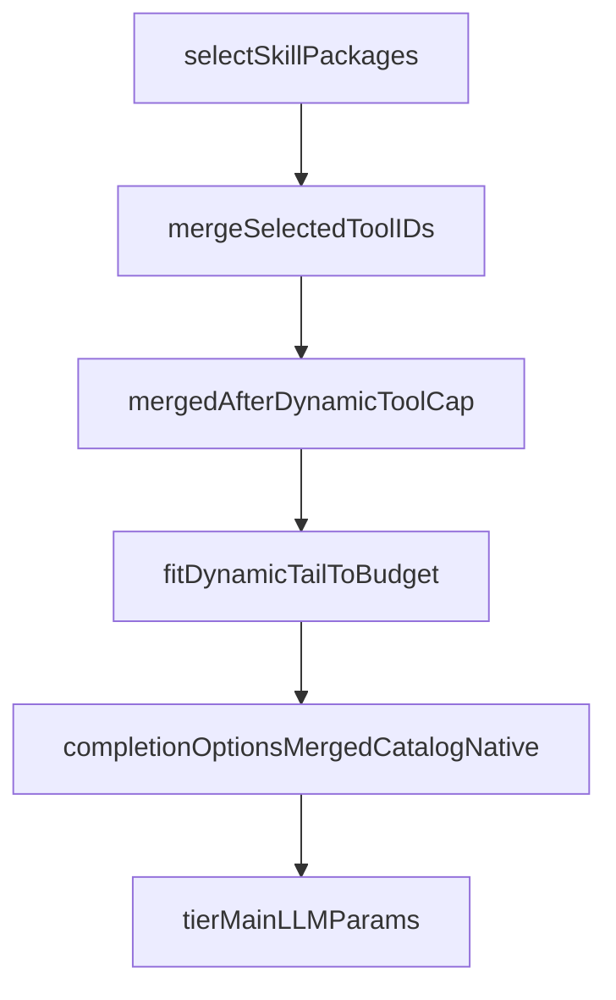

# EP-041 — Full-tier prompt pipeline — Requirements (EARS / INCOSE)

> **8 requirements** · 6 FR · 2 NFR

## Introduction

EP-041 makes tier-`full` assembly an explicit pipeline ([ep-scope.md](ep-scope.md)).

## C4 C1 — System Context

**Source:** [diagrams/c4-context.puml](diagrams/c4-context.puml)

### Flow

## Requirement index

| Id | Type | Summary |
|----|------|---------|
| REQ-41.001 | FR | Introduce fullTierAssembler type |
| REQ-41.002 | FR | Five named pipeline steps in fixed order |
| REQ-41.003 | FR | Single entry from buildTierFullMainPrompt |
| REQ-41.004 | FR | Behaviour parity with pre-epic assembly |
| REQ-41.005 | FR | Simple tier path unchanged |
| REQ-41.006 | FR | Pipeline order documented in code |
| REQ-41.007 | NFR | No config schema changes |
| REQ-41.008 | NFR | make check passes |

## Requirements

### REQ-41.001 — fullTierAssembler type

THE **PersonalAssistant** SHALL provide an unexported **`fullTierAssembler`** (or equivalent name) in `internal/core` that holds the handler reference and turn inputs for tier-`full` tail assembly.

### REQ-41.002 — Fixed step order

THE **fullTierAssembler** SHALL execute assembly steps in this order: (1) skill selection, (2) tool id merge, (3) dynamic tool cap, (4) dynamic tail budget fit, (5) completion options build.

### REQ-41.003 — Single pipeline entry

THE **PersonalAssistant** SHALL route `buildTierFullMainPrompt` through the pipeline entry point rather than an ad-hoc multi-file call chain without documented order.

### REQ-41.004 — Parity

WHEN the same handler state, user text, and retrieval chunks are supplied, THE **PersonalAssistant** SHALL produce identical `tierMainLLMParams`, tool id lists, and system message tail content as before EP-041.

### REQ-41.005 — Simple tier unchanged

THE **PersonalAssistant** SHALL leave `buildTierSimpleMainPrompt` and non-`full` tier dispatch unchanged.

### REQ-41.006 — Documented order

THE **repository** SHALL document the five step names in the pipeline source file (step method names or numbered comments adjacent to the call sequence).

### REQ-41.007 — No config changes

THE **Config loader** SHALL not change JSON schema.

### REQ-41.008 — make check

THE **repository** SHALL pass `make check`.
