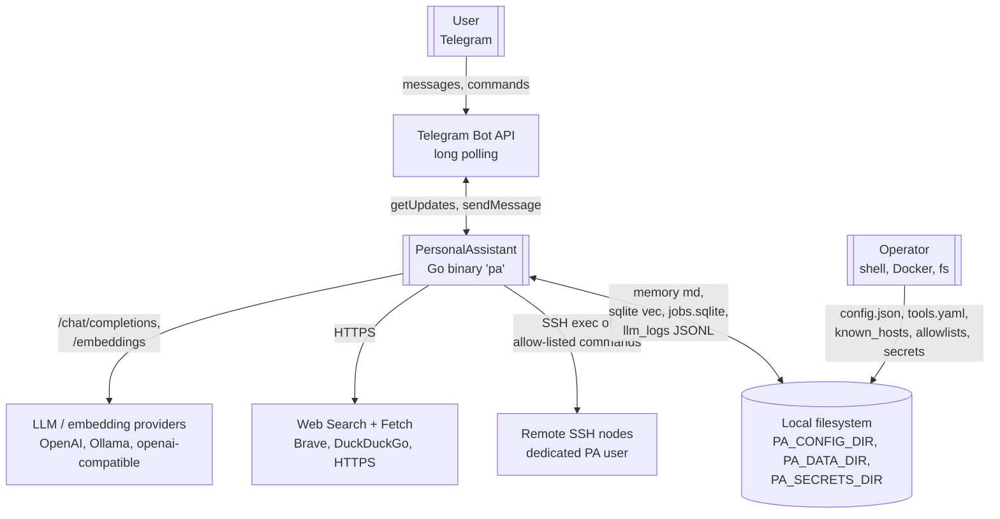
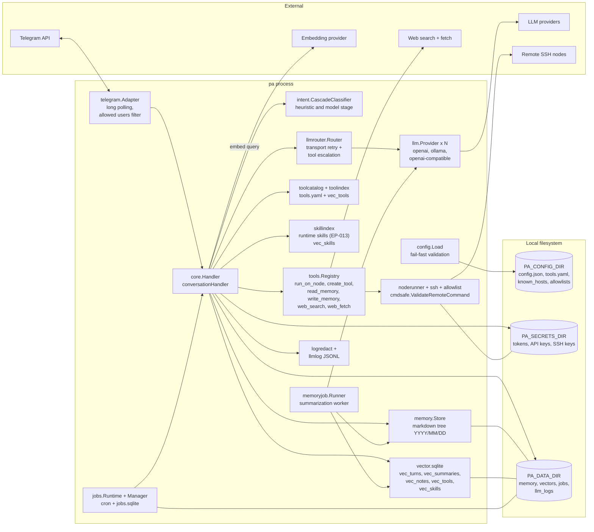
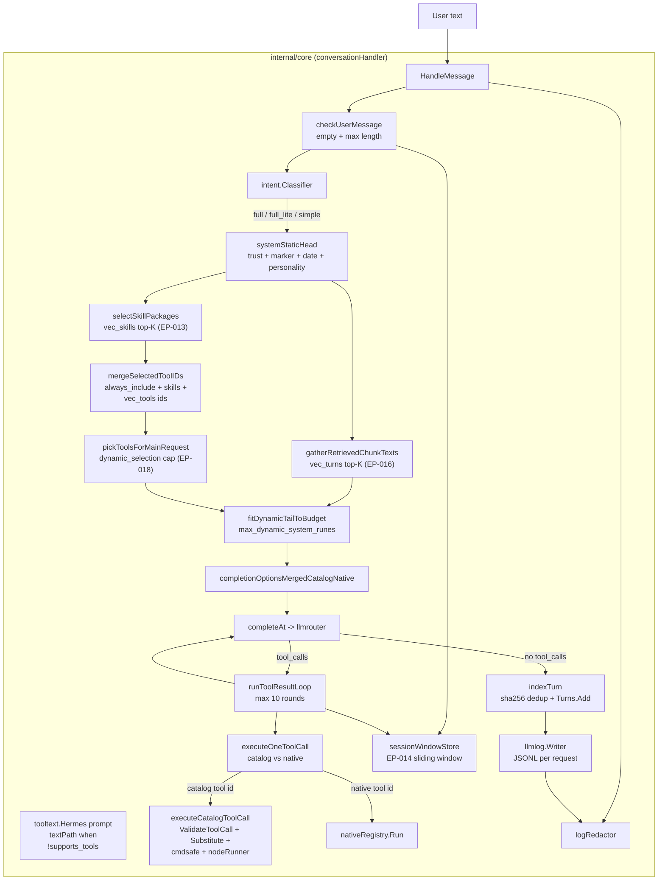

# PersonalAssistant — Architecture review (code-grounded)

**Document type:** architecture overview derived from this repository’s source code; not an independent audit or a performance benchmark.
**Date:** 2026-04-17
**Pinned revision:** `442aa014e9dab718734de679e83709e00d738dd1`
**Scope:** `cmd/pa`, `internal/**`, `.config/config.json`, related docs (`README.md`, `ai-sdlc-artefacts/threat-model.md`, `docs/`).
**Related artefacts:** [scope.md](scope.md), [strategy.md](strategy.md), [threat-model.md](threat-model.md), epics [EP-001 … EP-021](epics/).

---

## 1. Context and goals

PersonalAssistant is a single Go binary `pa` that implements a personal assistant: a Telegram bot receives messages, `internal/core` builds context (RAG + session window + runtime skills + tool catalog), talks to a pool of LLM providers, and sends the reply back. Major subsystems:

- long-term memory as markdown + vectors (sqlite-vec) with hierarchical summarization day → month → year (EP-002);
- extensible **tools** — catalog (YAML + command template on an SSH node) and native (`run_on_node`, `create_tool`, `read_memory`, `write_memory`, `web_search`, `web_fetch`);
- **scheduled jobs** scheduler (EP-019/020/021, cron + SQLite store);
- **tool-path escalation** across the provider chain (EP-006);
- three-tier **intent classifier** (`simple` / `full_lite` / `full`, EP-017/018) to save tokens and latency.

Target host: Synology DS220+ (Docker, arm64/amd64). Configuration is explicit in `config.json` (“explicit JSON configuration”, no hidden defaults) and validated on load.

---

## 2. C4 diagrams

### 2.1 Context (C1) — who talks to whom

**Trust zones**

- Telegram users — **semi-trusted** (authenticated via `allowedUserIDs`); their text is **untrusted content**.
- Operator and files under `PA_CONFIG_DIR` / `PA_SECRETS_DIR` — **trusted**.
- LLM / embedding APIs — **external**; they receive prompts and tool results.
- Remote nodes — **external**; access only as the dedicated PA user with keys from `PA_SECRETS_DIR`.

### 2.2 Container (C2) — internal processes and stores

The system is single-process but decomposes into logical containers of one binary plus external dependencies:

### 2.3 Component (C3) — inside `internal/core`

---

## 3. Source map (by size and role)

| Package | Role | Files (non-test) |
|---------|------|:---:|
| `internal/core` | dialogue orchestration, tool loop, routing glue, EP-013/14/17/18 logic | 15 |
| `internal/tools` | native tools + registry + params | 10 |
| `internal/toolcatalog` | YAML catalog, templates, `ValidateToolCall` + `Substitute` | 6 |
| `internal/jobs` | store (sqlite), `Manager` (`/jobs` commands), `Runtime` (cron) | 6 |
| `internal/config` | `Load`, fail-fast validation, types for all sections | 6 |
| `internal/llmrouter` | transport retry + tool-escalation policy | 5 |
| `internal/intent` | EP-017/018: heuristic + model stage + cascade | 4 |
| `internal/llm` | provider interface, implementations (OpenAI-compatible, Ollama) | 4 |
| `internal/embedding` | embeddings (batch, timeout) | 4 |
| `internal/telegram` | Adapter: long polling, allowedUserIDs, HTML formatting | 4 |
| `internal/summarize` | day/month/year summarization pipeline + labels | 4 |
| `internal/toolindex` / `internal/skillindex` | vec_tools / vec_skills build + search | 4 + 2 |
| `internal/ssh` / `internal/noderunner` / `internal/cmdsafe` / `internal/allowlist` | remote execution channel + validation | 2 + 2 + 3 + 2 |
| `internal/memory`, `internal/vector`, `internal/memoryjob` | markdown store + sqlite-vec + summarization worker | 2 + 2 + 2 |
| `internal/llmlog`, `internal/logredact`, `internal/logging` | JSONL LLM log, redaction, log level | 2 + 2 + 1 |
| `internal/runtimeskills`, `internal/systemprompt`, `internal/promptmarkers`, `internal/tooltext`, `internal/escalationpolicy`, `internal/patime`, `internal/httpsafety` | runtime skills, strict system-prompt markers, text-tool path | 2 + 1 + 1 + 1 + 3 + 1 + 1 |

Roughly ≈11.8K LOC (non-test), “one team / one product” scale; few dependencies (`go-telegram/bot`, `sqlite-vec`, `mattn/go-sqlite3`, `robfig/cron/v3`, `golang.org/x/crypto`, `yaml.v3`).

---

## 4. Key flows

### 4.1 Inbound message handling

1. `telegram.Adapter.Run` receives updates, filters by `allowedUserIDs`.
2. `core.HandleMessage` → `checkUserMessage` (empty / too long → early reply, no LLM).
3. `intent.Classifier.Classify` picks tier (`simple` / `full_lite` / `full`). Cascade: regex heuristics + optional cheap LLM in `ModelClassifier` (separate provider).
4. By tier:
   - `TierFull` → vector retrieval from `vec_turns`, runtime skills, tool pre-selection (`vec_tools`), EP-018 dynamic cap;
   - `TierFullLite` → no retrieval and no skills; tools may still apply when `text_based_enabled`;
   - `TierSimple` → plain LLM call without tools / extra context.
5. Prompt = fixed “head” (trust policy + marker supplement + date in `pa_timezone` + personality) + dynamic “tail” (retrieved chunks, runtime skills, Hermes instructions), fitted to `max_dynamic_system_runes`.
6. `llmrouter.Router` runs `Complete`; on transport errors (timeout, 5xx, network) → next provider; on qualifying tool failure → escalation (`tools.llm_escalation.baseline_index` → next, up to `max_per_user_message`).
7. If the model returns `tool_calls` (or they are parsed from the Hermes text path) → `runToolResultLoop` for up to 10 rounds: catalog tool → `ValidateToolCall` → `Substitute` → `cmdsafe.ValidateRemoteCommand` → `noderunner.RunOnNode` (allowlist + SSH); native tool → `Registry.Run`.
8. After final reply: sliding session store (EP-014), JSONL under `llm_logs/`, SHA-256 dedup turn indexing into `vec_turns`, Telegram usage footer (EP-015).

### 4.2 Memory summarization

- `cmd/pa -summarize=YYYY[-MM[-DD]]` or background `memoryjob.Runner` runs `summarize.Day` / `Month` / `Year`.
- Day source: JSONL `llm_logs` (saved turns); output → markdown `memory/YYYY/MM/DD/*.md` + `vec_summaries`.
- Log retention bounded by `llm_log_retention_days`.

### 4.3 Scheduled jobs

- User creates jobs (EP-020 natural language via native `create_scheduled_job_tool` + EP-021 runtime skill for routing; `/jobs list|show|run|pause|delete` handled by `jobs.Manager` before `baseHandler`).
- `jobs.Runtime` uses `robfig/cron/v3`, persists state in a separate SQLite DB (`jobs.sqlite`), supports `single_instance` overlap policy and `cancel_after_limit` timeout policy; delivers results into chat via `chatSender`.

---

## 5. Security model (in code)

- **Fail-fast config load** (`internal/config/Load`) — validates all sections, no hidden defaults; invalid fields abort startup.
- **Telegram gate** — empty `users_path` means deny everyone.
- **SSH / remote exec** — two-layer check:
  1. `cmdsafe.ValidateRemoteCommand` — rune set / length, then forbidden shell metacharacters (REQ-04.031), called both in `core.executeOneToolCall` (after `Substitute`) and again in `noderunner.RunOnNode`.
  2. `allowlist.Checker` — per-node file, exact match or prefix wildcard (only one `*` at end).
- **Dedicated PA user** per node + keys under `PA_SECRETS_DIR`.
- **Redaction** — shared `logredact` (built-in + `log_redaction.additional_patterns`) on INFO tool-invocation logs, DEBUG LLM request/response, and JSONL llmlog; `noderunner` gets the same editor via `SetLogRedactor`.
- **Prompt markers** — `promptmarkers.TextContainsForbiddenMarkerLine` rejects turn indexing when the model forges trust marker lines.
- **Retention** of LLM logs by day count (`PruneRetention`).
- STRIDE detail — [threat-model.md](threat-model.md).

---

## 6. Configuration and extensibility

- **Single entry** — `.config/config.json` plus optional files: `tools.yaml`, `known_hosts`, `*_allowlist`, skill packages under `paths.skills_dir`.
- **LLM providers** — array with explicit `type`, `supports_tools`, `supports_json_mode`, `default_temperature`, `default_max_tokens`. First provider is the “baseline” for normal replies; `baseline_index` from `tools.llm_escalation` drives the tool path.
- **Tool extensibility** — three paths:
  1. Catalog (`tools.yaml`): declarative `command`, `node_id`, `parameters`; no code change.
  2. Native (`tools.Tool`): Go code registered in `tools.Registry` from `cmd/pa/main.go`.
  3. Native `create_tool`: LLM appends catalog tools at runtime under a mutex with secret-pattern scanning.
- **Runtime skills (EP-013)** — markdown packages + tool mapping; selected via `vec_skills`; instructions enter the system “tail” only when relevant.
- **Three provider roles** over one pool:
  - main chat (index 0 or `baseline_index`);
  - escalation targets (following entries in the array);
  - summarize (`llmrouter.SummarizeRouterConfig` — separate adapter, same pool);
  - intent model stage (**separate** inline `LLMProvider`, e.g. local Ollama/Gemma).

---

## 7. Strengths

1. **Clear domain decomposition.** `internal/*` packages are narrow: `noderunner` executes, `allowlist` checks, `cmdsafe` validates commands, `toolcatalog` declares, `toolindex`/`skillindex` search, `llmrouter` owns provider policy. Readable dependency graph (see `cmd/pa/main.go`).
2. **Fail-fast configuration.** `config.Load` refuses invalid/incomplete config; aligns with `AGENTS.md` (“Fail fast”, “Explicit JSON configuration”). No magic defaults.
3. **Safe path to nodes.** Two-layer validation (`cmdsafe` → allowlist) + dedicated PA user + `ssh_known_hosts_path` + startup `VerifyDialAndHandshake`; CLI `-verify-nodes` checks reachability without starting the bot.
4. **Redaction is platform-level, not bolt-on.** `BuildLogRedactor` is wired through `core`, `noderunner`, `llmlog`; applies to remote stdout/stderr and tool arguments.
5. **Prompt tier system (EP-017/018)** saves tokens on short turns without breaking `full`-tier behaviour.
6. **Smooth tool-calling without native tool support.** `tooltext.Hermes` + `ForceJSONOutput` + follow-up parsing supports local models with `supports_tools: false`.
7. **Escalation policy is declarative.** `baseline_index`, `max_per_user_message`, provider list — all in JSON; `llmrouter` logic is explicit (`ClassifyCompleteError`, `DecideToolFailure`).
8. **SQLite-vec + split tables (EP-016).** Separate `vec_turns` / `vec_summaries` / `vec_notes` / `vec_tools` / `vec_skills` tables make it explicit what enters the prompt (today: turns only); invariant documented in code (`gatherSplitTableChunks`).
9. **Hierarchical memory (day → month → year)** separates fresh context from history while markdown stays human-readable.
10. **Mature process.** 21 epics, `ai-sdlc` pipeline, `make check` (vet, govulncheck, golangci-lint, race tests, coverage), CI badge + codecov — strong for a personal project.
11. **Traceability AC → REQ → code.** Comments like `REQ-01.018`, `EP-016 dedup`, `AC-01.032` tie code to epics.
12. **Dynamic tool creation (EP-009)** under mutex + `create_tool_secret_patterns` scanning — uncommon for self-hosted assistants, implemented with care.

---

## 8. Weaknesses

1. **“God handler” `conversationHandler`.** The struct has ≥25 fields; `HandleMessage` is `nolint:gocyclo`; `TierFull` and `TierFullLite` branches duplicate tailState / dynamicRan / opts / textPath logic. Tier builders or strategies would help.
2. **`cmd/pa/main.go` as composition root.** Several `buildX` helpers, `setup` returns seven values and is `nolint:gocyclo`. Each new subsystem (EP-013, EP-017, EP-019, EP-021) grows this file. No DI/wire — KISS-justified, but the ceiling is near.
3. **Core mixed with `jobs` via adapter.** `jobsCommandHandler` wraps `baseHandler` and intercepts `/jobs`; `create_scheduled_job_tool` depends on `jobsState.snapshot()` through a closure. Works, but `initJobsRuntimeAsync` is async and can expose tools before jobs are ready — users see errors instead of a warm-up state.
4. **Opaque mapping of providers to roles.** One `llm_providers` array serves chat, summarize, and tool escalation; `baseline_index` and “next = escalation candidate” semantics are not documented in one operator-facing place — code and epics only. Wrong order changes behaviour silently.
5. **`PA_LOG_LEVEL=debug` dumps full LLM I/O.** Protection is `logRedactor` only if patterns cover secrets; unknown patterns leak.
6. **Vector store is one SQLite file.** Several goroutines (`memoryjob`, background `toolindex.BuildAndSetReady`, handlers) write through separate connections. Fine with WAL / single-writer, but the repo does not set explicit PRAGMAs or write-side locking; under load, `SQLITE_BUSY` is possible.
7. **No in-app rate limiting.** Threat model notes this; one `/jobs run` → up to 10 tool rounds × escalation × tokens. Reliance on Telegram limits and allowlists only.
8. **No health/readiness HTTP endpoint.** `pa` is long-poll only; operators infer liveness from logs. OK for self-hosted; any HTTP evolution needs new surface.
9. **`create_tool` writes `tools.yaml` directly.** Mutex helps, but no atomic rename / COW; a failed write can leave a half-valid catalog. Fail-fast reload applies only on next restart; until then `toolindex` may keep stale in-memory state.
10. **Intent model stage with a long timeout** (e.g. 20s) per “uncertain” message adds latency and another billable/resource call. Fine for local models; costly for cloud.
11. **Hermes text-tool path** — JSON extracted from free text; even with `SuspectedBrokenHermesMarkup`, parsing varies across models. `hermes_parse` escalation helps at the cost of another `Complete`.
12. **Duplicate `cmdsafe.ValidateRemoteCommand`.** Called in `core.executeCatalogToolCall` and again in `noderunner.RunOnNode`. Defense-in-depth, but duplicate error paths can clutter logs.
13. **Tests under `cmd/pa`** mix `main_test.go` with `ep019_e2e_test.go`, `ep020_e2e_test.go` — unit and E2E together. Coverage works; readability suffers.
14. **Embedding batch size 100 in config** but `embedding.Embedder` is invoked per turn / per query / per chunk in many places — the field looks half-used.

---

## 9. Risks

| # | Risk | Probability | Impact | Triggers / evidence |
|---|------|:-:|:-:|---|
| R1 | **Compromised Telegram token or SSH key file** → full bot and node takeover | medium | critical | `threat-model.md` §3, §5 Spoofing/Elevation; depends on host FS permissions |
| R2 | **Abuse by an allowed Telegram user** (prompt injection → tool raid) | medium | high | `HandleMessage` allows up to 10 tool rounds × escalation; no rate limit |
| R3 | **Misconfigured allowlist or wide `*` prefix** | medium | critical | `allowlist.validateAllowlistPattern` constrains syntax, not semantics; `threat-model.md` §5 Elevation |
| R4 | **`create_tool` write corrupts `tools.yaml`** | low | high | race between file write and `toolindex`; no atomic rename evidenced in review |
| R5 | **Secrets leak via LLM JSONL / DEBUG logs** | low by default | high | completeness of `log_redaction.additional_patterns`; `PA_LOG_LEVEL=debug` widens blast radius |
| R6 | **Single SQLite file** (memory + vectors + jobs) | medium | medium | one filesystem corruption loses memory, history, jobs |
| R7 | **Hang on external LLM API** | high | medium | router retries only on transport-class errors; some hanging 2xx/stream responses need `context` timeouts |
| R8 | **Intent model stage adds latency/cost** | medium | low | `enabled=true` with a cloud `model_stage` gets expensive fast |
| R9 | **Tight coupling in `cmd/pa/main.go`** → regressions when adding epics | medium | medium | `setup` already at gocyclo edge; each EP-N adds branches |
| R10 | **No health endpoint** → silent failures in Docker/Compose | medium | low | operators wrap with scripts; “healthy” means log silence |
| R11 | **Hermes text-tool path unstable across models** | medium | medium | local models emit different JSON; escalation costs a round |
| R12 | **`memoryjob` as background actor** without visible queue/metrics | low | medium | summarization errors land in `slog` only |
| R13 | **Docker mounts with absolute paths** in `config.json` | low | high | `threat-model.md` §7.5 — wrong mount can expose keys or break paths |
| R14 | **Runtime skills grow** → system tail hits `max_dynamic_system_runes` | low | low | `fitDynamicTailToBudget` trims safely but drops RAG chunks first |

---

## 10. Recommendations (optional, non-binding)

Conditional steps; none is mandatory — repository owner decides.

1. **Extract tier builders** (e.g. `buildTierFullOptions(h, userText, sh)`) so `HandleMessage` becomes a linear orchestrator; eases gocyclo and branch tests.
2. **Split composition root** into `setupMemory`, `setupTools`, `setupJobs` with an explicit `*Application` / `*Runtime` instead of a seven-value `setup`. Still KISS: one struct + one constructor per subsystem.
3. **Document `llm_providers` pool semantics** in `docs/configuration.md` with examples: which indices serve escalation / summarize / classifier. Today this is tribal knowledge.
4. **Atomic catalog writes** from `create_tool` (tmp + `os.Rename`) + post-validation rollback — mitigates R4.
5. **Per-user rate limits** in `telegram.Adapter` or `conversationHandler` (messages/minute, tool rounds/minute) — mitigates R2 without external components.
6. **Health/readiness** (`/healthz` on `0.0.0.0:PORT` when `PA_HEALTH_ADDR` is set) — optional but simplifies Docker/Compose.
7. **SQLite PRAGMAs** (`journal_mode=WAL`, `busy_timeout`, `synchronous=NORMAL`) + a short concurrent-write test — reduces R6/R7 write contention.
8. **Move E2E tests** `cmd/pa/ep0*_e2e_test.go` under `tests/e2e/...` (alongside `tests/integration/`) — clearer coverage story.
9. **Structured slog events** for `memoryjob` and `jobs.Runtime` (start/success/error/duration) — supports local analytics (EP-007).
10. **Explicit deny of `PA_LOG_LEVEL=debug`** in production Dockerfile/Compose (docs + gate) — mitigates R5.
11. **Tier-specific `max_tool_rounds`:** e.g. 0–1 for `TierSimple` / `TierFullLite` instead of 10.

---

## 11. Dependencies and compatibility

- Go 1.26 + CGO (`sqlite-vec`, `go-sqlite3`) — needs a proper toolchain at build time and is **not** trivially `static` without extra steps (documented in `Dockerfile`, `docs/docker.md`).
- Runtime externals: Telegram API + chosen LLM endpoints; outbound HTTPS.
- Platform: Synology DS220+ (arm64) and Apple Silicon per README; CI runs `-race` to catch data races.

---

## 12. References

| Resource | Path |
|----------|------|
| Scope | [scope.md](scope.md) |
| Strategy | [strategy.md](strategy.md) |
| Threat model | [threat-model.md](threat-model.md) |
| Audit report | [audit-report.md](audit-report.md) |
| Epics | [epics/](epics/) |
| Entry point | `cmd/pa/main.go` |
| Dialogue core | `internal/core/handler.go` |
| LLM policy | `internal/llmrouter/` |
| Intent classifier | `internal/intent/` |
| Tools / catalog | `internal/tools/`, `internal/toolcatalog/`, `internal/toolindex/` |
| Remote exec | `internal/noderunner/`, `internal/ssh/`, `internal/allowlist/`, `internal/cmdsafe/` |
| Memory | `internal/memory/`, `internal/vector/`, `internal/memoryjob/`, `internal/summarize/` |
| Jobs | `internal/jobs/` |
| Config | `internal/config/`, `.config/config.json` |
| Operator docs | `docs/` |

---

*This document reflects revision `442aa014e9dab718734de679e83709e00d738dd1`. Update when `cmd/pa` structure, `core` interfaces, `llmrouter` policy, config schema, or the security model change materially.*
