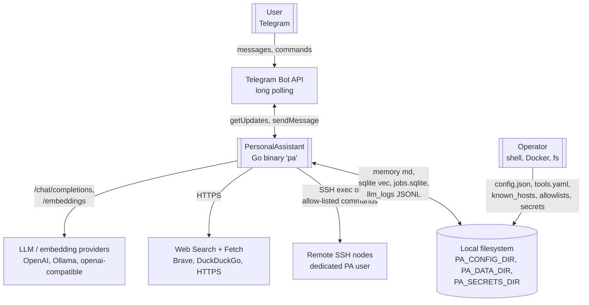
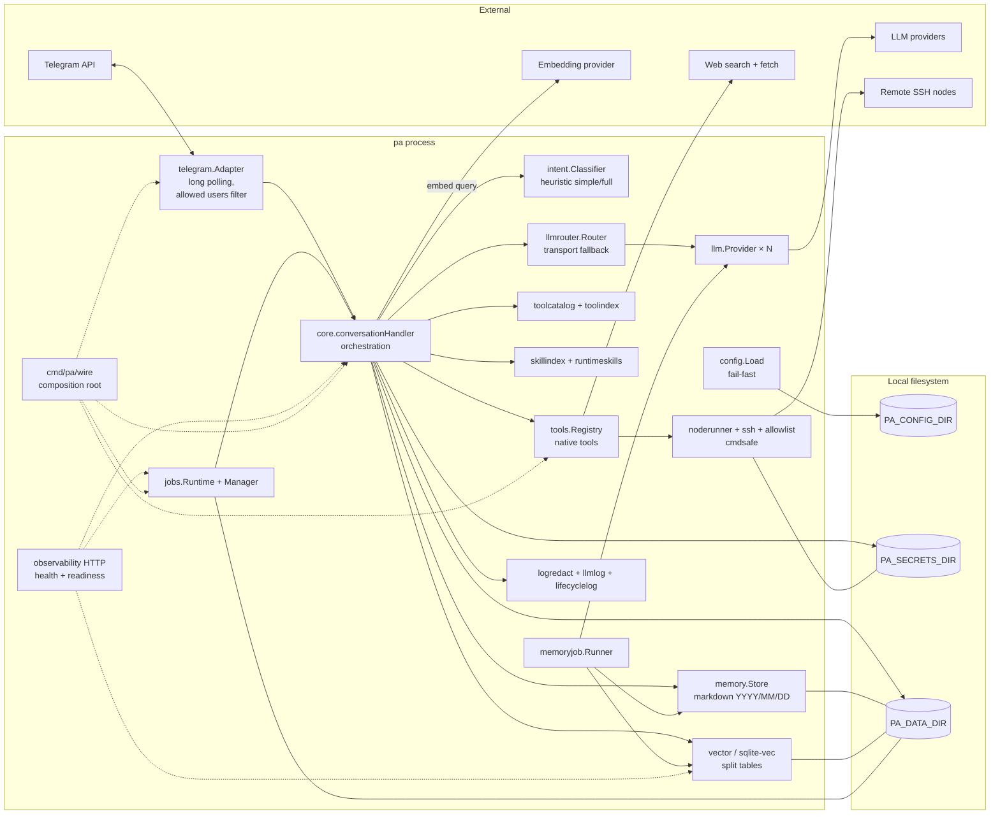
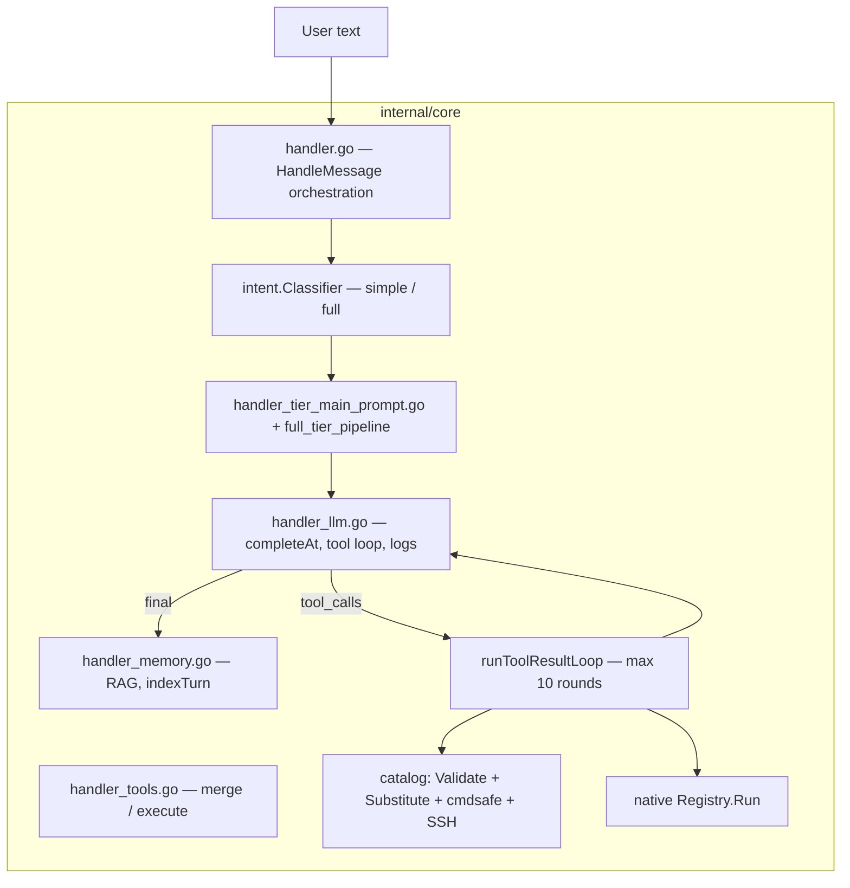

# PersonalAssistant — Architecture review (code-grounded)

**Document type:** architecture overview derived from this repository’s source code; not an independent audit or a performance benchmark.
**Date:** 2026-07-27
**Pinned revision:** `effd6aa5fa7a7100d23ae70b3561bebb37a2b429` (`main` at review time)
**ai-sdlc pin:** `v1.0.7` (see `ai-sdlc.version`)
**Scope:** `cmd/pa`, `internal/**`, related docs (`README.md`, `docs/`, `ai-sdlc-artefacts/threat-model.md`).
**Related artefacts:** [scope.md](scope.md), [strategy.md](strategy.md), [threat-model.md](threat-model.md), [audit-report.md](audit-report.md), epics [EP-001 … EP-043](epics/).
**Operator docs (canonical narrative):** [docs/architecture-ru.md](../docs/architecture-ru.md), [docs/architecture.md](../docs/architecture.md) (composition root).
**Pattern consult:** [ai-sdlc/reference/architecture-patterns/](../ai-sdlc/reference/architecture-patterns/index.md) (advisory cards; not a mandate to adopt every pattern).

**Supersedes:** earlier review dated 2026-04-17 (`442aa014…`). Many weaknesses listed there were addressed in EP-022…EP-043 (especially increment 0.02: EP-034…043).

---

## 1. Context and goals

PersonalAssistant is a **single-process Go binary** `pa` (self-hosted personal assistant): Telegram long polling → `internal/core` builds context (RAG + session window + runtime skills + tool catalog) → LLM pool → reply. Major subsystems:

- long-term memory as markdown + vectors (sqlite-vec) with hierarchical summarization day → month → year (EP-002, EP-033 retry);
- extensible **tools** — YAML catalog (command template on an SSH node) and native (`run_on_node`, `create_tool`, memory/web/search tools, `create_scheduled_job`, …);
- **scheduled jobs** (EP-019/020/021) with explicit runtime phases and readiness (EP-042);
- **llmrouter** transport fallback across `llm_providers` (tool-path LLM escalation removed in EP-034);
- **intent** heuristics only: two tiers `simple` / `full` (EP-036; `full_lite` and model stage removed).

Target host: Synology / NAS-style Docker (arm64/amd64). Configuration is explicit in `config.json` (every documented top-level key present; optional blocks are JSON `null`; unknown keys rejected) and validated on load — process does not start on invalid config.

**Fit:** one operator, one process, simplicity over horizontal scale. Not multi-tenant SaaS.

---

## 2. C4 diagrams

### 2.1 Context (C1) — who talks to whom

**Trust zones**

- Telegram users — **semi-trusted** (authenticated via `allowedUserIDs`); message text is **untrusted content**.
- Operator and files under `PA_CONFIG_DIR` / `PA_SECRETS_DIR` — **trusted**.
- LLM / embedding APIs — **external**; they receive prompts and tool results.
- Remote nodes — **external**; access only as the dedicated PA user with keys from `PA_SECRETS_DIR`.

### 2.2 Container (C2) — logical subsystems in one process

### 2.3 Component (C3) — inside `internal/core`

Handler is split across focused files (EP-038+) with **grouped dependency structs** (EP-040): `handlerToolDeps`, `handlerMemoryDeps`, `handlerSessionDeps`, `handlerLLMDeps` (five top-level fields on `conversationHandler`).

---

## 3. Source map (by role)

| Package / area | Role |
|----------------|------|
| `cmd/pa` | Entry, CLI (`-summarize`, `-verify-nodes`, …), jobs wrapper, observability HTTP |
| `cmd/pa/wire` | Composition root: infrastructure, LLM, tools, handler, readiness, jobs state (EP-027/042) |
| `internal/core` | Dialogue orchestration, prompt assembly, tool loop, RAG glue |
| `internal/telegram` | Adapter: long polling, allowlist users, typing, HTML |
| `internal/llm` / `internal/llmrouter` | Providers + transport fallback policy |
| `internal/intent` | Heuristic two-tier classifier |
| `internal/memory` / `internal/vector` / `internal/summarize` / `internal/memoryjob` | Markdown SoT, sqlite-vec, day/month/year pipeline, background worker |
| `internal/toolcatalog` / `internal/toolindex` / `internal/tools` | YAML catalog, vec_tools, native registry |
| `internal/skillindex` / `internal/runtimeskills` | Runtime skills + vec_skills |
| `internal/noderunner` / `internal/ssh` / `internal/allowlist` / `internal/cmdsafe` | Remote exec channel + validation |
| `internal/jobs` | Cron runtime + `/jobs` manager + SQLite store |
| `internal/config` | Strict JSON load / validation |
| `internal/sqlitepragma` | Shared WAL / busy_timeout / synchronous policy (EP-022) |
| `internal/llmlog` / `internal/logredact` / `internal/lifecyclelog` | Audit JSONL, redaction, structured lifecycle |
| `internal/httpsafety` | SSRF policy for web tools |
| `scripts/check-module-boundaries.sh` | No cycles; telegram may only import config+core; core must not import concrete LLM/vector impls |

Rough scale at review time: ~30 packages under `internal/`, ~14k LOC non-test Go under `internal/`. Dependencies stay small (`go-telegram/bot`, sqlite-vec, go-sqlite3, robfig/cron, x/crypto, yaml).

---

## 4. Key flows

### 4.1 Inbound message

1. `telegram.Adapter.Run` — filter by `allowedUserIDs` (empty users file = deny all).
2. Optional `jobsCommandHandler` intercepts `/jobs …` before core.
3. `core.HandleMessage` → empty / max-length early reply (no LLM).
4. `intent.Classifier` → `simple` (minimal prompt, no tools/RAG) or `full` (RAG + skills + tool pre-selection).
5. Prompt = static head (trust + date + personality) + dynamic tail fitted to `max_dynamic_system_runes`.
6. `llmrouter.Router.Complete` — start at provider index 0; on retryable **transport** errors switch to next provider. Tool failures do **not** switch providers (EP-034).
7. Tool loop up to **10** rounds: catalog → Validate → Substitute → `cmdsafe` → noderunner/allowlist/SSH; or native `Registry.Run`.
8. Post-turn: session window, llmlog JSONL, `vec_turns` index, optional usage footer.

### 4.2 Memory summarization

- CLI `-summarize=…` or background `memoryjob.Runner`; day from llm_logs → markdown + `vec_summaries`; month/year rollups; retries (EP-033). Worker yields to interactive turns (`UserTurnInProgress`).

### 4.3 Scheduled jobs

- Create via native tool / skills; manage via `/jobs`.
- `JobsRuntimeState` phases: **Initializing** / **Ready** / **Failed** — soft user messages + readiness check alignment (EP-042).
- Runtime fires into the same `HandleMessage` path; notifies chat via Telegram sender.

### 4.4 Composition root startup order

See [docs/architecture.md](../docs/architecture.md): `wire.Build` → StartLLMProviders → MaybeStartMemorySummarization → BuildToolRegistry → BuildMessageHandler → wrapJobsHandler → `runServer` (+ optional observability HTTP).

---

## 5. Security model (in code)

- **Fail-fast config** — `config.Load`; no hidden product defaults.
- **Telegram gate** — allowlist; empty = deny everyone.
- **SSH / remote exec** — defense in depth: `cmdsafe.ValidateRemoteCommand` (also re-checked in noderunner) + per-node allowlist + dedicated PA user + `known_hosts`; `-verify-nodes` without starting the bot.
- **create_tool** — same-directory atomic replace + sync + post-write validation / restore (EP-023); secret-pattern scanning on new tools.
- **Redaction** — shared `logredact` across app logs, tool invocation, JSONL, noderunner.
- **Prompt markers** — reject turn indexing when trust marker lines are forged.
- **SSRF** — `httpsafety` for web tools.
- **LLM log retention** — day-bounded prune.
- Detail: [threat-model.md](threat-model.md).

**Pattern note (`authn-boundary`):** authentication concentrates at Telegram allowlist + operator FS trust; authorization for remote power is allowlist/cmdsafe at the tool/SSH boundary — not a full multi-tenant authn stack (appropriate for personal use).

---

## 6. Configuration and extensibility

- Paths via `PA_CONFIG_DIR`, `PA_DATA_DIR`, `PA_SECRETS_DIR`.
- **LLM pool:** one `llm_providers[]` array; main chat starts at 0; transport fallback walks the array; summarize uses a separate adapter over the same pool. Operator guidance: [docs/llm-provider-roles-and-logging.md](../docs/llm-provider-roles-and-logging.md) (EP-024).
- **Tools:** catalog YAML (no recompile) / native Go (register in wire) / `create_tool` at runtime / runtime skills packages.
- **Tool pre-selection:** `tools.selection` (always_include + skills + vec_tools + optional cap) — EP-037 consolidated config.
- **Conversation tools require** baseline `supports_tools: true` (Hermes text path removed — EP-030); startup warning if baseline omits tools while catalog/native tools are wired.

---

## 7. Observability and operations

- Structured `slog`; optional DEBUG dumps LLM I/O (redactor only as strong as patterns).
- JSONL llm audit + lifecycle events (`lifecycle_event`, subsystem, phase, duration).
- Opt-in **observability HTTP** (EP-029): liveness always 200 when listener up; readiness aggregates LLM/vectors/tool index/jobs/memoryjob (and optional LLM probe). Bind failure does not stop Telegram.
- Docs: [observability-http.md](../docs/observability-http.md), [operations.md](../docs/operations.md).

---

## 8. Strengths

1. **Clear domain packages** with one-way dependencies and CI boundary checks — aligns with `module-boundaries` kiss_default (flat packages + enforced edges).
2. **Fail-fast explicit JSON configuration** — matches project principles; process never boots half-configured.
3. **Safe remote path** — cmdsafe + allowlist + dedicated user + known_hosts + verify CLI.
4. **Platform-level redaction** and SSRF policy — not bolted on after the fact.
5. **Controlled agent loop** — tier + rune budget + max tool rounds (predictable cost/blast radius); not an open-ended ReAct agent.
6. **Memory duality** — human-readable markdown SoT + split vector tables for retrieval.
7. **Composition root** in `cmd/pa/wire` with subsystem checklist and readiness hooks (EP-027/042).
8. **Handler structure** — file split + grouped deps (EP-038/040/041); no longer a single 25+ flat-field god struct.
9. **Reliability hardening** — SQLite PRAGMA policy + concurrent-write tests (EP-022); atomic catalog writes (EP-023); jobs init phases (EP-042).
10. **Simplified LLM/intent surface** — transport-only fallback; two-tier heuristics; Hermes and tool-escalation removed (EP-030/034/036).
11. **Ops surface** — health/readiness HTTP + lifecycle logging (EP-029).
12. **Process maturity** — 43 epics, REQ/AC traceability, `make check` (vet, govulncheck, lint, race, coverage, boundaries), validate gate historically green.

---

## 9. Weaknesses and residual gaps

1. **`internal/core` remains the change hotspot** — still the largest module; most agent behaviour changes touch it. Grouping helped; it is not a small package.
2. **`cmd/pa/main.go` still holds CLI/ops paths** (~470 LOC) — wire owns assembly, but entry remains thick with summarize/verify/logging helpers.
3. **No in-app rate limiting** — EP-028 canceled (single trusted user). Prompt injection → allowlisted tool raid remains the main residual abuse path for an allowed Telegram user.
4. **Allowlist semantics** — syntax constrained; a wide `*` prefix is still an operator footgun (critical blast radius).
5. **DEBUG / incomplete redaction** — secrets can leak if patterns miss material (`PA_LOG_LEVEL=debug` widens blast radius).
6. **Single-host data plane** — markdown + SQLite under `PA_DATA_DIR`; backup/corruption are operator concerns (PRAGMAs reduce busy contention, not backup risk).
7. **CGO + sqlite-vec** — non-trivial static builds; documented in Docker docs.
8. **Open epics (NEW):** EP-003 agent security hardening; EP-005 SSH subsystem (pa-runner); EP-007 correlation / local analytics / metrics — gaps in depth of hardening and rich observability, not in basic architecture.
9. **Document drift risk** — keep this file and `docs/architecture-ru.md` aligned when wire/core/LLM policy change materially.
10. **Duplicate cmdsafe checks** — intentional defense-in-depth; duplicate error paths can clutter logs under failure storms.

---

## 10. Risks

| # | Risk | Prob. | Impact | Notes |
|---|------|:-----:|:------:|-------|
| R1 | Compromised Telegram token or SSH key on host | med | critical | Host FS permissions; threat-model Spoofing/Elevation |
| R2 | Allowed user prompt injection → tool raid | med | high | Up to 10 tool rounds; no rate limit (EP-028 canceled by design) |
| R3 | Misconfigured allowlist / wide `*` | med | critical | Semantic width not enforced by code |
| R4 | Secrets in DEBUG / llm JSONL | low–med | high | Depends on redaction patterns |
| R5 | Local SQLite/FS corruption or bad Docker mounts | low | high | Paths in config vs mounts |
| R6 | External LLM hang / slow providers | med | med | Timeouts + transport fallback; not all failure modes are transport-class |
| R7 | Core/wire growth regressions when adding features | med | med | Mitigated by wire checklist + boundaries; still the main edit surface |
| R8 | Observability depth (no rich metrics/correlation yet) | med | low–med | EP-007 still NEW; health/ready cover basic ops |

**Resolved vs 2026-04-17 review (do not re-list as open):** non-atomic `create_tool` (EP-023); missing health endpoint (EP-029); missing SQLite PRAGMA policy (EP-022); opaque provider-role docs (EP-024); Hermes instability (EP-030); tool-path escalation complexity (EP-034); three-tier + model intent latency (EP-036); flat god-handler field soup / unsplit composition root (EP-027/038/040/042); E2E mixed under `cmd/pa` without layout cleanup (EP-025/043).

---

## 11. Pattern checklist (ai-sdlc reference)

Advisory read of [architecture-patterns/index.md](../ai-sdlc/reference/architecture-patterns/index.md) against current PA:

| Pattern id | Status in PA | Comment |
|------------|--------------|---------|
| `module-boundaries` | **adopted** | Packages + `check-module-boundaries.sh` |
| `authn-boundary` | **partial** | Telegram allowlist + SSH/tool gates; personal-scale |
| `sync-vs-async` | **partial** | Sync turn path; async jobs init, memoryjob, index builds |
| `retry-and-timeouts` | **partial** | HTTP timeouts; LLM transport fallback; memoryjob retries; not a universal retry framework |
| `health-liveness-readiness` | **adopted** | EP-029 opt-in HTTP |
| `idempotency` | **partial** | Turn SHA dedup; jobs overlap policies; not end-to-end request idempotency keys |
| `rate-limiting` | **explicitly declined** | EP-028 canceled for single-user model |
| `circuit-breaker` / `bulkhead` | **not adopted** | Transport fallback is simpler; KISS for one process |
| `transactional-outbox` / `publisher-subscriber` / `saga-or-compensating` / `dead-letter-queue` | **not adopted** | No broker; monolith filesystem + SQLite |
| `caching` | **not as a subsystem** | Session window + vector retrieval only |
| `strangler-fig` | **n/a** | Greenfield monolith |

---

## 12. Recommendations (optional, non-binding)

Owner decides; none are mandatory for personal single-user deployment.

1. Keep **EP-003 / EP-005 / EP-007** as the intentional backlog for deeper security and observability — or cancel with an explicit product reason (as EP-028).
2. Treat **allowlist review** as an operational ritual (especially any trailing `*`).
3. Prefer **`PA_LOG_LEVEL=info`** in production compose; document DEBUG as break-glass only.
4. When adding subsystems, follow the **wire checklist** in [docs/architecture.md](../docs/architecture.md) and extend readiness names/details stably.
5. Refresh this artefact when composition root, core interfaces, LLM routing policy, or the security model change materially.

---

## 13. Dependencies and compatibility

- Go 1.26+ with **CGO** (sqlite-vec, go-sqlite3).
- Runtime: Telegram API + configured LLM/embedding endpoints; outbound HTTPS.
- Platforms: linux/amd64 and linux/arm64 Docker images; local macOS/Apple Silicon for development.
- Quality gate: `make check` includes format, vet, govulncheck, lint, race tests, coverage, module boundaries, ai-sdlc pin verify.

---

## 14. References

| Resource | Path |
|----------|------|
| Scope / strategy / threat model / audit | [scope.md](scope.md), [strategy.md](strategy.md), [threat-model.md](threat-model.md), [audit-report.md](audit-report.md) |
| Epics | [epics/](epics/) |
| Architecture (RU narrative / EN wire) | `docs/architecture-ru.md`, `docs/architecture.md` |
| Configuration / LLM roles / observability | `docs/configuration.md`, `docs/llm-provider-roles-and-logging.md`, `docs/observability-http.md` |
| Pattern cards | `ai-sdlc/reference/architecture-patterns/` |
| Entry / wire | `cmd/pa/main.go`, `cmd/pa/wire/` |
| Dialogue core | `internal/core/` |
| Boundaries script | `scripts/check-module-boundaries.sh` |

---

*This document reflects revision `effd6aa5fa7a7100d23ae70b3561bebb37a2b429` and ai-sdlc pin `v1.0.7`. Update when `cmd/pa/wire`, `core` interfaces, `llmrouter` policy, config schema, or the security model change materially.*
