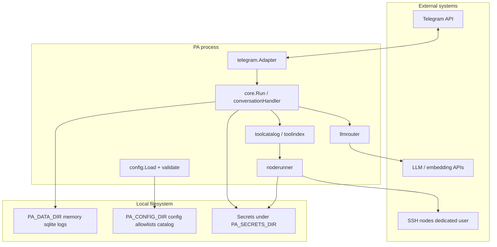

# PersonalAssistant — Threat model (code-grounded)

**Document type:** Design-time threat model derived from source code and operator documentation — **not** a penetration test or formal certification.  
**Date:** 2026-03-20  
**Repository revision analysed:** `5fa2de4a92d816a51530f3bde76efa89b4c99b77`  
**Scope:** Whole product (`cmd/pa`, `internal/*`, `docs/`, config contract).  
**Skill:** [threat-model-report.skill.md](../ai-sdlc/specification/skills/threat-model-report.skill.md)

---

## 1. System overview

PersonalAssistant is a single Go binary (`pa`) that runs a **Telegram** bot (long polling), forwards allowed users’ messages through **`internal/core`** to configured **LLM providers**, optionally uses **vector search** over a local SQLite (sqlite-vec) index and **markdown memory**, and may execute **catalog-defined tools** by running **allowlisted commands** on remote **SSH nodes** (`internal/noderunner`, `internal/ssh`). Optional **scheduled tasks** (`internal/scheduler`) and **summarization** CLI modes exist. Secrets and API keys are **file-backed**; paths are resolved via **`PA_CONFIG_DIR`**, **`PA_DATA_DIR`**, **`PA_SECRETS_DIR`** (see [docs/configuration.md](../docs/configuration.md)).

---

## 2. Architecture and trust boundaries

**Trust zones**

1. **Untrusted at message semantics:** Telegram user text is **untrusted content** that becomes LLM input; it can influence tool calls within schema and catalog rules.  
2. **Semi-trusted:** Users listed in `telegram.users_path` are **authenticated** to the bot by Telegram identity + allowlist (`internal/telegram/adapter.go`).  
3. **Trusted operator:** Host OS, file permissions on config/secrets, and integrity of `config.json`, allowlists, and `tools.yaml`.  
4. **Third-party trust:** LLM and embedding providers receive prompts and tool results over TLS per client configuration.

---

## 3. Assets

| Asset | Location / flow | Sensitivity |
|-------|-----------------|-------------|
| Telegram bot token | File via `telegram.token_path` | Critical |
| Allowed user list | `telegram.users_path` | High |
| LLM / embedding API keys | Paths in `config.json` | Critical |
| SSH private keys for nodes | `nodes.*.auth.private_key_path` | Critical |
| Main config | `PA_CONFIG_DIR/config.json` | High — defines behaviour and paths |
| Tool catalog | Path under `paths.tool_catalog_path` | High — defines executable templates |
| Per-node allowlists | `command_allowlist_path` | High |
| Memory / vector index / logs | `PA_DATA_DIR` | Medium–High (conversation content) |
| Optional LLM JSONL logs | `paths.llm_log_dir` | High if unredacted patterns miss secrets |

---

## 4. Threat actors

| Actor | Reach | Typical goal |
|-------|-------|--------------|
| **Anonymous external** | No Telegram allowlist → no bot access; may attack **host**, **Docker**, or **exposed services** if misconfigured | Token theft, RCE on host |
| **Allowed Telegram user** | Full chat + indirect tool invocation | Abuse tools within allowlist, prompt-style manipulation, resource burn |
| **Operator / insider** | Full disk access | Read all secrets and memory |
| **Compromised LLM provider path** | TLS channel to API | Data exfiltration to vendor policy |
| **Compromised node** | SSH as dedicated user | Lateral movement; not PA bypass if keys safe |

---

## 5. STRIDE analysis

| Category | Applicable threats | Controls in codebase / docs | Gaps / notes |
|----------|-------------------|----------------------------|--------------|
| **Spoofing** | Impersonate bot or user | Telegram token proves bot identity to API; inbound users checked against `allowedUserIDs` (`adapter.go`) | Stolen token file → full bot compromise |
| **Tampering** | Alter config/catalog while running | Config loaded at startup; operator must protect files | Runtime file swap until restart |
| **Repudiation** | Deny having sent a message | Not a product goal; Telegram + logs may offer operator audit | No built-in non-repudiation |
| **Information disclosure** | Secrets in logs, DEBUG dumps, tool errors | `logredact`, `BuildLogRedactor`, redacted tool invocation INFO (`handler.go`); LLM JSONL redaction (`llmlog`); noderunner **log** attrs redacted when `SetLogRedactor` set (`runner.go`) | `PA_LOG_LEVEL=debug` logs full LLM I/O ([configuration.md](../docs/configuration.md)); tool **returned** errors may embed raw truncated remote stdout/stderr for diagnostics |
| **Denial of service** | Flood messages / LLM / SSH | No per-user rate limit in app | Mitigate via Telegram limits, reverse proxy, or external throttling |
| **Elevation of privilege** | Arbitrary command on node | Allowlist (`allowlist` + `noderunner`; load rejects invalid `*` patterns), `cmdsafe.ValidateRemoteCommand` (rune set then REQ-04.031 shell sequences) in `noderunner.RunOnNode` and `core.executeOneToolCall` before SSH, catalog validation (`toolcatalog`) | **Misconfigured** wide allowlist or dangerous template remains the main risk |

---

## 6. Security controls (evidence-based)

- **Config fail-fast:** `internal/config/load.go` — validation including `tools.llm_escalation`, paths, tool pre-selection minima, `log_redaction` required.  
- **Telegram gate:** `internal/telegram/adapter.go` — empty `users_path` → allow-none behaviour (tests document).  
- **LLM transport:** `internal/llmrouter` — bounded completion attempts; retry only on classified transport failures (`classifier.go`, `policy.go`).  
- **Tool path typing:** `internal/core/toolfailure`, `internal/escalationpolicy` — escalation decisions use typed errors, not string matching alone.  
- **Remote exec:** `cmdsafe.ValidateRemoteCommand` in `internal/noderunner/runner.go` (before allowlist + SSH) and `internal/core/handler.go` `executeOneToolCall` (catalog-substituted commands before `RunOnNode`); allowlist check in runner; truncated streams in logs/errors; optional log redactor from `cmd/pa` via `core.BuildLogRedactor`.  
- **SSH client:** `internal/ssh` — dedicated user model; startup handshake behaviour documented in [operations.md](../docs/operations.md).  
- **Secrets layout:** [configuration.md](../docs/configuration.md), [docker.md](../docs/docker.md) — file-based secrets, Compose secret mounts.  
- **Quality gate:** `Makefile` — `make check` (vet, golangci-lint, integration tests, module boundaries).

---

## 7. Gaps and residual risks

1. **Trusted user = trusted input to LLM** — No isolation between allowed users beyond shared bot policy (single-tenant mental model).  
2. **No in-app rate limiting** for messages or tool rounds beyond existing caps (e.g. max tool rounds in handler).  
3. **Third-party LLM** visibility of prompts, tool outputs, and escalation chain usage.  
4. **Dependency and supply-chain** risk standard for Go modules and base container images.  
5. **Absolute paths in config** — Used as-is; Docker mis-mount can break keys or widen exposure if host paths leak into container unintentionally.  
6. **Scheduler / summarization** paths run with same process privileges and config — compromise of scheduled task definitions file equals behaviour change on load.

---

## 8. Recommendations

**Operators**

- Keep `users_path` minimal; never commit `.secrets/` or real `config.json` with secrets.  
- Prefer bare secret filenames + `PA_SECRETS_DIR` for Docker ([docker.md](../docs/docker.md)).  
- Use `./pa -verify-nodes` before production reliance on SSH tools ([operations.md](../docs/operations.md)).  
- Avoid `PA_LOG_LEVEL=debug` except short-lived diagnostics.  
- Tighten allowlists: smallest command set; review catalog templates for injectable argument values.

**Development (future, conditional)**

- Optional `/health` or readiness for orchestration (see analytics comparison reports) — only if product scope expands.  
- Document per-deployment **threat model delta** when adding HTTP surfaces or new channels.

**Out of scope for this document**

- Telegram or cloud provider security assessments.  
- Formal compliance mapping (SOC2, ISO, etc.).

---

## 9. References

| Resource | Path |
|----------|------|
| Configuration and secrets | [docs/configuration.md](../docs/configuration.md) |
| Operations / verify-nodes | [docs/operations.md](../docs/operations.md) |
| Docker and secrets | [docs/docker.md](../docs/docker.md) |
| Troubleshooting SSH/tools | [docs/troubleshooting.md](../docs/troubleshooting.md) |
| Project rules | [AGENTS.md](../AGENTS.md) |
| Product entry | [README.md](../README.md) |
| Example epic (tools / escalation context) | [epics/EP-006/ep-scope.md](epics/EP-006/ep-scope.md) |

---

*Generated following the repository threat-model-report skill; update this file when security-relevant code or operator contracts change materially.*
