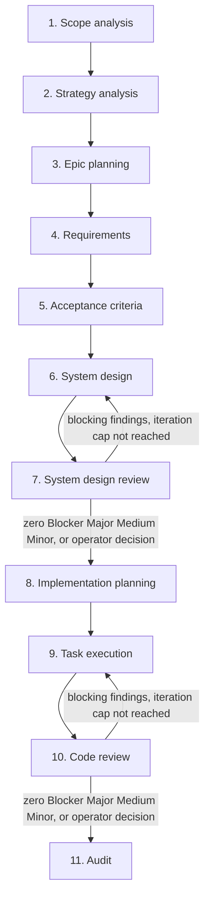

# SDLC Pipeline — ai-sdlc

**Purpose:** This document specifies the agentic SDLC process: **11 stages** from project scope analysis through strategy, epic planning, requirements, acceptance criteria, system design, system design review, implementation planning, task execution, code review, and audit. Stages 3–11 run for each epic in execution order: 3 → 4 → 5 → 6 → 7 → 8 → 9 → 10 → 11. **Stages 6 and 7** may repeat as **iterations** (same stage numbers; see **§2.1**) until design review exit criteria are met. **Stages 9 and 10** may repeat as **iterations** (see **§2.2**) until code review exit criteria are met. It is the single source of truth for how epics are elaborated with agent-driven workflows. Each stage maps to a **skill file** under [specification/skills/](skills/); agent instructions live only in skills (no separate roles or prompts).

**Artefact paths:** Project-level artefacts (scope.md, strategy.md) live in the **ai-sdlc-artefacts/** root. Epic-level outputs live under **ai-sdlc-artefacts/epics/<epic-id>/** (e.g. `ai-sdlc-artefacts/epics/EP-001/`).
Paths in this spec and in skills use that convention; no references to outside of that folders in links.

**Artefact levels:** Project-level (scope.md, strategy.md) in `ai-sdlc-artefacts/`. Epic-level artefacts (ep-scope, ep-requirements, ep-acceptance-criteria, ep-system-design, ep-system-design-review, ep-implementation-plan, **ep-code-review** when saved, ep-audit-report) live in `epics/<epic-id>/`. **`ep-code-review.md`** may hold **§2.2** per-iteration sections (see **§2.2** and stage 10 skill).

**Human-in-the-loop:** Pipeline execution is cooperative. When a stage has multiple valid outcomes (e.g. artefact naming, document structure, file placement), the agent MUST list options and ask the user to choose before proceeding. See also skills [README](skills/README.md) (Common behaviour).

---

## Agent execution expectations (normative)

**Relationship to repo root [AGENTS.md](../../AGENTS.md):** Workspace rules that apply to any task in this repository (cooperation, permissions to change product code, commits, secrets, chat language, principles such as KISS / fail fast, **`make check`** after substantive code edits when commands are allowed) live there.

**Relationship to [ai-sdlc README](../README.md):** That file is the **directory index** for `ai-sdlc/` (what lives where). **This specification** and the **stage skills** define pipeline behaviour.

- **Single process:** Execute stages using the table in §2, **Human-in-the-loop** above, and **§3** for delegated stages **7** and **10**. Do **not** invent a parallel SDLC.
- **Repository truth:** Prefer approved content under **`ai-sdlc-artefacts/`** and the product codebase over unofficial external write-ups when deciding how *this* project should behave.
- **Implementation plan (stages 8 → 9):** The epic **`ep-implementation-plan.md`** is produced by pipeline **stage 8** ([08-implementation-planning.skill.md](skills/08-implementation-planning.skill.md)). **Executing** that plan is **stage 9** only — follow [09-task-execution.skill.md](skills/09-task-execution.skill.md) (one task at a time from the plan, verification and checkpoints per skill; do not treat the plan as an informal checklist outside stage 9).
- **Acceptance criteria coverage:** Before treating an epic as complete from an AC↔test perspective, run `./bin/validate EP-XXX` from the repository root (after `make build` if needed). For project-wide AC coverage, run `./bin/validate` with no arguments. See [VALIDATION.md](../tools/validate/VALIDATION.md) and the [validate tool README](../tools/validate/README.md) under `ai-sdlc/tools/validate/`.

---

## 1. Pipeline overview

---

## 2. Stage descriptions: skill mapping and I/O

Each stage lists its **skill file** (under `specification/skills/`), purpose, main inputs, and output artefact path. Project-level outputs are under `ai-sdlc-artefacts/`; epic-level under `ai-sdlc-artefacts/epics/<epic-id>/`. Required sections and structure of each artefact are defined in the corresponding skill file (e.g. "Output structure" or "Document sections"), not in separate template files.

| Stage | Skill | Purpose (short) | Main inputs | Outputs (artefact path) |
|-------|-------|-----------------|-------------|--------------------------|
| 1. Scope analysis | [01-scope-analysis.skill.md](skills/01-scope-analysis.skill.md) | Project scope from chat/request | Chat / request | scope.md |
| 2. Strategy analysis | [02-strategy-analysis.skill.md](skills/02-strategy-analysis.skill.md) | Delivery + test strategy | scope.md | strategy.md |
| 3. Epic planning | [03-epic-planning.skill.md](skills/03-epic-planning.skill.md) | Epic scope per epic; **creates epic git branch at start** of stage (see skill), writes `ep-scope.md` after approval **on that branch** | scope, strategy | epics/<epic-id>/ep-scope.md |
| 4. Requirements | [04-requirements.skill.md](skills/04-requirements.skill.md) | Epic requirements | ep-scope.md | epics/<epic-id>/ep-requirements.md |
| 5. Acceptance criteria | [05-acceptance-criteria.skill.md](skills/05-acceptance-criteria.skill.md) | Epic-level testable conditions | ep-scope.md, ep-requirements.md | epics/<epic-id>/ep-acceptance-criteria.md |
| 6. System design | [06-system-design.skill.md](skills/06-system-design.skill.md) | Components, interfaces, decisions (may repeat per **§2.1** after stage 7) | ep-requirements.md, ep-acceptance-criteria.md; optional: latest `ep-system-design-review.md` iteration | epics/<epic-id>/ep-system-design.md |
| 7. System design review | [07-system-design-review.skill.md](skills/07-system-design-review.skill.md) | Quality and traceability review of design (may repeat per **§2.1**) | ep-scope.md, ep-requirements.md, ep-acceptance-criteria.md, ep-system-design.md | epics/<epic-id>/ep-system-design-review.md |
| 8. Implementation planning | [08-implementation-planning.skill.md](skills/08-implementation-planning.skill.md) | Tasks, ordering, verification per epic | ep-scope.md, ep-requirements.md, ep-acceptance-criteria.md, ep-system-design.md; **recommended:** ep-system-design-review.md | epics/<epic-id>/ep-implementation-plan.md |
| 9. Task execution | [09-task-execution.skill.md](skills/09-task-execution.skill.md) | Implement plan → codebase (may repeat per **§2.2** after stage 10) | ep-implementation-plan.md; optional: latest `ep-code-review.md` iteration | repo (codebase) |
| 10. Code review | [10-code-review.skill.md](skills/10-code-review.skill.md) | Structured review of change set (may repeat per **§2.2**) | Diff / PR / paths; optional epic artefacts | Chat; **ep-code-review.md** when saved (see skill; **§2.2** iteration sections) |
| 11. Audit | [11-audit.skill.md](skills/11-audit.skill.md) | Status report from current branch | Current branch | epics/<epic-id>/ep-audit-report.md |

### 2.1 System design ↔ system design review iteration (stages 6 and 7)

Stages **6** and **7** are **re-entrant**: after **stage 7** finds issues in **`ep-system-design.md`**, run **stage 6** again to apply fixes, then run **stage 7** again on the updated design. Stage numbers **do not change**; each pass is another **iteration** of the same stages.

**Exit the iteration loop** when the latest **stage 7** report records **zero** open findings with severity **Blocker**, **Major**, **Medium**, and **Minor** (severity definitions and report layout: [07-system-design-review.skill.md](skills/07-system-design-review.skill.md)).

**Iteration cap:** After **five** completed **stage 7** iterations, if any **Blocker**, **Major**, **Medium**, or **Minor** finding **remains**, **stop** the cycle and obtain an explicit **operator decision** (e.g. accept residual risk, narrow scope, redesign approach, or written override) before **stage 8** or further automated passes.

**Artefact `ep-system-design-review.md`:** **One file per epic**, containing a **separate top-level section per iteration** (e.g. `## Review iteration 1` … `## Review iteration N`) as specified in the stage 7 skill—preserve prior iterations when adding a new one.

**Delegation:** Each **stage 7** run MUST follow [§3](#3-delegated-execution-mandatory-subagent-stages-7-and-10) (fresh reviewer context), including **every** iteration after material edits to `ep-system-design.md`.

### 2.2 Task execution ↔ code review iteration (stages 9 and 10)

Stages **9** and **10** are **re-entrant** for a bounded change set (e.g. epic branch / PR for **EP-XXX**): after **stage 10** records **Blocker**, **Major**, **Medium**, or **Minor** findings on that change set, run **stage 9** again to apply fixes in the repo, then run **stage 10** again on the **updated** diff (same epic scope; refresh paths or `base..head` as needed). Stage numbers **do not change**; each pass is another **iteration** of the same stages.

**Exit the iteration loop** when the latest **stage 10** report records **zero** open findings with severity **Blocker**, **Major**, **Medium**, and **Minor** (definitions: [10-code-review.skill.md](skills/10-code-review.skill.md)). **Nit** and **Suggestion** do not block exit.

**Iteration cap:** After **five** completed **stage 10** iterations, if any **Blocker**, **Major**, **Medium**, or **Minor** finding **remains**, **stop** the cycle and obtain an explicit **operator decision** before **stage 11** or further automated passes.

**Artefact `ep-code-review.md`:** **One file per epic** when persisting reviews, containing a **separate top-level section per iteration** (e.g. `## Review iteration 1` … `## Review iteration N`) as specified in the stage 10 skill—preserve prior iterations when appending. (Reviews may still be drafted in chat first; save per skill and user approval.)

**Delegation:** Each **stage 10** run MUST follow [§3](#3-delegated-execution-mandatory-subagent-stages-7-and-10) (fresh reviewer context), including **every** iteration after **material code changes** from stage 9.

---

## 3. Delegated execution (mandatory subagent: stages 7 and 10)

**Purpose:** Stages **7** (system design review) and **10** (code review) MUST run in a **separate agent session** from the work they critique, so the reviewer has clean context and is not biased by having just authored the design or the code.

**MUST (when the environment supports subagents):**

- **Stage 7** — The **orchestrating** agent (or human) **delegates** stage 7 to a **subagent** (or Cursor **Task** / equivalent) whose only job is to execute [07-system-design-review.skill.md](skills/07-system-design-review.skill.md) for the given epic: read `ep-scope.md`, `ep-requirements.md`, `ep-acceptance-criteria.md`, `ep-system-design.md`, and produce the review (draft in chat until user approves **save**, per skill). The subagent MUST NOT be the same linear chat session that **wrote** `ep-system-design.md` in one uninterrupted flow without handoff (start a new delegated run for the review). This applies to **every** stage 7 iteration in the **§2.1** cycle (each pass after material design changes needs a new delegated review).

- **Stage 10** — The **orchestrating** agent **delegates** stage 10 to a **subagent** whose only job is to execute [10-code-review.skill.md](skills/10-code-review.skill.md) on the agreed change set (PR, branch range, or paths). Review stays **readonly** on the repo unless the user explicitly asks the reviewer to edit. Output is chat-first; optional `ep-code-review.md` when the user asks to save (for **§2.2**, append **`## Review iteration N`** per skill). This applies to **every** stage 10 iteration in the **§2.2** cycle (each pass after material code changes needs a new delegated review).

**Orchestrator responsibilities:** Provide epic id (`EP-XXX`) or explicit paths, confirm inputs exist, invoke the subagent with a short brief (e.g. “Run pipeline **stage 7** per skill …” or “Run pipeline **stage 10** per skill …”), then present the subagent’s output to the user for approval and file writes per skill rules.

**Enforcement:** This is a **process rule** in git (this spec + skills). **CI cannot verify** that a subagent was used; compliance depends on agents following **this specification** (including **Agent execution expectations** above), the mapped **stage skills**, and—when locating process files—the [ai-sdlc README](../README.md).

**SHOULD (when subagents are unavailable):** Open a **new chat / composer** with fresh context, state in the first message that the run is **only** pipeline stage 7 or **only** stage 10, paste the skill name and epic id or diff scope, and execute the same skill end-to-end—**without** carrying over the prior author-session transcript. That is treated as equivalent to a subagent for compliance with this section.

---

## 4. Artefact file naming

**Project-level** (under `ai-sdlc-artefacts/`):

| Artefact | Filename |
|----------|----------|
| Project scope | scope.md |
| Delivery + test strategy | strategy.md |

**Epic-level** (under `ai-sdlc-artefacts/epics/<epic-id>/`):

| Artefact | Filename |
|----------|----------|
| Epic scope | ep-scope.md |
| Epic requirements | ep-requirements.md |
| Epic acceptance criteria | ep-acceptance-criteria.md |
| Epic system design | ep-system-design.md |
| System design review report | ep-system-design-review.md |
| Implementation plan (tasks + ordering) | ep-implementation-plan.md |
| Code review (saved; optional; **§2.2** uses one file, per-iteration sections) | ep-code-review.md |
| Audit report | ep-audit-report.md |

---

## 5. Traceability

- **scope.md** → strategy.md → ep-scope.md → ep-requirements.md → ep-acceptance-criteria.md → **(ep-system-design.md ↔ ep-system-design-review.md)** — iterate per **§2.1** until exit criteria or operator decision → ep-implementation-plan.md → **(task execution / repo ↔ code review stage 10)** — iterate per **§2.2** until exit criteria or operator decision → chat and/or **ep-code-review.md** (per-iteration sections when saved) → **stage 11** → ep-audit-report.md.

**References:** Links in artefacts may point only to paths under `ai-sdlc-artefacts/`. Every linked document must exist (no broken links). Skills must enforce this rule.

If an upstream artefact changes, downstream stages and artefacts must be reviewed and updated so traceability is preserved (no dedicated pipeline stage—cooperate with the user on scope of updates). When multiple valid levels of change exist for alignment, ask the user.

---

## 6. Summary diagram

```mermaid
flowchart LR
  subgraph project [Project]
    scope[scope]
    strategy[strategy]
  end
  subgraph epic [Epic]
    ep_scope[ep-scope]
    ep_req[ep-requirements]
    ep_ac[ep-acceptance-criteria]
    ep_design[ep-system-design]
    ep_rev[ep-system-design-review]
    ep_impl[ep-implementation-plan]
    repo[Repo]
    ep_cr[ep-code-review]
    ep_audit[ep-audit-report]
  end
  scope --> strategy --> ep_scope --> ep_req --> ep_ac --> ep_design --> ep_rev
  ep_rev -.->|iterate stages 6-7 per 2.1| ep_design
  ep_rev --> ep_impl --> repo
  repo --> ep_cr
  ep_cr -.->|iterate stages 9-10 per 2.2| repo
  ep_cr --> ep_audit
```

**Stage 10 (code review)** runs after task execution (stage 9) and before **stage 11 (audit)** (`ep-audit-report.md`). Output is **chat-first**; **`ep-code-review.md`** when saved holds optional notes or, under **§2.2**, **per-iteration** sections (see [10-code-review.skill.md](skills/10-code-review.skill.md)).

**Context for AI:** Each step's context is everything upstream in the chain. When building the implementation plan (stage 8), the agent's context includes ep-scope, ep-requirements, ep-acceptance-criteria, ep-system-design, and **should include** ep-system-design-review.md when that file exists after stage 7 (including **all** iteration sections per **§2.1**). Do not start stage 8 until **§2.1** exit criteria are met or the operator has recorded a decision after the iteration cap.

When running **stage 11** for an epic delivery path, the agent’s context **should include** **ep-code-review.md** when present (**all** `## Review iteration N` sections per **§2.2**). Do not treat the code-review gate as complete for that path until **§2.2** exit criteria are met or the operator has recorded a decision after the iteration cap.
