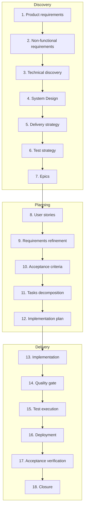

# SDLC Pipeline — ai-sdlc

**Purpose:** This document specifies the agentic SDLC process: 18 stages from product discovery through planning to delivery and closure. It is the single source of truth for how epics are elaborated with agent-driven workflows. Each stage maps to a **skill file** under [specification/skills/](skills/); agent instructions live only in skills (no separate roles or prompts).

**Artefact paths:** All execution outputs live under **ai-sdlc-artefacts/epics/<epic-id>** (e.g. `ai-sdlc-artefacts/epics/ep-104/`). Paths in this spec and in skills use that convention; no references to `docs/EP-104` or other legacy paths in links.

**Artefact levels:** Epic-level artefacts (requirements, design, test strategy, user stories index, implementation plan, coverage) live in `epics/<epic-id>/`. Story-level artefacts (e.g. acceptance criteria) live in `epics/<epic-id>/stories/<story-id>/` (e.g. `stories/US-01/acceptance-criteria.md`).

---

## 1. Pipeline overview

---

## 2. Stage descriptions: skill mapping and I/O

Each stage lists its **skill file** (under `specification/skills/`), purpose, main inputs, and output artefact path under `ai-sdlc-artefacts/epics/<epic-id>/`.

| Stage | Skill | Purpose (short) | Main inputs | Outputs (artefact path) |
|-------|-------|-----------------|-------------|--------------------------|
| 1. Product requirements | [01-product-requirements.skill.md](skills/01-product-requirements.skill.md) | Product vision, scope, functional behaviour | Vision, problem, constraints | 01-02-requirements.md |
| 2. Non-functional requirements | [02-nfr.skill.md](skills/02-nfr.skill.md) | Quality attributes, constraints (security, deploy, observability) | Product reqs, platform, compliance | 01-02-requirements.md (NFR section) |
| 3. Technical discovery | [03-technical-discovery.skill.md](skills/03-technical-discovery.skill.md) | Options, comparison, recommendation, risks | Reqs, platform, open questions | 03-technical-discovery.md, research/ |
| 4. System Design | [04-system-design.skill.md](skills/04-system-design.skill.md) | Components, interfaces, data models, decisions | Reqs, research | 04-system-design.md |
| 5. Delivery strategy | [05-delivery-strategy.skill.md](skills/05-delivery-strategy.skill.md) | Increments (Prototype/MVP/MLP/v1), scope per increment | Reqs, architecture, risks, priorities | 05-delivery-strategy.md |
| 6. Test strategy | [06-test-strategy.skill.md](skills/06-test-strategy.skill.md) | Test levels, AC mapping, coverage approach | Reqs, AC (if any), architecture | 06-test-strategy.md, 06-manual-test-plan.md |
| 7. Epics | [07-epics.skill.md](skills/07-epics.skill.md) | Epic list: ID, title, scope, traceability | Scope, delivery strategy | 07-epic-list.md |
| 8. User stories | [08-user-stories.skill.md](skills/08-user-stories.skill.md) | User stories (As/I want/So that), trace to REQ | Reqs, epic scope | 08-user-stories.md |
| 9. Requirements refinement | [09-requirements-refinement.skill.md](skills/09-requirements-refinement.skill.md) | Refine REQ, glossary, conditions for AC | User stories, reqs, questions | (refined in 01-02, 08) |
| 10. Acceptance criteria | [10-acceptance-criteria.skill.md](skills/10-acceptance-criteria.skill.md) | Testable conditions, Gherkin, trace to REQ/US | User stories, refined reqs, test strategy | stories/<story-id>/acceptance-criteria.md (per story); optional epic index: 10-acceptance-criteria.md |
| 11. Tasks decomposition | [11-tasks-decomposition.skill.md](skills/11-tasks-decomposition.skill.md) | Task list, dependencies, trace to US/AC/REQ | User stories, AC, architecture, test strategy | 11-12-implementation-plan.md (task part) |
| 12. Implementation plan | [12-implementation-plan.skill.md](skills/12-implementation-plan.skill.md) | Ordered tasks, checkpoints, verification, parallel work | Task list, architecture, test strategy | 11-12-implementation-plan.md |
| 13. Implementation | [13-implementation.skill.md](skills/13-implementation.skill.md) | Execute plan: code, config, checkpoints | Implementation plan, system design | repo (codebase) |
| 14. Quality gate | [14-quality-gate.skill.md](skills/14-quality-gate.skill.md) | Review, static analysis, lint; pass/fail for promotion | Implemented code, review criteria | repo, CI |
| 15. Test execution | [15-test-execution.skill.md](skills/15-test-execution.skill.md) | Run tests, record results and coverage | Test strategy, AC, artifacts | 15-current-coverage.md, test reports |
| 16. Deployment | [16-deployment.skill.md](skills/16-deployment.skill.md) | Build, deploy to target env(s), release id | Approved artifacts, deployment config | env, release notes |
| 17. Acceptance verification | [17-acceptance-verification.skill.md](skills/17-acceptance-verification.skill.md) | Confirm AC in deployed system, sign-off | Deployed system, AC, test results | backlog / tracker |
| 18. Closure | [18-closure.skill.md](skills/18-closure.skill.md) | Close epic, retrospective, update docs | Acceptance result, epic, feedback | docs, backlog |

---

## 3. Artefact file naming

**Epic-level** (under `ai-sdlc-artefacts/epics/<epic-id>/`):

| Artefact | Filename |
|----------|----------|
| Product + NFR requirements | 01-02-requirements.md |
| Technical discovery | 03-technical-discovery.md |
| System design | 04-system-design.md |
| Delivery strategy | 05-delivery-strategy.md |
| Test strategy | 06-test-strategy.md |
| Manual test plan | 06-manual-test-plan.md |
| Epic list | 07-epic-list.md |
| User stories | 08-user-stories.md |
| Acceptance criteria (optional index) | 10-acceptance-criteria.md — links to per-story AC; source of truth is story-level |
| Implementation plan (tasks + ordering) | 11-12-implementation-plan.md |
| Current coverage | 15-current-coverage.md |
| Research docs | research/ (one or more files) |

**Story-level** (under `ai-sdlc-artefacts/epics/<epic-id>/stories/<story-id>/`):

| Artefact | Filename |
|----------|----------|
| Acceptance criteria (source of truth) | acceptance-criteria.md |

---

## 4. Traceability

- **Product requirements** → NFR, Research, System Design, Epics, User stories, AC, Tasks, Implementation plan.
- **User stories** → Acceptance criteria, Tasks decomposition, Implementation plan.
- **Acceptance criteria** → Test strategy, Tasks, Implementation plan (verification), Current coverage.
- **Tasks decomposition** → Implementation plan (ordering and parallelism).
- **Implementation plan** → Implementation (13), Quality gate (14), Test execution (15), Deployment (16), Acceptance verification (17), Closure (18).

If stage *N*'s output changes, every stage *N+1 … 18* that consumes it must be reviewed and updated so traceability is preserved.
