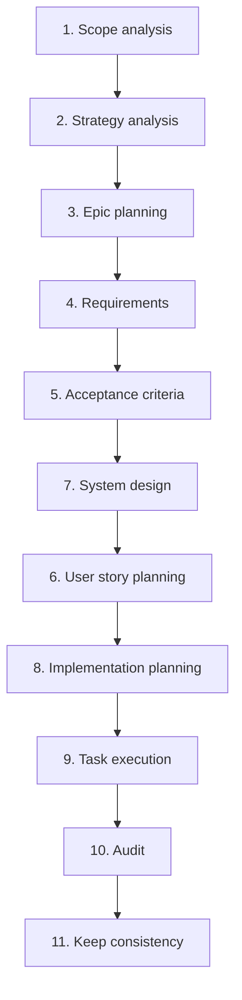
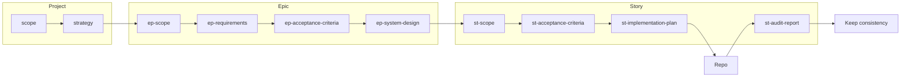

# SDLC Pipeline — ai-sdlc

**Purpose:** This document specifies the agentic SDLC process: 11 stages from scope analysis through strategy, epic planning, requirements, acceptance criteria, system design, user story planning, implementation planning, task execution, audit, and keep consistency. Stages 3–8 run in execution order: 3 → 4 → 5 → 7 → 6 → 8 (system design before user story planning). It is the single source of truth for how epics are elaborated with agent-driven workflows. Each stage maps to a **skill file** under [specification/skills/](skills/); agent instructions live only in skills (no separate roles or prompts).

**Artefact paths:** Project-level artefacts (scope.md, strategy.md) live in the **ai-sdlc-artefacts/** root. Epic-level outputs live under **ai-sdlc-artefacts/epics/<epic-id>/** (e.g. `ai-sdlc-artefacts/epics/EP-104/`). 
Story-level outputs live under **ai-sdlc-artefacts/epics/<epic-id>/stories/<story-id>** (e.g. `ai-sdlc-artefacts/epics/EP-104/stories/US-01/`).
Paths in this spec and in skills use that convention; no references to outside of that folders in links.

**Artefact levels:** Project-level (scope.md, strategy.md) in `ai-sdlc-artefacts/`. Epic-level artefacts (ep-scope, ep-requirements, ep-acceptance-criteria, ep-system-design) live in `epics/<epic-id>/`. Story-level artefacts (st-scope, st-acceptance-criteria, st-implementation-plan, st-audit-report) live in `epics/<epic-id>/stories/<story-id>/`. Story-level AC are derived from or assigned from ep-acceptance-criteria.

**Human-in-the-loop:** Pipeline execution is cooperative. When a stage has multiple valid outcomes (e.g. artefact naming, document structure, file placement), the agent MUST list options and ask the user to choose before proceeding. See also skills [README](skills/README.md) (Common behaviour).

**Legacy** The folder `epics/<epic-id>/stories/<story-id>/legacy` contains the legacy docuemnts DON'T change them, use as a reference only.

---

## 1. Pipeline overview

---

## 2. Stage descriptions: skill mapping and I/O

Each stage lists its **skill file** (under `specification/skills/`), purpose, main inputs, and output artefact path. Project-level outputs are under `ai-sdlc-artefacts/`; epic-level under `ai-sdlc-artefacts/epics/<epic-id>/`; story-level under `ai-sdlc-artefacts/epics/<epic-id>/stories/<story-id>/`. Required sections and structure of each artefact are defined in the corresponding skill file (e.g. "Output structure" or "Document sections"), not in separate template files.

| Stage | Skill | Purpose (short) | Main inputs | Outputs (artefact path) |
|-------|-------|-----------------|-------------|--------------------------|
| 1. Scope analysis | [01-scope-analysis.skill.md](skills/01-scope-analysis.skill.md) | Project scope from chat/request | Chat / request | scope.md |
| 2. Strategy analysis | [02-strategy-analysis.skill.md](skills/02-strategy-analysis.skill.md) | Delivery + test strategy | scope.md | strategy.md |
| 3. Epic planning | [03-epic-planning.skill.md](skills/03-epic-planning.skill.md) | Epic scope per epic | scope, strategy | epics/<epic-id>/ep-scope.md |
| 4. Requirements | [04-requirements.skill.md](skills/04-requirements.skill.md) | Epic requirements | ep-scope.md | epics/<epic-id>/ep-requirements.md |
| 5. Acceptance criteria | [05-acceptance-criteria.skill.md](skills/05-acceptance-criteria.skill.md) | Epic-level testable conditions | ep-scope.md, ep-requirements.md | epics/<epic-id>/ep-acceptance-criteria.md |
| 7. System design | [07-system-design.skill.md](skills/07-system-design.skill.md) | Components, interfaces, decisions | ep-requirements.md, ep-acceptance-criteria.md | epics/<epic-id>/ep-system-design.md |
| 6. User story planning | [06-user-story-planning.skill.md](skills/06-user-story-planning.skill.md) | Story scope per story | ep-scope.md, ep-requirements.md, ep-acceptance-criteria.md, ep-system-design.md | epics/<epic-id>/stories/<story-id>/st-scope.md, st-acceptance-criteria.md |
| 8. Implementation planning | [08-implementation-planning.skill.md](skills/08-implementation-planning.skill.md) | Tasks, ordering, verification per story | st-scope, st-acceptance-criteria, US + AC | stories/<story-id>/st-implementation-plan.md |
| 9. Task execution | [09-task-execution.skill.md](skills/09-task-execution.skill.md) | Execute plan → commits | st-implementation-plan.md | repo (codebase) |
| 10. Audit | [10-audit.skill.md](skills/10-audit.skill.md) | Status report from current branch | Current branch | stories/<story-id>/st-audit-report.md |
| 11. Keep consistency | [11-keep-consistency.skill.md](skills/11-keep-consistency.skill.md) | Update artefacts from audit report | st-audit-report | Updated artefacts (no single file) |

---

## 3. Artefact file naming

**Project-level** (under `ai-sdlc-artefacts/`):

| Artefact | Filename |
|----------|----------|
| Project scope | scope.md |
| Delivery + test strategy | strategy.md |

**Epic-level** (under `ai-sdlc-artefacts/epics/<epic-id>/`):

| Artefact | Filename |
|----------|----------|
| Epic scope | ep-scope.md |
| Epic requirements | ep-requirements.md |
| Epic acceptance criteria | ep-acceptance-criteria.md |
| Epic system design | ep-system-design.md |

**Story-level** (under `ai-sdlc-artefacts/epics/<epic-id>/stories/<story-id>/`):

| Artefact | Filename |
|----------|----------|
| Story scope | st-scope.md |
| Acceptance criteria (source of truth) | st-acceptance-criteria.md |
| Implementation plan (tasks + ordering) | st-implementation-plan.md |
| Audit report | st-audit-report.md |

---

## 4. Traceability

- **scope.md** → strategy.md → ep-scope.md → ep-requirements.md → ep-acceptance-criteria.md → ep-system-design.md → st-scope.md → st-acceptance-criteria.md → st-implementation-plan.md → task execution (repo) → st-audit-report.md → keep consistency (updated artefacts).

When building st-acceptance-criteria, the agent's context also includes ep-acceptance-criteria (story-level AC are derived from or assigned from epic-level AC).

**References:** Links in artefacts may point only to paths under `ai-sdlc-artefacts/`. Every linked document must exist (no broken links). Skills must enforce this rule.

If an upstream artefact changes, downstream stages and artefacts must be reviewed and updated so traceability is preserved. The upstream artefacts are more importante for aligment process, if you have options what level change for reaching consistency - ask user. 

---

## 5. Summary diagram

**Context for AI:** Each step's context is everything upstream in the chain. When building st-acceptance-criteria, the agent's context also includes ep-acceptance-criteria.
