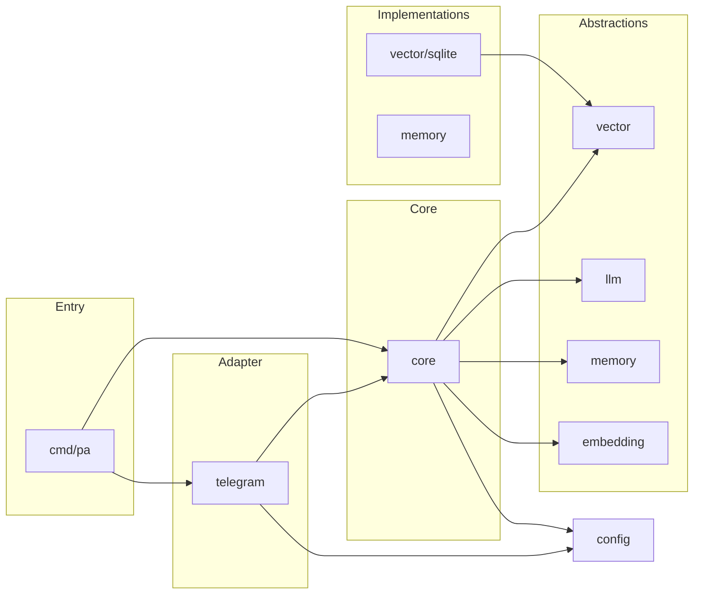

# System Design: EP-104 PersonalAssistant MVP

**Purpose:** Define architecture, components, interfaces, data models, error handling, and key technical decisions.  
**Pipeline:** [PIPELINE.SPEC.md](PIPELINE.SPEC.md)  
**Previous:** [03-technical-discovery.md](03-technical-discovery.md)  
**Next:** [05-delivery-strategy.md](05-delivery-strategy.md)  
**Related:** [01-02-requirements.md](01-02-requirements.md), [05-delivery-strategy.md](05-delivery-strategy.md), [11-12-implementation-plan.md](11-12-implementation-plan.md)

---

## Table of contents

1. [Overview](#1-overview)
2. [Architecture](#2-architecture)
3. [Components and interfaces](#3-components-and-interfaces)
4. [Data models](#4-data-models)
5. [Error handling](#5-error-handling)
6. [Testing strategy](#6-testing-strategy)

---

## 1. Overview

Single-binary Go application (Option B from [research §5 Proposed design](03-technical-discovery.md#5-section-4-proposed-design-to-be)): one process with clear boundaries between Telegram adapter, core orchestration, memory store, vector index, LLM abstraction, scheduler, tools, SSH client, and LLM logging. Target: Synology DS220+ (Intel Celeron J4025, x86_64), deployed as one Docker container ([REQ-002](01-02-requirements.md#interface-and-deployment)). Config-driven: nodes, LLM providers (ordered list, fallback on failure), memory/log paths, path to scheduled tasks file, and per-node allowlist file path are validated at startup ([REQ-003](01-02-requirements.md#nodes-and-ssh)).

---

## 2. Architecture

- **Ingestion:** Telegram bot ([go-telegram/bot](https://github.com/go-telegram/bot), polling for MVP) → core. See [REQ-001](01-02-requirements.md#interface-and-deployment).
- **Core:** Receives messages, loads config, calls LLM via provider interface ([REQ-008](01-02-requirements.md#llm-and-logging)), reads/writes long-term memory ([REQ-006](01-02-requirements.md#memory-and-indexing)), runs semantic search over vector index ([REQ-007](01-02-requirements.md#memory-and-indexing)), invokes tools ([REQ-010](01-02-requirements.md#scheduler-and-tools)) and scheduler ([REQ-009](01-02-requirements.md#scheduler-and-tools)), and (when needed) runs allowed commands on nodes via SSH ([REQ-004](01-02-requirements.md#nodes-and-ssh), [REQ-005](01-02-requirements.md#nodes-and-ssh), [REQ-013](01-02-requirements.md#nodes-and-ssh)).
- **Storage:** Long-term memory = the assistant’s single store: directory of markdown files in calendar structure year/month/day, with hierarchical summarization (day → month → year) from LLM logs, tool results, and scheduler events ([REQ-019](01-02-requirements.md#memory-and-indexing), [REQ-020](01-02-requirements.md#memory-and-indexing)); not partitioned by interlocutor ([REQ-018](01-02-requirements.md#memory-and-indexing)). Vector store = pluggable interface; default in-process implementation (see [§3 Components](#3-components-and-interfaces) and [research §4.1 Vector store options](03-technical-discovery.md#41-vector-store-options-req-007-pluggable)).
- **Outbound:** SSH client (`golang.org/x/crypto/ssh`) to nodes as dedicated PA user only; commands restricted by per-node allowlist (pattern/regex). No shell with untrusted input; exec-style args only.
- **Observability:** LLM logging subsystem writes request/response to configurable path in JSON Lines ([REQ-014](01-02-requirements.md#llm-and-logging), [REQ-015](01-02-requirements.md#llm-and-logging)). Application log level is controlled by `PA_LOG_LEVEL` (default INFO); at DEBUG the core logs full LLM request and response in the handler ([REQ-021](01-02-requirements.md#llm-and-logging)).

C4: see [01-02-requirements.md — C4 Diagrams](01-02-requirements.md#c4-diagrams). No extra containers for MVP ([REQ-012](01-02-requirements.md#extensibility-and-architecture)).

### 2.1 Module boundaries ([REQ-012](01-02-requirements.md#extensibility-and-architecture), [AC-025](10-acceptance-criteria.md#ac-025-us-14))

Module boundaries ensure that ingestion adapters, core, memory store, vector index, LLM abstraction, scheduler, and tools are clearly separated so that replacing or extending one part does not require a full redesign.

**Layers and packages:**

| Layer | Packages | Allowed internal dependencies |
|-------|----------|------------------------------|
| **Ingestion adapter** | `internal/telegram` | `config`, `core` only |
| **Core** | `internal/core` | `config`, `embedding`, `llm`, `llmlog`, `logredact`, `memory`, `vector` (interfaces only; no concrete impls) |
| **Storage** | `internal/memory`, `internal/vector`, `internal/vector/sqlite` | `vector` (interface); `vector/sqlite` imports only `internal/vector` |
| **LLM** | `internal/llm`, `internal/llm/openai` | `config`; core uses `llm` interface |
| **Embedding** | `internal/embedding` | `config`; core uses embedder interface |
| **Scheduler and tools** | `internal/scheduler`, `internal/tools` | `scheduler` → `tools`; core uses both |
| **Node access** | `internal/ssh`, `internal/allowlist`, `internal/noderunner` | `allowlist`, `noderunner` → `config`, `allowlist`, `ssh`; `ssh` → `config` |
| **Infra** | `internal/config`, `internal/llmlog`, `internal/logredact`, `internal/summarize` | `config` → `logredact`; `llmlog` → `llm` (types); `summarize` → `embedding`, `llm`, `llmlog`, `memory`, `vector` |

**Wiring:** `cmd/pa` is the only place that imports concrete implementations (e.g. `vector/sqlite`); core depends on interfaces.

**Rules:**

- **Adapters** (e.g. Telegram) must not import `memory`, `vector`, `llm`, `embedding`, `scheduler`, `tools`, `ssh`; only `config` and `core`.
- **Core** must not import concrete implementations of vector/llm/embedding (e.g. `vector/sqlite`, `llm/openai`); only interface packages. Wiring is in `cmd/pa`.
- **No package** may introduce a circular dependency.

**Dependency direction (allowed flow):**

Verification: run `./scripts/check-module-boundaries.sh` (or `make check-boundaries`). See [implementation plan §10.1](11-12-implementation-plan.md#101-document-and-enforce-clear-module-boundaries).

---

## 3. Components and interfaces

| Component | Responsibility | Key interface / tech |
|-----------|----------------|----------------------|
| **Config** | Load and validate JSON (nodes, LLM providers, paths, allowlist paths, scheduled_tasks_path). | Validated structs; fail startup on error ([REQ-003](01-02-requirements.md#nodes-and-ssh)). |
| **Telegram adapter** | Poll Bot API, map updates to core messages, send replies; implements scheduler Notifier for "notify" tasks. | go-telegram/bot; config: token, users file (user_id, role), optional notify_chat_id for scheduler notify destination ([REQ-023](01-02-requirements.md#scheduler-and-tools)). |
| **Core** | Orchestrate conversation: memory read, vector search, LLM call, tool/scheduler dispatch, SSH when needed. | Single entry per user message; uses all below. |
| **Memory (MD store)** | Read/write the assistant’s single memory store (markdown files in calendar layout year/month/day). Hierarchical summarization (day → month → year) from LLM logs, tool results, scheduler events. | File system; calendar structure ([REQ-019](01-02-requirements.md#memory-and-indexing)); summary sources ([REQ-020](01-02-requirements.md#memory-and-indexing)); not partitioned by interlocutor ([REQ-006](01-02-requirements.md#memory-and-indexing), [REQ-018](01-02-requirements.md#memory-and-indexing)). |
| **Vector store** | Pluggable: index embeddings from memory (and optionally conversation), semantic search. | Interface with default impl; see [research §4.1](03-technical-discovery.md#41-vector-store-options-req-007-pluggable) and [§4.2](03-technical-discovery.md#42-deep-analysis-three-vector-store-options-decades-long-retention-target-hardware). |
| **LLM provider** | Abstract completion: e.g. `Complete(ctx, messages, opts) (response, usage, err)`. | Ordered list in config; first available used; fallback to next on failure ([REQ-008](01-02-requirements.md#llm-and-logging)). |
| **Scheduler** | Run tasks at times defined in a separate tasks file. | [robfig/cron/v3](https://github.com/robfig/cron); tasks loaded from path in config (JSON array); execution calls tools or Telegram notification; notify destination from config ([REQ-009](01-02-requirements.md#scheduler-and-tools), [REQ-023](01-02-requirements.md#scheduler-and-tools)). |
| **Tools** | Extensible: Name, Description, ParamsSchema, Run(ctx, params). | In-process registry at startup; config can enable/parameterise ([REQ-010](01-02-requirements.md#scheduler-and-tools), [REQ-011](01-02-requirements.md#extensibility-and-architecture)). |
| **SSH client** | Connect to nodes as dedicated PA user; execute only allowlisted commands. | `golang.org/x/crypto/ssh`; one identity per node ([REQ-013](01-02-requirements.md#nodes-and-ssh)); allowlist loaded from file path per node ([REQ-005](01-02-requirements.md#nodes-and-ssh)). |
| **LLM logging** | On each LLM call, write request and response to configured path. Stdlog level from `PA_LOG_LEVEL` (default INFO); at DEBUG core logs full request/response in handler. | JSON Lines; configurable destination and parseable format ([REQ-014](01-02-requirements.md#llm-and-logging), [REQ-015](01-02-requirements.md#llm-and-logging)); debug level ([REQ-021](01-02-requirements.md#llm-and-logging)). |

### Vector store choice (pluggable, [REQ-007](01-02-requirements.md#memory-and-indexing))

- **Default (with CGO):** SQLite + sqlite-vec for single-file, durable, vector+FTS storage when decades-long retention is priority; use optional build tag or separate build ([research §4.2 summary](03-technical-discovery.md#summary-and-recommendation-for-decades-long-retention)).
- **Optional (no CGO):** [vecgo](https://github.com/hupe1980/vecgo) (HNSW) or [chromem-go](https://github.com/philippgille/chromem-go). Persistence: vecgo via Gob file; chromem-go via explicit export/import. Index built from MD content; embeddings from LLM provider. For long-term retention: backup index file and document rebuild-from-MD if needed. See [research §4.2](03-technical-discovery.md#42-deep-analysis-three-vector-store-options-decades-long-retention-target-hardware).

---

## 4. Data models

- **Config:** Nodes (host, dedicated_user, auth, command_allowlist_path), llm_providers (ordered list), paths (memory_dir, log_path, vector_index_path, scheduled_tasks_path), telegram (token_path, users_path, optional notify_chat_id for scheduler notify). Scheduled tasks in separate JSON file. See [implementation plan — Config file](11-12-implementation-plan.md#config-file-json) and [05-delivery-strategy.md](05-delivery-strategy.md) (MVP stack).
- **Long-term memory:** The assistant’s single store: markdown files under memory_dir in a calendar structure year/month/day ([REQ-019](01-02-requirements.md#memory-and-indexing)); not subdivided by interlocutor ([REQ-018](01-02-requirements.md#memory-and-indexing)). Hierarchical summarization: day summary (from that day’s activity), month summary (from day summaries), year summary (from month summaries). Summary inputs include LLM logs, tool execution results, and scheduler events ([REQ-020](01-02-requirements.md#memory-and-indexing)). Optional approval by owner before persisting summaries. Content and chunking strategy are part of implementation ([REQ-006](01-02-requirements.md#memory-and-indexing)).
- **LLM log entry:** request_id, timestamp, direction (request|response), payload (messages, model, response, usage, duration) in JSON Lines ([REQ-015](01-02-requirements.md#llm-and-logging)).
- **Tool:** name, description, params_schema (e.g. JSON Schema), Run(ctx, params) ([REQ-010](01-02-requirements.md#scheduler-and-tools)).

---

## 5. Error handling

- **Config validation:** On load failure or invalid allowlist/node/LLM config → log clear error, exit non-zero; do not start serving ([REQ-003](01-02-requirements.md#nodes-and-ssh)).
- **LLM/Telegram/SSH errors:** Log; return user-facing error or retry per policy; do not expose internal details to the user.
- **Vector store:** If index load fails, optionally start with empty index and log; or fail startup if persistence is required by config.
- **SSH:** Only allowlisted commands; exec with args (no shell). On connection or exec failure, log and report to core; no fallback to other users ([REQ-013](01-02-requirements.md#nodes-and-ssh)). See [research §7 Risks](03-technical-discovery.md#7-risks-and-mitigations).

---

## 6. Testing strategy

- **Unit:** Config validation, allowlist matching, tool registry, LLM logging format, memory path resolution.
- **Integration:** Core + one LLM provider (e.g. mock or local Ollama), core + in-memory vector store, Telegram adapter with test bot or mock.
- **E2E (optional for MVP):** Single flow: message in → memory/vector + LLM → reply out; optional SSH to test node with allowlisted command.
- **Deploy:** Build linux/amd64 Docker image; run on target or equivalent (e.g. DS220+ or same arch); verify config load, one conversation, and log output.

Iteration plan: [05-delivery-strategy.md](05-delivery-strategy.md). Risks: [research §7 Risks and mitigations](03-technical-discovery.md#7-risks-and-mitigations).
