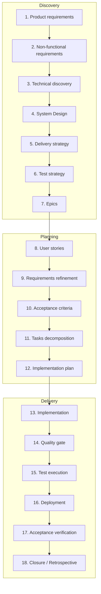

# SDLC Pipeline — PersonalAssistant

**Purpose:** This document specifies the **agent development process**: pipeline from product discovery through planning to delivery and closure (stages 1–18, inputs, outputs, traceability). It is the single source of truth for how epics are elaborated with agent-driven workflows.  
**Pipeline:** SDLC Pipeline (Discovery → Planning → Delivery).  
**Previous:** — (top-level pipeline spec).  
**Next:** — (pipeline ends at stage 18).  
**Related:** [01-02-requirements.md](01-02-requirements.md), [03-technical-discovery.md](03-technical-discovery.md), [04-system-design.md](04-system-design.md), [05-delivery-strategy.md](05-delivery-strategy.md), [06-test-strategy.md](06-test-strategy.md), [07-epic-list.md](07-epic-list.md), [08-user-stories.md](08-user-stories.md), [10-acceptance-criteria.md](10-acceptance-criteria.md), [11-12-implementation-plan.md](11-12-implementation-plan.md), [roles/](roles/README.md) (agent prompts per role).

---

## 1. Pipeline overview

---

## 2. Stage descriptions: inputs and outputs

### 2.1 Product requirements (what we build)

| | |
|---|---|
| **Role** | [Agent as Product Owner](roles/01-product-requirements.md) |
| **Purpose** | Capture the product vision, scope, and functional behaviour from a user and business perspective — *what* the system does, not how. |
| **Answered questions** | 1. What are we building? (vision, scope). 2. What terminology do we use? (glossary). 3. What must the system do? (functional requirements). 4. What is out of scope or deferred? |
| **Inputs** | Stakeholder vision; problem statement; success criteria; constraints (platform, audience); references (e.g. similar products, regulations). |
| **Output** | **Product requirements document**: introduction, scope, glossary, and a list of top-level requirements `REQ-X` tagged by class (e.g. `FR`) (e.g. in EARS form). Optional: high-level feature list, C4 context diagram (C1). |

---

### 2.2 Non-functional requirements (how it behaves)

| | |
|---|---|
| **Role** | [Agent as Tech Lead](roles/02-nfr.md) |
| **Purpose** | Define quality attributes and constraints: performance, security, deployability, observability, compliance, and evolution. |
| **Answered questions** | 1. How should the system behave? (performance, security, deployability, etc.). 2. What quality attributes matter? 3. What constraints apply? (platform, compliance). 4. How do we support evolution? (versioning, extensibility). |
| **Inputs** | Product requirements; platform and ops constraints; security and compliance needs; known NFR standards (e.g. latency, availability). |
| **Output** | **NFR section or document**: quality attributes and constraints (security model, deployment constraints, logging/audit, extensibility, versioning, backward compatibility) expressed as requirements `REQ-X` tagged `NFR`. May be merged into the main requirements doc or kept in a dedicated NFR section. |

---

### 2.3 Technical discovery

| | |
|---|---|
| **Role** | [Agent as Tech Lead](roles/03-technical-discovery.md) |
| **Purpose** | Top-level technical investigation to inform architecture and delivery strategy. |
| **Answered questions** | 1. Can we do this at all? (feasibility).  2. What options exist? (alternatives: technologies, approaches, vendors).  3. What are the pros and cons of each? (comparison and trade-offs).  4. What are the technical risks and how can we mitigate them? (e.g. proof-of-concept to evaluate characteristics). |
| **Inputs** | Requirements (functional + NFR); target platform; constraints (e.g. hardware, no vendor lock-in); list of open technical questions. |
| **Output** | **Research document(s)**: options analysed (e.g. vector store, LLM integration), comparison criteria, recommendation, risks and mitigations, MVI/iteration notes, sources. |

---

### 2.4 System Design (how we build it)

| | |
|---|---|
| **Role** | [Agent as Tech Lead](roles/04-system-design.md) |
| **Purpose** | Turn requirements and research into a concrete technical design: components, interfaces, data models, error handling, and key decisions with rationale. |
| **Answered questions** | 1. What are the main components and how do they interact? 2. What are the interfaces and data models? 3. How do we handle errors and failures? 4. What are the key technical decisions and their rationale? |
| **Inputs** | Requirements; research (recommendations, risks); C4 or similar context from requirements. |
| **Output** | **System design document**: architecture overview, component diagram (C2/C3), interfaces, data models, error handling, testing strategy summary; ADRs or "decisions" section where useful. |

---

### 2.5 Delivery strategy (prototype → MVP → MLP → v1 → v2)

| | |
|---|---|
| **Role** | [Agent as Product Owner](roles/05-delivery-strategy.md) |
| **Purpose** | Define the sequence of shippable increments and the value delivered at each step (e.g. prototype for validation, MVP for first use, MLP for "lovable", v1 for GA). |
| **Answered questions** | 1. In what order do we deliver value? (Prototype, MVP, MLP, v1, v2…). 2. What is in scope for each increment? 3. What are the dependencies between increments? 4. What are the success criteria per increment? |
| **Inputs** | Product requirements; architecture; risks and dependencies; stakeholder priorities; capacity assumptions. |
| **Output** | **Delivery strategy**: named increments (e.g. Prototype, MVP, MLP, v1) with scope and success criteria per increment; dependency order; optional timeline or phase map. |

---

### 2.6 Test strategy (how we verify)

| | |
|---|---|
| **Role** | [Agent as QA Lead](roles/06-test-strategy.md) |
| **Purpose** | Define how quality is assured: test levels (unit, integration, E2E, manual), what is tested at each level, and how acceptance criteria map to tests. |
| **Answered questions** | 1. How do we verify the product? (test levels: unit, integration, E2E, manual). 2. What is tested at each level? 3. How do acceptance criteria map to tests? 4. What special topics need coverage? (e.g. secret leakage). |
| **Inputs** | Requirements; acceptance criteria (if already drafted); architecture; risk areas (e.g. security, secrets). |
| **Output** | **Test strategy document**: test levels and definitions; mapping of AC to recommended levels; pyramid summary; special topics (e.g. secret leakage); link to current coverage. |

---

### 2.7 Epics (large chunks of value)

| | |
|---|---|
| **Role** | [Agent as Product Owner](roles/07-epics.md) |
| **Purpose** | Break the product into large, coherent themes or initiatives that can be planned and delivered independently (or in a defined order). |
| **Answered questions** | 1. What are the large themes or initiatives? 2. How do we split the product into planable chunks? 3. What can be delivered independently (or in what order)? 4. What is the scope and success criteria per epic? |
| **Inputs** | Product scope; delivery strategy; dependencies and priorities. |
| **Output** | **Epic list**: epic ID, title, short description, scope (features/capabilities), optional success criteria; traceability to requirements. |

---

### 2.8 User stories (user-valued capabilities)

| | |
|---|---|
| **Role** | [Agent as Analyst](roles/08-user-stories.md) |
| **Purpose** | Express scope in user-facing stories: "As a … I want … so that …", one slice of value per story, traceable to requirements. |
| **Answered questions** | 1. Who wants what and why? (As a / I want / So that). 2. What is the scope of each story? 3. How do stories trace to requirements? 4. What value does each story deliver? |
| **Inputs** | Requirements; epic scope; stakeholder input. |
| **Output** | **User stories document**: story ID (e.g. US-01…US-18), title, formulation (As/I want/So that), link to requirements and (later) acceptance criteria. |

---

### 2.9 Requirements refinement (within user stories)

| | |
|---|---|
| **Role** | [Agent as Analyst](roles/09-requirements-refinement.md) |
| **Purpose** | Clarify and detail requirements in the context of specific user stories: edge cases, definitions, and constraints so that acceptance criteria can be written unambiguously. |
| **Answered questions** | 1. What edge cases or ambiguities need clarifying? 2. What definitions or terms need to be pinned down? 3. What constraints apply per story or theme? 4. What "conditions of satisfaction" feed acceptance criteria? |
| **Inputs** | User stories; product and NFR documents; open questions from design or research. |
| **Output** | Refined requirements: decompose `REQ-X` into sub-requirements `REQ-X.Y` (and deeper if needed); add or update tags (e.g. `NFR`, `FR`); clarifications in glossary; optional story-level notes or "conditions of satisfaction" that feed AC. |

---

### 2.10 Acceptance criteria (testable conditions per story)

| | |
|---|---|
| **Role** | [Agent as QA Lead](roles/10-acceptance-criteria.md) |
| **Purpose** | Define testable conditions for each user story so that "done" is unambiguous. Prefer Gherkin (Given/When/Then) for automation and clarity. |
| **Answered questions** | 1. When is a user story done? (testable conditions). 2. What are the scenarios? (Given/When/Then or equivalent). 3. How do AC trace to requirements and test level? 4. What format do we use? (e.g. Gherkin for automation). |
| **Inputs** | User stories; refined requirements; test strategy (levels). |
| **Output** | **Acceptance criteria document**: AC ID, owning story, Gherkin (Given/When/Then) or equivalent; traceability to REQ and test level. |

---

### 2.11 Tasks decomposition

| | |
|---|---|
| **Role** | [Agent as Tech Lead](roles/11-tasks-decomposition.md) |
| **Purpose** | Decompose user stories into individual tasks and define dependencies between them so that execution order and parallelism can be planned. |
| **Answered questions** | 1. What concrete tasks does each user story (or epic) break into? 2. What are the dependencies between tasks? (what must finish before what). 3. Which tasks have no mutual dependency? (candidates for parallel work). 4. How do tasks trace to US, AC, and REQ? |
| **Inputs** | User stories; acceptance criteria; architecture; test strategy; delivery strategy (increment boundaries). |
| **Output** | **Task list**: individual tasks with descriptions, dependencies between tasks, traceability to US/AC/REQ. |

---

### 2.12 Implementation plan (ordering and parallelism)

| | |
|---|---|
| **Role** | [Agent as Tech Lead](roles/12-implementation-plan.md) |
| **Purpose** | Take the task list and dependencies, produce an ordered implementation plan with checkpoints and verification; identify which tasks can be executed in parallel. |
| **Answered questions** | 1. In what order do we execute tasks given dependencies? 2. Which tasks can run in parallel? (no dependency path between them). 3. Where do we place checkpoints and how do we verify each step? 4. Where are config and format references documented? |
| **Inputs** | Task list (with dependencies); architecture; test strategy; delivery strategy. |
| **Output** | **Implementation plan**: ordered tasks (with checkpoints); verification per task; traceability to REQ/AC; indication of parallel work; config and format references where needed. |

---

### 2.13 Implementation

| | |
|---|---|
| **Role** | [Agent as Developer](roles/13-implementation.md) |
| **Purpose** | Execute the implementation plan: implement tasks (code, config, infra), follow checkpoints and verification defined in the plan. |
| **Answered questions** | 1. Are all planned tasks implemented? 2. Do checkpoints pass? 3. Is the codebase consistent with the system design and requirements? |
| **Inputs** | Implementation plan; system design; task list; architecture and config references. |
| **Output** | Implemented code and artifacts; checkpoint results; updated repo (e.g. branches, PRs). |

---

### 2.14 Quality gate

| | |
|---|---|
| **Role** | [Agent as Developer](roles/14-quality-gate.md) |
| **Purpose** | Assure quality before test execution: peer review (e.g. PR review), static analysis, lint; define and enforce pass criteria for promotion. |
| **Answered questions** | 1. Does the change meet review and quality criteria? 2. Are there no blocking issues (security, style, design)? 3. Is the change ready for test execution? |
| **Inputs** | Implemented code (PRs/branches); review and quality criteria (from test strategy, NFR); lint/static-analysis config. |
| **Output** | Approved changes; quality gate result (pass/fail); list of non-blocking follow-ups if any. |

---

### 2.15 Test execution

| | |
|---|---|
| **Role** | [Agent as QA Lead](roles/15-test-execution.md) |
| **Purpose** | Run tests as defined by the test strategy: unit, integration, E2E, manual; record results and coverage. |
| **Answered questions** | 1. Do all tests pass at each level? 2. What is the current coverage vs strategy? 3. Are acceptance criteria covered by executed tests? |
| **Inputs** | Test strategy; acceptance criteria; implemented artifacts; test suites and environments. |
| **Output** | Test results (pass/fail per suite); coverage report; updated [15-current-coverage.md](15-current-coverage.md); defects or skip reasons. |

---

### 2.16 Deployment

| | |
|---|---|
| **Role** | [Agent as Tech Lead / DevOps](roles/16-deployment.md) |
| **Purpose** | Build deployable artifacts and deploy to target environment(s) (e.g. staging then production) per delivery strategy. |
| **Answered questions** | 1. Are artifacts built and versioned correctly? 2. Is the deployment successful in each environment? 3. Are rollback and health checks in place? |
| **Inputs** | Implemented and approved artifacts; deployment strategy and env config; delivery strategy (increment boundaries). |
| **Output** | Deployed system in target environment(s); build and deployment logs; release identifier. |

---

### 2.17 Acceptance verification

| | |
|---|---|
| **Role** | [Agent as QA Lead](roles/17-acceptance-verification.md) |
| **Purpose** | Confirm that acceptance criteria are met in the deployed system; sign off for release or iteration closure. |
| **Answered questions** | 1. Are all relevant AC satisfied in the target environment? 2. Is the increment ready for users or for closure? 3. What exceptions or deferred items are documented? |
| **Inputs** | Deployed system; acceptance criteria document; test results; manual test plan if used. |
| **Output** | Acceptance result (pass/fail per story or increment); sign-off or list of outstanding items; updated status of US/AC. |

---

### 2.18 Closure / Retrospective

| | |
|---|---|
| **Role** | [Agent as Product Owner / Tech Lead](roles/18-closure.md) |
| **Purpose** | Close the epic or increment: update documentation, capture lessons learned, and feed insights back into requirements or process. |
| **Answered questions** | 1. Is the epic or increment formally closed? 2. What was learned (technical, process, scope)? 3. What documentation or backlog items need updating? |
| **Inputs** | Acceptance verification result; delivery strategy; epic/list and implementation artifacts; team feedback. |
| **Output** | Closed epic/increment; retrospective notes; updated docs (e.g. coverage, lessons); optional new or revised requirements or backlog items. |

---

## 3. Data flow (inputs → outputs per stage)

| Stage | Inputs | Outputs | Project docs (EP-104) |
|-------|--------|---------|------------------------|
| 1. Product requirements | Vision, problem, constraints, references | Product requirements doc (scope, glossary, functional REQ) | [01-02-requirements.md](01-02-requirements.md) |
| 2. Non-functional requirements | Product reqs, platform, security/compliance | NFR section or doc (security, deploy, logging, etc.) | [01-02-requirements.md](01-02-requirements.md) |
| 3. Technical discovery | Reqs, platform, open questions | Research doc(s) (options, recommendation, risks) | [03-technical-discovery.md](03-technical-discovery.md), [research/](research/) |
| 4. System Design | Reqs, research | System design (components, interfaces, data, decisions) | [04-system-design.md](04-system-design.md) |
| 5. Delivery strategy | Reqs, architecture, risks, priorities | Increment definitions (Prototype/MVP/MLP/v1/v2) | [05-delivery-strategy.md](05-delivery-strategy.md) |
| 6. Test strategy | Reqs, AC (if any), architecture | Test strategy doc (levels, AC mapping, coverage) | [06-test-strategy.md](06-test-strategy.md), [06-manual-test-plan.md](06-manual-test-plan.md) |
| 7. Epics | Scope, delivery strategy | Epic list (ID, title, scope) | [07-epic-list.md](07-epic-list.md) |
| 8. User stories | Reqs, epic scope | User stories doc (ID, As/I want/So that, REQ links) | [08-user-stories.md](08-user-stories.md) |
| 9. Requirements refinement | User stories, reqs, questions | Refined reqs, glossary updates | n/a |
| 10. Acceptance criteria | User stories, refined reqs, test strategy | AC doc (Gherkin, REQ/AC traceability) | [10-acceptance-criteria.md](10-acceptance-criteria.md) |
| 11. Tasks decomposition | User stories, AC, architecture, test strategy | Task list with dependencies, traceability to US/AC/REQ | [11-12-implementation-plan.md](11-12-implementation-plan.md) (task breakdown) |
| 12. Implementation plan | Task list (dependencies), architecture, test strategy | Ordered plan, checkpoints, verification, parallel work | [11-12-implementation-plan.md](11-12-implementation-plan.md) |
| 13. Implementation | Implementation plan, system design, task list | Code and artifacts, checkpoint results | repo (codebase) |
| 14. Code review / Quality gate | Implemented code, review criteria, lint/config | Approved changes, quality gate result | repo, CI |
| 15. Test execution | Test strategy, AC, artifacts, test suites | Test results, coverage report | [15-current-coverage.md](15-current-coverage.md), test reports |
| 16. Deployment | Approved artifacts, deployment config | Deployed system, release id | env, release notes |
| 17. Acceptance verification | Deployed system, AC, test results | Sign-off, US/AC status | backlog / tracker |
| 18. Closure / Retrospective | Acceptance result, epic, feedback | Closed epic, retrospective, updated docs | docs, backlog |

---

## 4. Traceability (summary)

- **Product requirements** → NFR, Research, System Design, Epics, User stories, AC, Tasks decomposition, Implementation plan.  
- **NFR** → System Design, delivery, test strategy.  
- **User stories** → Acceptance criteria, Tasks decomposition, Implementation plan.  
- **Acceptance criteria** → Test strategy (levels), Tasks decomposition, Implementation plan (verification), Current coverage (tests).  
- **Tasks decomposition** → Implementation plan (ordering and parallelism).  
- **Implementation plan** → Implementation (13), Code review (14), Test execution (15), Deployment (16), Acceptance verification (17), Closure (18).  
- **Delivery (13–18)** → Implementation plan, Test strategy, AC; outputs feed Closure and optionally new requirements (back to 1–2).

---

## 5. Iterations and backflows

The pipeline is ordered (1 → 2 → … → 18), but changes during or after execution are expected. When any document is changed (e.g. a new requirement is added, a user story is split, or design decisions are revised), **all subsequent documents in the pipeline must be reviewed, updated, and kept in sync** so that traceability is preserved.

**Rule:** If stage *N*’s output is modified, every stage *N+1 … 18* that consumes or traces to that output must be **actualised and aligned** with the change.

| If this changes … | … then review and update (at least) |
|-------------------|-------------------------------------|
| 1–2. Requirements (product, NFR) | 3–18. |
| 3. Technical discovery | 4–18. |
| 4. System Design | 5–6, 11–18. |
| 5. Delivery strategy | 6–7, 11–18. |
| 6. Test strategy | 10–18. |
| 7. Epics | 8–18. |
| 8. User stories | 9–18. |
| 9. Requirements refinement | 10–18. |
| 10. Acceptance criteria | 11–18. |
| 11. Tasks decomposition | 12–18. |
| 12. Implementation plan | 13–18 (implementation, review, test, deploy, accept, closure). |
| 13. Implementation | 14–18. |
| 14. Code review / Quality gate | 15–18. |
| 15. Test execution | 16–18 (deploy only if tests pass; accept; close). |
| 16. Deployment | 17–18. |
| 17. Acceptance verification | 18. |
| 18. Closure / Retrospective | (no downstream pipeline stages; may feed new requirements into stage 1–2). |

**Practices:**

- After editing a document, run through the **Traceability (section 4)** and the table above: identify which later stages are affected and update the corresponding docs.
- Keep cross-references and IDs consistent (e.g. when adding `REQ-X`, add or adjust traces in epics, user stories, AC, and implementation plan).
- Prefer small, incremental changes and re-sync often so that drift does not accumulate.

---

## 6. Glossary

| Term | Meaning |
|------|--------|
| **AC** | Acceptance criteria — testable conditions that define when a user story is done; often written in Gherkin (Given/When/Then). |
| **ADR** | Architecture Decision Record — a short document capturing a significant design decision and its rationale. |
| **C4** | C4 model — a hierarchy of diagrams for software architecture: C1 (context), C2 (container), C3 (component), C4 (code). |
| **E2E** | End-to-end (test) — a test that runs against the full system or a major flow from user action to outcome. |
| **EARS** | Easy Approach to Requirements Syntax — a set of sentence patterns for writing clear, consistent requirements (e.g. WHEN … THE system SHALL …). |
| **FR** | Functional requirement — a requirement that describes what the system must do (behaviour, capability). |
| **Gherkin** | A language for scenario-based specifications: Given (precondition), When (action), Then (outcome); used for acceptance criteria and automated tests. |
| **MLP** | Minimum Lovable Product — an increment that delivers a minimal but “lovable” experience, often after MVP. |
| **MVI** | Minimum Viable Iteration — a small iteration used to validate an option or reduce risk (e.g. proof-of-concept). |
| **MVP** | Minimum Viable Product — the smallest increment that delivers real value and can be used or shipped. |
| **NFR** | Non-functional requirement — a requirement that describes how the system should behave (performance, security, deployability, etc.). |
| **REQ** | Requirement — an item in the requirements baseline; often tagged with an ID (e.g. REQ-01) and a class (FR, NFR). |
| **US** | User story — a short statement of value in the form “As a … I want … so that …”, with an ID (e.g. US-01). |

---
