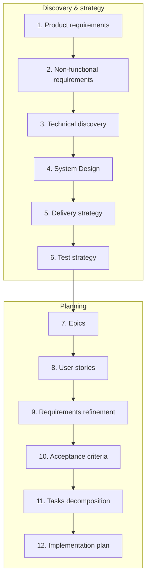

# SDLC Pipeline — PersonalAssistant

**Document:** Pipeline specification (product and engineering lifecycle)  
**Audience:** Product, architecture, development  
**Purpose:** Define the pipeline from product discovery through to implementation planning: stages, inputs, outputs, and traceability.

This pipeline is used at **epic level** (e.g. EP-104). Each stage produces artifacts that feed the next.

---

## 1. Pipeline overview

---

## 2. Stage descriptions: inputs and outputs

### 2.1 Product requirements (what we build)

| | |
|---|---|
| **Purpose** | Capture the product vision, scope, and functional behaviour from a user and business perspective — *what* the system does, not how. |
| **Answered questions** | 1. What are we building? (vision, scope). 2. What terminology do we use? (glossary). 3. What must the system do? (functional requirements). 4. What is out of scope or deferred? |
| **Inputs** | Stakeholder vision; problem statement; success criteria; constraints (platform, audience); references (e.g. similar products, regulations). |
| **Output** | **Product requirements document**: introduction, scope, glossary, and a list of top-level requirements `REQ-X` tagged by class (e.g. `FR`) (e.g. in EARS form). Optional: high-level feature list, C4 context diagram (C1). |

---

### 2.2 Non-functional requirements (how it behaves)

| | |
|---|---|
| **Purpose** | Define quality attributes and constraints: performance, security, deployability, observability, compliance, and evolution. |
| **Answered questions** | 1. How should the system behave? (performance, security, deployability, etc.). 2. What quality attributes matter? 3. What constraints apply? (platform, compliance). 4. How do we support evolution? (versioning, extensibility). |
| **Inputs** | Product requirements; platform and ops constraints; security and compliance needs; known NFR standards (e.g. latency, availability). |
| **Output** | **NFR section or document**: quality attributes and constraints (security model, deployment constraints, logging/audit, extensibility, versioning, backward compatibility) expressed as requirements `REQ-X` tagged `NFR`. May be merged into the main requirements doc or kept in a dedicated NFR section. |

---

### 2.3 Technical discovery

| | |
|---|---|
| **Purpose** | Top-level technical investigation to inform architecture and delivery strategy. |
| **Answered questions** | 1. Can we do this at all? (feasibility).  2. What options exist? (alternatives: technologies, approaches, vendors).  3. What are the pros and cons of each? (comparison and trade-offs).  4. What are the technical risks and how can we mitigate them? (e.g. proof-of-concept to evaluate characteristics). |
| **Inputs** | Requirements (functional + NFR); target platform; constraints (e.g. hardware, no vendor lock-in); list of open technical questions. |
| **Output** | **Research document(s)**: options analysed (e.g. vector store, LLM integration), comparison criteria, recommendation, risks and mitigations, MVI/iteration notes, sources. |

---

### 2.4 System Design (how we build it)

| | |
|---|---|
| **Purpose** | Turn requirements and research into a concrete technical design: components, interfaces, data models, error handling, and key decisions with rationale. |
| **Answered questions** | 1. What are the main components and how do they interact? 2. What are the interfaces and data models? 3. How do we handle errors and failures? 4. What are the key technical decisions and their rationale? |
| **Inputs** | Requirements; research (recommendations, risks); C4 or similar context from requirements. |
| **Output** | **System design document**: architecture overview, component diagram (C2/C3), interfaces, data models, error handling, testing strategy summary; ADRs or "decisions" section where useful. |

---

### 2.5 Delivery strategy (prototype → MVP → MLP → v1 → v2)

| | |
|---|---|
| **Purpose** | Define the sequence of shippable increments and the value delivered at each step (e.g. prototype for validation, MVP for first use, MLP for "lovable", v1 for GA). |
| **Answered questions** | 1. In what order do we deliver value? (Prototype, MVP, MLP, v1, v2…). 2. What is in scope for each increment? 3. What are the dependencies between increments? 4. What are the success criteria per increment? |
| **Inputs** | Product requirements; architecture; risks and dependencies; stakeholder priorities; capacity assumptions. |
| **Output** | **Delivery strategy**: named increments (e.g. Prototype, MVP, MLP, v1) with scope and success criteria per increment; dependency order; optional timeline or phase map. |

---

### 2.6 Test strategy (how we verify)

| | |
|---|---|
| **Purpose** | Define how quality is assured: test levels (unit, integration, E2E, manual), what is tested at each level, and how acceptance criteria map to tests. |
| **Answered questions** | 1. How do we verify the product? (test levels: unit, integration, E2E, manual). 2. What is tested at each level? 3. How do acceptance criteria map to tests? 4. What special topics need coverage? (e.g. secret leakage). |
| **Inputs** | Requirements; acceptance criteria (if already drafted); architecture; risk areas (e.g. security, secrets). |
| **Output** | **Test strategy document**: test levels and definitions; mapping of AC to recommended levels; pyramid summary; special topics (e.g. secret leakage); link to current coverage. |

---

### 2.7 Epics (large chunks of value)

| | |
|---|---|
| **Purpose** | Break the product into large, coherent themes or initiatives that can be planned and delivered independently (or in a defined order). |
| **Answered questions** | 1. What are the large themes or initiatives? 2. How do we split the product into planable chunks? 3. What can be delivered independently (or in what order)? 4. What is the scope and success criteria per epic? |
| **Inputs** | Product scope; delivery strategy; dependencies and priorities. |
| **Output** | **Epic list**: epic ID, title, short description, scope (features/capabilities), optional success criteria; traceability to requirements. |

---

### 2.8 User stories (user-valued capabilities)

| | |
|---|---|
| **Purpose** | Express scope in user-facing stories: "As a … I want … so that …", one slice of value per story, traceable to requirements. |
| **Answered questions** | 1. Who wants what and why? (As a / I want / So that). 2. What is the scope of each story? 3. How do stories trace to requirements? 4. What value does each story deliver? |
| **Inputs** | Requirements; epic scope; stakeholder input. |
| **Output** | **User stories document**: story ID (e.g. US-01…US-18), title, formulation (As/I want/So that), link to requirements and (later) acceptance criteria. |

---

### 2.9 Requirements refinement (within user stories)

| | |
|---|---|
| **Purpose** | Clarify and detail requirements in the context of specific user stories: edge cases, definitions, and constraints so that acceptance criteria can be written unambiguously. |
| **Answered questions** | 1. What edge cases or ambiguities need clarifying? 2. What definitions or terms need to be pinned down? 3. What constraints apply per story or theme? 4. What "conditions of satisfaction" feed acceptance criteria? |
| **Inputs** | User stories; product and NFR documents; open questions from design or research. |
| **Output** | Refined requirements: decompose `REQ-X` into sub-requirements `REQ-X.Y` (and deeper if needed); add or update tags (e.g. `NFR`, `FR`); clarifications in glossary; optional story-level notes or "conditions of satisfaction" that feed AC. |

---

### 2.10 Acceptance criteria (testable conditions per story)

| | |
|---|---|
| **Purpose** | Define testable conditions for each user story so that "done" is unambiguous. Prefer Gherkin (Given/When/Then) for automation and clarity. |
| **Answered questions** | 1. When is a user story done? (testable conditions). 2. What are the scenarios? (Given/When/Then or equivalent). 3. How do AC trace to requirements and test level? 4. What format do we use? (e.g. Gherkin for automation). |
| **Inputs** | User stories; refined requirements; test strategy (levels). |
| **Output** | **Acceptance criteria document**: AC ID, owning story, Gherkin (Given/When/Then) or equivalent; traceability to REQ and test level. |

---

### 2.11 Tasks decomposition

| | |
|---|---|
| **Purpose** | Decompose user stories into individual tasks and define dependencies between them so that execution order and parallelism can be planned. |
| **Answered questions** | 1. What concrete tasks does each user story (or epic) break into? 2. What are the dependencies between tasks? (what must finish before what). 3. Which tasks have no mutual dependency? (candidates for parallel work). 4. How do tasks trace to US, AC, and REQ? |
| **Inputs** | User stories; acceptance criteria; architecture; test strategy; delivery strategy (increment boundaries). |
| **Output** | **Task list**: individual tasks with descriptions, dependencies between tasks, traceability to US/AC/REQ. |

---

### 2.12 Implementation plan (ordering and parallelism)

| | |
|---|---|
| **Purpose** | Take the task list and dependencies, produce an ordered implementation plan with checkpoints and verification; identify which tasks can be executed in parallel. |
| **Answered questions** | 1. In what order do we execute tasks given dependencies? 2. Which tasks can run in parallel? (no dependency path between them). 3. Where do we place checkpoints and how do we verify each step? 4. Where are config and format references documented? |
| **Inputs** | Task list (with dependencies); architecture; test strategy; delivery strategy. |
| **Output** | **Implementation plan**: ordered tasks (with checkpoints); verification per task; traceability to REQ/AC; indication of parallel work; config and format references where needed. |

---

## 3. Data flow (inputs → outputs per stage)

| Stage | Inputs | Outputs | Project docs (EP-104) |
|-------|--------|---------|------------------------|
| 1. Product requirements | Vision, problem, constraints, references | Product requirements doc (scope, glossary, functional REQ) | [REQUIREMENTS.md](REQUIREMENTS.md) |
| 2. Non-functional requirements | Product reqs, platform, security/compliance | NFR section or doc (security, deploy, logging, etc.) | [REQUIREMENTS.md](REQUIREMENTS.md) (NFR sections) |
| 3. Technical discovery | Reqs, platform, open questions | Research doc(s) (options, recommendation, risks) | [research.md](research.md), [research/](research/) |
| 4. System Design | Reqs, research | System design (components, interfaces, data, decisions) | [system-design.md](system-design.md) |
| 5. Delivery strategy | Reqs, architecture, risks, priorities | Increment definitions (Prototype/MVP/MLP/v1/v2) | [research.md](research.md) §5–§6, [implementation-plan.md](implementation-plan.md) (checkpoints) |
| 6. Test strategy | Reqs, AC (if any), architecture | Test strategy doc (levels, AC mapping, coverage) | [test-strategy.md](test-strategy.md), [current-coverage.md](current-coverage.md) |
| 7. Epics | Scope, delivery strategy | Epic list (ID, title, scope) | Epic EP-104 (this directory) |
| 8. User stories | Reqs, epic scope | User stories doc (ID, As/I want/So that, REQ links) | [user-stories.md](user-stories.md) |
| 9. Requirements refinement | User stories, reqs, questions | Refined reqs, glossary updates | [REQUIREMENTS.md](REQUIREMENTS.md), [prompts/](prompts/) |
| 10. Acceptance criteria | User stories, refined reqs, test strategy | AC doc (Gherkin, REQ/AC traceability) | [acceptance-criteria.md](acceptance-criteria.md) |
| 11. Tasks decomposition | User stories, AC, architecture, test strategy | Task list with dependencies, traceability to US/AC/REQ | [implementation-plan.md](implementation-plan.md) (task breakdown) |
| 12. Implementation plan | Task list (dependencies), architecture, test strategy | Ordered plan, checkpoints, verification, parallel work | [implementation-plan.md](implementation-plan.md) |

---

## 4. Traceability (summary)

- **Product requirements** → NFR, Research, System Design, Epics, User stories, AC, Tasks decomposition, Implementation plan.  
- **NFR** → System Design, delivery, test strategy.  
- **User stories** → Acceptance criteria, Tasks decomposition, Implementation plan.  
- **Acceptance criteria** → Test strategy (levels), Tasks decomposition, Implementation plan (verification), Current coverage (tests).  
- **Tasks decomposition** → Implementation plan (ordering and parallelism).  
- **Implementation plan** → System design, Research (e.g. MVI), Test strategy.

Artifacts in this directory that implement the pipeline for EP-104: [REQUIREMENTS.md](REQUIREMENTS.md), [research.md](research.md), [system-design.md](system-design.md), [test-strategy.md](test-strategy.md), [user-stories.md](user-stories.md), [acceptance-criteria.md](acceptance-criteria.md), [implementation-plan.md](implementation-plan.md), [current-coverage.md](current-coverage.md).
