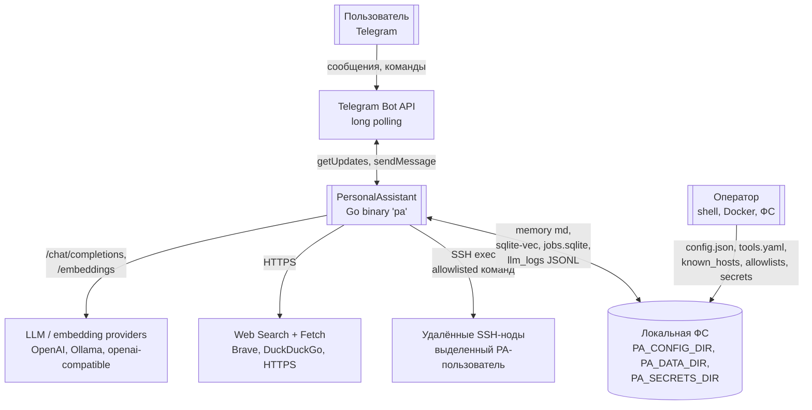
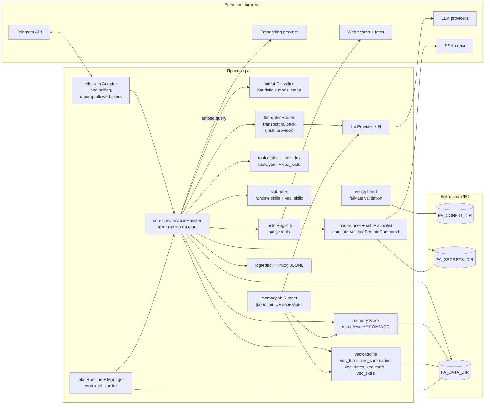
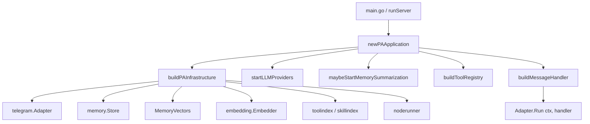
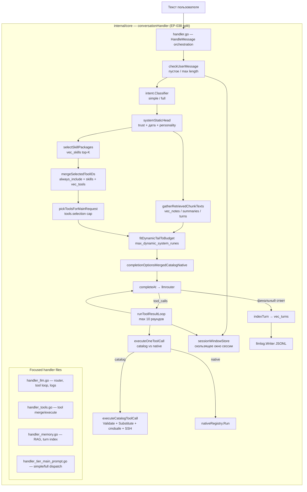
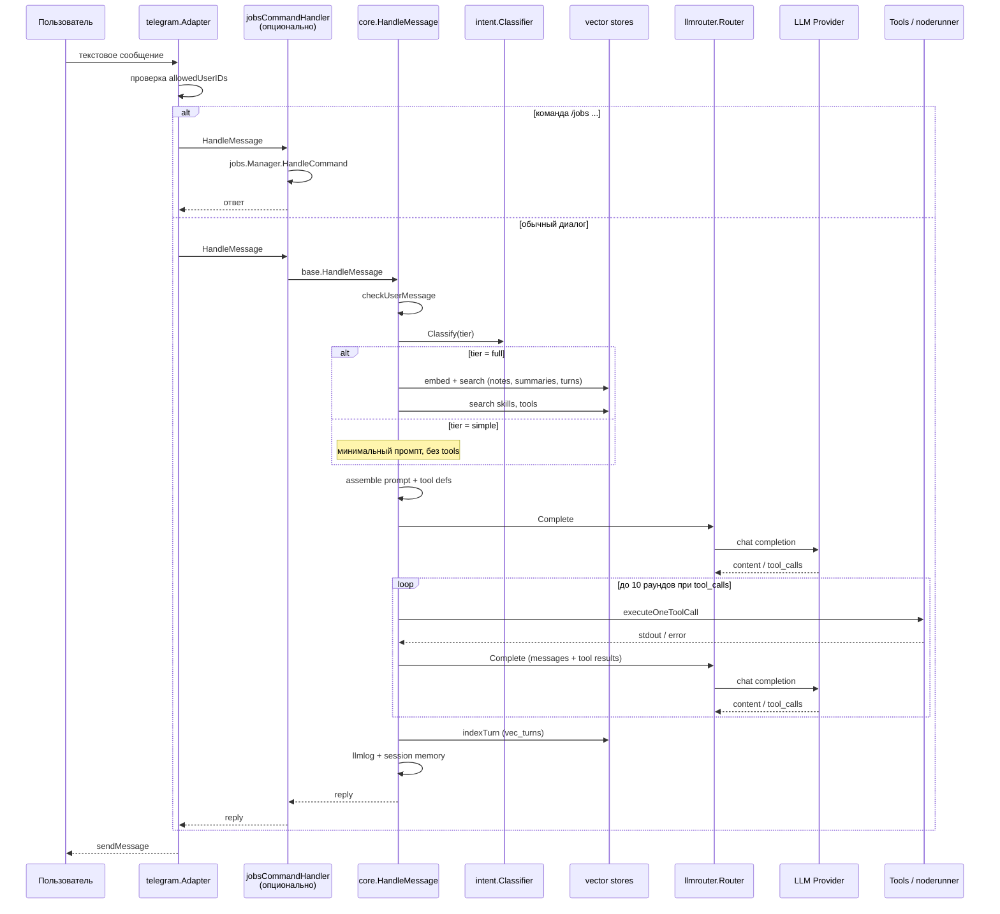
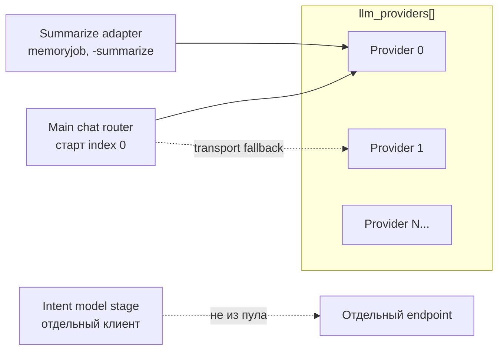
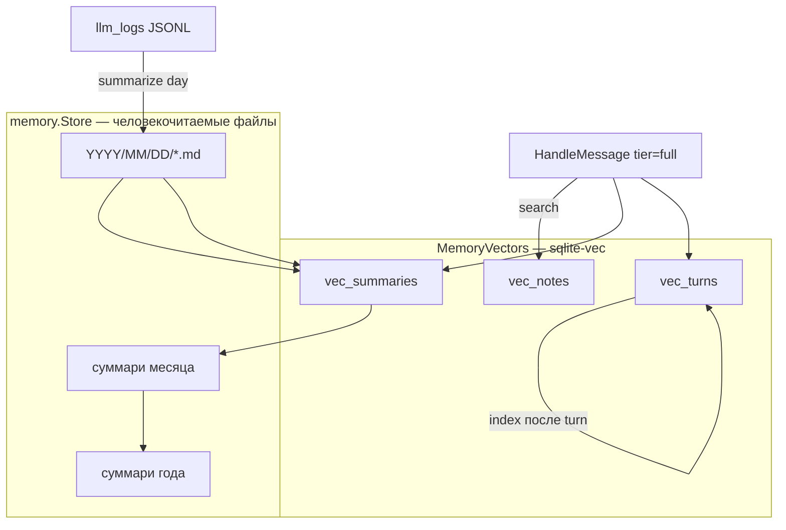
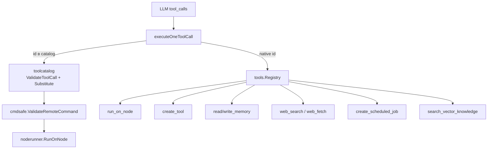
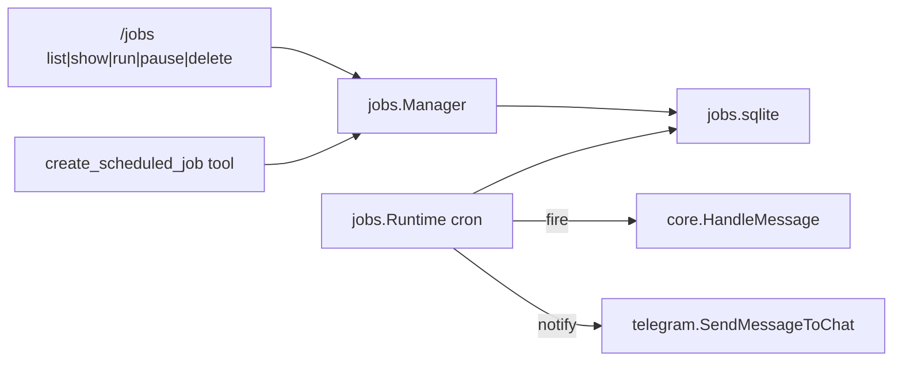
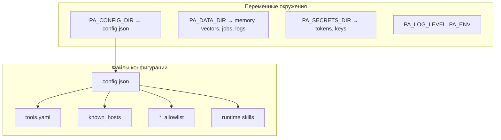

# PersonalAssistant — архитектура агента

Описание архитектуры **PersonalAssistant (PA)** на основе исходного кода репозитория. Документ ориентирован на разработчиков и операторов, знакомых с кодовой базой.

**См. также:** [configuration.md](configuration.md), [llm-provider-roles-and-logging.md](llm-provider-roles-and-logging.md), [operations.md](operations.md), [threat model (artefact)](../ai-sdlc-artefacts/threat-model.md).

---

## 1. Обзор

PersonalAssistant — **однопроцессный Go-сервис** (`cmd/pa`, бинарник `pa`). Основные функции:

- Telegram-бот (long polling) с фильтрацией по allowlist пользователей;
- диалоговый «агент» в `internal/core`: сборка контекста, вызов LLM, цикл tool calling;
- долгосрочная память (markdown по календарю) + семантический поиск (sqlite-vec);
- каталог инструментов (YAML) и native tools (Go);
- удалённое исполнение allowlisted-команд на SSH-нодах;
- фоновая иерархическая суммаризация (день → месяц → год);
- планировщик задач (cron + SQLite).

Конфигурация — явный `config.json` в `PA_CONFIG_DIR` (без скрытых дефолтов на уровне продукта). Невалидный конфиг **не даёт процессу стартовать**.

---

## 2. Контекст системы (C4 — Level 1)

### Зоны доверия

| Зона | Уровень | Примечание |
|------|---------|------------|
| Пользователи Telegram | полу-доверенные | Аутентификация через `allowedUserIDs`; текст сообщений — **недоверенный контент** |
| Оператор, файлы конфигурации | доверенные | `PA_CONFIG_DIR`, `PA_SECRETS_DIR` |
| LLM / embedding API | внешние | Получают промпты и результаты tools |
| SSH-ноды | внешние | Доступ только под выделенным пользователем PA |

---

## 3. Контейнеры внутри процесса (C4 — Level 2)

Один OS-процесс, логически разделённый на подсистемы:

### Composition root (`cmd/pa`)

Сборка приложения централизована в `paApplication` (EP-027):

Ключевые интерфейсы в `internal/core`:

| Интерфейс | Назначение |
|-----------|------------|
| `Adapter` | Источник сообщений (Telegram и др.); блокирует до отмены `ctx` |
| `MessageHandler` | Один текст на вход → один текст на выход (`HandleMessage`) |
| `NodeRunner` | Выполнение allowlisted-команды на SSH-ноде |

---

## 4. Компоненты core (C4 — Level 3)

---

## 5. Поток обработки сообщения

### 5.1 Sequence diagram

### 5.2 Шаги (кратко)

1. **Telegram** — long polling, фильтр по `telegram.users_path`, typing indicator при обработке.
2. **Валидация** — пустое или слишком длинное сообщение → ранний ответ без LLM.
3. **Intent tier (EP-017/EP-036)** — каскад: эвристики → tier (при неоднозначности — `full`):
   - `simple` — короткий промпт, без tools и RAG;
   - `full` — полный контекст: RAG + skills + tools.
4. **Сборка промпта** — статическая «голова» + динамический «хвост» (chunks, skills, tool hints), урезание по `max_dynamic_system_runes`.
5. **Session memory (EP-014)** — опционально последние N обменов в рамках `sessionKey` (обычно chat id).
6. **LLM call** через `llmrouter` (transport fallback; старт с index 0; сбои tools не переключают provider).
7. **Tool loop** — до **10 раундов** (`maxToolRounds`): выполнение tools → добавление результатов → повторный LLM call.
8. **Post-turn** — JSONL-лог, индексация turn в `vec_turns`, обновление session window, опциональный footer с usage (EP-015).

---

## 6. Подсистемы

### 6.1 LLM и роутинг

| Роль | Источник конфигурации |
|------|----------------------|
| Основной диалог | `llm_providers` + `llmrouter` (каждый `Complete` — старт с index 0) |
| Transport fallback | Следующий provider в массиве при retryable transport-ошибках (5xx, timeout, сеть); сбои tools не меняют index |
| Суммаризация | Тот же пул, отдельный adapter (`SummarizeRouterConfig`) |
| Intent classifier | Эвристики только (без отдельного LLM-клиента) |

Подробнее: [llm-provider-roles-and-logging.md](llm-provider-roles-and-logging.md).

### 6.2 Память

Два слоя:

- **Markdown** — долгосрочное хранилище, иерархическая суммаризация через `internal/summarize` и фоновый `memoryjob.Runner`.
- **Vectors** — семантический поиск для промпта (tier `full`) и индексация turns после ответа.
- CLI: `./pa -summarize=YYYY-MM-DD` — разовая суммаризация без запуска бота.

`memoryjob` не блокирует интерактивные turn'ы: учитывает `UserTurnInProgress`.

### 6.3 Инструменты (tools)

**Pre-selection tools для LLM** (не весь каталог):

1. `tools.always_include` из config;
2. tools, привязанные к выбранным runtime skills;
3. семантический top-K из `vec_tools` (`toolindex`).

Опционально **dynamic cap** (EP-018) ограничивает число tools в одном LLM-запросе.

**Catalog tool** — декларативный YAML: шаблон команды + `node_id` + параметры; без изменения Go-кода.

**Native tools** — Go-реализации, регистрируются в `buildToolRegistry()` (`cmd/pa/application.go`).

`create_tool` обновляет YAML атомарно (temp file + rename + sync + post-write validation) — см. [README.md](../README.md).

### 6.4 Runtime skills (EP-013)

Markdown-пакеты в `paths.skills_dir`. На каждый turn (tier `full`) — vector search по `vec_skills`, инструкции попадают в system tail только когда релевантны. Skills могут расширять набор tools для turn'а.

### 6.5 Планировщик (EP-019+)

`jobsCommandHandler` оборачивает базовый handler: slash-команды `/jobs` перехватываются до core. Runtime инициализируется асинхронно; до готовности пользователь видит «Scheduler is initializing».

---

## 7. Карта пакетов

| Пакет | Роль |
|-------|------|
| `cmd/pa` | Entry point, composition root, jobs runtime, observability HTTP |
| `internal/core` | Оркестратор агента: handler, prompt assembly, tool loop |
| `internal/telegram` | Транспорт (long polling) |
| `internal/llm` | Интерфейс и реализации провайдеров |
| `internal/llmrouter` | Transport fallback между провайдерами |
| `internal/intent` | Классификатор tier (EP-017/018) |
| `internal/memory` | Markdown store |
| `internal/vector` | sqlite-vec |
| `internal/summarize` | Pipeline day/month/year |
| `internal/memoryjob` | Фоновый worker суммаризации |
| `internal/toolcatalog` | YAML-каталог tools |
| `internal/toolindex` / `internal/skillindex` | Векторные индексы tools/skills |
| `internal/tools` | Native tool implementations |
| `internal/noderunner` + `internal/ssh` + `internal/allowlist` + `internal/cmdsafe` | Безопасное удалённое исполнение |
| `internal/jobs` | Планировщик |
| `internal/config` | Strict JSON config load |
| `internal/llmlog` + `internal/logredact` | Аудит LLM + redaction |

---

## 8. Безопасность (кратко)

| Механизм | Где |
|----------|-----|
| Fail-fast config | `config.Load` — невалидный конфиг → exit |
| Telegram gate | Пустой `users_path` = deny all |
| Двухслойная проверка remote command | `cmdsafe.ValidateRemoteCommand` + `allowlist.Checker` |
| Dedicated PA user + known_hosts | `internal/ssh`, `PA_SECRETS_DIR` |
| Redaction логов | `logredact` → app logs, tool invocation, JSONL llmlog, noderunner |
| Prompt markers | Запрет индексации turn при подделке trust-маркеров |
| SSRF policy | `internal/httpsafety` для web tools |

Полная модель угроз: [ai-sdlc-artefacts/threat-model.md](../ai-sdlc-artefacts/threat-model.md).

---

## 9. Конфигурация и пути

Примеры: `config.examples/`. Описание ключей: [configuration.md](configuration.md).

---

## 10. Observability

- **Application logs** — `slog` на stderr; уровень `PA_LOG_LEVEL` (см. [llm-provider-roles-and-logging.md](llm-provider-roles-and-logging.md)).
- **LLM audit** — JSONL в `paths.llm_log_dir` с retention.
- **Lifecycle log** — структурированные события (EP-029).
- **HTTP observability** (опционально) — health/readiness: [observability-http.md](observability-http.md).

---

## 11. Расширение системы

| Способ | Действие |
|--------|----------|
| Новый канал (Matrix, CLI) | Реализовать `core.Adapter`, передать в `core.Run` / `runServer` |
| Новый catalog tool | Добавить запись в `tools.yaml` + reindex (или `create_tool`) |
| Новый native tool | Go-код в `internal/tools`, регистрация в `buildToolRegistry` |
| Новый runtime skill | Markdown-пакет в `skills_dir`, rebuild skill index |
| Новая LLM-модель | Запись в `llm_providers`; порядок в массиве задаёт приоритет transport fallback |

---

## 12. Ограничения и компромиссы

- **Один процесс** — простота деплоя (Docker на Synology и др.), но нет горизонтального масштабирования бота.
- **Tool loop cap = 10** — защита от бесконечных циклов; не полноценный автономный agent на десятки шагов.
- **Tier system** — экономия токенов на простых сообщениях; сложные сценарии требуют tier `full`.
- **SSH-only remote exec** — нет локального произвольного shell от LLM; безопасность через allowlist.
- **Composition root растёт** — новые подсистемы добавляются в `cmd/pa`; явный DI/wire не используется (KISS).

---

## 13. Архитектурные решения: narrative (презентация, интервью)

Краткий связный рассказ об архитектуре PA — дополнение к диаграммам выше. Удобен для устного ответа на интервью или для onboarding.

### Контекст и рамка

PersonalAssistant — **self-hosted персональный ассистент**: один Go-бинарник, Telegram как канал, LLM в центре, долгосрочная память и инструменты. Целевой сценарий — домашний NAS (Synology): **один оператор, один процесс, явная конфигурация без скрытых дефолтов**. Это не SaaS, не multi-tenant и не распределённая система — осознанный выбор простоты деплоя и отладки.

### Monolith + ports & adapters

Главная идея — **однопроцессный monolith** с чётким разделением ролей:

| Интерфейс | Роль |
|-----------|------|
| `core.Adapter` | Транспорт (сейчас Telegram) |
| `core.MessageHandler` | Оркестратор: текст → ответ |
| `core.NodeRunner` | Удалённое исполнение на SSH-нодах |

**Зачем:** KISS для personal project (один Docker-контейнер); Telegram можно заменить другим адаптером без переписывания core; вся сложность (prompt assembly, tool loop, RAG) сосредоточена в `conversationHandler`.

**Компромисс:** composition root в `cmd/pa` растёт с каждым epic; DI-фреймворк не используется — осознанный trade-off ради простоты.

### Оркестрация агента: управляемый tool-calling loop

PA — **не open-ended ReAct-агент** на десятки шагов, а **детерминированный оркестратор** вокруг LLM с жёсткими лимитами.

Поток `HandleMessage`:

1. Валидация входа
2. Intent classification → tier (`simple` / `full`)
3. Сборка промпта (статическая «голова» + динамический «хвост» с бюджетом runes)
4. LLM call через `llmrouter`
5. Tool loop **до 10 раундов**: execute → append results → repeat
6. Post-turn: индексация, JSONL-лог, session memory

**Зачем:** предсказуемость и контроль стоимости (токены, SSH-вызовы); fail-fast на каждом этапе; tier system экономит ресурсы на простых сообщениях, не ломая full-path для сложных задач.

**Компромисс:** `conversationHandler` — крупный объект с множеством полей; tier-логика частично дублируется; возможный рефакторинг — strategy по tier.

### Память: два complementary слоя

| Слой | Технология | Зачем |
|------|------------|-------|
| Source of truth | Markdown по календарю (`memory/YYYY/MM/DD`) | Читаемо человеком, удобно для audit |
| Retrieval | sqlite-vec (`vec_turns`, `vec_summaries`, `vec_notes`) | RAG в промпт, semantic search |

Плюс **иерархическая суммаризация** day → month → year в фоне (`memoryjob`), с приоритетом ниже интерактивных turn'ов.

**Зачем:** markdown — оператор видит, что «помнит» ассистент; vectors — только то, что нужно LLM прямо сейчас; split tables (EP-016) явно контролируют, что попадает в контекст.

### Tools: catalog + native + vector pre-selection

Три пути расширения **без единого plugin framework**:

1. **YAML catalog** — декларативные tools: шаблон команды + `node_id`; LLM не пишет shell напрямую
2. **Native tools** (Go) — `run_on_node`, `create_tool`, web, memory, scheduler
3. **Runtime skills** — markdown-пакеты, выбираются vector search'ем

В LLM **не отдаётся весь каталог** — semantic pre-select через `vec_tools` + `always_include` + tools из skills; опционально dynamic cap (EP-018).

**Зачем:** безопасность (catalog → `ValidateToolCall` → `Substitute` → `cmdsafe` → allowlist → SSH); расширяемость без перекомпиляции; экономия context window.

### Безопасность как архитектурный принцип

Remote execution — **не sandbox с произвольным кодом**, а **allowlisted SSH**:

- Telegram: bot + allowlist user IDs
- Config: fail-fast load, explicit JSON (все ключи, `null` = disabled)
- Remote: `cmdsafe` + per-node allowlist + dedicated PA user + `known_hosts`
- Logs: platform-level redaction (`logredact`) в app logs, tool invocation, JSONL

**Зачем:** для personal assistant главный риск — prompt injection → tool raid; проще запретить опасное, чем «лечить» sandbox; `-verify-nodes` позволяет проверить SSH до старта бота.

### LLM: один pool, несколько ролей

Один массив `llm_providers`, разные роли через router:

| Роль | Механизм |
|------|----------|
| Main chat | Старт с index 0 на каждый `Complete` |
| Transport fallback | Следующий provider при retryable transport-ошибках (5xx / timeout / сеть) |
| Summarization | Отдельный adapter, тот же pool |
| Intent classifier | Эвристики (без отдельного клиента из пула) |

**Зачем:** один конфиг для всех моделей; первая запись в пуле — основная; при transport-сбоях — резервные провайдеры; declarative policy в JSON.

**Компромисс:** порядок providers в массиве влияет на поведение — см. [llm-provider-roles-and-logging.md](llm-provider-roles-and-logging.md).

### Explicit configuration и observability

- `config.json` — все top-level ключи обязательны; unknown keys rejected
- Пути через `PA_CONFIG_DIR`, `PA_DATA_DIR`, `PA_SECRETS_DIR`
- Observability: structured logs, JSONL LLM audit, optional HTTP health (EP-029)

**Зачем:** процесс не стартует с «половиной конфига»; оператор на NAS точно знает, что включено.

### Сильные стороны и слабые места

**Сильные стороны:**

- Чёткое разделение пакетов (`noderunner` / `allowlist` / `cmdsafe` / `toolcatalog` / `llmrouter`)
- Fail-fast configuration
- Безопасный путь к нодам (двухслойная валидация)
- Tier-based prompts (EP-017/018)
- Platform-level redaction

**Слабые места / возможные улучшения:**

- Async init jobs runtime (tools доступны до полной готовности scheduler)
- Один SQLite-файл под несколько writers (возможен `SQLITE_BUSY` под нагрузкой)
- Нет in-app rate limiting

### Сжатый устный ответ (2–3 минуты)

> PA — self-hosted персональный ассистент на Go: Telegram → core → LLM → tools → SSH-ноды. Архитектурно это monolith с ports & adapters: `telegram.Adapter` знает только про transport, `conversationHandler` — про orchestration.
>
> Агентский цикл — controlled tool calling: intent tier выбирает глубину контекста, tool loop ограничен 10 раундами. Память двухслойная: markdown как source of truth, sqlite-vec для RAG. Tools — YAML catalog с allowlisted SSH, плюс native tools; в промпт попадает не весь каталог, а semantic subset.
>
> LLM — pool провайдеров с transport fallback (переключение только при transport-ошибках, старт с index 0; сбои tools не меняют provider). Безопасность заложена в архитектуру: fail-fast config, cmdsafe + allowlist, redaction в логах.
>
> Trade-off — simplicity over scalability: один процесс, один оператор. Increment 0.02 (EP-035..038) упростил пакеты, intent (2 tier), config `tools.selection` и разбил `conversationHandler` на `handler.go` + `handler_llm/tools/memory.go`.

### Ответ на типичный follow-up: «Почему не microservices / LangChain?»

Для personal assistant на NAS **monolith + явные Go-интерфейсы** даёт меньше moving parts, проще отладка и деплой. LangChain добавил бы слой абстракции, который сложнее контролировать в security-sensitive сценарии (SSH, allowlists, redaction). Microservices оправданы при multi-tenant и горизонтальном масштабировании — для PA это избыточно.

### Шаблон ответа на интервью (структура)

1. Что это (1 предложение)
2. Monolith + Adapter / Handler / NodeRunner (зачем)
3. Agent loop с tier + tool cap (зачем)
4. Memory: markdown + vectors (зачем)
5. Tools: catalog + native + pre-select (зачем + security)
6. LLM router + transport fallback (зачем)
7. Один trade-off + одно «что бы улучшил»

---

*Документ описывает архитектуру по состоянию кодовой базы репозитория PersonalAssistant. При расхождении с кодом приоритет у исходников.*
